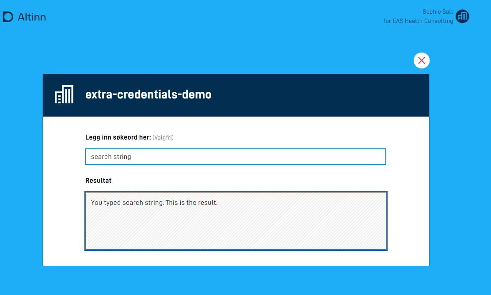
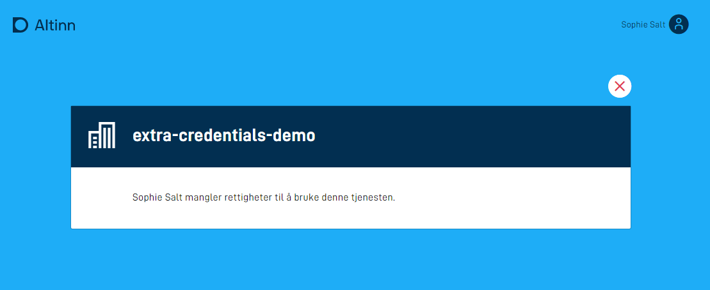
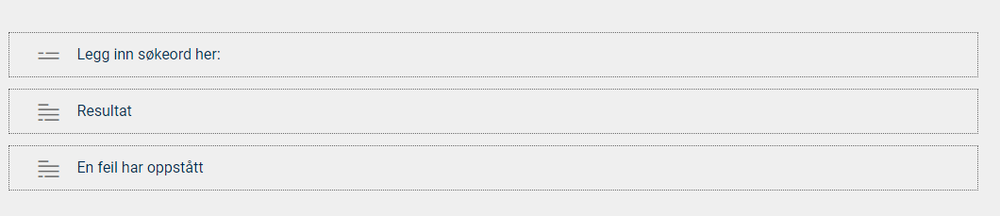

Tilgangsstyring for stateless apper kan løses med [standard app-autorisasjon](/nb/altinn-studio/v8/reference/configuration/authorization/), 
der du ved hjelp av Altinn-roller definerer hvem som har tilgang til å bruke tjenesten. Hvis du har behov for ytterligere 
sikring av tjenesten, kan du implementere logikk for autorisasjon av brukere med tredjepartsløsninger. Dette kan være API-er som er eksponert innenfor egen virksomhet, eller åpne API fra andre tilbydere.

Eksempelet nedenfor bruker Finanstilsynets API til å fastslå om virksomheten som en bruker representerer i Altinn, har tilstrekkelige lisenser til å bruke tjenesten.






Kildekoden til applikasjonen som eksempelet er basert på finnes [her](https://altinn.studio/repos/ttd/extra-credentials-demo) (krever bruker i Altinn Studio).

Videre i eksempelet vil betegnelsen *bruker* være synonymt med en virksomhet representert av en person i Altinn.

1. **Utvid datamodellen med felter for autorisasjon**

    I tillegg til et felt for å ta input fra brukeren og et felt for å vise resultatet, har vi i dette eksempelet et felt for å holde på informasjon om hvorvidt brukeren er autentisert, og et felt for å holde på en dynamisk feilmelding.

    ```xml
    <xs:sequence>
        <xs:element name="searchString" type="xs:string" />
        <xs:element name="result" type="xs:string" />
        <xs:element name="userAuthorized" type="xs:boolean" />
        <xs:element name="errorMessage" type="xs:string" />
    </xs:sequence>
    ```

    *Hopp til steg 4 hvis appen kun skal brukes via API.*
  
2. **Legg til felt for å vise feilmelding i brukergrensesnittet**

    I brukergrensesnittet til appen er det tre komponenter: Et søkefelt for brukerinput, et tekstfelt dedikert til å vise søkeresultatet, og en paragraf som er reservert for feilmeldinger.

    

    Komponentene er koblet til datamodell og tekstressurs på følgende måte i `{page}.json`:


    
    App/ui/layouts/{page}.json
    

    ```json
    "layout": [
      {
        "id": "sokeBoks",
        "type": "Input",
        "textResourceBindings": {
          "title": "SearchString"
        },
        "dataModelBindings": {
          "simpleBinding": "searchString"
        },
        "hidden": ["equals", ["dataModel", "userAuthorized"], false],
        "required": false,
        "readOnly": false
      },
      {
        "id": "resultatBoks",
        "type": "TextArea",
        "textResourceBindings": {
          "title": "Result"
        },
        "dataModelBindings": {
          "simpleBinding": "result"
        },
        "hidden": ["equals", ["dataModel", "userAuthorized"], false],
        "required": false,
        "readOnly": true
      },
      {
        "id": "errorBoks",
        "type": "Paragraph",
        "textResourceBindings": {
          "title": "ErrorMessage"
        },
        "hidden": [
          "or",
          ["equals", ["dataModel", "userAuthorized"], true],
          ["equals", ["dataModel", "userAuthorized"], null]
        ],
        "required": false,
        "readOnly": true
      }
    ]
    ```

3. **Vis eller skjul felter med uttrykk**

    Komponentenes `hidden`-egenskap styrer hvilke felter brukeren ser. Feltet `userAuthorized` formidler resultatet av kontrollen som er beskrevet i steg 5. Feltet og uttrykkene styrer bare visningen og gir ikke i seg selv tilgang til tjenesten.

    - Søkefeltet og resultatfeltet skjules når `userAuthorized` er `false`.
    - Feilmeldingen skjules når `userAuthorized` er `true` eller ikke har fått en verdi.

    Dermed er søke- og resultatfeltene synlige som standard. Hvis autorisasjonen mislykkes, skjules disse feltene, og feilmeldingen vises. Se [dokumentasjonen for uttrykk]() for flere eksempler.

4. **Legg til tekstressurser**

   I tillegg til navnet på tjenesten er det lagt inn tre tekstressurser.

   Tekstressursen for feilmelding inneholder en placeholder for navnet på brukeren. Variabelen `errorMessage` populeres i datamodellen når det registreres at en bruker ikke er autorisert til å bruke tjenesten.

    ```json
     {
      "id": "ErrorMessage",
      "value": "{0} mangler rettigheter til å bruke denne tjenesten.",
      "variables": [
        {
          "key": "errorMessage",
          "dataSource": "dataModel.lookup"
        }
      ]
    },
    {
      "id": "Result",
      "value": "Resultat"
    },
    {
      "id": "SearchString",
      "value": "Legg inn søkeord her:"
    },
    ```
5. **Implementér autorisasjonslogikk**

    Alt av dataprosessering for stateless apper ligger i filen `App\logic\DataProcessing\DataProcessingHandler.cs`, og det er her autorisasjonslogikken skal plasseres.

    Logikk for å slå opp data og autorisere brukeren ligger i metoden `ProcessDataRead`. Denne kalles hver gang en bruker åpner appen eller sender inn inputdata.

    ```cs
     public async Task<bool> ProcessDataRead(Instance instance, Guid? dataId, object data)
     {
         lookup lookup = (lookup)data;
         
         // Check if user is authorized to use service
         Party party = await _register.GetParty(int.Parse(instance.InstanceOwner.PartyId)); 

         if (string.IsNullOrEmpty(party.OrgNumber) || !await _finanstilsynet.HasReqiuiredLicence(_settings.LicenseCode, party.OrgNumber))
         {
             lookup.userAuthorized = false;
             lookup.errorMessage = $"{party.Name}";
             return true;
         }         
          
         // logic for looking up data
         if (!string.IsNullOrEmpty(lookup.searchString))
         {
             lookup.result = $"You typed \"{lookup.searchString}\". This is the result.";
             return true;
         }

         return false;
     }
    ```

    Metoden starter med logikk for å hente ut skjemadataen slik at denne kan brukes videre i metoden.

    ```cs
    lookup lookup = (lookup)data
    ```

    Videre kommer logikken for å sjekke om brukeren er autorisert.

    ```cs
    // Check if user is authorized to use service
    Party party = await _register.GetParty(int.Parse(instance.InstanceOwner.PartyId))

    if (string.IsNullOrEmpty(party.OrgNumber) || !await _finanstilsynet.HasReqiuiredLicence(_settings.LicenseCode, party.OrgNumber))
    {
        lookup.userAuthorized = false;
        lookup.errorMessage = $"{party.Name}";
        return true;
    }
    ```

    For å vite hvem brukeren er, brukes identifikatoren `instance.InstanceOwner.PartyId`, som vi får som input til metoden. Vi slår opp i Altinn sitt register for å hente ut party-objektet som representerer brukeren. Dette kan inneholde en organisasjon eller en person.

    ```cs
    Party party = await _register.GetParty(int.Parse(instance.InstanceOwner.PartyId))
    ```

    Det gjøres to sjekker for å avgjøre om en bruker er autorisert eller ikke. Først verifiseres det at party-objektet har definert et organisasjonsnummer. Hvis dette ikke er tilfellet, er brukeren en person, og dermed ikke autorisert.

    Den andre sjekken kaller `_finanstilsynet.HasReqiuiredLicence()`, en metode som slår opp i Finanstilsynets API for å avgjøre om organisasjonen har en gitt lisens. Implementasjonen av servicen er tilgjengelig [her](https://altinn.studio/repos/ttd/extra-credentials-demo/src/branch/master/App/services/FinanstilsynetService.cs).

    Hvis ingen av sjekkene er vellykkede, populeres to felter i datamodellen:
    - en indikator på at brukeren ikke er autorisert
    - en feilmelding, her kun navnet til brukeren

    og `true` returneres for å indikere at dataverdier har blitt oppdatert.

    ```cs
    lookup.userAuthorized = false;
    lookup.errorMessage = $"{party.Name}";
    return true;
    ```

    Helt til slutt kommer logikken for å vise et resultat basert på søkestrengen.

    ```cs
    // logic for looking up data
    if (!string.IsNullOrEmpty(lookup.searchString))
    {
        lookup.result = $"You typed \"{lookup.searchString}\". This is the result.";
        return true;
    }

    return false;
    ```

    `lookup.result` populeres med verdien av oppslaget. I dette tilfellet skriver vi bare søkestrengen tilbake til brukeren. Igjen returneres `true` for å indikere at en dataverdi er blitt endret, og `false` hvis dette ikke er tilfellet.
