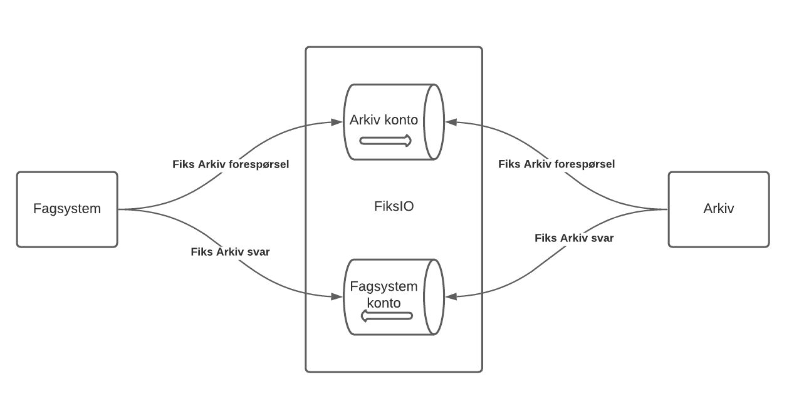
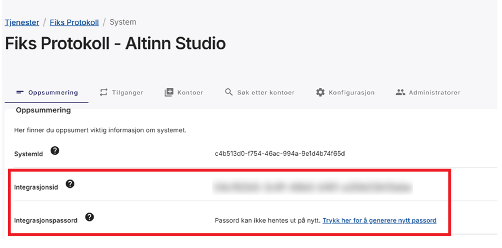
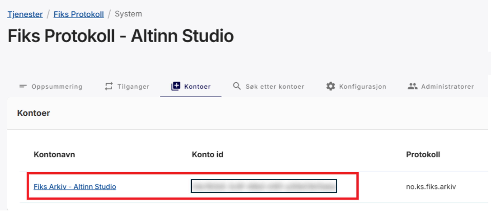
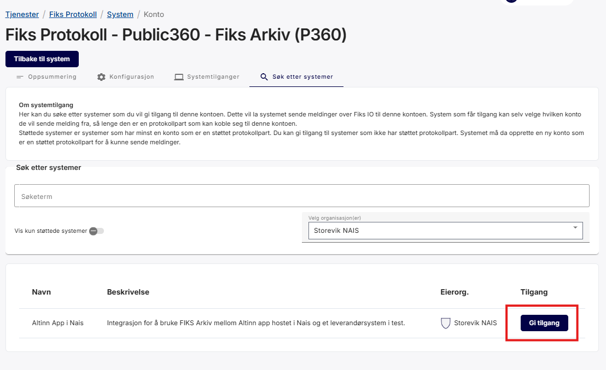

I v9 er Fiks Arkiv en **systemoppgave**. Du legger den til som et steg i prosessen (`process.bpmn`), og appen sender arkivmeldingen når prosessen kommer til steget. Oppgaven venter selv på svaret fra arkivet, så du trenger ikke lenger en tilbakemeldingsoppgave etter den.

Fiks Arkiv ligger i en egen NuGet-pakke, `Altinn.App.Clients.Fiks`, som du legger til i appen. Det skiller den fra PDF og eFormidling, som følger med `Altinn.App.Core`.

{}
Bruk samme versjon av `Altinn.App.Clients.Fiks` som av `Altinn.App.Core` og `Altinn.App.Api`. Kommer du fra v8, finner du endringene under [Kommer du fra v8?](#fra-v8).
{}

## Forutsetninger

Før du setter opp Fiks Arkiv i appen, må du ha dette på plass:

- **Fiks Protokoll** aktivert i Fiks forvaltningsportalen for organisasjonen din.
- Tilgang i **Samarbeidsportalen** til å administrere Maskinporten-klienter for organisasjonen din. Altinn Studio bruker denne tilgangen når du logger inn med Ansattporten og legger Maskinporten-scopes til appen.
- Et **arkivsystem** som er integrert med Fiks Arkiv, for eksempel Public 360.

## Slik fungerer oppgaven {#flyt}


Kilde: [KS Digital](https://github.com/ks-no/fiks-arkiv-specification)

Plattformen kjører oppgaven på serveren som tjenesteeier når prosessen kommer til steget. Oppgaven er delt i to: et arbeidssteg som sender arkivmeldingen, og en postkasse som tar imot svarene fra arkivet. Mekanismen er den samme som for andre [systemoppgaver med flere steg]().


sequenceDiagram
    autonumber
    participant Bruker
    participant App as Altinn-app
    participant FiksIO as Fiks IO
    participant Arkiv as Arkivsystem

    Bruker->>App: Sender inn skjemaet
    App->>App: Lager arkivmelding.xml og dokumentene,<br>og lagrer arkivmeldingen på instansen
    App->>App: Åpner en postkasse med frist på 7 døgn
    App->>FiksIO: arkivmelding.opprett<br>klientKorrelasjonsId = postkassens id
    FiksIO->>Arkiv: Leverer meldingen
    Arkiv-->>FiksIO: arkivmelding.opprett.mottatt
    FiksIO-->>App: Mottaksbekreftelse, oppgaven venter videre
    Arkiv-->>FiksIO: arkivmelding.opprett.kvittering
    FiksIO-->>App: Kvittering
    App->>App: Lagrer kvitteringen på instansen<br>og flytter prosessen videre
    App-->>Bruker: Neste steg vises


Slik går det steg for steg:

1. **Appen sender.** Arbeidssteget henter mottakeren, lager `arkivmelding.xml` med hoveddokument og vedlegg fra instansdataene, og lagrer arkivmeldingen på instansen som datatypen i `Receipt.ArchiveRecord`. Så åpner det en postkasse og sender meldingen til mottakerkontoen gjennom Fiks IO. Postkassens id følger med som `klientKorrelasjonsId`, og det er den som gjør at svaret finner tilbake til riktig oppgave. Feiler noe underveis, prøver plattformen steget på nytt med samme innhold.
2. **Arkivet svarer.** Arkivsystemet sender først en mottaksbekreftelse (`arkivmelding.opprett.mottatt`) og deretter en kvittering (`arkivmelding.opprett.kvittering`) når saken er opprettet. Kan det ikke opprette saken, sender det en feilmelding i stedet.
3. **Lytteren sender svaret videre.** Appen lytter på Fiks IO-kontoen sin, leser `klientKorrelasjonsId` fra hver melding og leverer den til postkassen som venter. Meldinger uten korrelasjons-id blir logget og forkastet, siden ingen oppgave venter på dem.
4. **Oppgaven konkluderer.** Mottaksbekreftelsen holder oppgaven ventende. Kvitteringen lagres på instansen som datatypen i `Receipt.ConfirmationRecord`, og deretter gjør oppgaven det `SuccessHandling` sier. En feilmelding fra arkivet behandles etter `ErrorHandling`. Kommer det ingen kvittering på 7 døgn, feiler oppgaven.

Mens oppgaven venter, ser brukeren ventesiden. Ingen bruker eller tjenesteeier trenger å gjøre noe, og ingenting spør arkivet om status. Se [Hva brukeren ser mens en systemoppgave kjører]() for hvordan du tilpasser ventesiden og feilsiden.

## Sette opp Fiks Arkiv i appen {#oppsett}

### Steg 1: Legg til Maskinporten-scopes i Altinn Studio {#oppsett-scopes}

Legg til disse scopene på appen i Altinn Studio:

- `ks:fiks`
- `altinn:serviceowner/instances.read`
- `altinn:serviceowner/instances.write`
{.correspondence-custom-list}

Når appen publiseres, oppretter Altinn Studio Maskinporten-klienten og legger `MaskinportenSettings` inn i appen. Fiks IO-klienten bruker denne klienten til å autentisere seg mot Fiks med `ks:fiks`, og appen bruker den som tjenesteeier mot Altinn-plattformen, blant annet når den markerer instansen som fullført.

Se [Legge til scopes i Altinn Studio]() for fremgangsmåten.

### Steg 2: Opprett en Fiks Arkiv-konto {#oppsett-konto}

{}
Svarene fra arkivet leveres til kontoen som sendte meldingen. Deler flere apper én konto, kan lytteren i én app plukke opp svar som hører til en annen. Sett derfor opp én konto per Altinn-app.
{}

- Generer et **x509-sertifikat for Fiks Arkiv-kryptering**.

  Formatkrav:
  - Offentlig del: PEM-fil, som du laster opp i Fiks Forvaltning.
  - Privat del: PEM-formatert streng, base64-kodet, som du legger inn som en secret for Altinn-appen.

  Bruk det verktøyet du foretrekker for å generere sertifikatet. En veiledning ligger nederst i dette steget.

- Sett opp et nytt system under Fiks Protokoll for organisasjonen din i Fiks Forvaltning. Se [KS Digitals veiledning for systemoppsett](https://developers.fiks.ks.no/tjenester/fiksprotokoll/veiledning_3_opprette_system/).

- Opprett en konto knyttet til dette systemet. Se [KS Digitals veiledning for kontooppsett](https://developers.fiks.ks.no/tjenester/fiksprotokoll/veiledning_4_opprette_konto/).

  Kontoen skal ha disse egenskapene:

    | Egenskap          | Verdi                            |
    |-------------------|----------------------------------|
    | Protokolltype     | no.ks.fiks.arkiv                 |
    | Versjon           | v1                               |
    | Protokollparter   | klient.arkivering / klient.full* |

    \* Bruk _klient.arkivering_ med mindre kontoen skal brukes til andre oppgaver også.

- Ta vare på disse verdiene til oppsettet av appen:
    - Integrasjons-ID og passord for Fiks-systemet
            
    - Konto-ID for Fiks-kontoen
            
    - Privat del av **x509-sertifikatet** som en base64-streng

{}
{}
{}

### Steg 3: Legg til pakken og registrer tjenestene {#oppsett-program}

Legg til en referanse til NuGet-pakken [Altinn.App.Clients.Fiks](https://www.nuget.org/packages/Altinn.App.Clients.Fiks/) i prosjektfilen. Bruk samme versjon som for `Altinn.App.Core` og `Altinn.App.Api`.


App/App.csproj


```xml {hl_lines=[5]}
<PackageReference Include="Altinn.App.Api" Version="9.0.0">
  <CopyToOutputDirectory>lib\$(TargetFramework)\*.xml</CopyToOutputDirectory>
</PackageReference>
<PackageReference Include="Altinn.App.Core" Version="9.0.0" />
<PackageReference Include="Altinn.App.Clients.Fiks" Version="9.0.0" />
```

Registrer så Fiks Arkiv-tjenestene og pek dem til konfigurasjonsseksjonene dine i `RegisterCustomAppServices` i `Program.cs`:


App/Program.cs


```csharp {hl_lines=["3-7"]}
void RegisterCustomAppServices(IServiceCollection services, IConfiguration config, IWebHostEnvironment env)
{
    services
        .AddFiksArkiv()
        .WithFiksIOConfig("FiksIOSettings")
        .WithFiksArkivConfig("FiksArkivSettings")
        .WithMaskinportenConfig("MaskinportenSettings");
}
```

Utvidelsesmetodene ligger i navnerommet `Altinn.App.Clients.Fiks.Extensions`, så husk `using` for dette.

`AddFiksArkiv()` registrerer alt oppgaven trenger: Fiks IO-klienten, lytteren som tar imot svar, generatoren som lager arkivmeldingen, og selve systemoppgaven. Du velger selv navnene på konfigurasjonsseksjonene, men de må stemme med seksjonsnavnene du bruker i `appsettings.json` og i Key Vault.

### Steg 4: Legg til oppgaven i prosessen {#oppsett-prosess}

Legg oppgaven inn i `process.bpmn` som en `bpmn:serviceTask` med oppgavetypen `fiksArkiv`. Plasser den etter oppgaven som lager dataene du vil arkivere, vanligvis etter PDF-oppgaven. Oppgaven må ha én innkommende og én utgående sekvensflyt, og du skal ikke legge en tilbakemeldingsoppgave etter den.

**Merk:** Du kan ennå ikke dra en Fiks Arkiv-oppgave direkte inn i Arbeidsflyt-editoren i Altinn Studio. Inntil videre anbefaler vi denne fremgangsmåten:

1. Dra en vanlig dataoppgave inn i Arbeidsflyt-editoren.
2. Del endringene i Studio.
3. Rediger `process.bpmn` på din egen maskin.
4. Gjør dataoppgaven om til en `bpmn:serviceTask` (se eksemplet nedenfor).

Slik sikrer du at sekvensflytene og diagrammet holder seg korrekte.


App/config/process/process.bpmn


```xml
<bpmn:serviceTask id="Task_FiksArkiv" name="Fiks Arkiv">
  <bpmn:extensionElements>
    <altinn:taskExtension>
      <altinn:taskType>fiksArkiv</altinn:taskType>
    </altinn:taskExtension>
  </bpmn:extensionElements>
  <bpmn:incoming>Flow_2</bpmn:incoming>
  <bpmn:outgoing>Flow_3</bpmn:outgoing>
</bpmn:serviceTask>
```

All konfigurasjon av selve meldingen ligger i `appsettings.json`, ikke i prosessen. Skal prosessen ta en annen vei når arkiveringen feiler, se `ErrorHandling` under [konfigurasjonen](#oppsett-fiksarkivsettings) og [flytkontroll]() for hvordan du legger inn en `reject`-flyt.

### Steg 5: Gi tjenesteeieren tilgang {#oppsett-tilgang}

Plattformen flytter prosessen ut av oppgaven som tjenesteeier. Oppgavetypen `fiksArkiv` krever handlingen `write`, som tilgangsfilen fra appmalen allerede gir tjenesteeieren. Har du en `reject`-flyt ut av oppgaven, trenger tjenesteeieren `reject` i tillegg. Se [Gi tilgang til oppgaven]() for regelen og hva som skjer når den mangler.

### Steg 6: Konfigurer appen {#oppsett-konfigurasjon}

Legg konfigurasjonen i `appsettings.json`, og legg alle sensitive verdier i Azure Key Vault i stedet for å sjekke dem inn. Appen leser secrets ved oppstart, så endrer du dem etter publisering, må du publisere appen på nytt. Se [secrets-dokumentasjonen](/nb/altinn-studio/v8/reference/configuration/secrets/) for hvordan appen leser fra Key Vault.

{}

Med standardoppsettet i Altinn Studio legges `MaskinportenSettings` inn i appen automatisk når du publiserer, og `.WithMaskinportenConfig("MaskinportenSettings")` peker Fiks IO-klienten til den. Du trenger da ikke gjøre noe mer.

Har du et eldre, manuelt oppsett, legger du klient-ID-en inn som `ClientId` og den base64-kodede JSON Web Key-en som `JwkBase64`:

| Innstilling   | Beskrivelse                                                                             |
|---------------|-----------------------------------------------------------------------------------------|
| **Authority** | Maskinporten authority/audience som brukes til autentisering og autorisasjon.           |
| **ClientId**  | Klient-ID-en som er registrert hos Maskinporten. Vanligvis en UUID.                     |
| **JwkBase64** | Privatnøkkelen som brukes til å autentisere mot Maskinporten, som base64-kodet JWK.     |


App/appsettings.json


```json
"MaskinportenSettings": {
  "Authority": "https://[test.]maskinporten.no/",
  "ClientId": "hentes fra Key Vault",
  "JwkBase64": "hentes fra Key Vault"
}
```

Key Vault-secrets:

- `MaskinportenSettings--ClientId`
- `MaskinportenSettings--JwkBase64`

{}

{}

| Innstilling                 | Beskrivelse                                                                                                        |
|-----------------------------|--------------------------------------------------------------------------------------------------------------------|
| **AccountId**               | Konto-ID for Fiks IO-kontoen appen sender fra.                                                                     |
| **IntegrationId**           | Integrasjons-ID for Fiks-systemet.                                                                                 |
| **IntegrationPassword**     | Passordet for integrasjonen.                                                                                       |
| **AccountPrivateKeyBase64** | Privatnøkkelen til kontoen, som base64-kodet PEM med topp- og bunntekst. Brukes til autentisering og til å dekryptere svarene fra arkivet. |
| **ApiHost**                 | Fiks IO sitt API. `https://api.fiks.test.ks.no:443` i test og `https://api.fiks.ks.no:443` i produksjon.           |
| **AmqpHost**                | Fiks IO sin meldingskanal. `amqp://io.fiks.test.ks.no:5671` i test og `amqp://io.fiks.ks.no:5671` i produksjon.   |

Legg `IntegrationPassword` og `AccountPrivateKeyBase64` i Key Vault. Sett `ApiHost` og `AmqpHost` per miljø, for eksempel i `appsettings.Staging.json`, når appen skal snakke med KS sitt testmiljø.


App/appsettings.json


```json
"FiksIOSettings": {
  "AccountId": "c3c87fac-06be-44ed-a11c-aa137d12863c",
  "IntegrationId": "08b3d8b9-5026-46dc-936c-8e6709efa72c",
  "IntegrationPassword": "hentes fra Key Vault",
  "AccountPrivateKeyBase64": "hentes fra Key Vault"
}
```

Key Vault-secrets:

- `FiksIOSettings--IntegrationPassword`
- `FiksIOSettings--AccountPrivateKeyBase64`

{}

{}

#### Overordnet struktur {#oppsett-fiksarkivsettings}

```text
FiksArkivSettings
├─ Receipt
│  ├─ ConfirmationRecord
│  └─ ArchiveRecord
├─ Recipient
│  ├─ FiksAccount
│  ├─ Identifier
│  ├─ Name
│  └─ OrganizationNumber
├─ Metadata
│  ├─ SystemId
│  ├─ RuleId
│  ├─ CaseFileId
│  ├─ CaseFileTitle
│  ├─ JournalEntryTitle
│  ├─ CaseFileAdministrativeUnit
│  └─ CaseFileClassifications[]
├─ Documents
│  ├─ PrimaryDocument
│  └─ Attachments[]
├─ ErrorHandling
│  ├─ MoveToNextTask
│  └─ Action
└─ SuccessHandling
   ├─ MoveToNextTask
   ├─ Action
   └─ MarkInstanceComplete
```

Nedenfor går vi gjennom hver seksjon, viser hvordan du oppgir verdier (fast eller fra datamodellen), og gir eksempler på `appsettings.json`.

{}
Innstillingene er dokumentert etter beste evne, men koden kan endre seg. Trenger du den nøyaktige listen, se [kildekoden](https://github.com/Altinn/altinn-studio/blob/main/src/App/backend/src/Altinn.App.Clients.Fiks/FiksArkiv/Models/FiksArkivSettings.cs).
{}

#### Receipt

Datatypene appen lagrer arkivmeldingen og kvitteringen i. Begge er påkrevd.

{}
Datatypene må finnes i `applicationmetadata.json`, og appen må kunne skrive til dem.
{}

Begge oppgis som `{ "DataType": "…", "Filename": "…" }`.

| Innstilling            | Formål                                                                                                     |
|------------------------|------------------------------------------------------------------------------------------------------------|
| **ArchiveRecord**      | Datatypen og filnavnet for _arkivmeldingen_. Lagres når meldingen sendes.                                  |
| **ConfirmationRecord** | Datatypen og filnavnet for _arkivkvitteringen_. Lagres når kvitteringen kommer, før prosessen går videre. |


App/appsettings.json


```json
"FiksArkivSettings": {
  "Receipt": {
    "ArchiveRecord": {
      "DataType": "fiks-archive-record",
      "Filename": "Arkivmelding.xml"
    },
    "ConfirmationRecord": {
      "DataType": "fiks-receipt",
      "Filename": "Arkivkvittering.xml"
    }
  }
}
```


App/config/applicationmetadata.json


```json
{
  "dataTypes": [
    {
      "id": "fiks-archive-record",
      "allowedContributors": ["app:owned"],
      "maxCount": 1,
      "minCount": 0,
      "enableFileScan": false,
      "validationErrorOnPendingFileScan": false
    },
    {
      "id": "fiks-receipt",
      "allowedContributors": ["app:owned"],
      "maxCount": 1,
      "minCount": 0,
      "enableFileScan": false,
      "validationErrorOnPendingFileScan": false
    }
  ]
}
```

#### Recipient

Hvem som skal motta arkivmeldingen.

| Innstilling            | Formål                                                    | Type                |
|------------------------|-----------------------------------------------------------|---------------------|
| **FiksAccount**        | Konto-ID-en (GUID) til mottakerkontoen meldingen sendes til. | GUID (påkrevd)   |
| **Identifier**         | Identifikator for mottakeren, for eksempel kommunenummer. | string (påkrevd)    |
| **Name**               | Navnet på mottakeren.                                     | string (påkrevd)    |
| **OrganizationNumber** | Organisasjonsnummeret til mottakeren.                     | string (valgfri)    |

Alle verdiene kan være faste eller hentes fra datamodellen. Se [Slik oppgir du verdier](#oppsett-verdier), og bruk `DataModelBinding` når mottakeren varierer fra instans til instans.


App/appsettings.json


```json
"FiksArkivSettings": {
  "Recipient": {
    "FiksAccount": {
      "DataModelBinding": { "DataType": "HelperDataModel", "Field": "Recipient.AccountId" }
    },
    "Identifier": {
      "DataModelBinding": { "DataType": "HelperDataModel", "Field": "Recipient.Identifier" }
    },
    "Name": {
      "DataModelBinding": { "DataType": "HelperDataModel", "Field": "Recipient.Name" }
    },
    "OrganizationNumber": {
      "DataModelBinding": { "DataType": "HelperDataModel", "Field": "Recipient.OrgNumber" }
    }
  }
}
```

#### Metadata

Informasjon arkivsystemet bruker til å plassere saken.

| Innstilling                    | Formål og standardverdi                                                                                 |
|--------------------------------|---------------------------------------------------------------------------------------------------------|
| **SystemId**                   | System-ID i den genererte `arkivmelding.xml`. Standard: `Altinn Studio`.                                |
| **RuleId**                     | Regel-ID for behandling av meldingen i arkivsystemer som støtter regler. Utelatt hvis den ikke er satt. |
| **CaseFileId**                 | ID for saksmappen (`saksmappe`). Standard: instans-ID-en.                                               |
| **CaseFileTitle**              | Tittel på saksmappen. Standard: apptittelen.                                                            |
| **JournalEntryTitle**          | Tittel på journalposten (`journalpost`). Standard: apptittelen.                                         |
| **CaseFileAdministrativeUnit** | Administrativ enhet (`administrativEnhet`) på saksmappen. Standard: org-koden til appeieren.            |
| **CaseFileClassifications**    | Klassifikasjoner (`klassifikasjon`) på saksmappen, i den rekkefølgen du lister dem. Ingen som standard. |

Alle verdiene unntatt `CaseFileClassifications` kan være faste eller hentes fra datamodellen.

**Klassifikasjoner.** Hver oppføring i `CaseFileClassifications` er én av to ting:

- `{ "Source": "InstanceOwner" }` legger på eieren av instansen. En organisasjon klassifiseres med organisasjonsnummeret sitt i systemet `ORGNR`, en person med fødselsnummeret sitt i systemet `PNR`. Tittelen er navnet fra registeret. Eieren er den saken gjelder, uavhengig av hvem som sendte inn skjemaet.
- En egen klassifikasjon med `SystemId`, `ClassificationId` og `Title`. Alle tre er påkrevd.

`IsRestricted` kan settes på begge typene og gir `erSkjermet` i XML-en. Utelater du `CaseFileClassifications`, får saksmappen ingen klassifikasjoner. Skal appen fortsette å klassifisere på eieren slik den gjorde i v8, må du legge inn `InstanceOwner`-oppføringen selv.


App/appsettings.json


```json
"FiksArkivSettings": {
  "Metadata": {
    "CaseFileTitle": {
      "DataModelBinding": { "DataType": "HelperDataModel", "Field": "CaseFileTitle" }
    },
    "JournalEntryTitle": {
      "Value": "Søknad om skjenkebevilling"
    },
    "CaseFileAdministrativeUnit": {
      "Value": "Næringsavdelingen"
    },
    "CaseFileClassifications": [
      { "Source": "InstanceOwner" },
      { "SystemId": "Fagklasse", "ClassificationId": "U63", "Title": "Skjenkebevilling" },
      { "SystemId": "Tilleggsklasse", "ClassificationId": "&18", "Title": "Unntatt offentlighet", "IsRestricted": true }
    ]
  }
}
```

#### Documents

Dokumentene som sendes med arkivmeldingen.

| Innstilling         | Formål                                                                          |
|---------------------|---------------------------------------------------------------------------------|
| **PrimaryDocument** | Hoveddokumentet, for eksempel skjemadataene eller PDF-en. Sendes som `Hoveddokument`. |
| **Attachments**     | Vedlegg. Sendes som `Vedlegg`. Alle dataelementer av datatypen blir med.       |

Hvert dokument har disse innstillingene:

| Innstilling  | Formål og standardverdi                                                                                                    |
|--------------|----------------------------------------------------------------------------------------------------------------------------|
| **DataType** | Datatypen i `applicationmetadata.json`. Påkrevd.                                                                           |
| **Filename** | Filnavnet dokumentet får i arkivmeldingen. Standard: filnavnet på dataelementet, ellers datatypen med filendelse.          |
| **Format**   | Formatkode (`dokumentobjekt.format`), for eksempel `PDF/A`. Standard: filendelsen.                                         |
| **Variant**  | Variantformat (`dokumentobjekt.variantformat`), for eksempel `A` for arkivformat eller `P` for produksjonsformat. Utelatt hvis det ikke er satt. |

`Format` og `Variant` oppgis som `{ "Code": "…", "Description": "…" }`, der `Description` er valgfri. Spør arkivet ditt hvilke koder det forventer.


App/appsettings.json


```json
"FiksArkivSettings": {
  "Documents": {
    "PrimaryDocument": {
      "DataType": "ref-data-as-pdf",
      "Filename": "Soknad.pdf",
      "Format": { "Code": "PDF/A" },
      "Variant": { "Code": "A", "Description": "Arkivformat" }
    },
    "Attachments": [
      { "DataType": "DataModel" },
      { "DataType": "vedlegg" }
    ]
  }
}
```

#### SuccessHandling

Hva oppgaven gjør når arkivet har bekreftet saken med en kvittering. Innstillingene gjelder altså ikke når meldingen er sendt, men når kvitteringen har kommet.

| Innstilling              | Formål og standardverdi                                                                                                                 |
|--------------------------|-----------------------------------------------------------------------------------------------------------------------------------------|
| **MoveToNextTask**       | Om prosessen skal gå videre av seg selv når kvitteringen kommer. Med `false` blir instansen stående på oppgaven til noen flytter den. Standard: `true`. |
| **Action**               | Handlingen prosessen går videre med. Standard: ingen, altså standardflyten.                                                             |
| **MarkInstanceComplete** | Om instansen skal markeres som fullført. Skjer før prosessen går videre. Standard: `false`.                                             |


App/appsettings.json


```json
"FiksArkivSettings": {
  "SuccessHandling": {
    "MoveToNextTask": true,
    "MarkInstanceComplete": true
  }
}
```

#### ErrorHandling

Hva oppgaven gjør når arkiveringen ikke kan lykkes for denne saken: arkivet avviser meldingen, eller mottakerkontoen finnes ikke. Andre feil er ikke omfattet, se [Når noe går galt](#feil).

| Innstilling        | Formål og standardverdi                                                                                                        |
|--------------------|--------------------------------------------------------------------------------------------------------------------------------|
| **MoveToNextTask** | Om prosessen skal gå videre likevel. Med `false` feiler oppgaven, slik at feilen blir synlig i overvåkingen. Standard: `false`. |
| **Action**         | Handlingen prosessen går videre med når `MoveToNextTask` er `true`. Standard: `reject`.                                        |

{}
Standardverdien for `MoveToNextTask` er `false`, også når du utelater hele `ErrorHandling`-seksjonen. En avvist arkivering feiler oppgaven i stedet for å gå videre. Vil du at prosessen skal ta `reject`-flyten, må du skrive `"MoveToNextTask": true` selv, og prosessen må ha en `reject`-flyt ut av oppgaven.
{}


App/appsettings.json


```json
"FiksArkivSettings": {
  "ErrorHandling": {
    "MoveToNextTask": true,
    "Action": "reject"
  }
}
```

#### Slik oppgir du verdier {#oppsett-verdier}

Innstillingene under `Recipient` og `Metadata` kan oppgis på to måter:
{.floating-bullet-numbers-sibling-ol}

1. **Fast verdi**

   ```json
   "JournalEntryTitle": {
     "Value": "Søknad om skjenkebevilling"
   }
   ```

2. **Verdi fra datamodellen**

   ```json
   "CaseFileTitle": {
     "DataModelBinding": {
       "DataType": "HelperDataModel",
       "Field": "CaseFileTitle"
     }
   }
   ```

Bruk `Value` når du kjenner teksten på forhånd, og `DataModelBinding` når verdien skal hentes fra dataene i instansen, for eksempel et felt brukeren har fylt ut eller en hjelpemodell appen fyller ut. `Field` støtter punktnotasjon.

#### Appen kontrollerer konfigurasjonen ved oppstart

Appen kontrollerer Fiks Arkiv-konfigurasjonen når den starter, ikke når den første instansen kommer til oppgaven. Den nekter å starte hvis `Receipt`, `Recipient` eller `Documents` mangler, hvis en datatype ikke finnes i `applicationmetadata.json`, hvis en `DataModelBinding` peker til en datatype uten datamodell, eller hvis en klassifikasjon både har `Source` og egne felt. Feilmeldingen sier hvilken innstilling som er gal.

#### Praktiske tips

- **Start enkelt.** Sett opp `Receipt`, `Recipient` og `Documents` først. Legg til `Metadata` når du vet hva arkivet ditt trenger.
- **Bruk binding der verdiene varierer.** Foretrekk `DataModelBinding` for felt som er ulike fra instans til instans.
- **Bruk standardverdiene.** Utelater du metadatafelt, brukes fornuftige standarder, som apptittelen og instans-ID-en.
- **Avklar klassifikasjoner og formatkoder med arkivet.** Arkivet bestemmer hvilke klassifikasjonssystemer og formatkoder det godtar.

{}

## Arkivmeldingen appen sender {#arkivmelding}

Standardgeneratoren lager en NOARK 5-arkivmelding med dette innholdet:

- **Saksmappe** med tittel, administrativ enhet, saksår og saksdato, en ekstern nøkkel som består av app-ID-en og `CaseFileId`, og klassifikasjonene du har konfigurert.
- **Journalpost** med tittel, journalstatus `Journalført` og journalposttype `Inngående dokument`.
- **Korrespondanseparter**: mottakeren fra `Recipient`, med lenken til instansen som referanse, og eieren av instansen som avsender, med navn, person- eller organisasjonsnummer og kontaktinformasjon fra registeret.
- **Dokumentbeskrivelser** for hoveddokumentet og hvert vedlegg, med filnavn, format og eventuelt variantformat.
- `system` fra `SystemId` og `regel` fra `RuleId`.

Alle datoer og tidspunkter er i UTC og er hentet fra det samme tidspunktet, så en oppgave som prøves på nytt sender samme arkivmelding som første gang. Dekker ikke standardmeldingen behovet ditt, kan du [lage din egen](#overstyre-arkivmelding).

## Overstyre standardatferd {#overstyre}

### Lage din egen arkivmelding {#overstyre-arkivmelding}

Implementer `IFiksArkivPayloadGenerator` og registrer klassen din. Grensesnittet har to metoder: `GeneratePayload`, som får oppgave-ID, mottaker, meldingstype, referansetidspunktet og tilgang til instansdataene, og returnerer filene som skal sendes, og `ValidateConfiguration`, som appen kaller ved oppstart med datatypene og prosessoppgavene i appen.


App/Program.cs


```csharp {hl_lines=[3]}
services
    .AddFiksArkiv()
    .WithPayloadGenerator<MinArkivmeldingGenerator>();
```

Bruk referansetidspunktet til alle datoer i meldingen, og les dokumentene gjennom `IInstanceDataAccessor` du får inn. Da sender en oppgave som prøves på nytt den samme meldingen som første gang.

### Reagere på svar fra arkivet {#overstyre-svar}

Trenger appen å gjøre noe med svarene fra arkivet, for eksempel kopiere saksnummeret fra kvitteringen inn i skjemadataene, implementerer du `IFiksArkivMessageHandler` og registrerer klassen din. Oppgaven kaller `HandleMessage` én gang for hver melding arkivet sender, før den tolker meldingen selv.


App/Program.cs


```csharp {hl_lines=[3]}
services
    .AddFiksArkiv()
    .WithMessageHandler<MinMeldingshandterer>();
```

```csharp
public class MinMeldingshandterer : IFiksArkivMessageHandler
{
    public Task HandleMessage(FiksArkivReceivedMessage message, ServiceTaskContext context)
    {
        if (message.IsReceipt)
        {
            // Les kvitteringen fra message.Payloads og lagre det du trenger
            // gjennom context.InstanceDataMutator.
        }

        return Task.CompletedTask;
    }
}
```

Fire ting å vite om handleren:

- Den kjører inne i prosessovergangen som behandler meldingen. Alt du lagrer gjennom `context.InstanceDataMutator`, lagres sammen med kvitteringen.
- Den skal ikke flytte prosessen. Oppgaven gjør det selv etter `SuccessHandling` og `ErrorHandling`, og et kall til `process/next` fra handleren blir avvist.
- Kaster den en feil, prøver plattformen meldingen på nytt, og oppgaven konkluderer ikke før handleren lykkes.
- Meldinger kan komme mer enn én gang. Bruk `message.MessageId` til å oppdage gjentakelser hvis handleren gjør noe som ikke tåler å skje to ganger.

`message.IsAcknowledgement`, `message.IsReceipt` og `message.IsError` sier hva slags melding det er, og `message.Payloads` inneholder innholdet, ferdig tolket der plattformen kjenner meldingstypen.

## Når noe går galt {#feil}

| Situasjon                                                        | Hva oppgaven gjør                                                                                                   |
|------------------------------------------------------------------|---------------------------------------------------------------------------------------------------------------------|
| Arkivet avviser meldingen                                        | Følger `ErrorHandling`. Som standard feiler oppgaven.                                                               |
| Mottakerkontoen finnes ikke                                      | Følger `ErrorHandling`. Som standard feiler oppgaven.                                                               |
| Fiks IO avviser integrasjons-ID-en eller passordet               | Oppgaven feiler straks. Rett opp verdiene og gjenoppta oppgaven. `ErrorHandling` brukes ikke, siden ingen handling fra brukeren hjelper. |
| Midlertidig feil, for eksempel mot Maskinporten eller nettverket | Plattformen prøver sendingen på nytt. Gir det seg ikke, feiler oppgaven.                                            |
| Ingen kvittering på 7 døgn                                       | Oppgaven feiler. Saken kan likevel være arkivert, så sjekk hos arkivet før du sender på nytt.                        |
| Kvitteringen kan ikke leses                                      | Oppgaven feiler. Saken er sannsynligvis arkivert, men appen har ingen kvittering å lagre.                           |
| Din `IFiksArkivMessageHandler` kaster en feil                    | Meldingen prøves på nytt til handleren lykkes.                                                                      |

Når oppgaven feiler, ser brukeren feilsiden, og feilen dukker opp i overvåkingen med en melding som sier hva som skjedde. En som har handlingen for oppgaven kan gjenoppta den med **Prøv igjen**, og en `reject`-flyt gir brukeren mulighet til å gå tilbake. Se [Hva brukeren ser mens en systemoppgave kjører]().

## Kommer du fra v8? {#fra-v8}

Dette er endret fra v8:

- **Ingen tilbakemeldingsoppgave.** Oppgaven venter selv på kvitteringen fra arkivet, og prosessen går først videre når den har kommet. Fjern tilbakemeldingsoppgaven du hadde etter Fiks Arkiv-oppgaven.
- **`SuccessHandling` gjelder når arkivet har bekreftet saken**, ikke når meldingen er sendt.
- **`ErrorHandling.MoveToNextTask` er `false` som standard.** En avvist arkivering feiler oppgaven i stedet for å gå videre stille.
- **Klassifikasjon av eieren er valgfri.** Den legges ikke lenger på automatisk. Legg inn `{ "Source": "InstanceOwner" }` i `Metadata.CaseFileClassifications` for å beholde den. Systemene heter nå `PNR` og `ORGNR`, og eieren av instansen klassifiseres, ikke den som sendte inn.
- **`IFiksArkivResponseHandler` er erstattet av `IFiksArkivMessageHandler`**, og `.WithResponseHandler<T>()` av `.WithMessageHandler<T>()`. Handleren kalles for hver melding arkivet sender, og skal ikke flytte prosessen.
- **`IFiksArkivHost` er fjernet.** Meldinger sendes bare gjennom systemoppgaven.
- **`klientKorrelasjonsId` er postkassens id**, ikke lenken til instansen. Lenken ligger fortsatt i arkivmeldingen, som referansen på mottakerens korrespondansepart.
- **Tidspunktene i arkivmeldingen er i UTC**, og `dokumentobjekt` har ikke lenger en `systemID`.

`studioctl app upgrade v9` legger inn tilgangsreglene tjenesteeieren trenger, men endrer ikke Fiks Arkiv-konfigurasjonen din.

## Konfigurasjon for mottak av meldinger i arkivsystemet {#mottak}

Digdir leverer verken arkivsystemet eller Fiks Arkiv, så vi har ikke fullstendig dokumentasjon for mottakersiden. Bruk KS Digitals dokumentasjon sammen med dokumentasjonen fra arkivsystemleverandøren. Her er likevel de vanligste fallgruvene vi har sett når appeiere tar integrasjonen i bruk.

### Opprett en Fiks Arkiv-konto for mottak
{.floating-bullet-numbers-sibling-ol}

1. Sett opp et nytt system under Fiks Protokoll for organisasjonen din.
2. Opprett en konto knyttet til dette systemet, med disse egenskapene:

    | Egenskap          | Verdi             |
    |-------------------|-------------------|
    | Protokolltype     | no.ks.fiks.arkiv  |
    | Versjon           | v1                |
    | Protokollparter   | arkiv.full        |

    Gi kontoen et navn som gjenspeiler appen, siden vi anbefaler én konto per Altinn-app.

3. Se dokumentasjonen for arkivsystemet for krav til krypteringsnøkkelparet.
4. Under kontoen, gå til fanen _Søk etter systemer_ og slå opp systemet som ble opprettet for å sende meldinger. Gi systemet tillatelse til å sende til mottakerkontoen ved å klikke _Gi tilgang_.
    

### Kjente problemer i konfigurasjonen av Public 360

#### Krypteringsnøkkelen er ikke dokumentert

Maskinporten-tokenet som lastes opp i P360 brukes som den private delen av krypteringsnøkkelen. Fiks Arkiv-kontoen som mottar meldinger, skal laste opp den offentlige delen av dette sertifikatet som krypteringsnøkkel.

## Ekstern dokumentasjon

Mer om Fiks Arkiv:

- <https://developers.fiks.ks.no/felles/integrasjoner/>
- <https://github.com/ks-no/fiks-arkiv-specification/wiki>
