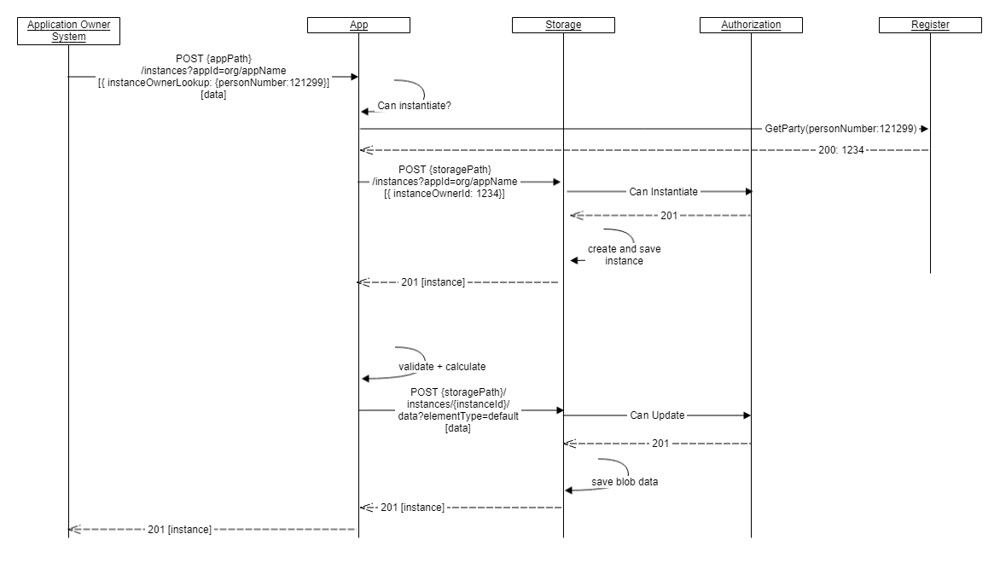

## Overview

An [instance](../../models/instance) can be regarded as an envelope or folder where data is collected and exchanged between the application user and owner. The instance document is a way for Altinn and external parties to track the state of one specific data exchange. How long an instance lives and how many interactions there are between the application owner and user will vary from one app to another. Advanced apps will have their own documentation.

**basePath**
```http
{org}/{appname}/instances
```

## Get instance

Endpoint for downloading the instance metadata document for a specific instance. The app API does not have an endpoint for listing instances. The Storage API in the Platform has a query endpoint that can be used for this purpose.

Use this endpoint for instances that are active, and the owner party id and instance guid for the instance are known. External systems that work with an instance over multiple sessions might want to keep these values (or full URL) stored on their end to limit the need to query this information multiple times.

```http
GET {basePath}/{instanceOwnerPartyId}/{instanceGuid}
```

## Get active instances

Endpoint for listing active instances for an instance owner.

This endpoint can be used to determine if a new instance of an app should be created or if continuation on an existing instance would be more feasible.
Note that the object returned is a simplified instance object and that `LastChangedBy` contains the name of the latest active entity rather than an id number.

```json
[
	{
		"id": "1337/bffd2c17-9d93-49f4-b504-3d0ece2402c7",
		"lastChanged": "2021-09-23T10:19:43",
		"lastChangedBy": "Sophie Salt"
	},
    {
		"instanceId": "1337/agfd2c17-4d93-49f4-b504-3d0ece2402d8",
		"lastChanged": "2021-07-11T22:14:02",
		"lastChangedBy": "Sophie Salt"
	}
]
```

```http
GET {basePath}/{instanceOwnerPartyId}/active
```

## Create instance

Altinn assigns a unique identifier to all users that wish to report data. We call this id *instanceOwner.partyId*. 
If you do not know this, you should provide the official identity number, e.g national identification number for persons or organisation number for organisations,
and in some case user name. This should be provided as part of the payload to the creation request.
Altinn will look up this identifier and replace it with the instanceOwner.partyId. The official identity number will be stored in the instance metadata.

Data elements can be provided as part of the creation request, but can also be uploaded at a later time.

The client specifies the instance owner and may set a number of the metadata fields of the instance by attaching the following form:

```json
{
    "appId" : "org/app",
    "instanceOwner": {
        "personNumber": "12247918309",
        "organisationNumber": null
    },
    "dueBefore": "2019-06-01T12:00:00Z",
    "visibleAfter": "2019-05-20T00:00:00Z"
}
```

Notice that all dates must be expressed in **Utc (Zulu)** time zone and represented according to ISO 8601!

Data elements (files) can be attached to the initial request as a *multipart/form-data* or as *attachments*.
The name of the parts must correspond to element types defined in the application metadata. 

```http
POST {basePath}
```



A multipart/formdata should contain the instance json document and the data element files of the instance.
The first part should be *instance* which contains the json template to create an instance from.

The subsequent parts must have a name that correspond to the element types defined in application metadata.
They may have a filename. Hence the *model1* and *certificate* names correspond to data types defined in the application metadata.
If additional data elements are required they must be defined in the application metadata.

```http {linenos=false,hl_lines=[5,10,15]}
Content-Type: multipart/form-data; boundary="abcdefg"

--abcdefg
Content-Type: application/json; charset=utf-8
Content-Disposition: form-data; name="instance"
{ ... }

--abcdefg
Content-Type: application/xml
Content-Disposition: form-data; name="model1"
<xml> ... </xml>

--abcdefg
Content-Type: application/pdf
Content-Disposition: form-data; name="certificate"; filename=certificate.pdf
%PDF-1.4
%Óëéá
1 0 obj
...

--abcdefg--
```

This call will return the instance metadata document that was created. 

## Simplified instantiation

For scenarios where the multipart is not required there is a new API that is simpler. 
It supports both key-value prefilling and copying data from an archived instance. 

The endpoint is available at

```http
POST {basePath}/create
```

Required body differs for the two features, and examples are available below. 

### Instantiation with key-value prefill

Note that prefill is a `Dictionary<string,string>`, so if you have recursive models you need to use the same key as in `dataModelBindings`
```json
{
    
    "instanceOwner": {
        "personNumber": "12247918309",
        "organisationNumber": null
    },
    "prefill": {
        "navnGarantist" : "Ole Hansen",
	"addresse.gatenavn": "Gateveien",
	"addresse.husnummer": "4"
     },
    "dueBefore": "2019-06-01T12:00:00Z",
    "visibleAfter": "2019-05-20T00:00:00Z"
}
```

### Instantiation from archived instance

```json
{
    
    "instanceOwner": {
        "partyId":"50002108",
        "personNumber": null,
        "organisationNumber": null
    },
    "sourceInstanceId": "50002108/049622b8-ea06-40f6-9f1b-26ceb7566232"
}
```

## Update sub status

The instance [sub status](../../../app/development/api/instance/#substatus) is used to give an end user further details
about the state of their instance. Currently, only application owner is allowed to update sub status for an instance.
Include the new sub status in the body of the requests as a json.

```http
PUT {basePath}/{instanceOwnerPartyId}/{instanceGuid}/substatus
```

**Request body**
```json
{
    "label": "some.label",
    "description": "Beskrivelse i klarteskst"
}
```
The values can be referencing text resource names from the language files or be regular text.

## Complete instance

Endpoint used by application owner to mark an instance as completed. Technically this only means that the instance is no longer needed by the application owner. 

Altinn will permanently delete an instance and all the data, if both application owner and a user with the necessary rights indicate on the instance that they no longer have a need for it.

```http
POST {basePath}/{instanceOwnerPartyId}/{instanceGuid}/complete
```

The request does not use the request body for anything even though it is a POST request.


## Delete instance

Endpoint for marking an instance as deleted. This can be used by both application owner and user to delete an instance. The endpoint has an optional parameter called **hard** that can be used to indicate the type of delete that is wanted. Setting the parameter to false or simply omitting it, will move the instance to a recycle bin. Hard delete means that the instance will be unrecoverable. 

Instances that where active might be permanently deleted by Altinn within a few days. Archived instances will be permanently deleted if both application owner and a user with the necessary rights indicate on the instance that they no longer have a need for it.

```http
DELETE {basePath}/{instanceOwnerPartyId}/{instanceGuid}?hard=true
```

The endpoint does not use the request body for anything. 

There are no Application API endpoint for recovering instances in the recycle bin.

