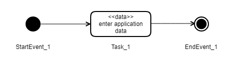

## Overview

All apps have a process definition that specifies start events, end events, tasks and the allowed flows (transitions) between these.
A process is started by the application, which selects a start event to start and follows the sequence flow to the first task and
creates a current task object to hold the process state.



A process is represented by an process model in BPMN/XML notation. Each task has an unique id, which is used to refer to the task in the api.

### Process model

Get the application's process model.

```http
GET {appPath}/process
```

Returns the bpmn file defining the process.

```xml {linenos=false,hl_lines=[5]}
<bpmn2:process id="Process_1" isExecutable="false">
    <bpmn2:startEvent id="StartEvent_1">
        <bpmn2:outgoing>Flow_1</bpmn2:outgoing>
    </bpmn2:startEvent>
   <bpmn2:task id="Task_1" name="Utfylling">
        <bpmn2:incoming>Flow_1</bpmn2:incoming>
        <bpmn2:outgoing>Flow_2</bpmn2:outgoing>
        <bpmn2:extensionElements>
            <altinn:taskExtension>
                <altinn:taskType>data</altinn:taskType>
            </altinn:taskExtension>
        </bpmn2:extensionElements>
    </bpmn2:task>
    <bpmn2:endEvent id="EndEvent_1">
        <bpmn2:incoming>Flow_2</bpmn2:incoming>
    </bpmn2:endEvent>
    <bpmn2:sequenceFlow id="Flow_1" sourceRef="StartEvent_1" targetRef="data_1" />    
    <bpmn2:sequenceFlow id="Flow_2" sourceRef="Task_1" targetRef="EndEvent_1" />
</bpmn2:process>
```

## Altinn specific task types

Application developers can in their BPMN Definition specify some altinn specific task types, see `altinn:taskType`,
which signify the behavior of the task. So far we have defined the following:

- *data* - user is asked to fill inn one or more data elements, e.g. upload data or fill in forms
- *confirmation* - user is asked to confirm the correctness of the information which has been filled in on previous tasks
- *feedback* - user is asked to wait while external feedback is uploaded to the instance

## Get process state of a specific instance

```http
GET {basePath}/api/v1/instances/347829/41e57962-dfb7-4502-a4dd-8da28b0885fc/process
```

For an ongoing process this process state can look like the json below. It indicates that the process was started at a given date time and that it's current task is *Task_1*.
The flow number indicates the sequence of process events/tasks that occurs during the execution of the process.
Notice that same task can be visited multiple times in a process if there is a sequence flow that allows that.

```json
{
  "started": "2019-09-25T09:32:44.20Z",
  "currentTask": {
    "flow": 2,
    "started": "2019-10-10T32:22.00Z",
    "elementId": "Task_1",
    "name": "Fyll ut",
    "altinnTaskType": "data",
    "validated": {
      "timestamp": "2019-10-04T12:00.00Z",
      "canCompleteTask": true
    }
  }
}
```

For an ended process the following will be returned:

```json
{
    "started": "2019-09-25T09:32:44.20Z",
    "startEvent": "StartEvent_1",
    "ended": "2019-10-10T14:01:22.034Z",
    "endEvent": "EndEvent_1"
}
```

## Process events

The system will generate a number of process related events, which can be found in the instances event history.

- Start Event
- StartTask Event
- EndTask Event
- End Event

### Start Event

```json 
{
    "instanceId": "347829/41e57962-dfb7-4502-a4dd-8da28b0885fc",
    "eventType": "process:Start",
    "processInfo": {
        "started": "2019-09-25T09:32:44.20Z",
        "startEvent": "StartEvent_1"
    },
    "createdDateTime": "2019-10-10T14:01:22.034Z",
}
```

### StartTask Event

```json {linenos=false,hl_lines=[3]}
{
    "instanceId": "347829/41e57962-dfb7-4502-a4dd-8da28b0885fc",
    "eventType": "process:StartTask",
    "processInfo": {
        "started": "2019-09-25T09:32:44.20Z",
        "startEvent": "StartEvent_1",
        "currentTask": {
            "flow": 2,
            "started": "2019-10-01T13:22.01Z",
            "elementId": "Task_1",
            "name": "Fyll ut MVA rapport",
            "altinnTaskId": "data"
        }
    },
    "createdDateTime": "2019-10-01T13:22.01Z",
}
```

### EndTask Event

```json {linenos=false,hl_lines=[3]}
{
    "instanceId": "347829/41e57962-dfb7-4502-a4dd-8da28b0885fc",
    "eventType": "process:EndTask",
    "processInfo": {
        "started": "2017-10-01T13:22.00Z",
        "startEvent": "StartEvent_1",
        "currentTask": {
            "flow": 2,
            "started": "2019-10-05T01:11.33Z",
            "elementId": "Task_1",
            "altinnTaskId": "data",
            "ended": "2019-10-05T01:11.33Z"
        }
    },
    "createdDateTime": "2019-10-05T01:11.33Z",
}
```

### End Event

```json {linenos=false,hl_lines=[3]}
{
    "instanceId": "347829/41e57962-dfb7-4502-a4dd-8da28b0885fc",
    "eventType": "process:EndEvent",
    "processInfo": {
        "started": "2017-10-01T13:22.00Z",
        "startEvent": "StartEvent_1",
        "ended": "2019-10-05T08:15:23.544Z",
        "endEvent": "EndEvent_1"
    },
    "createdDateTime": "2019-10-05T08:15:23.544Z",
}
```

### Get process history of a specific instance

Based on the process events the history of the instance's process is generated. The following illustrates an ended process:

```http
GET {basePath}/api/v1/instances/347829/41e57962-dfb7-4502-a4dd-8da28b0885fc/process/history
```

```json
{
    "processHistory": [
        {
            "eventType": "process_StartEvent",
            "elementId": "StartEvent_1",
            "occured": "2020-01-21T13:49:09.3109169Z"
        },
        {
            "eventType": "process_StartTask",
            "elementId": "Task_1",
            "started": "2020-01-21T13:49:09.4264322Z",
            "ended": "2020-01-21T13:49:39.66609Z"
        },
        {
            "eventType": "process_EndEvent",
            "elementId": "EndEvent_1",
            "occured": "2020-01-21T13:49:39.7681248Z"
        }
    ]
}
```

## Start Process

To start a process one can post start to the process endpoint.

```http
POST {basePath}/api/v1/instances/347829/41e57962-dfb7-4502-a4dd-8da28b0885fc/process/start[?startEvent=StartEvent_1]
```

This will start the process and move the process state to the first task from the given start. If process has more than one start event, then the client has to chose which one to start with the startEvent query parameter.

## Complete and move to next task

The process logic attempts to finish the current task and then moves the process forward to the next task in the flow. The cannot always select the next task, especially when more than one tasks can be chosen. In this case the client must chose which process element id to select.


```http
PUT {basePath}/api/v1/instances/347829/41e57962-dfb7-4502-a4dd-8da28b0885fc/process/next[?id=Task_2]
```

## Complete the process

The complete process method will attempt to complete the process for an instance. Hence, the app will move the process from one task to the next until it reaches an valid end state.

If a task's exit condition is not met, the process will be stopped in the last valid task. And the user must manually fix the problem and complete the process.


```http
PUT {basePath}/api/v1/instances/347829/41e57962-dfb7-4502-a4dd-8da28b0885fc/process/completeProcess
```


## Get the next tasks in a process

Returns an list of the next tasks/events that can be reached from the current task.

```http
GET {basePath}/api/v1/instances/347829/41e57962-dfb7-4502-a4dd-8da28b0885fc/process/next
```

## Start a task

If you are at a specific task and want to start the next task you can try to put next to the process endpoint. The process controller then tries to close the current task and start the wanted task. Updates process state accordingly. If exit condition of current task is not met, an error will be returned. If the task is not directly reachable by the flow, an error will be returned.

```http
PUT {basePath}/api/v1/instances/347829/41e57962-dfb7-4502-a4dd-8da28b0885fc/process/next?id=Task_2
```
