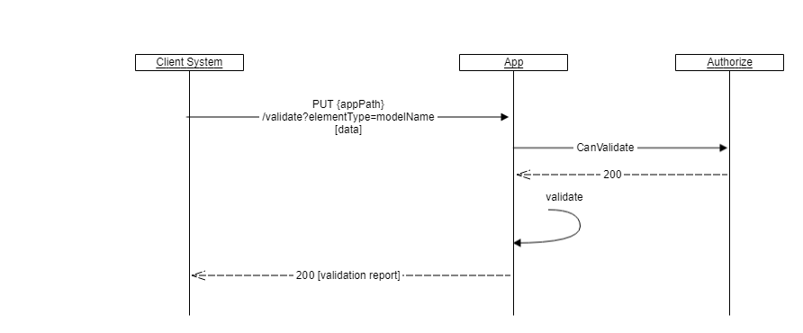

## Overview

There are multiple endpoints that can trigger validation and provide feedback regarding the state of an instance and its data.
Some of them validates data already uploaded and stored in Altinn while others can validate input.

## Validate stored instance

This action will validate an entire instance including the all data elements already uploaded and stored in Altinn.
Validation will be performed based on current task in the process. Validation will ensure that all required data elements, as defined by the application metadata,
have been uploaded and are valid.
If the result of the validation is that nothing is missing or wrong, the action will update the instance with information indicating that the instance is valid.
The response will be an empty array. In the case of validation issues the response will provide an array of the identified issues.
Validation of a full instance use validation of data as described in the chapter below.

```http
GET https://{org}.apps.at21.altinn.cloud/{org}/{app}/instances/{instanceOwnerPartyId}/{instanceId}/validate
```

Example response:

```json
[
    {
        "severity": "Error",
        "scope": "INSTANCE",
        "targetId": null,
        "field": null,
        "code": "TooManyDataElementsOfType",
        "description": "TooManyDataElementsOfType"
    }
]
```

## Validate stored data

This action will validate a specific data element already uploaded and stored in Altinn.
The logic validates that the data element has the correct Content-Type, that it isn't too large and so on. Data elements with
a model bound to them will be validated against the model (Schema).

Validation will also check that the data element being validated is required for the current task in the process.
If the data is validated during a task different from what is intended, the validator will give a warning.

```http
GET https://{org}.apps.at21.altinn.cloud/{org}/{app}/instances/{instanceOwnerPartyId}/{instanceId}/data/{dataid}/validate
```

Example response:

```json
[
    {
        "severity": "Error",
        "scope": "default",
        "targetId": null,
        "field": null,
        "code": "MissingContentType",
        "description": "MissingContentType"
    }
]
```

### Validate data

The application will provide a method to validate the datamodel without creating a instance of the data. Data must be provided as formdata.
The validate method takes a data file of an dataType and performs validation on that file. It returns a validation report.



```http
PUT {basePath}/api/v1/validate?dataType=modelA
```
