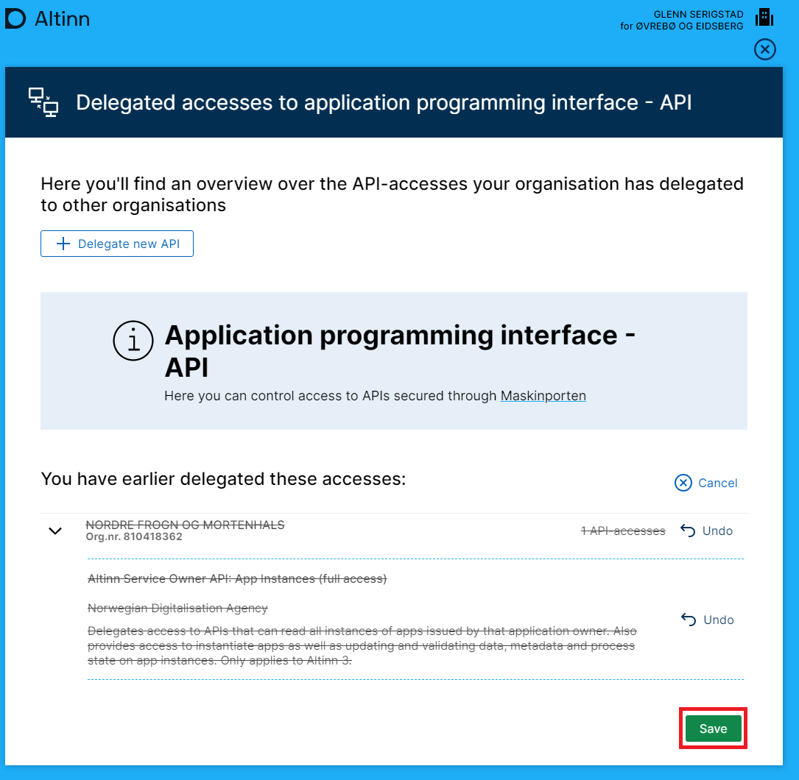

Certain service owners want a subcontractor to be able to act on their behalf, e.g. suppliers of specialist systems.
To achieve that, these API accesses must be delegated to the provider using Altinn.

It is the service owner's responsibility to remove the delegations themselves if the supplier no longer need access.

## Delegation of API access to the supplier

As a service owner key role user (typically general manager aka DAGL), open "Access to the Application Programming Interface - API".


Så må de nødvendige rettighetene gis.

- **Altinn Service Owner API: App Instances (full access)** - provides access to [scopes](#scopes) for both read and write.
- **Altinn service owner API: App instances (read access)** - only provides read access.


## Removal of delegation

Delegations that have been made can also be removed.
If a supplier no longer needs API access, it is the service owner's responsibility to remove these.





## Scopes

Delegation gives access to these scopes for the supplier:

```js
altinn:serviceowner/instances.read
altinn:serviceowner/instances.write
```
