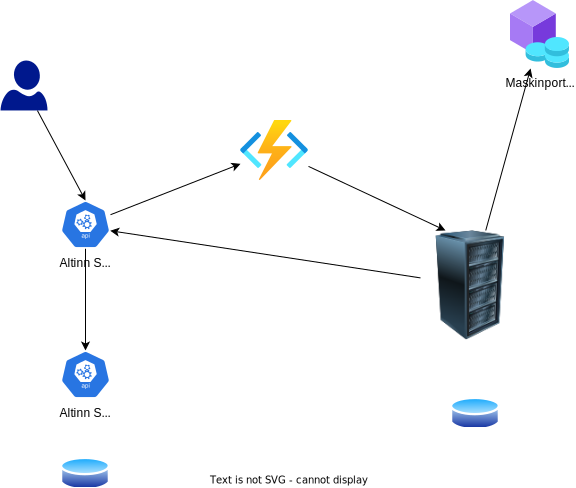

## Overordnet konsept

Altinn tilbyr en plattform for utvikling og drift av digitale tjenester. Hvis tjenestene krever at sluttbruker (innbygger/næringsliv) skal rapportere inn data, vil disse dataene i utgangspunktet bli lagret i Altinn. Tjenesteeier må hente disse mottatte dataene fra Altinns datalager ved hjelp av API-integrasjon. Denne guiden beskriver hvordan en slik integrasjon kan settes opp.

## Om prosessflyt i applikasjoner

En applikasjon utviklet i Altinn Studio kan ha forskjellige prosesser avhengig av tjenesteeiers behov. For en tjeneste som skal hente inn data, vil man typisk ha minst ett datasteg hvor sluttbruker kan skrive inn data. I tillegg kan det være aktuelt med et bekreftelsesteg hvor sluttbruker får mulighet til å se over data før de bekrefter at de er korrekte.

For en slik tjeneste vil prosessen i selve appen være avsluttet når sluttbruker trykker bekreft. Denne prosessen kan være del av en større prosess som tjenesteeier orkestrerer.

## Instansiering av tjeneste

Instansiering betyr i Altinn-sammenheng at det opprettes en dialog i en avgiver/parts innboks i Altinn. Denne instansieringen kan trigges av sluttbruker eller av tjenesteeier. I denne guiden forutsetter vi at den er instansiert av sluttbruker. Guide for tjenesteeier-instansiering finner du her (TODO).

## Overordnet prosess sluttbruker

Prosessen overordnet:

1. Sluttbruker instansierer tjeneste i parts meldingsboks i Altinn. Dette kan gjøres via API eller i nettleser på Altinn.no.
2. Skjema fylles ut og eventuelle vedleggsdata lastes opp.
3. Sluttbruker validerer data og eventuelle vedlegg og sender applikasjonsprosessen videre til bekreftelse.
4. Sluttbruker ser over data og bekrefter at de er ferdige med prosessen.
5. Applikasjon publiserer en hendelse om at sluttbruker er ferdig med utfyllingsprosessen. (Forutsetter at publisering er [slått på]())
6. Tjenesteeier mottar informasjon om hendelsen på sitt hendelsesmottak.
7. Tjenesteeier kaller Altinn API for å laste ned data for instansen.
8. Tjenesteeier bekrefter at data er nedlastet ok.



## Hva kreves teknisk

Utvikling av applikasjon er dekket i Guide for applikasjonsutvikling. Aktivering av publisering av hendelser fra applikasjon er beskrevet i guide.

Krav til webhook for mottak av events finner du [her](/events/subscribe-to-events/developer-guides/setup-subscription/#request).

Tjenesteeier må ha registrert en integrasjon i Maskinporten. Opprettelse av integrasjon er beskrevet i Guide [her](/api/authentication/maskinporten/#tilgang-som-tjenesteeier).

## Detaljert teknisk prosess

### Tjenesteeiersystem mottar Event fra Altinn Events

Første steget i prosessen er at mottaksendepunktet mottar informasjon om Event fra Applikasjon kjørende i Altinn. Dette forutsetter at [abonnement er satt opp](/events/subscribe-to-events/developer-guides/setup-subscription/).

```json
{
    "id": "bd9edd59-b18c-4726-aa9e-6b150eade814",
    "source": "https://ttd.apps.altinn.no/ttd/bli-applikasjonseier/instances/1337/bd9edd59-b18c-4726-aa9e-6b150eade814",
    "specversion": "1.0",
    "type": "app.instance.created",
    "resource": "urn:altinn:app:ttd.bli-applikasjonseier",
    "resourceinstance": "bd9edd59-b18c-4726-aa9e-6b150eade814",
    "subject": "/party/1337",
    "time": "2022-05-12T00:02:07.541482Z"
}
```

### Autentisering mot maskinporten

Tjenesteeiersystem kaller Maskinporten API med korrekt Scopes for tjenesteeier. Dette er beskrevet i detaljer [her](/authentication/what-do-you-get/maskinporten/#tilgang-som-tjenesteeier).

Deretter må tjenesteeiersystem kalle Altinns [innvekslingsendepunkt](/api/authentication/spec/) med sitt maskinportentoken som bearer token.

```http
http://platform.altinn.no/authenticaiton/api/v1/exchange/maskinporten/
```

### Tjenesteiersystem kaller source-endepunkt fra event

Events fra Altinn Applikasjoner peker på Instance-endepunktet til en gitt applikasjon som kjører i Altinn. Ved å benytte sitt tjenesteeier-token vil systemet kunne laste ned instance-dokumentet.

```json
{
    "id": "1337/bd9edd59-b18c-4726-aa9e-6b150eade814",
    "instanceOwner": {
        "partyId": "1337",
        "personNumber": "01039012345",
        "organisationNumber": null,
        "username": null
    },
    "appId": "ttd/bli-applikasjonseier",
    "org": "ttd",
    "selfLinks": {
        "apps": "https://ttd.apps.altinn.no/ttd/bli-applikasjonseier/instances/1337/bd9edd59-b18c-4726-aa9e-6b150eade814",
        "platform": "https://ttd.apps.altinn.no/storage/api/v1/instances/1337/bd9edd59-b18c-4726-aa9e-6b150eade814"
    },
    "dueBefore": null,
    "visibleAfter": null,
    "process": {
        "started": "2020-11-18T15:56:41.5662973Z",
        "startEvent": "StartEvent_1",
        "currentTask": {
            "flow": 2,
            "started": "2020-11-18T15:56:41.5664762Z",
            "elementId": "Task_1",
            "name": "Utfylling",
            "altinnTaskType": "data",
            "ended": null,
            "validated": {
                "timestamp": "2020-11-20T13:00:05.1800273+00:00",
                "canCompleteTask": true
            }
        },
        "ended": null,
        "endEvent": null
    },
    "status": null,
    "completeConfirmations": null,
    "data": [
        {
            "id": "8a8a01ae-9533-4aa9-b914-8ab0fae6ea0d",
            "instanceGuid": "bd9edd59-b18c-4726-aa9e-6b150eade814",
            "dataType": "Kursdomene_BliTjenesteeier_M_2020-05-25_5703_34553_SERES",
            "filename": null,
            "contentType": "application/xml",
            "blobStoragePath": "ttd/bli-applikasjonseier/bd9edd59-b18c-4726-aa9e-6b150eade814/data/8a8a01ae-9533-4aa9-b914-8ab0fae6ea0d",
            "selfLinks": {
                "apps": "https://ttd.apps.altinn.no/ttd/bli-applikasjonseier/instances/1337/bd9edd59-b18c-4726-aa9e-6b150eade814/data/8a8a01ae-9533-4aa9-b914-8ab0fae6ea0d",
                "platform": "https://ttd.apps.altinn.no/storage/api/v1/instances/1337/bd9edd59-b18c-4726-aa9e-6b150eade814/data/8a8a01ae-9533-4aa9-b914-8ab0fae6ea0d"
            },
            "size": 401,
            "locked": false,
            "refs": [],
            "created": "2020-11-18T15:56:43.1089008Z",
            "createdBy": null,
            "lastChanged": "2020-11-18T15:56:43.1089008Z",
            "lastChangedBy": null
        }
    ],
    "created": "2020-11-18T15:56:42.1972942Z",
    "createdBy": "1337",
    "lastChanged": "2020-11-18T15:56:42.1972942Z",
    "lastChangedBy": "1337"
}
```

### Tjenesteiersystem kaller endepunkt for hvert av dataelementene

I instance-dokumentet fra steget over er det listet dataelementene som en instance består av. Disse dokumentene kan lastes ned fra applikasjonsendepunktet. Hvert dataelement har informasjon om f.eks. datatype og når det sist ble endret.

URL for nedlasting av hvert element er oppgitt som en URL til App eller URL til Storage.

```http
https://ttd.apps.altinn.no/ttd/bli-applikasjonseier/instances/1337/bd9edd59-b18c-4726-aa9e-6b150eade814/data/8a8a01ae-9533-4aa9-b914-8ab0fae6ea0d
```

Det anbefales at tjenesteeier benytter app-endepunktet for nedlasting. På denne måten har man best tilgang til logger.

### Tjenesteiersystem kaller endepunkt for å bekrefte data

Når instance-data og dataelementer er lastet ned og verifisert ok, må tjenesteeier bekrefte ok nedlasting. Dette gjøres ved å kalle [Complete-endepunktet](/api/apps/instances/#complete-instance) på Applikasjon.

## Referansesystem

Altinn har utviklet et referansesystem som mottar Events og laster ned data. Dette finner man [her](https://github.com/Altinn/altinn-application-owner-system).


