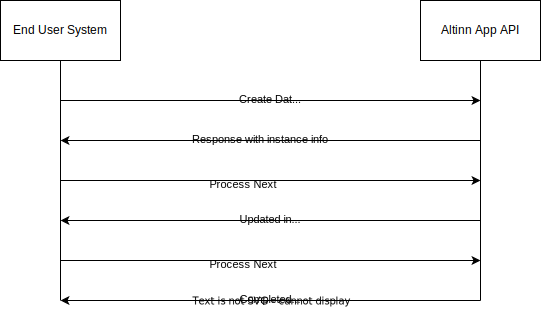

## Overordnet om Altinn og sluttbrukersystem

På Altinn-plattformen utvikler forskjellige etater og andre offentlige aktører tjenester som skal benyttes av innbyggere eller næringsliv.

Tjenestene kan være enkle, hvor man må rapportere en begrenset mengde data, til komplekse tjenester med flere typer dataelementer over flere prosessteg.

En viktig egenskap med tjenester utviklet i Altinn er at hver tjeneste tilbyr et sett med API-er som kan benyttes for maskin-til-maskin-innsending av data fra sluttbrukersystem.

Et sluttbrukersystem er i denne konteksten programvare som utfører oppgaver på vegne av sluttbruker (innbygger/næringsliv), enten fullstendig automatisert eller kontrollert av en sluttbruker.

I dag er det ca. 50% av dataene som blir rapportert til Altinn som blir sendt på denne måten fra over 100 forskjellige programvareløsninger.

## Hva er en Altinn-tjeneste?

En tjeneste består av en applikasjon som er tilgjengelig i Altinns infrastruktur. Denne applikasjonen har et sett med konfigurasjoner som beskriver data som tjenesten skal motta eller sende ut, samt hvilken prosess tjenesten har.

Eksempler på tjenester utviklet på den nye Altinn 3-plattformen finner du [her](/altinn-studio/news/launched-apps/).

## Hvilke typer data eksponerer/mottar tjenestene via API?

Den typiske Altinn-tjenesten har definert en skjemamodell som beskriver de dataene som gjelder den aktuelle tjenesten.

Denne modellen er spesifisert av den tjenesteeieren som har laget tjenesten. En tjeneste kan i tillegg til en eller flere skjemamodeller også ha definerte sett med vedleggsdata som skal vedlegges.

## Overordnet prosess for innsending

Diagrammet nedenfor viser den overordnede flyten i kommunikasjon mellom et sluttbrukersystem og Altinns API.



## Detaljert teknisk prosess

### Forutsetninger

For sluttbrukersystemer hvor sluttbrukere skal logge inn ved å bruke ID-porten, må sluttbrukersystemet ha en klient registrert som api_klient i ID-porten. Dokumentasjon om hvordan man registrerer klient finner man [her](https://docs.digdir.no/docs/idporten/oidc/oidc_func_clientreg).

### Pålogging & scopes

For pålogging må sluttbrukersystem sende sluttbruker til ID-porten for pålogging ved hjelp av sin oppsatte klientkonfigurasjon.

Scope det må spørres om er altinn:instances.read og altinn:instances.write.

Disse scopene gir mulighet for å kalle alle apper i Altinn 3.

Som del av påloggingsprosessen vil sluttbrukersystemet få tilgang til et access_token med informasjon om sluttbruker.

Se detaljert påloggingsprosess med ID-porten og skjermbildet som sluttbruker blir presentert for, [her](../../../../authentication/what-do-you-get/id-porten/).

### Innveksling av access_token til Altinn Token

Neste steg i prosessen er å veksle access_token fra ID-porten til et Altinn Token.

Et Altinn Token kan benyttes mot alle tjenesteapplikasjoner og relevante felleskomponenter.

Innveksling skjer mot [Autentiserings API](/api/authentication/spec/).

Innvekslingen skjer ved at man setter Access Token fra ID-porten som et Bearer token i authorization headeren og gjør et GET-kall mot innvekslingsendepunktet hvor "id-porten" er brukt som token provider.

Detaljert beskrivelse av innveksling med ID-porten token finner du [her](../../../../authentication/what-do-you-get/id-porten/).

### Instansiering og innsending av data

Når man har et gyldig token kan man instansiere (opprette tjenesteinstans) og sende inn data for den digitale tjenesten.

Det er i hovedsak to flyter man kan velge her.

#### Instansiering uten skjemadata

Ved instansiering uten skjemadata vil første kall mot Altinn kun inneholde informasjon om hvem som er avgiver og hvilken tjeneste man instansierer.

Dette kallet går mot [Instance API](/api/apps/instances/#create-instance) på app. ([OpenAPI](/api/apps/spec))

```json
{
    "appId" : "org/app",
    "instanceOwner": {
        "personNumber": "12247918309",
        "organisationNumber": null
    }
}
```

Resultatet er en instans med skjemadata som igjen inneholder standard data og prefilldata konfigurert av tjenesteeier.

```json
{
    "id": "1337/bd9edd59-b18c-4726-aa9e-6b150eade814",
    "instanceOwner": {
        "partyId": "1337",
        "personNumber": "01039012345",
        "organisationNumber": null,
        "username": null
    },
    "appId": "ttd/bli-applikasjonseier",
    "org": "ttd",
    "selfLinks": {
        "apps": "https://local.altinn.cloud/ttd/bli-applikasjonseier/instances/1337/bd9edd59-b18c-4726-aa9e-6b150eade814",
        "platform": "https://local.altinn.cloud/storage/api/v1/instances/1337/bd9edd59-b18c-4726-aa9e-6b150eade814"
    },
    "dueBefore": null,
    "visibleAfter": null,
    "process": {
        "started": "2020-11-18T15:56:41.5662973Z",
        "startEvent": "StartEvent_1",
        "currentTask": {
            "flow": 2,
            "started": "2020-11-18T15:56:41.5664762Z",
            "elementId": "Task_1",
            "name": "Utfylling",
            "altinnTaskType": "data",
            "ended": null,
            "validated": {
                "timestamp": "2020-11-20T13:00:05.1800273+00:00",
                "canCompleteTask": true
            }
        },
        "ended": null,
        "endEvent": null
    },
    "status": null,
    "completeConfirmations": null,
    "data": [
        {
            "id": "8a8a01ae-9533-4aa9-b914-8ab0fae6ea0d",
            "instanceGuid": "bd9edd59-b18c-4726-aa9e-6b150eade814",
            "dataType": "Kursdomene_BliTjenesteeier_M_2020-05-25_5703_34553_SERES",
            "filename": null,
            "contentType": "application/xml",
            "blobStoragePath": "ttd/bli-applikasjonseier/bd9edd59-b18c-4726-aa9e-6b150eade814/data/8a8a01ae-9533-4aa9-b914-8ab0fae6ea0d",
            "selfLinks": {
                "apps": "https://local.altinn.cloud/ttd/bli-applikasjonseier/instances/1337/bd9edd59-b18c-4726-aa9e-6b150eade814/data/8a8a01ae-9533-4aa9-b914-8ab0fae6ea0d",
                "platform": "https://local.altinn.cloud/storage/api/v1/instances/1337/bd9edd59-b18c-4726-aa9e-6b150eade814/data/8a8a01ae-9533-4aa9-b914-8ab0fae6ea0d"
            },
            "size": 401,
            "locked": false,
            "refs": [],
            "created": "2020-11-18T15:56:43.1089008Z",
            "createdBy": null,
            "lastChanged": "2020-11-18T15:56:43.1089008Z",
            "lastChangedBy": null
        }
    ],
    "created": "2020-11-18T15:56:42.1972942Z",
    "createdBy": "1337",
    "lastChanged": "2020-11-18T15:56:42.1972942Z",
    "lastChangedBy": "1337"
}
```

Systemet kan velge å laste ned data via data-API for å legge til egne data eller eventuelt bare overskrive skjema som ble opprettet under instansiering. Det må brukes ID for autoopprettet skjema for å overskrive.

PUT-grensesnitt for data benyttes for å overskrive data. Data kan sendes som XML eller JSON.

Dette avhenger av hvordan skjemadefinisjonen er delt av tjenesteeier.

#### Instansiering med multipart formdata

Denne måten å instansiere på gjør at man sender inn informasjon om avgiver, samt data, i ett og samme API-kall. Instansdelen er som i eksempelet over.

Skjemadata kan være i XML-format (mest vanlig til nå) eller JSON-format.

Typisk vil tjenesteeier kommunisere XSD/JSON Schema-dokumentasjon til sluttbrukersystemleverandører via [Altinn digitalisering](https://www.altinndigital.no/produkter/altinn-api-for-datasystem/tjenesteoversikt/) eller via egne kanaler.

Eksempel på slike kanaler er nettsted for [Skattemeldingen tjeneste](https://github.com/Skatteetaten/skattemeldingen) og [MVA tjeneste](https://skatteetaten.github.io/mva-meldingen/).

I tillegg til skjemadata kan det være ett eller flere filvedlegg.

Eksempelet nedenfor viser multipart/form-data med instance-informasjon, skjemadata (model1) og vedleggsdata (certificate).

```http {linenos=false,hl_lines=[5,10,15]}
Content-Type: multipart/form-data; boundary="abcdefg"

--abcdefg
Content-Type: application/json; charset=utf-8
Content-Disposition: form-data; name="instance"
{ ... }

--abcdefg
Content-Type: application/xml
Content-Disposition: form-data; name="model1"
<xml> ... </xml>

--abcdefg
Content-Type: application/pdf
Content-Disposition: form-data; name="certificate"; filename=certificate.pdf
%PDF-1.4
%Óëéá
1 0 obj
...

--abcdefg--
```

### Fullføring av prosess

Idet skjemadata og vedleggsdata er komplett utfylt kan sluttbrukersystemet fullføre applikasjonsprosessen.

En prosess kan bestå av ett til flere steg. Typisk består en prosessflyt av et steg hvor man laster opp data og et nytt prosessteg hvor man bekrefter data.

For et sluttbrukersystem betyr det at følgende operasjoner må gjennomføres før prosessen er komplett:

#### Bekrefte Next på datasteg

Ved å sende PUT på [NEXT](/api/apps/process/#complete-and-move-to-next-task) på prosess-API vil tjenesten validere data og sende prosessen videre til bekreftelse.

Ved feil på data vil man få en feilmelding.

Man kan da kalle [validerings-API](/api/apps/validation/#validate-stored-instance) for å få detaljer om feil.

#### Bekrefte Next på bekreftelsesteg

Når data er validert OK vil tjenesten ligge til bekreftelse. Ved å gjøre et ekstra PUT-kall til NEXT i denne tilstanden blir tjenesten fullført.

Tjenesteeier blir da varslet om at prosessen er fullført og kan behandle data videre.
