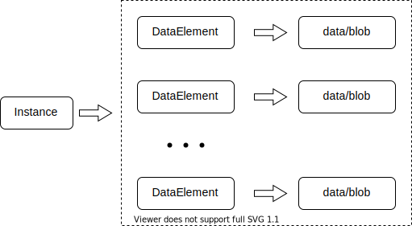

## The two primary data structures

This will be an overview of the primary models used by Storage (and apps from Altinn Studio). The primary purpose of
this is to form a basic understanding of the models before introducing the APIs.

### Instance

The instance model is the main metadata document in Altinn 3. It is used by Altinn to keep track of the state of an
interaction between an end user and the owner of an app. An instance must be associated with an app and a reportee
as the instance owner.

Instances are also similar to file folders for other documents; forms and unstructured data collected during the
lifetime of the instance. The number of documents and files being produced will depend on the app. 

In a simple app, an end user will fill in a form and submit it to the application owner. This would typically produce
a one way interaction where only one or two documents are collected in the instance. In more advanced apps the number
of documents and files would extend to multiple forms, attachments, and feedback or validation messages from the
application owner. 

An instance cannot reference data directly, but will hold a list of data elements with more information about collected
data.

### DataElement

The DataElement model is a metadata document for a specific form or binary file. The most important aspects of this
document is that it holds information about where the actual data is being stored, and how the data is being used by
the application. 

Most apps will automatically create a data element to represent the form being filled out by the user. More advanced
apps will also require the user to upload attachments or to fill in multiple forms.

An instance can have many data elements, but each data element cannot reference more than one data file.

