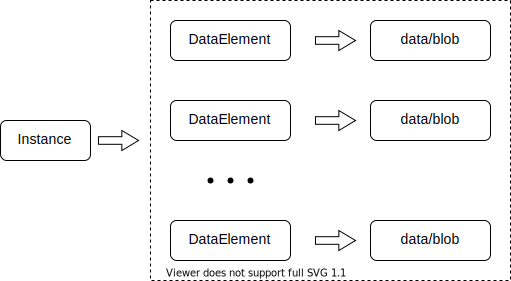

## De to primære datastrukturene

Dette vil være en oversikt over primærmodellene som brukes av Storage (og av apper fra Altinn Studio). Hovedhensikten med dette er å danne en grunnleggende forståelse av modellene før introduksjon av API-ene.

### Instans (Forekomst)

Instansmodellen er hovedmetadatadokumentet i Altinn 3. Den brukes av Altinn for å holde styr på tilstanden til en interaksjon mellom en sluttbruker og eieren av en app. En instans må være knyttet til en app og en rapportør som instanseier.
 
Instanser er også litt som beholdere for alle andre dokumenter; skjemaer og ustrukturert data samlet inn under en interaksjon mellom en sluttbruker og applikasjonseieren. Antall dokumenter og filer som produseres vil avhenge av appen.

I en enkel app vil en sluttbruker fylle ut et skjema og sende det til applikasjonseieren. Dette vil typisk produsere en enveis interaksjon der bare ett eller to dokumenter samles inn i instansen. I mer avanserte apper vil antallet dokumenter og filer utvides til flere skjemaer, vedlegg og tilbakemeldinger eller valideringsmeldinger fra applikasjonseieren.

En instans kan ikke referere til data direkte, men vil inneholde en liste over dataelementer med mer informasjon om innsamlede data.

### DataElement

DataElement-modellen er et metadatadokument for et spesifikt skjema eller binær fil. De viktigste aspektene ved dette dokumentet er at det inneholder informasjon om hvor de faktiske dataene blir lagret, og hvordan dataene brukes av applikasjonen.

De fleste apper vil automatisk opprette et dataelement for å representere skjemaet som fylles ut av brukeren. Mer avanserte apper vil også kreve at brukeren laster opp vedlegg eller fyller ut flere skjemaer.

En instans kan ha mange dataelementer, men hvert dataelement kan ikke referere til mer enn én datafil.

