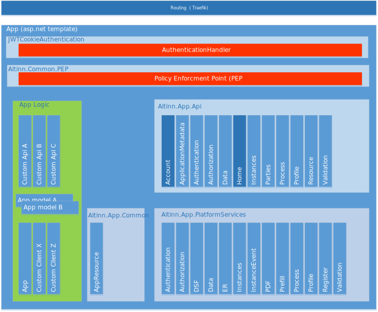

In this app template the App Backend is based on [ASP.NET Core](https://docs.microsoft.com/en-us/aspnet/core/) and is 
a [Web Api application](https://docs.microsoft.com/en-us/aspnet/core/web-api/).

The App Backend exposes REST-Api's consumed by a optional App Frontend and/or external systems / mobile apps.
The structure of the API's is documented [here](/altinn-api/)

The diagram below show how the code is structured in different parts. 

## Altinn.App.Api
The REST-APIS are implemented in different [web-api-controllers](https://docs.microsoft.com/en-us/aspnet/core/web-api/) and uses attribute based routing to identify the correct
operation. The web-api controllers are implemented in a library called [Altinn.App.Api](https://www.nuget.org/packages/Altinn.App.Api) and is published to Nuget. 

The app template is configured to use this nuget package. 

## Altinn.App.PlatformServices
Platform services are services that are configured in startup on the app and with help of dependendency injection is available to 
the API controllers and other code in the app. The services are implemented in
a library called [Altinn.App.PlatformServices](https://www.nuget.org/packages/Altinn.App.PlatformServices) and is published to Nuget. 

## Altinn.App.Common
In common functionality to read configuration from the docker drive is implemnted and other
common functionality.  The common functionality are implemented in a library
called [Altinn.App.Common](https://www.nuget.org/packages/Altinn.App.Common) and is published to Nuget. 

## App logic
The app logic contains the custom application code that a app developer has generated/created in Altinn Studio or
in third party development tools like Visual Studio Code. 

## Datamodel
The data model in an app is defined as an XSD. From the XSD it is generated a C# representation of that model.

In app backend all data is deserialized/serialized from/to this model when communication with frontend/external systems.

All logic in the app will typical be related to the datamodel.
In the future we will support apps with multiple data models.

