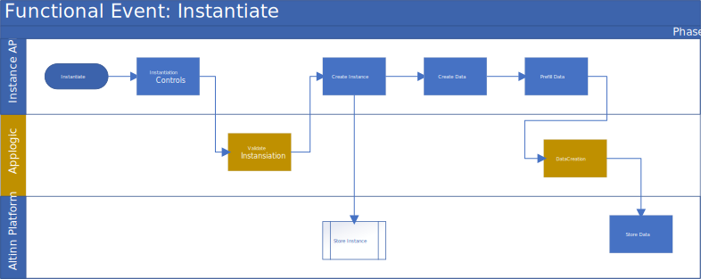
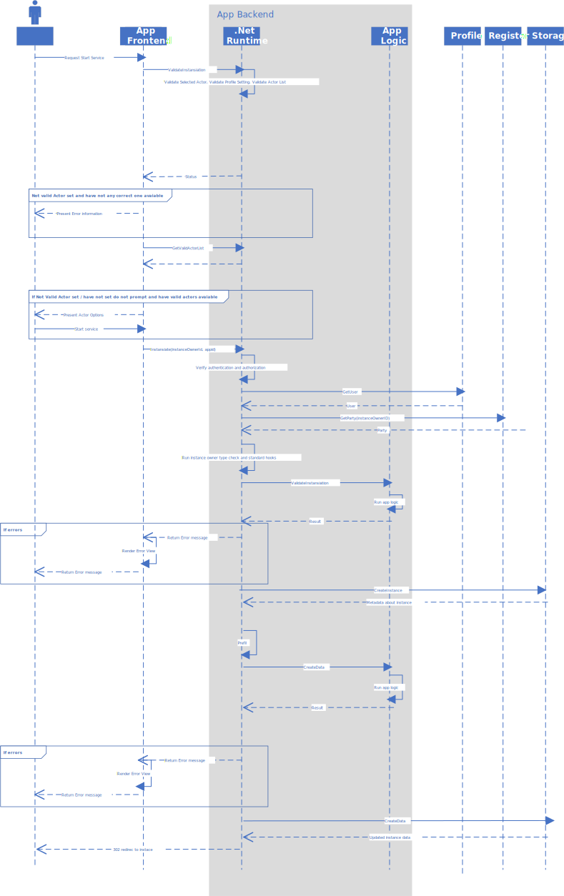
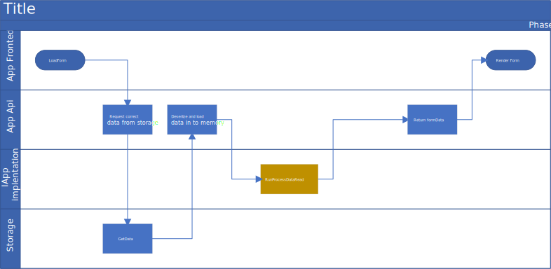
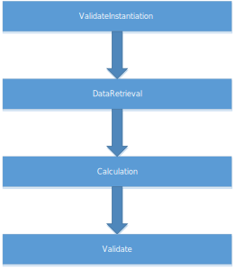
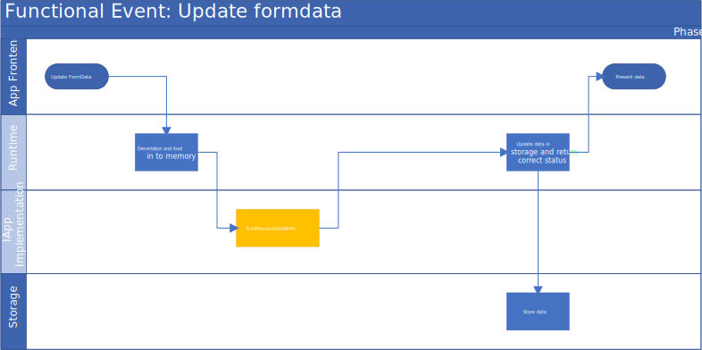
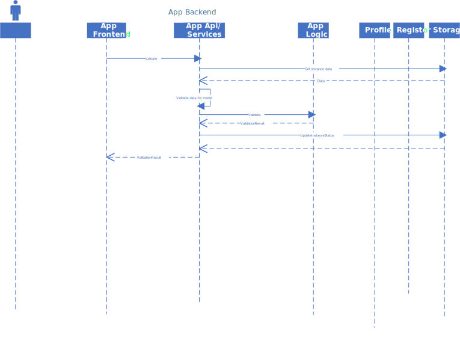

Events are mapped to functional events triggered by end users or systems. This functional events are typical trigged by a API-call 
from App Frontend or other systems/applications using the API's in App Backend. 

Some AppLogic Events happens in more than one functional event. 

## AppLogic Events
AppLogic events are defined in the
[IAltinnApp interface](https://github.com/Altinn/altinn-studio/blob/master/src/Altinn.Apps/AppTemplates/AspNet/Altinn.App.PlatformServices/Interface/IAltinnApp.cs).

The following AppLogic Events are currently defined

- InstantiateValidation - Event where app developer can add custom code to validate instantiation. 
- DataCreation - Event where app develoepr can add custom code to prefill data
- RunProcessDataRead - Where app developer can add custom data code for calculation or population of data when data is read from app
- RunProcessDataWrite - Where app developer can add custom data code for calculation or population of data when data is saved to app (POST/PUT)
- Calculation - Event where app developer can add custom calculation code OBSOLETE.
- Validation - Event where app developer can add custom code to validate the instance/data
- OnStartProcess
- OnStartProcessTask
- CanEndProcessTask
- OnEndProcessTask
- OnEndProcess

## Functional events

Below, different functional events, are listed.
For each functional event there is described which AppLogic events that is triggered.

### Instansiation
Instansiation is when the end user, end user system or organisation instansiates a new app instance.
Events connected to instansiation can contain logic that can prefill the datamodell
or validate if the user or system is allowed to instansiate that app.

The below sequence diagram shows how the app-logic events are combined with other logic for a requesting to start an app in the app catalogue.

### Load form data (GET)
Loading of form data can be performed by the App Frontend or an end user system that needs to get
the latest updated form data. 

The following events will be performed

### Storing of form data (POST)
Update of form data can happen when frontend (REACT app) sends data to backend
or a end user system does the same. When an update happend there is defined serveral
events that is performed in a given order. The app developer can implement
logic related to this event that could perform calculation, validation, API calls and much more.

The API for updating form data support different modes

- Create - Data should be stored as a new form instance
- Complete - Data is complete and the app should move ahead in the workflow
- Calculate - Logic in the calculation event should be performed and the updated form data should be returned
- Validate - Calculation will be performend and then validation logic is runned and any validation errors is returned.
- Update - Calculation is runned before data is stored in to the database.

The order of events are:

### Update form data (PUT)
Update of form data happens when the frontend or external end user systems/applications 
want to update a existing form connected to an app instance

The following events happens:

### Validation
Validation is triggered from App Frontend or from end user system. 

The below sequence diagram shows the application events:

