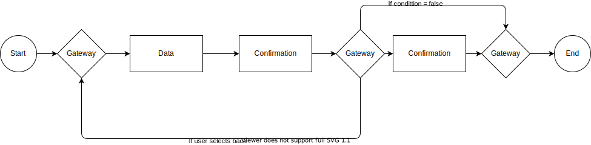

The template follows the [BPMN 2.0 standard.](https://www.bpmn.org/)

## Supported process elements

### Tasks
### Exclusive Gateways

Exclusive gateways allow a different path in the process based on direct user input, data, or other aspects available from code.

## Process Examples

## Process configuration

In Altinn Studio, the App developer can configure the process.

[Read our development handbook for details.](../../../../app/development/configuration/process/)