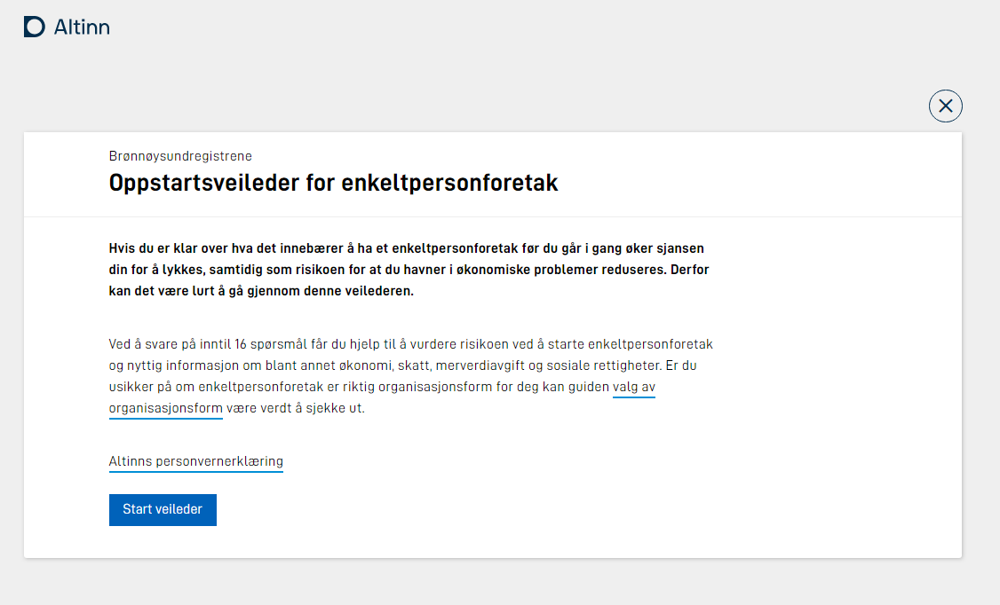

For digital services targeting API consumers strictly, there is no need for the front end.

The application developer configures the UI in Altinn Studio UI-designer.

The configuration files are deployed together with the application.

## UI rendering

The UI-Render functionality in App Frontend renders the UI based on the configuration set in Altinn Studio when users access the digital service. 

### Process views

The App template front end has default support for the supported task types in the application. Therefore, the front end has a default behavior for each supported task.

#### Data Views

The default view for the data task is to present the configured UI components mapped to the application data models.

#### Confirmation View

The default view for confirmation allows the user to look at data, return to data for modification or confirm data by pressing a button.

#### Feedback View

The view for the feedback task shows default information about the instance that is awaiting external feedback.

### UI-Components

The list of supported UI components is growing. This list includes UI components developed by the core Altinn team and components from the open-source community. A noncomplete list of UI components includes: 

- Input
- Textarea
- Datepicker
- Map
- Multiple select
- Dropdown list
- Image
- Repeating group
- Label
- Heading
- Paragraph

You can find UI-component documentation [here.](../../../../app/development/ux/components/)

### Page Support

The App Template front end supports having multiple pages of UI components in the same task view.

Multipage support is essential for digital services with a large amount of data that needs input.

[Read how to configure pages.](../../../../app/development/ux/pages/)

### Page Navigation

[Read how to configure page navigation.](../../../../app/development/ux/pages/navigation/)

### Dynamics

Configuring dynamics that manipulate the UI based on data and other aspects is possible. Dynamics is configured using
expressions.

[Read how in the Application Developer Handbook.](../../../../app/development/logic/expressions)

### Language support

The front end support configuring the digital service with multiple languages. It even supports right-to-left languages.

[Read more about language support.](../../../../app/development/ux/texts/translation/)

## Custom Frontend

Suppose the standard application front end does not fulfill your needs. 

The template supports that you can replace the standard front end with your custom front end based on your preferred technology.

 [Read more about architecture](../architecture).