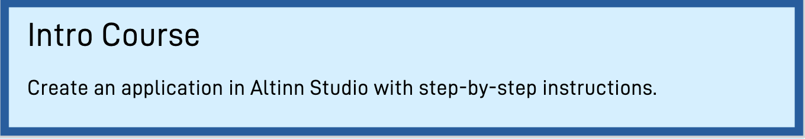

{}
**Who can use Altinn Studio?**  
Anyone can log into [altinn.studio](https://altinn.studio) and check out the possibilities!  
You have to be a [service owner](https://www.altinndigital.no/kom-i-gang/) in Altinn and
[accept the conditions for Altinn in public cloud](https://digdir.apps.altinn.no/digdir/godkjenn-bruksvilkaar/) to be able to deploy apps to the production environment.
{}

If you have questions or feedback, then you can contact us on [Slack](https://altinnstudio.slack.com)
or [GitHub](https://github.com/Altinn/altinn-studio/issues/new/choose), or just keep on reading this documentation.

---

## Get started

Follow these steps to start developing apps in Altinn Studio.
1. [Create user](/app/getting-started/create-user)
2. [Learn to navigate Altinn Studio](/app/getting-started/navigation)
3. [Create an application in Altinn Studio](/app/getting-started/create-app)
4. [Get to know Altinn Studio Designer](/app/getting-started/ui-editor)
5. [Prepare for local development](/app/getting-started/local-dev)

---

## App development
Create and edit apps in Altinn Studio.

|   |   |   |   |   |
|---|---|---|---|---|
| [Data](/app/development/data)  | [User interface](/app/development/ux)  | [Configuration](/app/development/configuration)  | [Logic](/app/development/logic) |  [API](/app/development/api) |

---

## Guides
How to perform specific tasks related to app development in Altinn Studio.

|   |   |   |   |   |
|---|---|---|---|---|
| [Design](/app/guides/design)  | [Testing](/app/testing)  | [Copy app](/app/guides/copy-app)  | [Access management](/app/guides/access-management)  | [Migrate from Altinn 2](/app/guides/migrate-services) |

## App examples
Draw inspiration from applications developed by Digdir or external organizations.

### [Digdir](/app/launched-apps/digdir)
Documentation for applications developed by Digitaliseringsdirektoratet.

### [External](/app/launched-apps/external)
Applications created by external organizations.

---

## Next steps

- [Deployment](/app/deployment/)
- [Monitoring](/app/monitoring/)
- [Maintenance](/app/maintainance/)