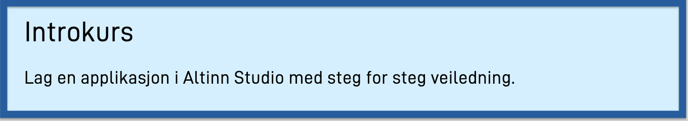

{}
**Hvem kan ta i bruk Altinn Studio?**  
Alle kan logge inn i [altinn.studio](https://altinn.studio) og teste ut mulighetene!  
Du må være [tjenesteeier](https://www.altinndigital.no/kom-i-gang/) i Altinn samt
[godta bruksvilkår for Altinn i skyen](https://digdir.apps.altinn.no/digdir/godkjenn-bruksvilkaar/) for å kunne produksjonssette apper.
{}

Hvis du lurer på noe så er det bare å ta kontakt med oss på [Slack](https://altinnstudio.slack.com)
eller [GitHub](https://github.com/Altinn/altinn-studio/issues/new/choose), eller lese denne dokumentasjonen.

---
## Kom i gang

Følg disse grunnleggende stegene for å komme i gang med utvikling av applikasjoner i Altinn Studio.
1. [Opprett bruker](/nb/app/getting-started/create-user)
2. [Lær å navigere Altinn Studio](/nb/app/getting-started/navigation)
3. [Opprett applikasjon i Altinn Studio](/nb/app/getting-started/create-app)
4. [Gjør deg kjent med Altinn Studio Designer](/nb/app/getting-started)
5. [Klargjør for lokal utvikling](/nb/app/getting-started/local-dev)

### [Retningslinjer for design](/nb/app/guides/design/guidelines)

---

## [Apputvikling](/nb/app/development)
Opprett og rediger applikasjoner i Altinn Studio.

### [Data](/nb/app/development/data)

|   |   |   |   |
|---|---|---|---|
| [Datamodell](/nb/app/development/data/data-model)  | [Forhåndsutfylling](/nb/app/development/data/prefill)  | [Flervalg (kodelister)](/nb/app/development/data/options)  | [Vedlegg](/nb/app/development/data/attachments)  |

### [Brukergrensesnitt](/nb/app/development/ux)

|   |   |   |   |   |   |   |
|---|---|---|---|---|---|---|
| [Komponenter](/nb/app/development/ux/components)  | [Sider](/nb/app/development/ux/pages)  | [Felter](/nb/app/development/ux/fields)  | [Bunntekst](/nb/app/development/ux/footer)  | [Styling](/nb/app/development/ux/styling)  | [Tekster](/nb/app/development/ux/texts)  | [PDF](/nb/app/development/ux/pdf)  |

### [Logikk](/nb/app/development/logic)

|   |   |   |   |   |
|---|---|---|---|---|
| [App Events](/nb/app/development/logic/events)  | [Generelt](/nb/app/development/logic/generic)  | [Tjenester](/nb/app/development/logic/services)  | [Dataprosessering](/nb/app/development/logic/dataprocessing)  | [Dynamikk](/nb/app/development/logic/dynamic)  |
|  [Instansiering](/nb/app/development/logic/instantiation) | [Uttrykk](/nb/app/development/logic/expressions)  | [Validering](/nb/app/development/logic/validation)  |

### [API](/nb/app/development/api)

|   |   |   |
|---|---|---|
| [Eksponere](/nb/app/development/api/expose)  | [Instans](/nb/app/development/api/instance)  | [Konsumere](/nb/app/development/api/consume)  |

### [Konfigurasjon](/nb/app/development/configuration)

|   |   |   |   |
|---|---|---|---|
| [Autorisasjon](/nb/app/development/configuration/authorization)  | [Autentisering](/nb/app/development/configuration/authentication)  | [Aktørtyper](/nb/app/development/configuration/partytype)  | [Prosess](/nb/app/development/configuration/process)  |
| [Produksjonssetting (deployment)](/nb/app/development/configuration/deployment)  | [Secrets](/nb/app/development/configuration/secrets)  | [Startup](/nb/app/development/configuration/startup)  | [Stateless](/nb/app/development/configuration/stateless)  |
| [Query parametre](/nb/app/development/configuration/queryparameters)  | [Hjelpefelter](/nb/app/development/configuration/shadowfields)  | [Datafelter](/nb/app/development/configuration/datafields)  | [eFormidling](/nb/app/development/configuration/)  |
|  [App-innstillinger](/nb/app/development/configuration/settings)  |   [Events](/nb/app/development/configuration/events)  | [Meldingsboks](/nb/app/development/configuration/messagebox)  |  [Virusscan](/app/development/configuration/filescan)  |
---

## [Testing](/nb/app/testing)

### [Lokal testing](/nb/app/testing/local)
Konfigurer et lokalt testmiljø for testing av applikasjonen.

### [Testmiljø](/nb/app/testing/deploy)
Bygg applikasjonen og produksjonssett (deploy) den til organisasjonens testmiljø.

---

## Veiledninger
Hvordan utføre spesifikke oppgaver relatert til app-utvikling i Altinn studio.

### [Design](/nb/app/guides/design)
|   |   |   |   |
|---|---|---|---|
| [Retningslinjer](/nb/app/guides/design/guidelines)  | [Innsiktsfase](/nb/app/guides/design/insight)  | [Prototyping](/nb/app/guides/design/prototype)  | [Brukertesting](/nb/app/guides/design/usertest)  |

### Altinn 2

|   |   |   |
|---|---|---|
| [Migrere fra Altinn 2](/nb/app/guides/migrate-services)  | [Altinn 2 datamodell](/nb/app/guides/altinn-2-datamodel)  | [Sereserstatning](/nb/app/guides/seres-migration)  |

### Diverse

|   |   |
|---|---|
| [Kopiere app](/nb/app/guides/copy-app)  | [Tilgangsstyring](/nb/altinn-studio/guides/access-management)  |

## App-eksempler

### [Digdir](/nb/app/launched-apps/digdir)
Dokumentasjon for applikasjoner utviklet av Digitaliseringsdirektoratet.

### [External](/nb/app/launched-apps/external)
Applikasjoner opprettet av eksterne organisasjoner.

---

## Neste steg

### [Produksjonssetting](/nb/app/deployment/)
### [Monitorering](/nb/app/monitoring/)
### [Vedlikehold](/nb/app/maintainance/)