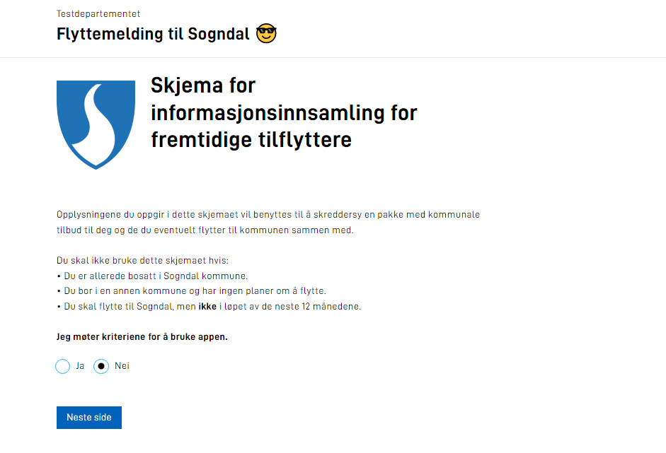
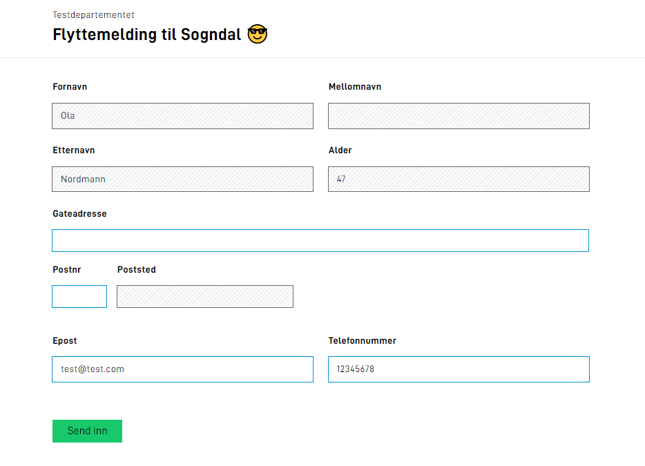
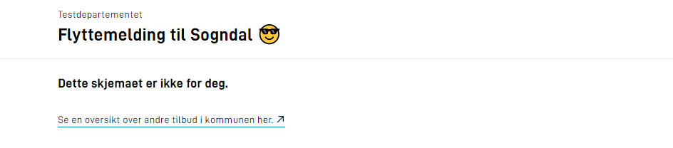

I denne bolken skal du videreutvikle applikasjonen du laget i [bolk 1](../bolk1) for å oppfylle flere av [kravene fra Sogndal kommune](../case/#krav-fra-kommunen).

**Temaer som dekkes i denne bolken:**

- Flere sider
- Bildekomponent
- Sporvalg
- Prefill


## Oppgaver

{}

For skjemaer der det samles inn eller gis mye informasjon
vil det forbedre brukeropplevelsen dersom man deler applikasjonen opp i flere sider.

La oss se nærmere på hvordan man kan opprette en ny side i applikasjonen
som vises _før_ brukeren kommer til første datainnsamlingsside som ble laget i bolk 1.

For å redigere ulike skjemasider i Altinn Studio må du:
1. Logge inn i Altinn Studio
2. Finne applikasjonen din på dashboardet og trykke _Rediger app_
3. Navigér til _Lage_-fanenåpner
4. Til høyre finner du området for administrasjon av skjemasider.

{}
Opprettelse og administrasjon av flere sider kan enkelt gjøres i Altinn Studio,
men dersom du ønsker å gjøre det manuelt kan dokumentasjonen her være til
hjelp.
{}

Da er det eneste som gjenstår å sette seg inn i kommunens
krav til infosiden og komme i gang med utviklingen. Lykke til!

### Krav fra kommunen

I og med at det skal samles inn en god del data i denne tjenesten,
er det viktig for Sogndal kommune at det tydelig kommuniseres hvem skjemaet
er ment for og hva som vil gjøres med dataen som samles inn.
Noen i kommunen har opprettet en skisse av informasjonssiden.

Følgende er ønskelig at reflekteres i applikasjonen:
 - plassering av bilder
 - tekststørrelser
 - formatering av tekst

[Skisse på informasjonsside](infoside_tilflyttere.pdf)

[Skisse på informasjonsside (.docx)](infoside_tilflyttere.docx)


### Nyttig dokumentasjon

- [Formatering av tekst i en applikasjon](../../development/ux/texts/#formatting-of-texts)
- [Hvordan legge til bilder i en applikasjon](../../development/ux/images/#add-images-to-the-application)
- [Sidestilte komponenter](../../development/ux/styling/#sidestilte-komponenter-grid)
- [Filoppsett ved flere sider](../../development/ux/pages/#oppsett)
- [Administrere rekkefølge på flere sider](../../development/ux/pages/navigation/#order)

### Forståelsessjekk
- Hvilken fil i applikasjonsrepoet er det som må justeres på dersom du manuelt ønsker å endre siderekkefølgen på eksisterende sider?
- Hvis du ønsker å gi en side et annet navn, men ikke har Altinn Studio tilgjengelig, hvilke filer må oppdateres med det nye filnavnet?
- Hvordan oppnår du at teksten bryter dersom tekststrengen ikke er lang nok til å naturlig brytes?
{}


{}

I mange tilfeller er det ikke aktuelt å svare på alle spørsmål i et skjema, kanskje fordi svaret sier seg selv, eller fordi det ikke er relevant basert på noe man har svart tidligere i skjemaet. Da kan sporvalg være en god løsning.

Ved hjelp av sporvalg kan man styre hvilke siden av en applikasjon som er synlige for brukeren.

I denne oppgaven skal du sette opp sporvalg i applikasjonen basert på kravene fra Sogndal kommune.


### Krav fra kommunen

En bruker som ikke oppfyller kravene for skjemaet skal stoppes så tidlig som mulig i arbeidsflyten.


På infosiden er det ønskelig at brukeren skal oppgi om skjemaet gjelder dem eller ikke.

Hvordan dette gjøres er fritt fram,  og feltet  `Innflytter.KanBrukeSkjema` i datamodellen er mulig å benytte til dette formålet.

Basert på svaret skal brukeren sendes videre til _Spor 1_ eller _Spor 2_.

### Spor 1

- Brukeren har ikke svart bekreftende på at skjemaet gjelder deres situasjon

- Bruker skal sendes til en side med følgende tekst:

    ```rich
    Dette skjemaet er ikke for deg.
    Se en oversikt over andre tilbud i kommunen her.
    ```

- Linje 2 i teksten skal være en hyperlenke som peker på:
https://www.sogndal.kommune.no/


- Det skal ikke være mulig å navigere til andre skjemasider etter denne.

### Spor 2

- Brukeren har svart bekreftende på at skjemaet gjelder deres situasjon

- Brukeren sendes videre til datainnsamlingssidene.

### Nyttig dokumentasjon
- [Hvordan sette opp sporvalg](../../development/ux/pages/tracks/)
- [Formatering av tekst](../../development/ux/texts/#formatting-of-texts)

### Forståelsessjekk
- Hvis en bruker går tilbake og endrer svaret sitt på infosiden, får den da opp datainnsamlingssidene? Hvis ikke. Hvilke endringer kan du gjøre for å støtte dette i din applikasjon?
- Dersom man har sporvalg på et senere tidspunkt i en arbeidsflyt og en sluttbruker endrer et valg. Hva skjer med skjemdataen man tidligere har fylt ut, dersom siden skjules for sluttbrukeren?
{}


{}

En av fordelene til Altinn er at man allerede har metadata om både personer og virksomheter tilgjengelig. Ved hjelp av prefill kan man hente ned data om brukeren og presentere denne i en app, slik at de slipper å fylle inn disse feltene. Typiske prefillverdier vil være: navn, adresse, e-post ect.

Dersom dataen er tilgjengelig i en av Altinns prefillkilder kan dette konfigureres mot et felt i datamodellen og automatisk populeres når skjemaet opprettes. Dersom man har andre behov for prefill kan dette løses med kode i applikasjonen.

I denne oppgaven flyttes fokus tilbake til den første datainnsamlingssiden, og målet er å preutfylle personopplysninger om sluttbrukeren for å spare brukeren litt tid.

### Krav fra kommunen

- Dersom personen som arbeider i skjemaet selv er tilflytter skal følgende verdier preutfylles:
  - Fornavn: Innflytter.Fornavn
  - Mellomnavn: Innflytter.Mellomnavn
  - Etternavn: Innflytter.Etternavn
  - E-post: Innflytter.Kontaktinformasjon.Epost
  - Telefonnummer: Innflytter.Kontaktinformasjon.Telefonnummer
  - Alder: Innflytter.Alder

- Det skal **ikke** være mulig å endre preutfylt navn og alder
- Det skal være mulig å endre preutfylt e-post og telefonnummer

### Nyttig dokumentasjon
- [Tilgjengelige prefillkilder](https://altinncdn.no/schemas/json/prefill/prefill.schema.v1.json)
- [Prefill fra nasjonale register og brukerprofil](../../development/data/prefill/#prefill-fra-nasjonale-register-og-brukerprofil)
- [Egendefinert prefill](../../development/data/prefill/#egendefinert-prefill)
- [Hvordan beregne alder basert på fødselsdato i C#](https://www.c-sharpcorner.com/blogs/how-to-calculate-age-in-year-in-asp-net1)

### Forståelsessjekk
- Er det mulig å endre en prefillverdi når den først er satt?
- Hvordan kan man hindre at en prefillverdi endres av sluttbrukeren?
- Ikke alle norske innbyggere har et personnr,
  noen får tildelt et [D-nummer](https://jusleksikon.no/wiki/F%C3%B8dselsnummer#D-nummer). Hvordan må koden din justeres for å ta hensyn til dette dersom alder skal baseres på et f-nr eller d-nr som sluttbruker selv taster inn?
{}


## Oppsummering

I denne bolken har du utvided applikasjonen din med mer funksjonalitet i form av å,
legge til flere sider, sette opp sporvalg for å styre brukerflyten og satt opp preutfylling av skjemafelter
både med tilgjengelig datakilder i Altinn og custom kode.

Tjenesten skal kunne kjøres opp på din lokale maskin med local test og du skal kunne teste begge brukerflytene og
bekrefte at riktige felter blir preutfylt.

**Husk å _pushe_ de lokale endringene dine, så de blir tilgjengelig i Altinn Studio når du er fornøyd**

### Løsningsforslag
Dersom du ikke har fått til alle stegene har vi et [løsningsforslag](https://altinn.studio/repos/ttd/tilflytter-sogndal-lf/src/branch/bolk/2) som du kan hente inspirasjon fra.





