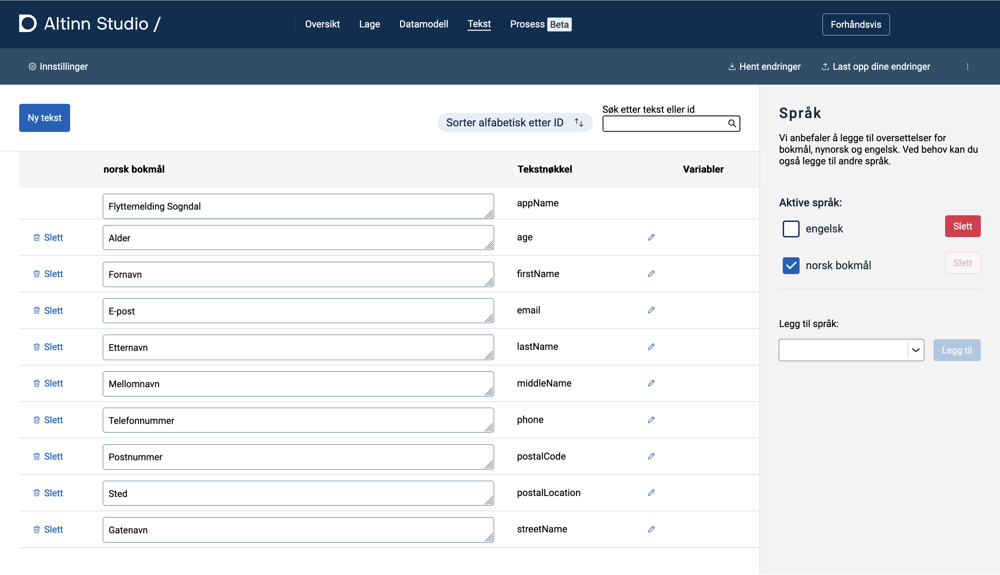
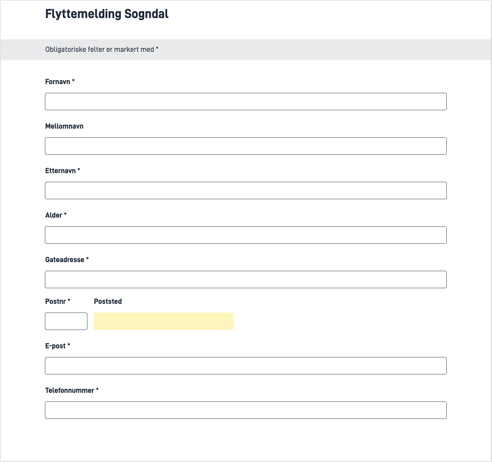
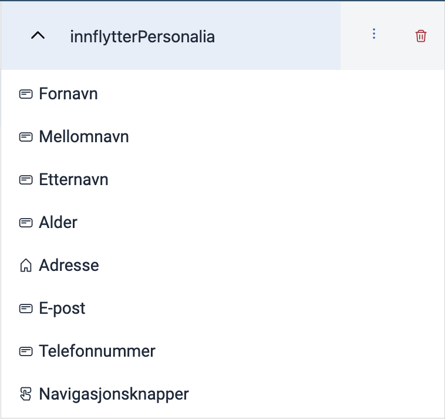
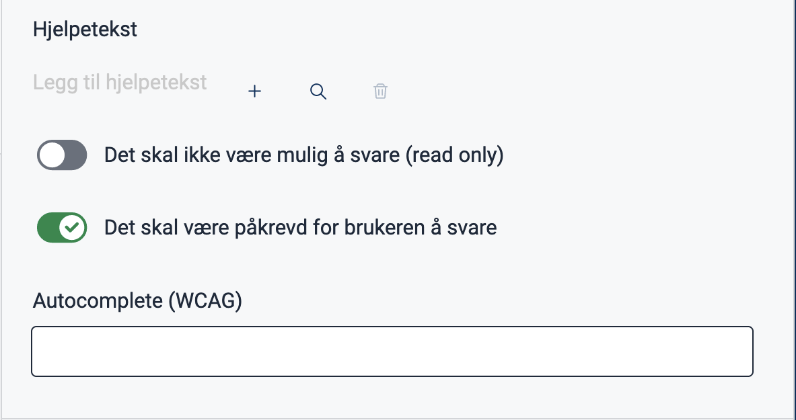

In this module, you will create the application itself, add a data model, and set up a simple form based on the requirements from Sogndal Municipality.

You'll have to perform the first two tasks, creating the application and adding the data model, in Altinn Studio's graphical user interface, [Altinn Studio Designer](/app/getting-started) (Designer).
 If you are developing the app locally, you can follow the instructions for [preparing for local development and testing](/app/getting-started/local-dev) after completing these tasks.

{}
**NOTE**  
You can perform all the steps in this module in Designer.
 However, completing the remaining modules and having a fully functional application requires local development.
{}

**Topics covered in this module:**

- Creating a new application
- Adding a data model
- Adding form components and connecting them to the data model
- Text editing

## Tasks

{}

Applications are created from the [Altinn Studio Dashboard](/app/getting-started/navigation/dashboard/).

### Requirements from the Municipality

The application must have a descriptive name (ID), making it easy to find among the many applications Sogndal Municipality has in Altinn Studio.

{}
If you want to test the app in a [test environment](/app/testing/deploy/) (described in [Module 3](/app/app-dev-course/modul3/)), you need to select an organization as the owner.
You must have [access to the organization](/app/getting-started/create-user/#join-an-organization), and the organization must have access to a test environment.
{}

### Tasks

1. [Create an application in Altinn Studio](/app/getting-started/create-app/new-app/)

### Useful Documentation

- [Navigating Altinn Studio](/app/getting-started/navigation)
- [Altinn Studio Dashboard](/app/getting-started/navigation/dashboard/)

{}

{}

The data model defines the type and format of data that can be submitted through an app.

With Altinn Studio's [Data Modeling tool](/app/development/data/data-modeling/),
 you can add a data model by [uploading an _xsd_ file](/app/development/data/data-modeling#upload-and-display-data-model)
  or you can [create a new data model](/app/development/data/data-modeling/#create-a-new-data-model) from scratch.
You can also start from an existing data model and edit it in a text editor or [directly in Altinn Studio](/app/development/data/data-modeling/#editing-a-data-model).
In this task, you will only upload a pre-existing data model.

### Requirements from the Municipality

Sogndal Municipality has created a [data model](datamodel.xsd) representing the data they want to collect from future residents.

### Tasks

1. [Download the xsd file](datamodel.xsd). If the file opens in the browser, create a new text file and copy the content over. Save the file as `datamodel.xsd`.
Alternatively, copy the file URL and run the command `curl <file-URL> > datamodel.xsd` from the command line. Open the file in a text editor and examine its content.
2. [Upload the data model in Altinn Studio](/app/development/data/data-modeling/#upload-and-display-data-model)
3. Click "Last opp dine endringer" and follow the instructions to save the changes.
4. Open the app's repository from the [Altinn Studio Dashboard](/app/getting-started/navigation/dashboard/) and look at the files in the `App/models` folder.

{}
If you intend to carry out all or parts of the development locally, now is the time to [prepare for local development and testing](/app/getting-started/local-dev).
{}

### Useful Documentation

- [Altinn Studio Data Modeling](/app/development/data/data-modeling/)
- [Description of Indicators in XSD](https://www.w3schools.com/xml/schema_complex_indicators.asp)
- [Installing curl for Windows](https://developer.zendesk.com/documentation/api-basics/getting-started/installing-and-using-curl/#windows)
- [Altinn Studio Repository](/app/getting-started/navigation/repos/)

### Knowledge Check

{}

The data model consists of a primary element: "innflytter" (migrant).
This element contains sub-objects such as _Fornavn_ (first name), _Etternavn_ (last name), and _Mellomnavn_ (middle name). In addition, there are composite elements like _Adresse_ (address), _Kontaktinformasjon_ (contact information), and _Arbeidsinformasjon_ (work information).
{}

{}

`minOccurs` indicates how many times the object must be mentioned at a minimum.
- `minOccurs=0` means that the field is not required.
- `minOccurs=1` means it is expected to appear at least once in the model.
{}

{}

`nillable=true` is defined in the middle name field, meaning a null value is allowed for the middle name.
{}

{}

The mentioned files are all generated from the `.xsd` description of the data model. They describe all the data and the properties of the data fields. Not all properties are necessarily transferred to all files, but the sum of their settings should maintain the settings of the `.xsd` file.

- The C# model is used by the app backend to deserialize data and make it available for processing and validation.
- `.metadata.json` is used in Altinn Studio to connect components and dynamics to the data fields easily.
- The `.schema.json` file is used by the Altinn app frontend for form validation on the client side.
{}

{}

- The properties `minOccurs` and `maxOccurs` are not transferred to the model.
- `nillable` is only transferred to certain types, such as _decimal_.
- `XmlElement.Order` is introduced as a decoration on each property.
  - This ensures that the order of elements will always be the same when the data is serialized to XML.
{}

{}

{}

[Texts in Altinn Studio](/app/development/ux/texts/) are stored in separate language files (also called resource files) and can be linked to form components using a text key.
The texts can be [created and edited in Altinn Studio Designer](/app/development/ux/texts/#using-altinn-studio) or [directly in the file](/app/development/ux/texts/#changing-texts-directly-in-the-repository).

{}
**NOTE**: The display name for the application must be changed both in `App/config/applicationmetadata.json` and in the language files.
{}

### Requirements from the Municipality

All components must have suitable descriptive labels to make the service user-friendly and accessible for visually impaired people.

### Tasks

1. [Create text resources](/app/development/ux/texts/#add-and-change-texts-in-an-application) for the components of the first form. The text should provide descriptions of the required input and will appear above the respective fields. Refer to the upcoming task to identify the components for which you'll need these texts.
2. [Change the display name for the application](/app/development/ux/texts/#change-application-title). It is important that the application's display name sounds good and describes the service well.
3. [Add translation(s) for the texts](/app/development/ux/texts/#add-and-change-texts-in-an-application). The application must be available in Norwegian Bokmål, Norwegian Nynorsk, and English. In the initial version, supporting only one of these languages is sufficient.


Remember to upload your changes when working in Designer so that the repository will reflect these changes.
In the next step, you will create components and link them to the text resources.

### Useful Documentation

- [Texts in Altinn Studio](/app/development/ux/texts/)
- [Editing Application Texts](/app/development/ux/texts/#add-and-change-texts-in-an-application)
- [Formatting of Texts](/app/development/ux/texts/#formatting-of-texts)
- [ISO 639-1 Standard language codes](https://en.wikipedia.org/wiki/List_of_ISO_639-1_codes)

### Knowledge Check

In Altinn, we currently support three written languages: Norwegian Bokmål, Norwegian Nynorsk, and English.

{}

To manually add support for English in an application, you need to create the file `resources.en.json` in the folder `App/config/texts`:


App/config/texts/resources.en.json


```json
{
  "language": "en",
  "resources": []
}
```

  Note that the `language` property at the top of the file must be set to `en`.
{}

{}

According to the [list of ISO 639-1 codes](https://en.wikipedia.org/wiki/List_of_ISO_639-1_codes), the code for Ukrainian is `uk`.
{}

{}

If the mentioned text key can't be located in the text resource file, the text key itself will be displayed.
{}

{}

{}

You can configure the components in an application using the graphical user interface [Altinn Studio Designer](/app/getting-started/).
 You can also configure them manually by editing the `<pageName>.json` file, which describes the structure of a form page (you can find the file in `App/ui/layouts`).

### Requirements from the Municipality

The first form page gathers personal information about the new resident and should have the following components:
- Name
  - First Name
  - Middle Name (optional)
  - Last Name
- Age
- Address
  - Street Address
  - Postal Code
  - City
- Contact Information
  - Email
  - Phone number

The fields should be mandatory unless indicated otherwise.

### Tasks

1. Set up the first form page with components based on the requirements of the Municipality.
2. Add labels by connecting text resources to each of the components.

Remember to upload your changes when working in Designer so that the repository will reflect these changes.

### Useful Documentation

- [Building a Form with the UI Editor in Altinn Studio](/app/getting-started/create-app/ui-editor/)s
- [Available components in Altinn Studio Library](/altinn-studio/designer/build-app/ui-designer/components/)
- [Guidelines for the use of components](/app/guides/design/guidelines/components/)

### Knowledge Check

In your application repository, you will find the `<pageName>.json` file in the `App/ui/layouts` folder. The JSON file describes the form page you have set up in Altinn Studio, assuming you have uploaded the changes.

You can find `<page>.json` in your application repository in the folder `App/ui/layouts`. The JSON file describes the data page you have set up in Altinn Studio, assuming you have uploaded the changes (`<page>` is replaced with the page's name, for example, `data.json`).

{}

To locate the component connected to the email field, you can search for 'epost' (email).
You will find the field name connected to the component under `dataModelBindings.simpleBinding` (highlighted).


App/ui/layouts/{page}.json


```json{linenos=false,hl_lines="7"}
{
  ...
  
  "id": "epost",
  "type": "Input",
  "dataModelBindings": {
    "simpleBinding": "Innflytter.Kontaktinformasjon.Epost"
  },
  "required": true,
  "readOnly": false,
  "textResourceBindings": {
    "title": "innflytter.epost"
  }
}
```

{}

{}

To make a field optional, you can change `required: true` to `required: false`.
{}

{}

The solution is to change the `type` field from `Input` to `TextArea` (highlighted).


App/ui/layouts/{page}.json


```json{linenos=false,hl_lines="3"}
{
  "id": "mellomnavn",
  "type": "TextArea",
  "textResourceBindings": {
    "title": "innflytter.mellomnavn"
  },
  "dataModelBindings": {
    "simpleBinding": "Innflytter.Mellomnavn"
  },
  "required": true,
  "readOnly": false
}
```
{}
{}

## Summary

In this module, you have created an application in Altinn Studio,
added a data model, and set up a form page that connects components to fields in the data model.

If you have prepared for local development, you have also cloned the application to your local development environment.
The application should be runnable on your local machine with LocalTest, and you should be able to fill in the fields.

## Solution

[Module 1 source code](https://altinn.studio/repos/testdep/flyttemelding-sogndal/src/branch/modul1)<br>



{}
Below you can find what the added texts look like in Altinn Studio and, in the *Code* tab, how this is reflected in the `resources.nb.json` file in the repository.

{}




### Texts in Altinn Studio






### Texts in the repository


App/config/texts/resource.nb.json


```json
{
  "language": "nb",
  "resources": [
    {
      "id": "appName",
      "value": "Flyttemelding Sogndal"
    },
    {
      "id": "firstName",
      "value": "Fornavn"
    },
    {
      "id": "middleName",
      "value": "Mellomnavn"
    },
    {
      "id": "lastName",
      "value": "Etternavn"
    },
    {
      "id": "age",
      "value": "Alder"
    },
    {
      "id": "streetName",
      "value": "Gatenavn"
    },
    {
      "id": "postalCode",
      "value": "Postnummer"
    },
    {
      "id": "postalLocation",
      "value": "Sted"
    },
    {
      "id": "email",
      "value": "E-post"
    },
    {
      "id": "phone",
      "value": "Telefonnummer"
    }
  ]
}
```






{}
Below you can find the form we created and the components used.


{}




### Components

{}
See *Code* to see how the layout and configurations of the form is reflected in the code.
{}



### Component - Configuration

{}
For the components we have set the component-ID, linked the component with the correct field in the data model and set the label by supplying the ID to the text resource we defined in the previous task.   

In the example below, the setup for the "Mellomnavn"-Component is shown.


{}

### Settings - "Required"

{}
Toggle the 'Det skal være påkrevd for brukeren å svare'-switch on the fields that are mandatory for the user to fill (which are all fields, with the exception of "Mellomnavn"):


{}




### Form page

The code for the first form page, which can be found in the repository in `App/ui/layouts/`, is as follows:


App/ui/layouts/innflytterPersonalia.json


```json
{
  "$schema": "https://altinncdn.no/toolkits/altinn-app-frontend/4//schemas/json/layout/layout.schema.v1.json",
  "data": {
    "layout": [
      {
        "id": "firstName",
        "type": "Input",
        "dataModelBindings": {
          "simpleBinding": "Innflytter.Fornavn"
        },
        "required": true,
        "readOnly": false,
        "textResourceBindings": {
          "title": "firstName"
        }
      },
      {
        "id": "middleName",
        "type": "Input",
        "dataModelBindings": {
          "simpleBinding": "Innflytter.Mellomnavn"
        },
        "required": false,
        "readOnly": false,
        "textResourceBindings": {
          "title": "middleName"
        }
      },
      {
        "id": "lastName",
        "type": "Input",
        "dataModelBindings": {
          "simpleBinding": "Innflytter.Etternavn"
        },
        "required": true,
        "readOnly": false,
        "textResourceBindings": {
          "title": "lastName"
        }
      },
      {
        "id": "age",
        "type": "Input",
        "dataModelBindings": {
          "simpleBinding": "Innflytter.Alder"
        },
        "required": true,
        "readOnly": false,
        "textResourceBindings": {
          "title": "age"
        }
      },
      {
        "id": "address",
        "type": "Address",
        "dataModelBindings": {
          "address": "Innflytter.Adresse.Gateadresse",
          "zipCode": "Innflytter.Adresse.Postnr",
          "postPlace": "Innflytter.Adresse.Poststed"
        },
        "simplified": true,
        "readOnly": false,
        "required": true
      },
      {
        "id": "email",
        "type": "Input",
        "dataModelBindings": {
          "simpleBinding": "Innflytter.Kontaktinformasjon.Epost"
        },
        "required": true,
        "readOnly": false,
        "textResourceBindings": {
          "title": "email"
        }
      },
      {
        "id": "phoneNumber",
        "type": "Input",
        "dataModelBindings": {
          "simpleBinding": "Innflytter.Kontaktinformasjon.Telefonnummer"
        },
        "required": true,
        "readOnly": false,
        "textResourceBindings": {
          "title": "phone"
        }
      },
      {
        "id": "NavigationButtons-yxdxMR",
        "type": "NavigationButtons",
        "showBackButton": true
      }
    ]
  }
}
```




<br><br>

{}
[Next module >>](../modul2/)
{}