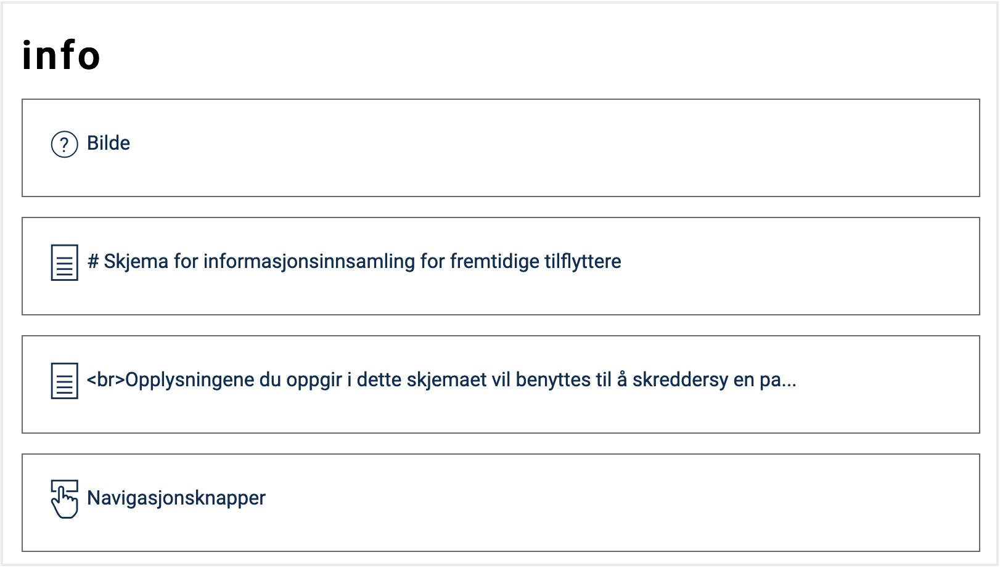
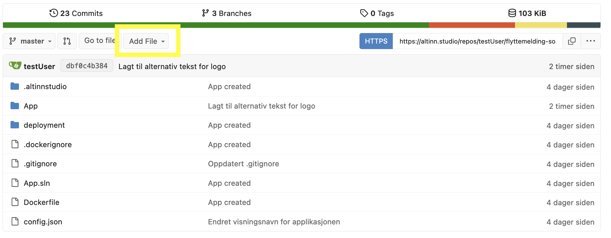
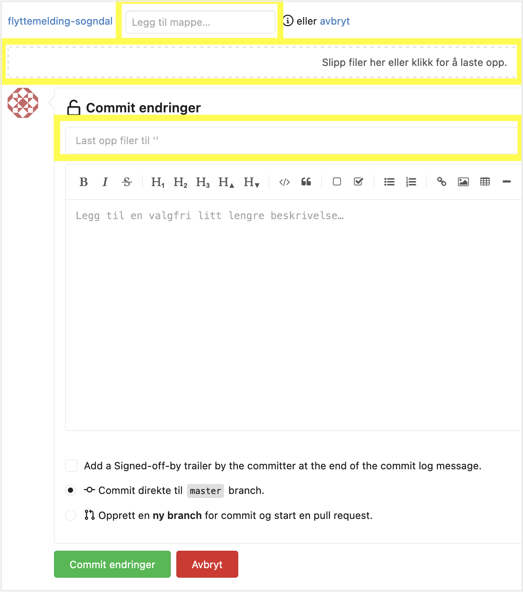
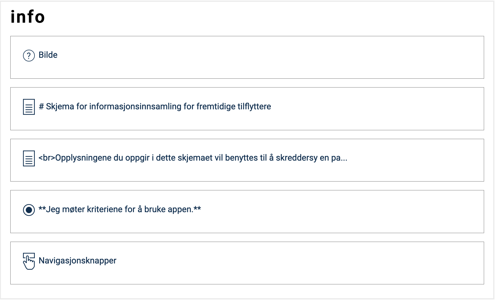
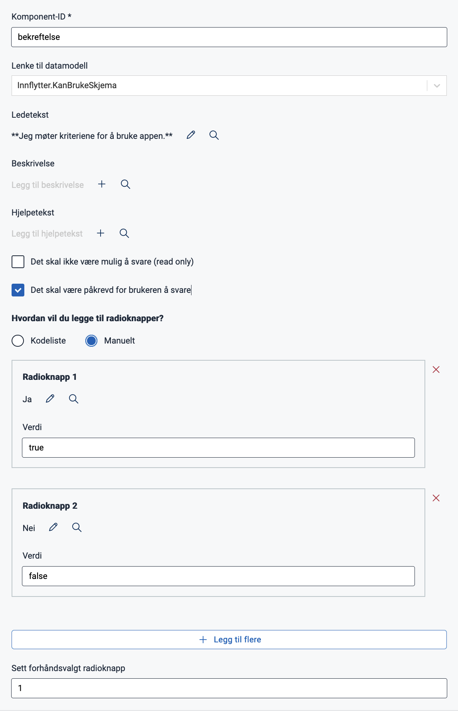
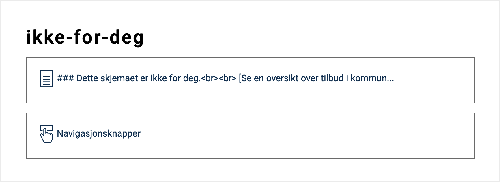
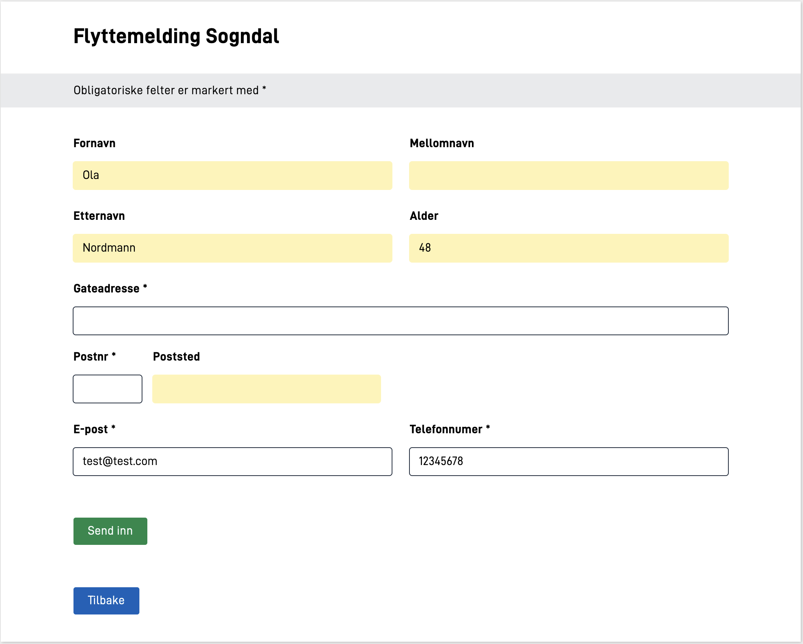
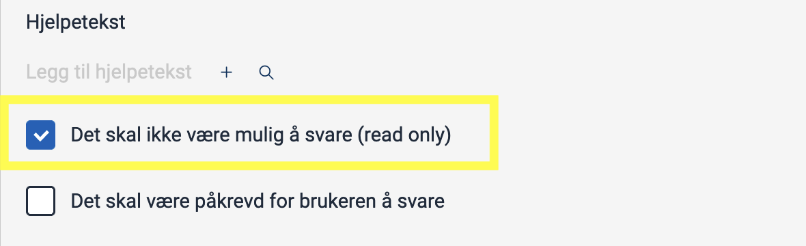

In this module you will further develop the application you created in [module 1](../modul1) including, among other things, a new page, dynamic tracks, and pre-filling.

Parts of module 2 can be done in [Altinn Studio Designer](/app/getting-started/ui-editor/) (Designer), but some tasks need to be performed using [local development](/app/getting-started/local-dev).

**Themes covered in this module:**

- More pages
- Image component
- Dynamic tracks
- Prefill


## Tasks

{}

For forms where a significant amount of information is collected or provided, dividing the application into multiple pages may enhance the user experience.

Let's take a closer look at how to create a new page in the application
that appears _before_ the user reaches the first data collection page created in module 1.

Creating and managing multiple pages can easily be done in [Altinn Studio Designer](/app/getting-started/ui-editor/) (left panel).
For manual page setup, refer to 'Useful Documentation' further down the page.

Now, all that remains is to familiarize yourself with the municipality's
requirements for the information page and get started with development. Good luck!

### Requirements from the municipality

As a significant amount of data will be collected in this service, it is important for Sogndal Municipality to clarify who the form is intended for and how they will use the collected data. Someone in the municipality has created a [draft of the information page](infoside_tilflyttere.pdf) to be used for this purpose.

The following elements are desired to be reflected in the application:
- Placement of images
- Text sizes
- Text formatting

Image of the Sogndal Municipality Coat of Arms that can be used in the application:


### Tasks
1. Add a new page. Give it an appropriate name and ensure it is displayed before the form page you created in module 1.
2. [Add an image](/app/development/ux/components/images/#adding-images-to-the-application) of the Sogndal Municipality Coat of Arms.
3. Add text according to the [draft](infoside_tilflyttere.pdf).

### Useful Documentation

- [Text formatting](/app/development/ux/texts/#formatting-of-texts)
- [Add images to an application](/app/development/ux/components/images/)
- [Side-by-side components using grid](/app/development/ux/styling/#components-placed-side-by-side-grid)
- [File structure for multiple pages](/app/development/ux/pages/)
- [Managing the order of multiple pages](/app/development/ux/pages/navigation/#order)

### Knowledge check

{}
<br>

The page order is described in `App/ui/Settings.json`.
To adjust the page order, you need to modify the list described under `pages.order` to represent the desired page sequence.
Refer to [Managing the order of multiple pages](/app/development/ux/pages/navigation/#order).
{}

<br>

{}
<br>

- `App/ui/layouts/<page>.json`: Change the file name (`<page>`) of the page you want to rename.
- `App/ui/Settings.json`: Update the name of the page under `pages.order`.
{}

<br>

{}
<br>

All text resources support Markdown and HTML notation, so by using `<br>`, you can force line breaks in the text.
{}

{}

{}

In many cases, it is not relevant to answer all the questions in a form, maybe because the answer is obvious or because it is not relevant based on an answer provided earlier in the form.
In that case, dynamic tracks could be a good solution. By using dynamic tracks you will be able to control which parts of the application that will be visible for the user.

In this task you will set up dynamic tracks in the application based on the requirements from the municipality of Sogndal.

### Requirements from the municipality

A user who does not meet the requirements for the form should be stopped as early as possible in the workflow.
 On the information page, it is desirable for the user to indicate whether the form applies to them or not.

The way the response is collected is optional.
 Note that a component must be associated with a field in the data model to store values.
  The field `Innflytter.KanBrukeSkjema` in the data model is available for this purpose.

Based on the response, the user should be directed to one of the following tracks:

*Track 1*

- The user has not confirmed that the form applies to their situation.
- The user should be directed to a page with the following text:

    > This form is not for you.  
    > [See an overview of other services offered by the municipality here](https://www.sogndal.kommune.no/).
    
    Line 2 in the text is a hyperlink that points to https://www.sogndal.kommune.no/

*Track 2*

- The user hasi confirmed that the form applies to their situation.
- The user should be directed to the data collection pages.

### Tasks

1. Add a component where the user can indicate whether the form applies to them or not.
2. Add a page to which the user will be directed in _track 1_.
3. Add logic to activate _track 1_ or _track 2_ based on the user's answer.

### Useful documentation
- [Dynamic expressions](/app/development/logic/expressions)
- [How to hide an entire page](/app/development/logic/expressions#viseskjule-hele-sider)
- [Text formatting](/app/development/ux/texts/#formatting-of-texts)

### Knowledge check
{}
<br>

If you have this type of logic in an application where users can proceed to submission for multiple tracks, the data on the page(s) that are now hidden for the user should be reset.
{}

{}


{}

Altinn provides the advantage of having readily accessible metadata for individuals and businesses. With prefilling, we can retrieve user data and populate fields seamlessly, reducing the need for manual data entry, especially for common details like names, addresses, and emails.

Data from Altinn's [prefill sources](/app/development/data/prefill/config/#available-prefill-values) can be directly integrated into the app by mapping the data to specific fields in the data model, automating field population during form creation. For more specific prefilling needs, code-based solutions can be integrated into the app's logic.

This task focuses on the first data collection page, aiming to streamline user experience by prefilling their personal details.

### Requirements from the municipality

- The following values should be prefilled for the user:
  - First name: `Innflytter.fornavn`
  - Middle name: `Innflytter.Mellomnavn`
  - Last name: `Innflytter.Etternavn`
  - Email: `Innflytter.Kontaktinformasjon.Epost`
  - Phone number: `Innflytter.Kontaktinformasjon.Telefonnummer`
  - Age: `Innflytter.Alder`

- It should **not** be possible to change prefilled name and age
- It should be possible to change prefilled email and phone number

### Tasks
1. Create a [prefill file](/app/development/data/prefill/config/#setup-of-prefill-in-the-application-repository).
2. Configure prefilling for values available through Altinn's [prefill sources](/app/development/data/prefill/config/#available-prefill-values) (all but age).
3. Create [custom prefilling](/app/development/data/prefill/custom) for age based on the personal identification number (see code assistance below).
4. Configure settings for fields that should not be editable by the user.

{}
<br>

The following function can be used to calculate a person's age from their personal identification number:

```cs
private static int CalculateAge(string sosialSecNumber)
    {
        int MAX_D_NUMBER = 71;
        int MIN_D_NUMBER = 41;
        int MAX_TEST_NUMBER = 92;
        int MIN_TEST_NUMBER = 81;
        int START_D_NUMBER = 40;
        int START_TEST_NUMBER = 80;

        string stringDay = sosialSecNumber.Substring(0, 2);
        string stringMonth = sosialSecNumber.Substring(2, 2);
        string stringYear = sosialSecNumber.Substring(4, 2);s
        string stringIndivid = sosialSecNumber.Substring(6, 3);

        int day = int.Parse(stringDay);
        int month = int.Parse(stringMonth);
        int year = int.Parse(stringYear);
        int individ = int.Parse(stringIndivid);

        // Get day if D-number
        if (MAX_D_NUMBER >= day && MIN_D_NUMBER <= day)
        {
            day -= START_D_NUMBER;
        }

        // Get month if TestUser-number
        if (MAX_TEST_NUMBER >= month && MIN_TEST_NUMBER <= month)
        {
            month -= START_TEST_NUMBER;
        }

        // find century
        if (year > 54 && (individ >= 500 && individ < 750))
        {
            // 1855-1899
            year += 1800;
        }
        else if (year > 39 && (individ >= 900 && individ < 1000))
        {
            // 1940-1999
            year += 1900;
        }
        else if (year < 40 && (individ >= 500 && individ < 1000))
        {
            // 2000-2039
            year += 2000;
        }
        else
        {
            year += 1900;
        }

        // calculate age
        int age = DateTime.Now.Year - year;

        if (DateTime.Now.Month < month)
        {
            age -= 1;
        }
        else if (DateTime.Now.Month == month)
        {
            if (DateTime.Now.Day < day)
            {
                age -= 1;
            }
        }

        return age;
    }
```
{}
<br>

*Remember to push your local changes to make them available in Altinn Studio.*

### Useful documentation
- [Prefilling from national registers and user profile](/app/development/data/prefill/config/#prefill-from-national-register-and-user-profile)
- [Available sources and values for prefilling](/app/development/data/prefill/config/#available-prefill-values)
- [Custom prefilling](/app/development/data/prefill/custom)
- [Description of the InstanceOwner object](/api/models/instance/#instanceowner) - This is where national identity number can be found.
  In the code, the properties are referred to with an uppercase first letter, not lowercase as in this overview.

### Knowledge check

{}
<br>

Yes. If no changes are made, a standard component with pre-filled data will be editable.
{}

<br>

{}
<br>

The component can be set to `readOnly` in one of two ways:

**1\.** In Altinn Studio Designer, by checking "Det skal ikke være mulig å svare (read only)" for the specific component:  


**2\.** Set the `readOnly` property to `true` for the component in the JSON file of the page:

```json{linenos=false,hl_lines=["13"]}
// File: /App/ui/layouts/<page>.json
{
  "$schema": "https://altinncdn.no/schemas/json/layout/layout.schema.v1.json",
  "data": {
    "layout": [
      {
        "id": "firstName",
        "type": "Input",
        "dataModelBindings": {
          "simpleBinding": "Innflytter.Fornavn"
        },
        "required": false,
        "readOnly": true,
        "textResourceBindings": {
          "title": "firstName"
        }
      }
    ]
  }
}
```

An option is to perform data validations on the server side to verify that the data in the field matches the data from the prefill source. This can be done in the processing or validation logic of the application.
{}

<br>

{}
<br>

{}
A [D-number](https://jusleksikon.no/wiki/F%C3%B8dselsnummer#D-nummer) is eleven digits, just like regular national identification numbers. It consists of a modified six-digit birth date and a five-digit personal number. The birth date is modified by _adding 4 to the first digit_. For example, a person born on January 1, 1980, would have the birth date 410180, while someone born on January 31, 1980, would have 710180.
{}

The folowing function converts an arbitrary national identification number or D-number into a date string in the format `dd-MM-yy`:

```cs
public static string GetDOB(string fOrDNumber){
  List<string> firstCharsInDNumber = new(){"4", "5", "6", "7" };

  var fOrDNumberArray = fOrDNumber.ToCharArray();

  char[] dobArray = new char[6];
  Array.Copy(fOrDNumberArray, dobArray, 6);

  char firstChar = dobArray[0];
  int firstInt = 0;

  if(firstCharsInDNumber.Contains(firstChar.ToString()))
  {
    firstInt = firstChar - 4;
    dobArray[0] = (char)firstInt;
  }

  string dobString = $"{dobArray[0]}{dobArray[1]}.{dobArray[2]}{dobArray[3]}.{dobArray[4]}{dobArray[5]}";
  // verify that it is a valid date
  DateTime.ParseExact(dobString, "dd.MM.yy", CultureInfo.InvariantCulture);
  return dobString;
}
```
{}
{}


## Summary

In this module, you have expanded your application with more functionality by
adding additional pages, configuring dynamic track to control user flow, and configuring prefilling of form fields
both using available data sources in Altinn and custom code.

The service should run on your local machine for local testing, and you should be able to test both user flows
and confirm that the correct fields are pre-filled.

<br>



{}
[Module 2 source code](https://altinn.studio/repos/testdep/flyttemelding-sogndal/src/branch/modul2)<br>
[(Module 2 source code - previous version)](https://altinn.studio/repos/ttd/tilflytter-sogndal-lf/src/branch/bolk/2)<br>

### Legge til infoside

In this step, we have added a simple info page with an image and text.


{}





<br>

#### Components

{}
See *Code* for horizontal alignment of components.
{}



#### Image

In this solution, the image has been downloaded and saved in the directory `/App/wwwroot` (the `wwwroot` directory was also created).
 Another option is to use an external URL for the image source.

{}
<br>

Navigate to the repository (click the logo in the top-right corner or the three dots on the right side of the menu bar) and select "Upload file" from the "Add file" menu.



In the "Add directory" field, enter `/App/wwwroot`.
Upload the image and add a descriptive commit message.
Click "Commit changes" to save.




{}


#### Text

Both the heading and description have been added as "Paragraph" (a subcategory of "Text") and formatted with markdown.





<br>

#### Info page - components and settings

The `grid` property has been used to horizontally align the image and the heading (highlighted).

```json{linenos=false,hl_lines=["17-19", "30-32"]}
// File: /App/ui/layouts/info.json

{
  "$schema": "https://altinncdn.no/schemas/json/layout/layout.schema.v1.json",
  "data": {
    "layout": [
      {
        "id": "kommune-logo",
        "type": "Image",
        "image": {
          "src": {
            "nb": "wwwroot/kommune-logo.png"
          },
          "width": "100%",
          "align": "center"
        },
        "grid": {
          "xs": 2
        },
        "textResourceBindings": {
          "altTextImg": "kommune-logo.altTextImg"
        }
      },
      {
        "id": "overskrift",
        "type": "Paragraph",
        "textResourceBindings": {
          "title": "info.overskrift.title"
        },
        "grid": {
          "xs": 7
        }
      },
      {
        "id": "beskrivelse",
        "type": "Paragraph",
        "textResourceBindings": {
          "title": "info.beskrivelse.title"
        }
      },
      {
        "id": "NavigationButtons-hateTR",
        "type": "NavigationButtons",
        "componentType": "NavigationButtons",
        "dataModelBindings": {},
        "showBackButton": true,
        "textResourceBindings": {
          "next": "navigation.next",
          "back": "navigation.back"
        }
      }
    ]
  }
}
```

#### Text resources (nb)
```json
// File: /App/config/texts/resource.nb.json

{
  "language": "nb",
  "resources": [
    ...
    {
      "id": "info.overskrift.title",
      "value": "# Skjema for informasjonsinnsamling for fremtidige tilflyttere"
    },
    {
      "id": "info.beskrivelse.title",
      "value": "<br>Opplysningene du oppgir i dette skjemaet vil benyttes til å skreddersy en pakke med kommunale tilbud til deg og de du eventuelt flytter til kommunen sammen med.\n<br><br>\nDu skal ikke bruke dette skjemaet hvis:\n* Du er allerede bosatt i Sogndal kommune\n* Du bor i en annen kommune og har ingen planer om å flytte\n* Du skal flytte til Sogndal, men **ikke** i løpet av de neste 12 månedene."
    },
    {
      "id": "kommune-logo.altTextImg",
      "value": "Sogndal kommunevåpen. Bilde"
    }
  ]
}
```



{}

{}

### Alternative workflow

In this solution, we have chosen radio buttons for the info page where users are required to specify whether they meet the requirements to use the form. The option 'No' has been pre-selected, so users must actively choose to use the form.

As an alternative to radio buttons, checkboxes or dropdown menus can be used.


A new page has been added to which users are directed if they do not confirm that they meet the requirements (track 1).


{}




{}
See *Code* for dynamic tracks logic.
{}

#### Radio buttons






#### New Page

New page for *Track 1*.








<br>

#### Radio buttons

```json{linenos=false,hl_lines=["8-29"]}
// File: /App/ui/layouts/info.json

{
  "$schema": "https://altinncdn.no/schemas/json/layout/layout.schema.v1.json",
  "data": {
    "layout": [
      ...
      {
        "id": "bekreftelse",
        "type": "RadioButtons",
        "required": true,
        "textResourceBindings": {
          "title": "info.bekreft"
        },
        "dataModelBindings": {
          "simpleBinding": "Innflytter.KanBrukeSkjema"
        },
        "options": [
          {
            "label": "info.ja",
            "value": "true"
          },
          {
            "label": "info.nei",
            "value": "false"
          }
        ],
        "preselectedOptionIndex": 1
      },
      ...
    ]
  }
}
```

#### New page 'Not for You' and dynamic tracks logic

A new page has been added that will only be shown if the user does not meet the requirements to use the service. One way to achieve this is by hiding the page if the user confirms that they *can* use the service.

Logic to hide the page has been implemented using the `hidden` property (see highlighted section in the code).
The value from the selected radio button is stored in the field `Innflytter.KanBrukeSkjema` but can be accessed through the component (`["component", "bekreftelse"]`).
As an option, you can test the value of the field directly (`["dataModel", "Innflytter.KanBrukeSkjema"]`).

```json{linenos=false,hl_lines="6-13"}
// File: /App/ui/layouts/ikke-for-deg.json

{
  "$schema": "https://altinncdn.no/schemas/json/layout/layout.schema.v1.json",
  "data": {
    "hidden": [
      "equals",
      [
        "component",
        "bekreftelse"
      ],
      true
    ],
    "layout": [
      {
        "id": "ikke-for-deg",
        "type": "Paragraph",
        "textResourceBindings": {
          "title": "ikke-for-deg.info"
        }
      },
      {
        "id": "NavigationButtons-azt7sj",
        "type": "NavigationButtons",
        "componentType": "NavigationButtons",
        "dataModelBindings": {},
        "showBackButton": true,
        "textResourceBindings": {
          "back": "navigation.back"
        }
      }
    ]
  }
}
```

Equivalent logic has been added for the form page as well.
This page will be hidden if the value of the `bekreftelse` component is set to `false`, meaning when the option for *not* meeting the service requirements is selected.

```json{linenos=false,hl_lines=["6-13"]}
// File: /App/ui/layouts/innflytterPersonalia.json

{
  "$schema": "https://altinncdn.no/schemas/json/layout/layout.schema.v1.json",
  "data": {
    "hidden": [
      "equals",
      [
        "component",
        "bekreftelse"
      ],
      false
    ],
    "layout": [
      ...
```

#### Exclude page from PDF

We do not want to include the 'Not for You' page when generating a PDF file.
This can be configured using the `excludeFromPdf` property in `Settings.json`.

```json{linenos=false,hl_lines="10"}
// File: /App/Settings.json

{
  "$schema": "https://altinncdn.no/schemas/json/layout/layoutSettings.schema.v1.json",
  "pages": {
    "order": [
      "info",
      "innflytterPersonalia",
      "ikke-for-deg"
    ],
    "excludeFromPdf": ["ikke-for-deg"]
  }
}
```

#### Text resources (nb)

New text resources that have been added.

```json{linenos=false,hl_lines=["7-22"]}
// File: /App/config/texts/resource.nb.json

{
  "language": "nb",
  "resources": [
    ...
    {
      "id": "info.bekreft",
      "value": "**Jeg møter kriteriene for å bruke appen.**"
    },
    {
      "id": "info.ja",
      "value": "Ja"
    },
    {
      "id": "info.nei",
      "value": "Nei"
    },
    {
      "id": "ikke-for-deg.info",
      "value": "### Dette skjemaet er ikke for deg.<br><br>\n[Se en oversikt over tilbud i kommunen her](https://www.sogndal.kommune.no)."
    }
  ]
}
```




{}

<h3>Prefilling</h3>

{}

Below is an example of how the data page may appear with pre-filled information.
 In addition to prefilling, several components are aligned side by side, and a 'Submit' button has been added.




{}




{}
See *Code* for prefilling and horizontal alignment of components.
{}


For fields that should not be editable (name and age), the 'Read only' option must be selected:



A 'Submit' button has been added for the form:





#### Updated Data Page

* The components for name and age have been set to `readOnly`
* Some components are aligned side by side
* A new button has been added

The code below provides an example with some of the components where changes have been highlighted.
For a complete solution, please refer to the [module 2 source code](https://altinn.studio/repos/testdep/flyttemelding-sogndal/src/branch/modul2).

```json{linenos=false,hl_lines=["22", "26-28", "37", "41-43", "47-54"]}
// File: /App/ui/layouts/innflytterPersonalia.json

{
  "$schema": "https://altinncdn.no/schemas/json/layout/layout.schema.v1.json",
  "data": {
    "hidden": [
      "equals",
      [
        "component",
        "bekreftelse"
      ],
      false
    ],
    "layout": [
      {
        "id": "firstName",
        "type": "Input",
        "dataModelBindings": {
          "simpleBinding": "Innflytter.Fornavn"
        },
        "required": false,
        "readOnly": true,
        "textResourceBindings": {
          "title": "firstName"
        },
        "grid": {
          "xs": 6
        }
      },
      {
        "id": "middleName",
        "type": "Input",
        "dataModelBindings": {
          "simpleBinding": "Innflytter.Mellomnavn"
        },
        "required": false,
        "readOnly": true,
        "textResourceBindings": {
          "title": "middleName"
        },
        "grid": {
          "xs": 6
        }
      },

      ...

      {
        "id": "send-inn",
        "type": "Button",
        "textResourceBindings": {
          "title": "button.send-inn"
        }
      },
      ...
    ]
  }
}
```

#### Prefilling

Prefilling of personal information (except age) has been configured in the newly created file `datamodel.prefill.json`:

```json{linenos=false,hl_lines=[""]}
// File: /App/models/datamodel.prefill.json

{
    "$schema": "https://altinncdn.no/schemas/json/prefill/prefill.schema.v1.json",
    "allowOverwrite": true,
    "ER": {
    },
    "DSF": {
        "FirstName": "Innflytter.Fornavn",
        "MiddleName": "Innflytter.Mellomnavn",
        "LastName": "Innflytter.Etternavn",
        "TelephoneNumber": "Innflytter.Kontaktinformasjon.Telefonnummer"
    },
    "UserProfile": {
        "Email": "Innflytter.Kontaktinformasjon.Epost"
    }
}
```

#### Age Calculation and Prefilling

For custom prefilling of age, a file `InstantiationProcessor.cs` has been created in the `logic/Instantiation` directory (the `Instantiation` directory was also created).
The `DataCreation` method retrieves the personal identification number from the instance passed to it. It then uses the number to calculate the age using the `CalculateAge` method (omitted, refer to code assistance under [Prefilling](#prefill) in the task description).
The calculated age is then assigned to the data field `skjema.Innflytter.Alder`.

```csharp{linenos=false,hl_lines=[""]}
// File: App/logic/Instantiation/InstantiationProcessor.cs

using System;
using System.Collections.Generic;
using System.Threading.Tasks;
using Altinn.App.Core.Features;
using Altinn.App.Models;
using Altinn.Platform.Storage.Interface.Models;

namespace Altinn.App.AppLogic.Instantiation;

public class InstantiationProcessor : IInstantiationProcessor
{
    public async Task DataCreation(Instance instance, object data, Dictionary<string, string> prefill)
    {
        Skjema skjema = (Skjema)data;
        string personNumber = instance.InstanceOwner.PersonNumber;
        skjema.Innflytter.Alder = CalculateAge(personNumber);
        await Task.CompletedTask;
    }

  // Code for hjelpemetoden CalculateAge()
}
```

The data type for `skjema` can be found in the datamodel file `datamodel.xsd`:

```xml{linenos=false,hl_lines="4"}
<!-- Fil: /App/models/datamodel.xsd -->

 <xsd:schema xmlns:xsd="http://www.w3.org/2001/XMLSchema" elementFormDefault="qualified" attributeFormDefault="unqualified">
  <xsd:element name="InnflytterSkjema" type="Skjema" />
  <xsd:complexType name="Skjema">
    <xsd:sequence>
    ...
```

Finally, the implementation needs to be registered in `Program.cs` for the code to run:

```csharp{linenos=false,hl_lines="7"}
// File: /App/Program.cs
...

void RegisterCustomAppServices(IServiceCollection services, IConfiguration config, IWebHostEnvironment env)
{
    // Register your apps custom service implementations here.
    services.AddTransient<IInstantiationProcessor, InstantiationProcessor>();
}

...
```





<br><br>

{}
[<< Previous module](../modul1/)      [Next module >>](../modul3/)
{}