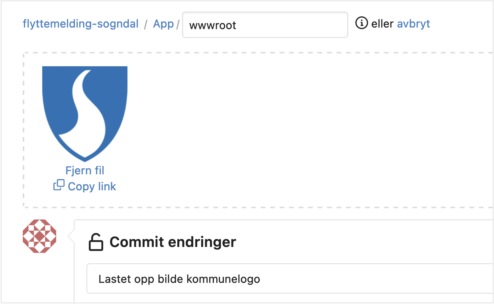
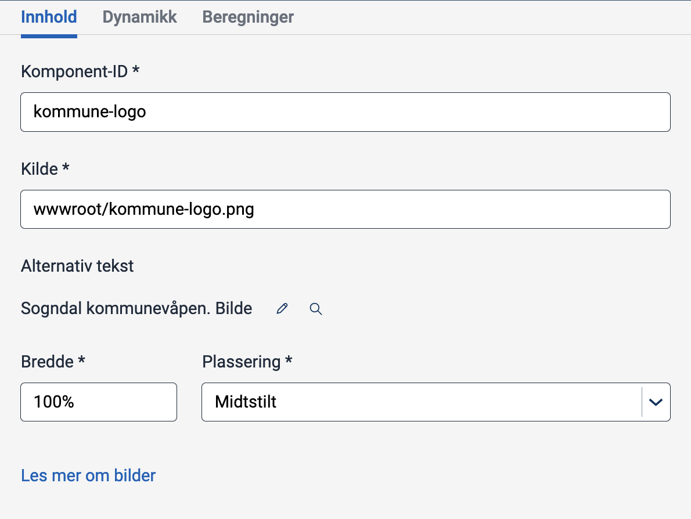
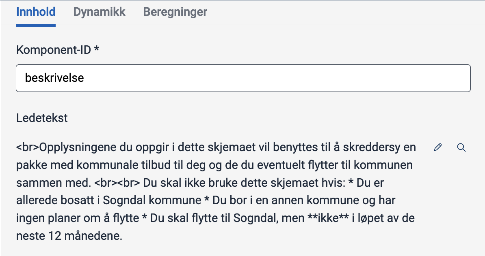
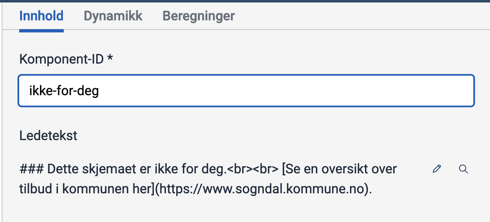
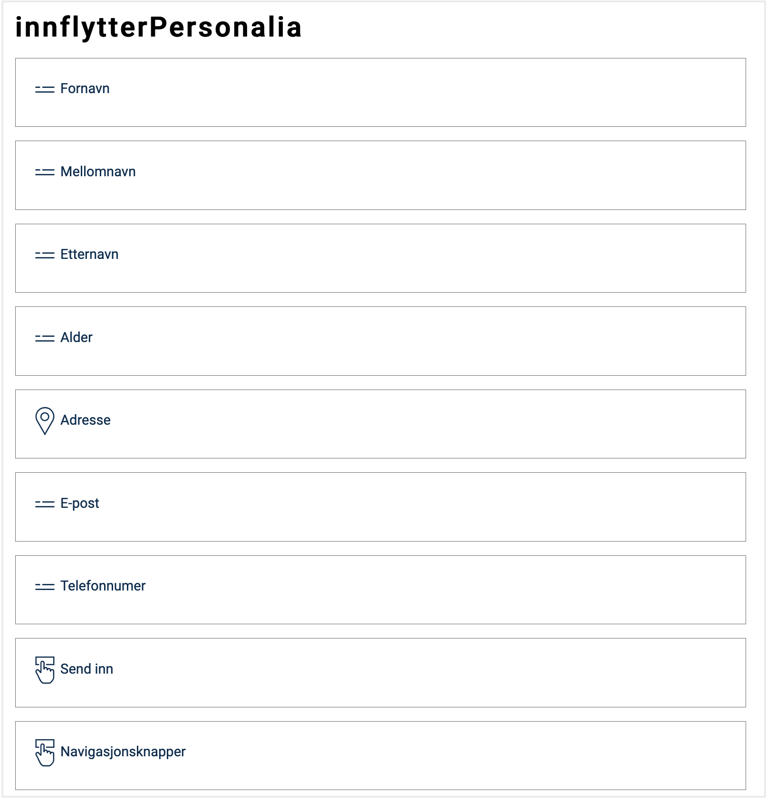

In this module, you will further develop the application you created in [Module 1](../modul1), including, among other things, a new page, hiding/showing pages based on dynamic expressions, and prefilling.

You can do parts of Module 2 in [Altinn Studio Designer](/app/getting-started/) (Designer), but some tasks need to be performed using [local development](/app/getting-started/local-dev).

**Themes covered in this module:**

- More pages
- Image component
- Dynamic tracks
- Prefilling

## Tasks

{}

For forms with a significant amount of information collected or provided, dividing the application into multiple pages may enhance the user experience.

Let's take a closer look at how to create a new page in the application
that appears _before_ the user reaches the first data collection page created in Module 1.

Creating and managing multiple pages can be done in [Altinn Studio Designer](/app/getting-started/) (left panel).
For manual page setup, refer to 'Useful Documentation' further down the page.

### Requirements of the municipality

Since Sogndal Municipality will collect a significant amount of data in this service, they need to clarify who the form is intended for and how they will use the data. Someone in the municipality has created a [draft of an information page](infoside_tilflyttere.pdf) for this purpose.

The information page should reflect the following elements:
- Placement of images
- Text sizes
- Text formatting

You can use the following image of the Sogndal Municipality Coat of Arms in the application:


### Tasks
1. Add a new page. Give it an appropriate name and position it before the form page you created in Module 1.
2. [Add an image](/app/development/ux/components/image) of the Sogndal Municipality Coat of Arms.
3. Add text according to the [draft](infoside_tilflyttere.pdf).

### Useful Documentation

- [Text formatting](/app/development/ux/texts/#formatting-of-texts)
- [Add images to an application](/app/development/ux/components/image/)
- [Side-by-side components using grid](/app/development/ux/styling/#components-placed-side-by-side-grid)
- [File structure for multiple pages](/app/development/ux/pages/)
- [Managing the order of multiple pages](/app/development/ux/pages/navigation/#order)

### Knowledge check

{}
You can configure the page order in `App/ui/Settings.json` by modifying the list described under `pages.order`.
Refer to [Managing the order of multiple pages](/app/development/ux/pages/navigation/#order).
{}

{}
- `App/ui/layouts/<page>.json`: Change the file name (`<page>`) of the page you want to rename.
- `App/ui/Settings.json`: Update the page's name under `pages.order`.
{}

{}
All text resources support Markdown and HTML notation, so using `<br>` can force line breaks in the text.
{}

{}

{}

In many cases, controlling which parts of the application are visible is desirable based on the user's response.
For example, skipping some of the questions in a form may be relevant if the answer is obvious or irrelevant based on previous responses.

In this task, you will set up dynamic expressions on pages in the application to direct users to different pages based on their responses.

### Requirements of the municipality

A user who does not meet the requirements for the service should be stopped as early as possible in the workflow.
 The user should indicate whether the service applies to them on the information page.

The way the response is collected is optional, but a tip is to use a selection component such as [checkboxes](/app/development/ux/components/checkboxes/), [radio buttons](/app/development/ux/components/radiobuttons/), or [dropdown](/app/development/ux/components/dropdown/).
 Note that a component must be associated with a field in the data model to store values (you can use the field `Innflytter.KanBrukeSkjema` in the data model).

The user should be directed to one of the following tracks based on their response:

*Track 1*

- The user indicates that the service does not apply to their situation.
- The user should be directed to a page with the following text:

    > This form is not for you.  
    > [See an overview of other services offered by the municipality here](https://www.sogndal.kommune.no/).
    
    Line 2 in the text is a hyperlink that points to https://www.sogndal.kommune.no/

*Track 2*

- The user has confirmed that the service applies to their situation.
- The user should be directed to the data collection pages.

### Tasks

1. Add a component where the user can indicate whether the form applies to them.
2. Add a page to which you can direct the user in _track 1_.
3. Add logic to activate _track 1_ or _track 2_ based on the user's answer.

### Useful documentation
- [Dynamic expressions](/app/development/logic/expressions)
- [How to hide an entire page](/app/development/logic/expressions#showhide-entire-pages)
- [Text formatting](/app/development/ux/texts/#formatting-of-texts)

### Knowledge check

{}
If you have logic in an application where users can proceed to submission for multiple tracks, the data on the page(s) that are now hidden for the user should be reset.
{}

{}

{}

Altinn provides the advantage of having readily accessible [metadata](/api/models/instance/#instance) for individuals and businesses. With prefilling, we can retrieve user data and populate fields seamlessly, reducing the need for manual data entry, especially for standard details like names, addresses, and emails.

You can directly integrate data from Altinn's [prefill sources](/app/development/data/prefill/config/#available-prefill-values) into the app by mapping the data to specific fields in the data model, automating field population during form creation. You can also integrate custom code-based solutions for prefilling.

This task focuses on the first data collection page, aiming to streamline the user experience by prefilling their details.

### Requirements of the municipality

- You should configure prefilling for the following values:
  - First name: `Innflytter.fornavn`
  - Middle name: `Innflytter.Mellomnavn`
  - Last name: `Innflytter.Etternavn`
  - Email: `Innflytter.Kontaktinformasjon.Epost`
  - Phone number: `Innflytter.Kontaktinformasjon.Telefonnummer`
  - Age: `Innflytter.Alder`

- It should **not** be possible to change prefilled name and age
- It should be possible to change prefilled email and phone number

### Tasks
1. Create a [prefill file](/app/development/data/prefill/config/#setup-of-prefill-in-the-application-repository).
2. Configure prefilling for values available through Altinn's [prefill sources](/app/development/data/prefill/config/#available-prefill-values) (all but age).
3. Create [custom prefilling](/app/development/data/prefill/custom) for age based on the personal identification number (see Code assistance and Useful resources below).
4. Configure settings for fields that should not be editable by the user.

{}
You can use the following function to calculate a person's age from their personal identification number:

```cs
private static int CalculateAge(string sosialSecNumber)
    {
        int MAX_D_NUMBER = 71;
        int MIN_D_NUMBER = 41;
        int MAX_TEST_NUMBER = 92;
        int MIN_TEST_NUMBER = 81;
        int START_D_NUMBER = 40;
        int START_TEST_NUMBER = 80;

        string stringDay = sosialSecNumber.Substring(0, 2);
        string stringMonth = sosialSecNumber.Substring(2, 2);
        string stringYear = sosialSecNumber.Substring(4, 2);s
        string stringIndivid = sosialSecNumber.Substring(6, 3);

        int day = int.Parse(stringDay);
        int month = int.Parse(stringMonth);
        int year = int.Parse(stringYear);
        int individ = int.Parse(stringIndivid);

        // Get day if D-number
        if (MAX_D_NUMBER >= day && MIN_D_NUMBER <= day)
        {
            day -= START_D_NUMBER;
        }

        // Get month if TestUser-number
        if (MAX_TEST_NUMBER >= month && MIN_TEST_NUMBER <= month)
        {
            month -= START_TEST_NUMBER;
        }

        // find century
        if (year > 54 && (individ >= 500 && individ < 750))
        {
            // 1855-1899
            year += 1800;
        }
        else if (year > 39 && (individ >= 900 && individ < 1000))
        {
            // 1940-1999
            year += 1900;
        }
        else if (year < 40 && (individ >= 500 && individ < 1000))
        {
            // 2000-2039
            year += 2000;
        }
        else
        {
            year += 1900;
        }

        // calculate age
        int age = DateTime.Now.Year - year;

        if (DateTime.Now.Month < month)
        {
            age -= 1;
        }
        else if (DateTime.Now.Month == month)
        {
            if (DateTime.Now.Day < day)
            {
                age -= 1;
            }
        }

        return age;
    }
```
{}

{}
**Note:** The application must be run locally to show prefilled values.
{}

*Remember to push your local changes to make them available in Altinn Studio.*

### Useful documentation
- [Prefilling from national registers and user profile](/app/development/data/prefill/config/#prefill-from-national-register-and-user-profile)
- [Available sources and values for prefilling](/app/development/data/prefill/config/#available-prefill-values)
- [Custom prefilling](/app/development/data/prefill/custom)
- [Instance](/api/models/instance/#instance) - Application metadata container
- [Description of the InstanceOwner object](/api/models/instance/#instanceowner) - This is where you can find the national identity number.
  In the code, the properties are referred to with an uppercase first letter, not lowercase, as in this overview.

### Knowledge check

{}
Yes, by default, a standard component with prefilled data is editable.
{}

{}

You can set the component to `readOnly` in one of two ways:

**1\.** In Altinn Studio Designer, by checking "Det skal ikke være mulig å svare (read only)" for the specific component:  


**2\.** Set the `readOnly` property to `true` for the component in the JSON file of the page:


App/ui/layouts/{page}.json


```json {linenos=false,hl_lines=["12"]}
{
  "$schema": "https://altinncdn.no/toolkits/altinn-app-frontend/4/schemas/json/layout/layout.schema.v1.json",
  "data": {
    "layout": [
      {
        "id": "firstName",
        "type": "Input",
        "dataModelBindings": {
          "simpleBinding": "Innflytter.Fornavn"
        },
        "required": false,
        "readOnly": true,
        "textResourceBindings": {
          "title": "firstName"
        }
      }
    ]
  }
}
```

An option is to perform data validations on the server side to verify that the data in the field matches the data from the prefill source. You can do this in the processing or validation logic of the application.
{}

{}

{}
A [D-number](https://jusleksikon.no/wiki/F%C3%B8dselsnummer#D-nummer) is eleven digits, like a regular national identification number, and consists of a modified six-digit birth date followed by a five-digit personal number. The birth date is modified by _adding 4 to the first digit_. For example, the modified birth date would be 410180 for a person born on January 1, 1980, and be 710180 for someone born on January 31, 1980.
{}

The following function converts an arbitrary national identification number or D-number into a date string of the format `dd-MM-yy`:

```cs
public static string GetDOB(string fOrDNumber){
  List<string> firstCharsInDNumber = new(){"4", "5", "6", "7" };

  var fOrDNumberArray = fOrDNumber.ToCharArray();

  char[] dobArray = new char[6];
  Array.Copy(fOrDNumberArray, dobArray, 6);

  char firstChar = dobArray[0];
  int firstInt = 0;

  if(firstCharsInDNumber.Contains(firstChar.ToString()))
  {
    firstInt = firstChar - 4;
    dobArray[0] = (char)firstInt;
  }

  string dobString = $"{dobArray[0]}{dobArray[1]}.{dobArray[2]}{dobArray[3]}.{dobArray[4]}{dobArray[5]}";
  // verify that it is a valid date
  DateTime.ParseExact(dobString, "dd.MM.yy", CultureInfo.InvariantCulture);
  return dobString;
}
```
{}
{}


## Summary

In this module, you have expanded your application with more functionality by
adding additional pages, configuring dynamic track to control user flow, and configuring prefilling of form fields
using available data sources in Altinn and custom code.

The service should run on your local machine for local testing, and you should be able to test both user flows
and confirm that the correct fields are prefilled.

## Solution

[Module 2 source code](https://altinn.studio/repos/testdep/flyttemelding-sogndal/src/branch/modul2)<br>



{}
In this step, we have added a simple info page with an image and text.


{}




### Components

{}
See *Code* for horizontal alignment of components.
{}


### Image

In this solution, we have stored the image within the app and used `wwwroot/kommune-logo.png` as the source.
 Another option is to use an external URL for the image source.

{}

Navigate to the repository (click the logo in the top-right corner or the three dots on the right side of the menu bar) and select "Upload file" from the "Add file" menu.


In the "Legg til mappe" field, enter `/App/wwwroot`.
Upload the image and add a descriptive commit message.
Click "Commit endringer" to save.




{}



### Text

Both the heading and description have been added as "Paragraph" (a subcategory of "Text") and formatted with markdown.







### Info page - components and settings

We have placed the image and heading side by side using the `grid` property (highlighted) and assigned different grid fractions to the components.


App/ui/layouts/info.json


```json {linenos=false,hl_lines=["15-17", "28-30"]}
{
  "$schema": "https://altinncdn.no/toolkits/altinn-app-frontend/4/schemas/json/layout/layout.schema.v1.json",
  "data": {
    "layout": [
      {
        "id": "kommune-logo",
        "type": "Image",
        "image": {
          "src": {
            "nb": "wwwroot/kommune-logo.png"
          },
          "width": "100%",
          "align": "center"
        },
        "grid": {
          "xs": 2
        },
        "textResourceBindings": {
          "altTextImg": "kommune-logo.altTextImg"
        }
      },
      {
        "id": "overskrift",
        "type": "Paragraph",
        "textResourceBindings": {
          "title": "info.overskrift.title"
        },
        "grid": {
          "xs": 7
        }
      },
      {
        "id": "beskrivelse",
        "type": "Paragraph",
        "textResourceBindings": {
          "title": "info.beskrivelse.title"
        }
      },
      {
        "id": "NavigationButtons-hateTR",
        "type": "NavigationButtons",
        "showBackButton": true,
        "textResourceBindings": {
          "next": "navigation.next",
          "back": "navigation.back"
        }
      }
    ]
  }
}
```

### Text resources (nb)


App/config/texts/resource.nb.json


```json
{
  "$schema": "https://altinncdn.no/toolkits/altinn-app-frontend/4/schemas/json/text-resources/text-resources.schema.v1.json",
  "language": "nb",
  "resources": [
    ...
    {
      "id": "info.overskrift.title",
      "value": "# Skjema for informasjonsinnsamling for fremtidige tilflyttere"
    },
    {
      "id": "info.beskrivelse.title",
      "value": "<br>Opplysningene du oppgir i dette skjemaet vil benyttes til å skreddersy en pakke med kommunale tilbud til deg og de du eventuelt flytter til kommunen sammen med.\n<br><br>\nDu skal ikke bruke dette skjemaet hvis:\n* Du er allerede bosatt i Sogndal kommune\n* Du bor i en annen kommune og har ingen planer om å flytte\n* Du skal flytte til Sogndal, men **ikke** i løpet av de neste 12 månedene."
    },
    {
      "id": "kommune-logo.altTextImg",
      "value": "Sogndal kommunevåpen. Bilde"
    }
  ]
}
```







{}
In this solution, we have chosen radio buttons for the info page where users must specify whether they meet the requirements to use the form. The option 'No' has been pre-selected, so users must actively choose to use the form.

You can use checkboxes or dropdown menus as an alternative to radio buttons.


We have added a new page to show users who don't meet the service requirements (track 1).


{}




{}
See *Code* for dynamic tracks logic.
{}

### Radio buttons


### New Page

New page for *Track 1*.








<br>

### Radio buttons


App/ui/layouts/info.json


```json {linenos=false,hl_lines=["6-27"]}
{
  "$schema": "https://altinncdn.no/toolkits/altinn-app-frontend/4/schemas/json/layout/layout.schema.v1.json",
  "data": {
    "layout": [
      ...
      {
        "id": "bekreftelse",
        "type": "RadioButtons",
        "required": true,
        "textResourceBindings": {
          "title": "info.bekreft"
        },
        "dataModelBindings": {
          "simpleBinding": "Innflytter.KanBrukeSkjema"
        },
        "options": [
          {
            "label": "info.ja",
            "value": "true"
          },
          {
            "label": "info.nei",
            "value": "false"
          }
        ],
        "preselectedOptionIndex": 1
      },
      ...
    ]
  }
}
```

### New page 'Not for You' and dynamic tracks logic

We have added a new page to show users who don't meet the service requirements.
 One way to achieve this is by hiding the page if the user confirms that they *can* use the service.

Logic to hide the page has been implemented using the `hidden` property (see highlighted section in the code).
The value from the selected radio button is stored in the field `Innflytter.KanBrukeSkjema` and can be accessed through the component (`["component", "bekreftelse"]`).
As an option, you can test the value of the field directly (`["dataModel", "Innflytter.KanBrukeSkjema"]`).


App/ui/layouts/ikke-for-deg.json


```json {linenos=false,hl_lines="4-11"}
{
  "$schema": "https://altinncdn.no/toolkits/altinn-app-frontend/4/schemas/json/layout/layout.schema.v1.json",
  "data": {
    "hidden": [
      "equals",
      [
        "component",
        "bekreftelse"
      ],
      true
    ],
    "layout": [
      {
        "id": "ikke-for-deg",
        "type": "Paragraph",
        "textResourceBindings": {
          "title": "ikke-for-deg.info"
        }
      },
      {
        "id": "NavigationButtons-azt7sj",
        "type": "NavigationButtons",
        "showBackButton": true,
        "textResourceBindings": {
          "back": "navigation.back"
        }
      }
    ]
  }
}
```

Equivalent logic has been added to the form page.
This page will be hidden when the option for *not* meeting the service requirements is selected (the value of the `bekreftelse` component is `false`).


App/ui/layouts/innflytterPersonalia.json


```json {linenos=false,hl_lines=["4-11"]}
{
  "$schema": "https://altinncdn.no/toolkits/altinn-app-frontend/4/schemas/json/layout/layout.schema.v1.json",
  "data": {
    "hidden": [
      "equals",
      [
        "component",
        "bekreftelse"
      ],
      false
    ],
    "layout": [
      ...
    ]
  }
}
```

### Exclude page from PDF

We do not want to include the 'Not for You' page when generating a PDF file.
Configure the `excludeFromPdf` property in `Settings.json` to exclude pages from pdf.


App/Settings.json


```json {linenos=false,hl_lines="9"}
{
  "$schema": "https://altinncdn.no/toolkits/altinn-app-frontend/4/schemas/json/layout/layoutSettings.schema.v1.json",
  "pages": {
    "order": [
      "info",
      "innflytterPersonalia",
      "ikke-for-deg"
    ],
    "excludeFromPdf": ["ikke-for-deg"]
  }
}
```

### Text resources (nb)

New text resources:


App/config/texts/resource.nb.json


```json {linenos=false,hl_lines=["5-20"]}
{
  "$schema": "https://altinncdn.no/toolkits/altinn-app-frontend/4/schemas/json/text-resources/text-resources.schema.v1.json",
  "language": "nb",
  "resources": [
    ...
    {
      "id": "info.bekreft",
      "value": "**Jeg møter kriteriene for å bruke appen.**"
    },
    {
      "id": "info.ja",
      "value": "Ja"
    },
    {
      "id": "info.nei",
      "value": "Nei"
    },
    {
      "id": "ikke-for-deg.info",
      "value": "### Dette skjemaet er ikke for deg.<br><br>\n[Se en oversikt over tilbud i kommunen her](https://www.sogndal.kommune.no)."
    }
  ]
}
```








{}

Below is an example of how the data page may appear with prefilled information.
 We have also aligned some components side by side and added a 'Submit' button.


{}




{}
See *Code* for prefilling and horizontal alignment of components.
{}



For fields that should not be editable (name and age), tick the 'Read only' option:


New button:





### Updated Data Page

* The components for name and age have been set to `readOnly`.
* Some components are aligned side by side.
* A new button has been added.

The code below provides an example of some of the changed components.
For a complete solution, please refer to the [Module 2 source code](https://altinn.studio/repos/testdep/flyttemelding-sogndal/src/branch/modul2).


App/ui/layouts/innflytterPersonalia.json


```json {linenos=false,hl_lines=["20", "24-26", "35", "39-41", "45-52"]}
{
  "$schema": "https://altinncdn.no/toolkits/altinn-app-frontend/4/schemas/json/layout/layout.schema.v1.json",
  "data": {
    "hidden": [
      "equals",
      [
        "component",
        "bekreftelse"
      ],
      false
    ],
    "layout": [
      {
        "id": "firstName",
        "type": "Input",
        "dataModelBindings": {
          "simpleBinding": "Innflytter.Fornavn"
        },
        "required": false,
        "readOnly": true,
        "textResourceBindings": {
          "title": "firstName"
        },
        "grid": {
          "xs": 6
        }
      },
      {
        "id": "middleName",
        "type": "Input",
        "dataModelBindings": {
          "simpleBinding": "Innflytter.Mellomnavn"
        },
        "required": false,
        "readOnly": true,
        "textResourceBindings": {
          "title": "middleName"
        },
        "grid": {
          "xs": 6
        }
      },

      ...

      {
        "id": "send-inn",
        "type": "Button",
        "textResourceBindings": {
          "title": "button.send-inn"
        }
      },
      ...
    ]
  }
}
```

### Prefilling

We have created a prefill file, `datamodel.prefill.json`, and configured prefilling of personal information (except age):


App/models/datamodel.prefill.json


```json {linenos=false,hl_lines=[""]}
{
  "$schema": "https://altinncdn.no/toolkits/altinn-app-frontend/4/schemas/json/prefill/prefill.schema.v1.json",
  "allowOverwrite": true,
  "ER": {},
  "DSF": {
    "FirstName": "Innflytter.Fornavn",
    "MiddleName": "Innflytter.Mellomnavn",
    "LastName": "Innflytter.Etternavn",
    "TelephoneNumber": "Innflytter.Kontaktinformasjon.Telefonnummer"
  },
  "UserProfile": {
    "Email": "Innflytter.Kontaktinformasjon.Epost"
  }
}
```

### Age Calculation and Prefilling

For custom prefilling of age, we created the file `InstantiationProcessor.cs` in the `logic/Instantiation` directory (we also created the optional `Instantiation` directory).
The `DataCreation` method retrieves the personal identification number from the instance passed to it. It then uses the number to calculate the age using the `CalculateAge` method (omitted, refer to code assistance under [Prefilling](#prefill) in the task description).
The calculated age is then assigned to the data field `skjema.Innflytter.Alder`.


App/logic/Instantiation/InstantiationProcessor.cs


```csharp{linenos=false,hl_lines=[""]}
using System;
using System.Collections.Generic;
using System.Threading.Tasks;
using Altinn.App.Core.Features;
using Altinn.App.Models;
using Altinn.Platform.Storage.Interface.Models;

namespace Altinn.App.AppLogic.Instantiation;

public class InstantiationProcessor : IInstantiationProcessor
{
    public async Task DataCreation(Instance instance, object data, Dictionary<string, string> prefill)
    {
        Skjema skjema = (Skjema)data;
        string personNumber = instance.InstanceOwner.PersonNumber;
        skjema.Innflytter.Alder = CalculateAge(personNumber);
        await Task.CompletedTask;
    }

  // Code for hjelpemetoden CalculateAge()
}
```

The data type for `skjema` can be found in the datamodel file `datamodel.xsd`:


App/models/datamodel.xsd


```xml{linenos=false,hl_lines="2"}
 <xsd:schema xmlns:xsd="http://www.w3.org/2001/XMLSchema" elementFormDefault="qualified" attributeFormDefault="unqualified">
  <xsd:element name="InnflytterSkjema" type="Skjema" />
  <xsd:complexType name="Skjema">
    <xsd:sequence>
    ...
```

Finally, we register the implementation in `Program.cs`:


App/Program.cs


```csharp{linenos=false,hl_lines="6"}
...

void RegisterCustomAppServices(IServiceCollection services, IConfiguration config, IWebHostEnvironment env)
{
    // register your app's custom service implementations here.
    services.AddTransient<IInstantiationProcessor, InstantiationProcessor>();
}

...
```





<br><br>

{}
[<< Previous module](../modul1/)      [Next module >>](../modul3/)
{}
