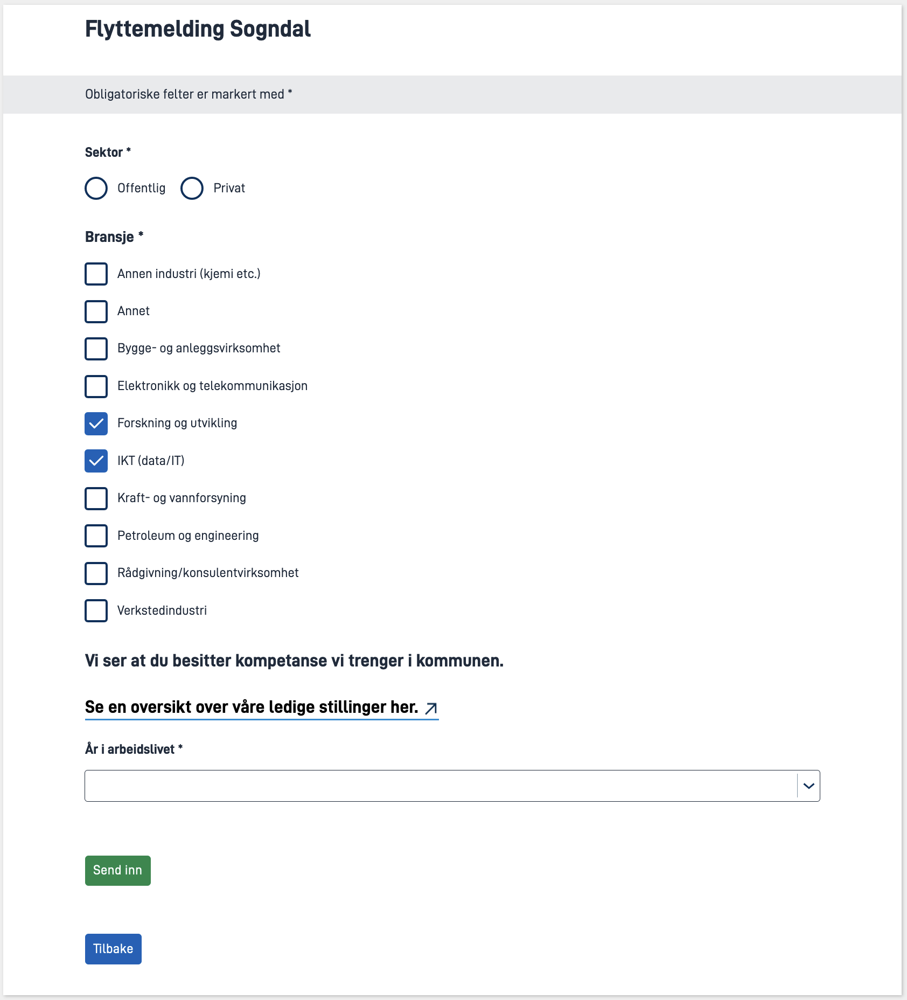

In this module, you're expanding the application you made in the previous modules to support more of the [requirements of the municipality of Sogndal](../case/#requirements-from-the-municipality).

**Topics covered in this module:**

- Code lists/Options
- Dynamic expressions

## Tasks

{}

In many applications there is a need to provide the user with a set of response options for a data field.
These options are referred to as _code lists_ or _options_.

In Altinn Studio, options are supported by the [radio buttons](/app/development/ux/components/radiobuttons/), [checkboxes](/app/development/ux/components/checkboxes/), [dropdown](/app/development/ux/components/dropdown/), and [multiple select](/app/development/ux/components/multipleselect/) components.

{}
There are three ways to configure code lists (add options) in Altinn:

1. By manually adding options for the component through Altinn Studio or in the file `{page}.json`.
2. By having the component fetch options from a static json-file.
3. By dynamically generate options through application logic.

{}

In this task, you will get to try out all three ways to configure a code list.

The municipality of Sogndal wishes to collect information on the newcomers employment.
 Data they wish to collect include which **sector** and **industry** the newcomer works in and how many **years** the newcomer has been active in the workforce.

### In Altinn Studio

  1. Create a new form page to collect employment related data.
  2. Add a **radio button** component for _Sector_. Create the answer options `Offentlig` and `Privat` manually.
  3. Add a **check box** component for _Industry_.
     Choose _Kodeliste_ as method for adding checkboxes and add _Kodeliste ID_ `industry`. The rest of the setup for this component is done locally.
  4. Add a **dropdown list** for _Years in work force_. Add _Kodeliste ID_ `years-in-work-force`. The rest of the setup for this component is done locally.   
  5. Save your changes in Designer and and _pull_ them to your local development environment.

### In Local Development environment

1. Create the directory `App/options` if it does not exist.
2. The municipality of Sogndal has created a [static code list](/app/development/data/options/static-codelists) for **industries**: [industry.json](../industry.json). Download the file and place it in `App/options`.
3. Set up the values in the code list for **Years in work force** as an [open dynamic code list](/app/development/data/options/dynamic-codelists#åpne-dynamiske-kodelister) in `App/options` (follow the directions in the documentation).  
   Options:
   Label         | Data value
   --------------|----------
   0 - 5 years   | `0-5`
   5 - 10 years  | `5-10`
   10 - 20 years | `10-20`
   20+ years     | `20+`

4. Verify that all code lists works as expected.

### Useful documentation

- [Static code lists](/app/development/data/options/static-codelists)
- [Dynamic code lists](/app/development/data/options/dynamic-codelists)

### Knowledge check
{}
Static response options are defined at build time and, as the name suggests, will remain static throughout their lifetime.
 Dynamic response options are retrieved at runtime and can therefore fetch values based on the time of day or other dynamic values.
{}

{}
Response options are by default openly accessible, and the API will be accessible to individuals who are not logged into the app. There are also no role restrictions.
In certain cases, it may be necessary to expose response options that are sensitive. This is where secure dynamic response options come into play, as they provide automatic verification that the caller has read permissions (`Instance.Read` rights).
{}

{}


{}

In some cases, the values displayed in a code list may depend on another form field.

The municipality of Sogndal wants the list of industries to be personalised based on which sector the user works in.

### Requirements from the municipality

We want the user to be presented with a different set of options for the industry choice based on which sector they work in.

- Private sector: [Standard list of industries](../industry.json)
- Public sector: `State` and `Municipality`

### Tasks

1. [Send a dynamic query parameter](/app/development/data/options/#pass-query-parameters-when-fetching-options) with the Industry component based on the Sector.
2. Create a dynamic code list for _Industry_ with logic based on the value of the query parameter (hint: you can read the industry list from the JSON file).

### Useful documentation
- [How to pass query parameters when fetching options](/app/development/data/options/#pass-query-parameters-when-fetching-options)
- [How to configure dynamic code lists](/app/development/data/options/dynamic-codelists)

### Knowledge check
{}
If a field in the mapping is updated, the app frontend will make a new call to fetch the code list. This allows dynamically displaying choices customized to the user's previously entered data.
{}

{}
If, for example, a user has selected a municipality from a dropdown list of municipalities that is configured with a mapping to `County`, and then goes back and changes the `County` field, the selected answer in the municipality list will be cleared.
{}

{}

{}

### Requirements from the municipality

If the user chooses `IKT (data/it)` under industry, a text with a link to our overview of vacant positions should appear.

Below the industry choice, the following text should appear

   > Vi ser at du besitter kompetanse vi trenger i kommunen.
   > Se en oversikt over våre ledige stillinger her.

Line 2 in the text should be a link that directs to https://sogndal.easycruit.com/index.html

The text and link should **only** be visible if the user has chosen `IKT (data/it)`.

### Tasks

1. Add a component that can display the current text.
2. Add [dynamics to the component](/app/development/logic/expressions/) that make it visible only if `IKT (data/it)` is selected (**NOTE**: The text should also be displayed when multiple options are selected, as long as one of them is `IKT (data/it)`).
3. Move the 'Submit' button to the employment section.

### Useful documentation
- [Dynamic expressions](/app/development/logic/expressions/)

### Knowledge check
- If you add a new function to `RuleHandlerHelper` - where will it run?
  - Would dynamic work without this defined?
- What is the correlation between functions defined in `RuleHandlerObject` and the file `RuleConfiguration.json`?

{}

## Summary

In this module you have configured dropdown, radio button and checkbox components and added options for them manually, programmatically and dynamically.

The service should run on your local computer with localtest and it should be possible to select the expected option from each component.

*Remember to push your local changes so that they become available in Altinn Studio*

## Solution
[Source code Module 4](https://altinn.studio/repos/testdep/flyttemelding-sogndal/src/branch/modul4)

{}


* Add components in Altinn Studio Designer, add an appropriate header, and link the component to the correct field in the data model.

* **Adding options manually:** Fill in fields in Altinn Studio Designer. In the code, it appears as follows:


App/ui/layouts/Arbeidsforhold.json


```json{linenos=false,hl_lines="5-23"}
{
  "$schema": "https://altinncdn.no/schemas/json/layout/layout.schema.v1.json",
  "data": {
    "layout": [
      {
        "id": "RadioButtons-sektor",
        "type": "RadioButtons",
        "dataModelBindings": {
          "simpleBinding": "Innflytter.Arbeidsinformasjon.Sektor"
        },
        "required": true,
        "options": [
          {
            "label": "arbeidsforhold.sektor.offentlig",
            "value": "offentlig"
          },
          {
            "label": "arbeidsforhold.sektor.privat",
            "value": "privat"
          }
        ],
        "textResourceBindings": {
          "title": "arbeidsforhold-sektor.title"
        }
      },
      ...
    ]
  }
}
```

* **Adding a static code list for industry:** Place the file `industry.json` in `App/options`.

* **Adding a dynamic code list for years in the workforce:**


App/options/YearsInWorkForceOptionsProvider.cs


```csharp
using Altinn.App.Core.Features;
using Altinn.App.Core.Models;
using System.Collections.Generic;
using System.Threading.Tasks;

namespace Altinn.App.AppLogic.Options
{
    public class YearsInWorkForceOptionsProvider : IAppOptionsProvider
    {
        public string Id { get; set; } = "years-in-work-force";

        public Task<AppOptions> GetAppOptionsAsync(string language, Dictionary<string, string> keyValuePairs)
        {
            var options = new AppOptions
            {
                Options = new List<AppOption>
                    {
                        new() {
                            Label = "0 - 5 år",
                            Value = "0-5"
                        },
                        new() {
                            Label = "5 - 10 år",
                            Value = "5-10"
                        },
                        new() {
                            Label = "10 - 20 år",
                            Value = "10-20"
                        },
                        new() {
                            Label = "20+ år",
                            Value = "20+"
                        }
                    }
            };

            return Task.FromResult(options);
        }
    }
}
```

* **Register dynamisk code list:**


App/Program.cs


```csharp{linenos=false,hl_lines="5"}
...
{
    // Register your apps custom service implementations here.
    services.AddTransient<IInstantiationProcessor, InstantiationProcessor>();
    services.AddTransient<IAppOptionsProvider, YearsInWorkForceOptionsProvider>();
   ...
}

{}

{}


To send a query parameter with the Industry component, we add a mapping to the component linked to the `Sektor` field in the data model:


App/ui/layouts/arbeidsforhold.json


```json{linenos=false,hl_lines="13-15"}
...
      {
        "id": "Checkboxes-bransje",
        "type": "Checkboxes",
        "dataModelBindings": {
          "simpleBinding": "Innflytter.Arbeidsinformasjon.Bransje"
        },
        "required": true,
        "textResourceBindings": {
          "title": "arbeidsforhold-bransje.title"
        },
        "optionsId": "industry",
        "mapping": {
          "Innflytter.Arbeidsinformasjon.Sektor": "sektor"
        }
      },
...
```

* Dynamic code list for _Industry_ with response options that depend on the value of `sektor`:


App/options/IndustryOptions.cs


```csharp
using Altinn.App.Core.Features;
using Altinn.App.Core.Models;
using Newtonsoft.Json;
using System.Collections.Generic;
using System.IO;
using System.Threading.Tasks;

namespace Altinn.App.AppLogic.Options
{
    public class IndustryOptions : IAppOptionsProvider
    {
        public string Id { get; set; } = "industry";
        private List<AppOption> _privateOptions = null;

        public Task<AppOptions> GetAppOptionsAsync(string language, Dictionary<string, string> keyValuePairs)
        {
            string sektor = keyValuePairs.GetValueOrDefault("sektor");

            if (sektor == "offentlig")
            {
                var offentligeOptions = new AppOptions
                {
                    Options = new List<AppOption>
                    {
                        new() {
                            Label = "Stat",
                            Value = "stat"
                        },
                        new() {
                            Label = "Kommune",
                            Value = "kommune"
                        },
                    }
                };
                return Task.FromResult(offentligeOptions);
            }
            else
            {
                if (_privateOptions == null)
                {
                    using (StreamReader r = new("./options/industry.json"))
                    {
                        string json = r.ReadToEnd();
                        _privateOptions = JsonConvert.DeserializeObject<List<AppOption>>(json);
                    }

                }
                return Task.FromResult(new AppOptions { Options = _privateOptions });
            }
        }
    }
}
```

* Register the code list in `Program.cs`:


App/Program.cs


```csharp{hl_lines="6"}
{
   ...
    // Register your apps custom service implementations here.
    services.AddTransient<IInstantiationProcessor, InstantiationProcessor>();
    services.AddTransient<IAppOptionsProvider, YearsInWorkForceOptionsProvider>();
    services.AddTransient<IAppOptionsProvider, IndustryOptions>();
    ...
}
```

{}

{}



* **Add a text display component**. Logic has been added to the component to hide it if "IKT (data/IT)" is not selected. The value `491` for the field is retrieved from the `industry.json` file. The 'Submit' button has also been moved to this page.


App/ui/layouts/arbeidsforhold.json


```json{hl_lines="8"}
...
{
   "id": "info-it-kompteanse",
   "type": "Paragraph",
   "textResourceBindings": {
      "title": "arbeid.it-kompetanse"
   },
   "hidden": ["notContains", ["component", "Checkboxes-bransje"], "491"],
   "dataModelBindings": {}
},
{
   "id": "send-inn",
   "type": "Button",
   "textResourceBindings": {
      "title": "button.send-inn"
   }
},
...
```

* **Add text resource:**


App/config/texts/resource.nb.json


```json
...
{
"id": "arbeid.it-kompetanse",
"value": "#### Vi ser at du besitter kompetanse vi trenger i kommunen. <br><br> [Se en oversikt over våre ledige stillinger her.](https://sogndal.easycruit.com/index.html)"
},
...
```

{}


<br><br>

{}
[<< Previous module](../modul3/)      [Next module >>](../modul5/)
{}