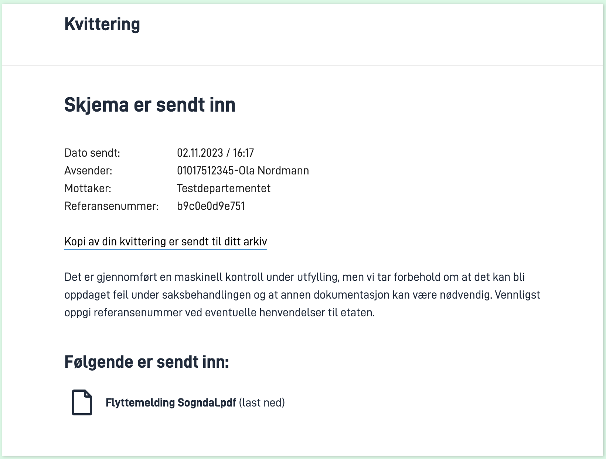

I denne modulen skal du legge til et prosessteg i applikasjonen.

**Temaer som dekkes i denne modulen:**
- Prosess
- Bekreftelsessteg
- Autorisasjonsregler
- Validering
- Overstyre standardtekster

## Oppgaver

{}

En Altinn-app har en prosessflyt definert av BPMN (Business Process Model and Notation) som beskriver de ulike stegene i prosessen.
Standardflyten for en nyopprettet applikasjon består av én oppgave og ett utfyllingssteg.


Din oppgave er å utvide standardprosessflyten med et bekreftelsessteg som illustrert nedenfor.
Bekreftelsessiden blir lagt til automatisk når man legger til dette i BPMN-filen `App/config/process/process.bpmn`.


### Krav fra kommunen

- Brukeren skal kunne se over utfylt data før skjemaet sendes inn.

### Oppgaver

1. Oppdater `App/config/process/process.bpmn` slik at den inneholder bekreftelsessteget
    (du kan erstatte hele innholdet med innholdet i malen under).

[Mal prosessflyt med data og bekreftelsessteg](/nb/app/development/configuration/process/Data_Confirmation_Process.bpmn)

{}
Har du lyst på en ekstra utfordring, kan du redigere prosessflyten manuelt eller i et BPMN-redigeringsverktøy.
Du kan da bruke malen som fasit.
{}

### Nyttig dokumentasjon

- [Tilgjengelige prosessteg i en Altinn App](/nb/app/development/configuration/process/#støttede-prosess-task-typer)
- [Hvordan endre prosessflyten til en applikasjon](/nb/app/development/configuration/process/#endre-prosessen)
- [Online BPMN editor](https://demo.bpmn.io/)
- [BPMN standard](https://en.wikipedia.org/wiki/Business_Process_Model_and_Notation)

### Forståelsessjekk

{}
`altinn:taskType` er definert for hver oppgave.
{}

{}
Altinn-spesifikke egenskaper vil trolig ikke bli importert eller eksportert når man jobber med modellen.
{}

{}
_SequenceFlow_ i bpmn-filen beskriver kun at flyten går én vei, fra utfylling og til bekreftelse. Flyten vil dermed ikke kunne gå begge veier.
{}

{}

{}

Policy-filen til applikasjonen din er tilpasset standard prosessflyt og må oppdateres for å inkludere bekreftelsessteget.

### Krav fra kommunen

- Det skal være samme rollekrav for å fylle ut og bekrefte en instans.
- Brukeren skal kunne sende inn skjemaet.

### Oppgaver

1. Gjør deg kjent med policy-filen `App/config/authorization/policy.xml`: Identifiser de ulike reglene og mønsteret for `RuleId`.
2. Finn den aktuelle regelen i [regelbiblioteket](/nb/app/development/configuration/authorization/rules/).
    Regelen skal dekke at en bruker med rolle REGNA eller DAGL skal kunne bekrefte innsending av skjema (Task2).
3. Legg til regelen i policy-fila. Husk å erstatte `[RULE_ID]` med riktig ID (følg mønsteret fra de andre reglene).

### Nyttig dokumentasjon
- [Regelbibliotek](/nb/app/development/configuration/authorization/rules/)
- [Alle roller i Altinn](https://www.altinn.no/hjelp/skjema/alle-altinn-roller/)

### Forståelsessjekk

{}
Applikasjonen vil vise "Ukjent feil" når brukeren trykker på "send inn"-knappen.
{}

{}
Da vil alle brukere, både med og uten roller, ha tillatelse til å utføre _confirm_-operasjonen for applikasjonen.
{}

{}

{}

### Krav fra kommunen
- Kun brukeren som eier instansen skal kunne sende inn skjemaet, selv om andre kan ha de nødvendige rollene.

### Oppgaver

For at kun brukeren som eier instansen skal kunne sende inn skjemaet kan vi legge til en validering som sjekker om
 `partyId` til nåværende bruker samsvarer med `partyId` (se [InstanceOwner](/nb/api/models/instance/#instanceowner)) til eieren av instansen for oppgaven med ID-en "Task_2" (som er bekreftelsessteget).
 Hvis de ikke samsvarer, legger den til en feilmelding i valideringsresultatene. Feilmeldingen vil vises på skjermen og prosessflyten stoppes.

1. Opprett filen `App/logic/Validation/InstanceValidation.cs` (følg fremgangsmåte for [egendefinert validering](/nb/app/development/logic/validation/#hvordan-legge-til-egendefinert-validering)).
2. Legg til valideringslogikk for bruker-id i klassen `ValidateTask`.

### Nyttig dokumentasjon
- [Egendefinert validering](/nb/app/development/logic/validation/#hvordan-legge-til-egendefinert-validering)
- [Instance](/nb/api/models/instance/#instance)
- [InstanceOwner](/nb/api/models/instance/#instanceowner)

### Forståelsessjekk
{}
Du kan foreslå å endre policyen slik at bare rollen "PRIV" - som kun kan delegeres til en privatperson på vegne av en selv - har tillatelse til å utføre handlingen "confirm".
 Dette vil føre til at autorisasjonsreglene automatisk inkluderer sjekken som nå er implementert som egen validering.
{}

{}


{}

### Krav fra kommunen

Vi ønsker at brukeren skal presenteres med følgende tekst før innsending:

```rich
Du er nå klar for å sende inn melding om tilflytting til Sogndal kommune.

Ved å sende inn dette skjemaet samtykker du til at dataen du har fylt ut kan lagres og benyttes til å tilpasse kommunens tilbud til deg de neste 18 månedene.

Før du sender inn vil vi anbefale å se over svarene dine. Du kan ikke endre svarene etter at du har sendt inn.
```

### Oppgaver

1. Opprett en tekstressurs som [overstyrer standardteksten for bekreftelsessiden](/nb/app/development/configuration/process/customize/#bekreftelse-confirmation).

### Nyttig dokumentasjon
- [Tilpasning av bekreftelsessiden](/nb/app/development/configuration/process/customize/#bekreftelse-confirmation)

{}


## Oppsummering

I denne modulen har du utvidet applikasjonen din med et bekreftelsessteg, tilpasset visningen, og lagt til validering og autorisasjonsregler knyttet til prosessteget.

Tjenesten skal kunne kjøres opp på din lokale maskin med lokal test
og du skal kunne teste det nye prosessteget og bekrefte at visningen ser ut som ønsket.

*Husk å pushe de lokale endringene dine så de blir tilgjengelige i Altinn Studio.*

## Løsningsforslag
[Kildekode Modul 5](https://altinn.studio/repos/testdep/flyttemelding-sogndal/src/branch/modul5)

{}

* **Kopier innholdet i [malen](/nb/app/development/configuration/process/Data_Confirmation_Process.bpmn) og lim det inn i filen `App/config/process/process.bpmn`** (erstatt hele det originale innholdet).
 
 Du skal nå få opp følgende side når du klikker på "Send inn":


Merk at hvis du klikker på "Send inn" på bekreftelsessiden vil du få en feilmelding. Dette løses i neste steg med autorisasjon.

{}

{}

* **Finn den aktuelle regelen i [regelbiblioteket](/nb/app/development/configuration/authorization/rules/):**
[Bruker med rollen REGNA eller DAGL kan bekrefte instanser av [ORG]/[APP] som er i Task_2](/nb/app/development/configuration/authorization/rules/#bruker-med-rollen-regna-eller-dagl-kan-bekrefte-instanser-av-orgapp-som-er-i-task_2).

* **Kopier koden for regelen og lim den inn i  `policy.xml`** (rett etter den siste regelen (mellom den siste `</xacml:Rule>` tagen og `<xacml:ObligationExpressions>`)).

* **Erstatt `[RULE_ID]` med `7`** (siden den foregående regelen har id `6`).

For komplett løsning, se [kildekode](https://altinn.studio/repos/testdep/flyttemelding-sogndal/src/branch/modul5/App/config/authorization/policy.xml).

Med autorisasjonen på plass skal det gå an å sende inn skjemaet og du vil få opp bekreftelsessiden:



{}

{}

* **Følg fremgangsmåte for [egendefinert validering](/nb/app/development/logic/validation/#hvordan-legge-til-egendefinert-validering) for å opprette fil.**
* **Legg til valideringslogikk for bruker-id i klassen `ValidateTask`:**


App/logic/Validation/InstanceValidation.cs


```csharp
...

namespace Altinn.App.AppLogic.Validation;

public class InstanceValidator : IInstanceValidator
{
    // Field used to store the http context for the current request
    private readonly HttpContext _httpContext;

    public InstanceValidator(IHttpContextAccessor httpContextAccessor)
    {
        // Get the http context from the accessor
        _httpContext = httpContextAccessor.HttpContext;
    }
    public Task ValidateData(object data, ModelStateDictionary validationResults)
    {
        throw new System.NotImplementedException();
    }

     public async Task ValidateTask(Instance instance, string taskId, ModelStateDictionary validationResults)
    {
        // Get the user from the http context
        var user = _httpContext.User;
        if (taskId == "Task_2")
        {
            // Get the party id claim from the user
            Claim partyIdClaim = user.FindFirst(c => c.Type == AltinnCoreClaimTypes.PartyID);
            // Check if the party id claim matches the instance owner party id
            if (partyIdClaim.Value != instance.InstanceOwner.PartyId)
            {
                // Add a model error to the validation results (this will be displayed in the UI and prevent the user from continuing)
                validationResults.AddModelError(taskId, "confirm.validation_message");
            }
        }

        // Return a completed task
        await Task.CompletedTask;
    }
}
```

* **Registrer implementeringen i `Program.cs`**


App/Program.cs


```csharp{hl_lines="6"}
{
    // Register your apps custom service implementations here.
    services.AddTransient<IInstantiationProcessor, InstantiationProcessor>();
    services.AddTransient<IAppOptionsProvider, YearsInWorkForceOptionsProvider>();
    services.AddTransient<IAppOptionsProvider, IndustryOptions>();
    services.AddTransient<IInstanceValidator, InstanceValidator>();
}
```

* **Legg til tekstressurs med beskjed som vises dersom validering feiler:**


App/config/texts/resources.nb.json


```json
{
  "$schema": "https://altinncdn.no/toolkits/altinn-app-frontend/4/schemas/json/text-resources/text-resources.schema.v1.json",
  "language": "nb",
  "resources": [
    ...
    {
      "id": "confirm.validation_message",
      "value": "Kun brukeren som eier instansen kan sende inn dette skjema."
    }
  ]
}
```

{}

{}


* **For å legge til egendefinert tekst på bekreftelsessiden som i eksempelet over legger du til følgende tekstressurs:**


App/config/texts/resources.nb.json


```json
{
  "$schema": "https://altinncdn.no/toolkits/altinn-app-frontend/4/schemas/json/text-resources/text-resources.schema.v1.json",
  "language": "nb",
  "resources": [
    ...
    {
      "id": "confirm.body",
      "value": "Du er nå klar for å sende inn melding om tilflytting til Sogndal kommune. </br></br> Ved å sende inn dette skjemaet samtykker du til at dataen du har fylt ut kan lagres og benyttes til å tilpasse kommunens tilbud til deg de neste 18 månedene. </br></br> **Før du sender inn vil vi anbefale å se over svarene dine. Du kan ikke endre svarene etter at du har sendt inn.**"
    }
  ]
}
```

{}

<br><br>

{}
[<< Forrige modul](../modul4/)      [Neste modul >>](../modul6/)
{}