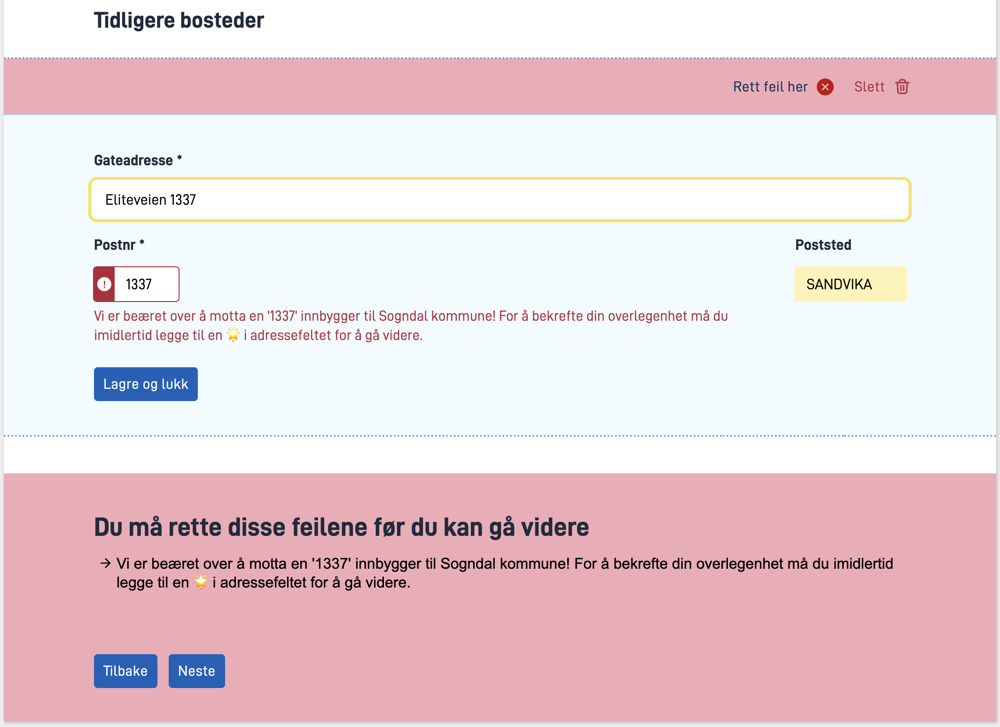
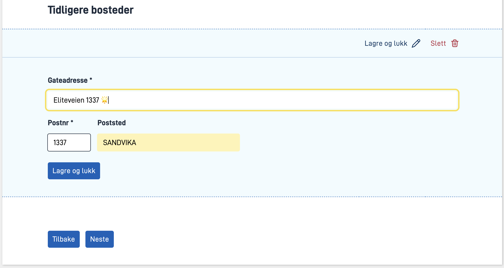

I denne modulen skal du utvide applikasjonen du har laget i foregående moduler for å støtte mer av [funksjonaliteten som Sogndal kommune ønsker](../case/#krav-fra-kommunen).

**Temaer som dekkes i denne modulen:**
- Repeterende grupper
- Validering
- Dataprosessering

## Oppgaver

{}
### Krav fra kommunen

For å kunne skreddersy et best mulig tilbud til nye innflyttere ønsker vi oss en oversikt over tidligere bosteder til innflytteren.

På datasiden ønsker vi at det legges opp til at brukeren kan fylle inn tidligere bosteder. Tidligere bosteder skal inneholde følgende felter:
- Gateadresse
- Postnummer
- Poststed

Det skal være mulig å legge inn opptill 10 tidligere bosteder.

### Oppgaver

1. Legg til en gruppekomponent på siden som samler inn personalia.
2. Legg til en adressekomponent under gruppekomponenten.
3. For begge komponentene, legg til passende ledetekst og knytt de til relevante felter i datamodellen.

Merk at "Maksimalt antall repetisjoner" må endres lokalt.

### Nyttig dokumentasjon
- [Oppsett for gruppering av felter](/nb/app/development/ux/fields/grouping)
- [Oppsett for repeterende grupper](/nb/app/development/ux/fields/grouping/repeating)

### Forståelsessjekk
{}
Feltet `maxOccurs` i xsd-modellen sier noe om hvorvidt et felt er repeterende. Om `maxOccurs` > 1 vil man i praksis se på dette elementet som en liste.
{}

{}
Det er tillatt 10 repetisjoner for `TidligereBosteder`.
{}

{}


{}

### Krav fra kommunen

Dersom innflytter fyller inn postnummer `1337` som et av tidligere bosteder må vedkommende
 bekrefte sin uovertruffenhet ved å legge til et symbol i adressefeltet før de kan gå videre.

Vi ønsker derfor at det skal dukke opp en feilmelding på det aktuelle feltet med følgende tekst:

```rich
Vi er beæret over å motta en '1337' innbygger til Sogndal kommune!
 Du må imidlertid bekrefte din uovertruffenhet ved å legge til en 🌟 i adressefeltet for å gå videre.
```

1. Legg til en validering på feltet `Postnr` for tidligere bostedsadresser.

### Nyttig dokumentasjon
- [Serverside valideringer](/nb/app/development/logic/validation/#serverside-validering)
- [Hvordan legge til egendefinert validering](/nb/app/development/logic/validation/#hvordan-legge-til-egendefinert-validering)
- [Enkeltfeltvalideringer](/nb/app/development/logic/validation/#enkeltfeltvalidering)

### Forståelsessjekk
{}
Valideringer på serversiden kjøres som standard kun i det brukeren velger å bevege seg videre fra et steg.
Denne oppførselen kan overstyres, og det er mulig å trigge valideringer både på enkelte felter og f.eks. ved sidebytte mellom ulike sider.
{}

{}
Klientside-valideringer bør anses som et hjelpemiddel for bedre bruksopplevelse og ikke som en garanti på at data leveres på riktig format.
Ondsinnede kan komme seg forbi disse valideringene, og klientsidevalideringer vil ikke bli kjørt om man f.eks. benytter seg av api'ene direkte.
Derfor bør valideringer som legges på frontend alltid gjenspeiles i logikken backend.
{}

{}


{}
### Krav fra kommunen
En av kommunens databehandlere har sett seg lei av å manuelt rette opp i en gateadresse som ofte blir skrevet feil av innflyttere.
Vi ønsker derfor å programmatisk fikse opp i dette under utfyllingen av appen.

Om sluttbruker fyller inn `Sesame Street 1` i feltet `Innflytter.Adresse.Gateadresse` skal dette automatisk rettes til `Sesamsgate 1`.
I alle andre tilfeller skal feltet forbli urørt.

### Oppgaver

1. Opprett en fil for [dataprosessering](/nb/app/development/logic/dataprocessing/).
2. Legg til prosessering av adressefeltet som beskrevet over.

Husk å implementere løsningen i `Program.cs` som tidligere.


### Nyttig dokumentasjon
- [Dataprosessering](/nb/app/development/logic/dataprocessing/)

### Forståelsessjekk
{}
Dataprosessering blir kjørt hver gang brukeren enten leser eller skriver data.
Det vil si at hver gang brukeren endrer et gitt felt så vil logikken kjøres.
Dette stiller derfor krav til at apputvikler optimaliserer koden som kjøres og unngår tunge og komplekse operasjoner på hver kalkulering.
{}

{}
`ProcessDataWrite` kjøres i det brukeren skriver data, altså når brukeren har fylt inn et felt eller oppdaterer en eksisterende verdi.
`ProcessDataRead` kjøres i det brukeren leser data fra databasen, f.eks. når man navigerer seg til en tidligere instans av applikasjonen og henter opp tildigere utfylt data.
{}

{}
Kjært barn har mange navn - også i dette tilfellet. `DataProcessing` og `Calculations` er samme navn på samme konsept. I nugetpakkene før 4.7.0 gikk dette under navnet `Calculations` eller `kalkuleringer`, mens dette nå omtales som `DataProcessing`.
{}

{}

## Oppsummering
I denne modulen har du sett på **repeterende grupper** og hvordan dette konfigureres som en del av brukergrensesnittet.
Vi har også sett på hvordan man setter opp egendefinerte **valideringer** i backend for tilfeller som ikke lar seg definere som en del av restriksjoner i datamodellen.
Til slutt har vi sett på hvordan man kan sette opp **dataprosessering** som muliggjør manipulering av data ved kjøretid.

## Løsningsforslag
[Kildekode Modul 6](https://altinn.studio/repos/testdep/flyttemelding-sogndal/src/branch/modul6)<br>
[(Kildekode Modul 6 - tidligere versjon)](https://altinn.studio/repos/ttd/tilflytter-sogndal-lf/src/branch/bolk/6)<br>

{}

")

")

Vi har lagt til en komponent for repeterende gruppe i Altinn Studio Designer med en adressekomponent som "child".

Gruppekomponenten er knyttet til datamodell-feltet `Innflytter.TidligereBosteder`
 og adressekomponenten er knyttet til feltene `Innflytter.TidligereBosteder.Gateadresse`,
  `Innflytter.TidligereBosteder.Postnr` og `Innflytter.TidligereBosteder.Poststed`.

Antall tillatte repeterende grupper er bestemt av `maxOccurs` for feltet i datamodellen. 
 Vi må også sette `maxCount` til `10` på gruppekomponenten for å hindre brukeren i å (visuelt) opprette flere grupper enn tillatt.
 Foreløpig må dette gjøres lokalt i sidens layout-fil (se under).

Vi har i tillegg lagt til en overskrift som tydeliggjør skillet mellom tidligere og nåværende adresser.


App/ui/layouts/innflytterPersonalia.json


```json
    ...
      {
        "id": "tidligere-bosteder-overskrift",
        "type": "Header",
        "size": "M",
        "textResourceBindings": {
          "title": "innflytterPersonalia.tidligere-bosteder-overskrift.title"
        }
      },
      {
        "id": "Group-tidligere-bosteder",
        "type": "Group",
        "maxCount": 10,
        "dataModelBindings": {
          "group": "Innflytter.TidligereBosteder"
        },
        "textResourceBindings": {
          "add_button": "innflytterPersonalia.AddressComponent-adresse"
        },
        "children": [
          "AddressComponent-tidligere-bosted"
        ]
      },
      {
        "id": "AddressComponent-tidligere-bosted",
        "type": "AddressComponent",
        "dataModelBindings": {
          "address": "Innflytter.TidligereBosteder.Gateadresse",
          "zipCode": "Innflytter.TidligereBosteder.Postnr",
          "postPlace": "Innflytter.TidligereBosteder.Poststed"
        },
        "simplified": true,
        "required": true,
        "textResourceBindings": {
          "title": "innflytterPersonalia.AddressComponent-tidligere-bosted.title"
        }
      },
    ...
```

**Følgende tekstressurser er lagt til:**


App/config/texts/resources.nb.json


```json
{
  "language": "nb",
  "resources": [
    ...
    {
      "id": "innflytterPersonalia.AddressComponent-adresse",
      "value": "adresse"
    },
    {
      "id": "innflytterPersonalia.AddressComponent-tidligere-bosted.title",
      "value": "Tidligere bosted"
    },
    {
      "id": "innflytterPersonalia.tidligere-bosteder-overskrift.title",
      "value": "Tidligere bosteder"
    }
  ]
}
```

{}

{}





* **Legg til en validerings-trigger på adressekomponenten:**


App/ui/layouts/innflytterPersonalia.json


```json{hl_lines="15"}
...
  {
    "id": "AddressComponent-tidligere-bosted",
    "type": "AddressComponent",
    "dataModelBindings": {
      "address": "Innflytter.TidligereBosteder.Gateadresse",
      "zipCode": "Innflytter.TidligereBosteder.Postnr",
      "postPlace": "Innflytter.TidligereBosteder.Poststed"
    },
    "simplified": true,
    "required": true,
    "textResourceBindings": {
      "title": "innflytterPersonalia.AddressComponent-tidligere-bosted.title"
    },
    "triggers": ["validation"]
  },
...
```

* **Legg til valideringslogikk i metoden `ValidateData` i `InstanceValidation.cs`:**


App/logic/Validation/InstanceValidation.cs


```csharp
...

public async Task ValidateData(object data, ModelStateDictionary validationResults)
    {

       if (data.GetType() == typeof(Skjema))
        {
            Skjema skjema = (Skjema)data;
            string elitePostalCode = "1337";
            string eliteSymbol = "🌟";

            if (skjema?.Innflytter.TidligereBosteder != null)
            {
                List<Adresse> tidligereBosteder = skjema.Innflytter.TidligereBosteder;
                int i = 0;
                foreach (Adresse adresse in tidligereBosteder)
                {
                    if (adresse.Postnr == elitePostalCode && !adresse.Gateadresse.Contains(eliteSymbol))
                    {
                        validationResults.AddModelError("Innflytter.TidligereBosteder[" + i + "].Postnr", "Innflytter.TidligereBosteder.validation_message");
                    }
                    i++;
                }
            }
        }
        await Task.CompletedTask;
    }
...
```

* **Legg til tekstressurs for feilmelding:**


App/config/texts/resources.nb.json


```json
{
  "language": "nb",
  "resources": [
    ...
    {
      "id": "Innflytter.TidligereBosteder.validation_message",
      "value": "Vi er beæret over å motta en '1337' innbygger til Sogndal kommune! Du må imidlertid bekrefte din uovertruffenhet ved å legge til en 🌟 i adressefeltet for å gå videre."
    }
  ]
}
```

### Ekstra utfordring

Denne løsningen endrer bare adressen for tidligere bosteder.
Oppdater koden slik at valideringen også omfatter nåværende adresse.

{}

{}


* **Opprett en klasse som implementerer `IdataProcessor` som beskrevet i [dataprosessering](/nb/app/development/logic/dataprocessing/) og legg til logikk for dataprosessering:**


App/logic/DataProcessing/DataProcessor.cs


```csharp
// 'using' statements

namespace Altinn.App.AppLogic.DataProcessing;

public class DataProcessor : IDataProcessor {
    public async Task<bool> ProcessDataRead(Instance instance, Guid? dataId, object data)
    {
        return await Task.FromResult(false);
    }

    public async Task<bool> ProcessDataWrite(Instance instance, Guid? dataId, object data)
    {
        bool edited = false;

        if (data.GetType() == typeof(Skjema)) {
            Skjema skjema = (Skjema)data;
            
            if (skjema?.Innflytter.TidligereBosteder != null) {
                List<Adresse> tidligereBosteder = skjema.Innflytter.TidligereBosteder;
                int i = 0;
                foreach (Adresse adresse in tidligereBosteder) {
                    if (adresse.Gateadresse == "Sesame Street 1") {
                        adresse.Gateadresse = "Sesamgate 1";
                        edited = true;
                    }
                    i++;
                }
            }
        }
        return await Task.FromResult(edited);
    }
}
```

* **Registrer implementeringen i `Program.cs`**


App/Program.cs


```csharp{hl_lines="8"}
...
{
    // Register your apps custom service implementations here.
    ...
    services.AddTransient<IInstanceValidator, InstanceValidator>();
    services.AddTransient<IDataProcessor, DataProcessor>();
}
...
```

### Ekstra utfordring

Denne løsningen endrer bare adressen for tidligere bosteder og kun for `Sesame Street 1`.
Oppdater koden slik at:

1. Prosesseringen også omfatter nåværende adresse.
2. Endringen skjer for alle gatenumre.

{}

<br><br>

{}
[<< Forrige modul](../modul5/)      [Neste modul >>](../modul7/)
{}