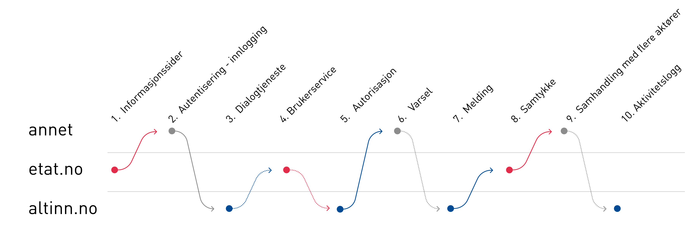

## Consider

- **What are the current challenges?** Start by defining the problem. What are you going to solve? 
It is easier to create a solution with a clearly defined scope for your problem. It might be a good 
idea to gather your project group, and to look for a nice wall to put post-it notes on.
- **Who are the users and what are their needs?** 
We recommend starting by defining your target audience and their requirements as early as possible during the project. 
Create an overview of your users and who they are. In most cases your service should be usable by multiple user groups. 
Are they citizens or do they represent a company? What background do they have? 
Are they digitally inclined or not accustomed to digital services? 
This phase normally starts with interviews, observations or a focus group.
- **Points of contact for the user** Create an overview of the points of contact for the user. What does the customer see during their use of your service? 
One way to do this is pictured below:
 Should Altinn be hidden from the end user or will you be using Altinns internal UI? Does this match how the user expects to complete their task? Is it possible to offer the customer the relevant part of Altinn in the context they are in, instead of sending them back and forth? 
- **What data do you need?** The need for a digital solution usually starts with a need to gather data. Start by checking if someone else has the data you need, and if it is available for reuse. You can check for data in our <a href="https://data.norge.no/">common datacatalog</a>. If not - how can you request it in a way that requires the least effort by your users? Sometimes it could be an idea to try something different than than obvious
solutions where you ask through a form. 
{.connected-bullets}

After working through the initial phase and defining the user requirements, we recommend that you set up a prototype that can be tested by relevant users. If you are creating a form, you can use our [prototype-Kit for Figma](../prototype).
