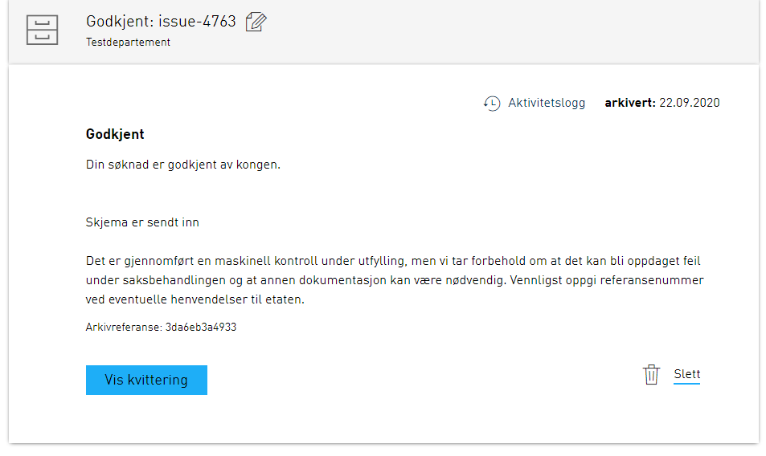

This page is currently incomplete, more information will be provided at a later date.

An instantiated application will have a corresponding instance object. This object contains metadata about that specific instance.
If you want to learn more about instance and its surrounding API you can read the technical documentation for [API](../../api).

## Substatus

As an app owner you can set a substatus for the instance, this is to enable providing more detailed information information about the current state of the instance.
Substatus will be shown both in the message box in Altinn and on the receipt page.

The substatus is an object which can be set on the instance object. How this is done is described under API.
Substatus is a simple object that contains `label` and `description`. These fields can either contain plain text or a text key which refers to the application texts. Keep in mind that variables in text are not supported in these fields. 
The message box is limited to 25 characters in the `label` field, and should `label` contain more than 25 characters only the first 22 will be used and all remaining be replaced with "..."

Example of a substatus object: 
```json
{
    "label": "some.label",
    "description": "Description in plain text"
}
```

Below you can see examples of how substatus looks like in the message box, and in the receipt where the substatus is set up in the following way:
```json
{
    "label": "Accepted",
    "description": "Your application has been accepted by the king."
}
```




## Automatic deletion of drafts

As an application owner you might want to delete a users draft after a certain period of time since instantiation.
Three steps are required to achieve this:

1. Applications must be configured so that service owners are permitted to delete instances 
2. Identifying which instances have not been completed through asking storage
3. Deleting instance via an endpoint exposed within the application

### Step 1: Configuration of application

The standard for an application is that the service owner is not permitted to delete instances.
To be allowed to do this a rule must be added to `policy.xml` which is placed in `App/config/authorization`.
The rule can be copied from the [rule library](../autorisasjon/regelbibliotek/#org-can-delete-an-instance-of-orgapp-in-any-task-or-event).

### Step 2: Identify which instances have not been completed through asking storage

Storage exposes a set of query parameters which can be used when collecting a set of instances.
In the example below we return all instances which were instantiated the 30th of September 2020 or earlier,
which are still in the form filling stage. 

You can test query parameters here to find the correct queries for your specific service here.

`HTTP GET https://platform.altinn.no/storage/api/v1/instances?appId={org}/{app}&created=lte:2020-09-30&process.currentTask=Task_1`

### Step 3: Deleting an instance via the endpoint exposed in the application

After identifying the instances which are to be deleted, sending the actual call to the
application to get them deleted is simple. The id of the instance (instanceOwner.partyId/instanceGuid) then have to be submitted. 

`HTTP DELETE https://ttd.apps.altinn.no/ttd/apps-test/instances/{instanceOwner.partyId}/{instanceGuid}`
