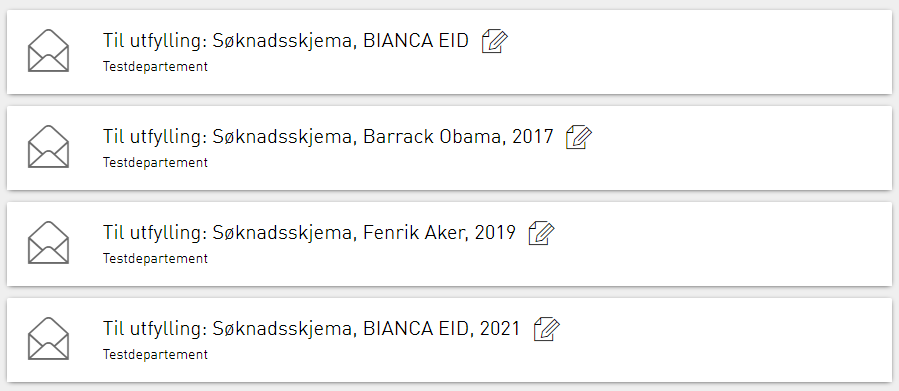

In some cases it can be useful with presentation fields to easier
differentiate instances of a single application.

By configuring presentation fields on an application,
these values are extracted from the form data and included in the instance object.
The data values are appended to the application title when the instance is displayed in the message box.


## Configuration
Configuration of presentation fields is defined in `applicationmetadata.json`,
which you can find in ythe appliation repository in the folder `App/config`.

Add a new section named `presentationField` that consists of the proprties below

 Name     | Description
----------|------------
id        | Id for the presentation field. used to identify the presentation text when it is stored on the instance object.
path      | Datamodel path to the presentation field. This value is the same that is bound to a component in the layout file of the app.
dataTypeId| Id of the data type of the data model to retrieve the value from.

The complete presentation fields configuration in an application might look like this:

```json
"presentationFields": [
{
  "id": "Ansettelse",
  "path": "OpplysningerOmArbeidstakeren-grp-8819.Arbeidsforhold-grp-8856.AnsattAar-datadef-33267.value",
  "dataTypeId": "default"
},
{
  "id": "Navn",
  "path": "OpplysningerOmArbeidstakeren-grp-8819.OpplysningerOmArbeidstakeren-grp-8855.AnsattNavn-datadef-1223.value",
  "dataTypeId": "default"
}]
```

## Result

The result in the message box will be the title of the application followed by the presentation texts in a comma separated list.

