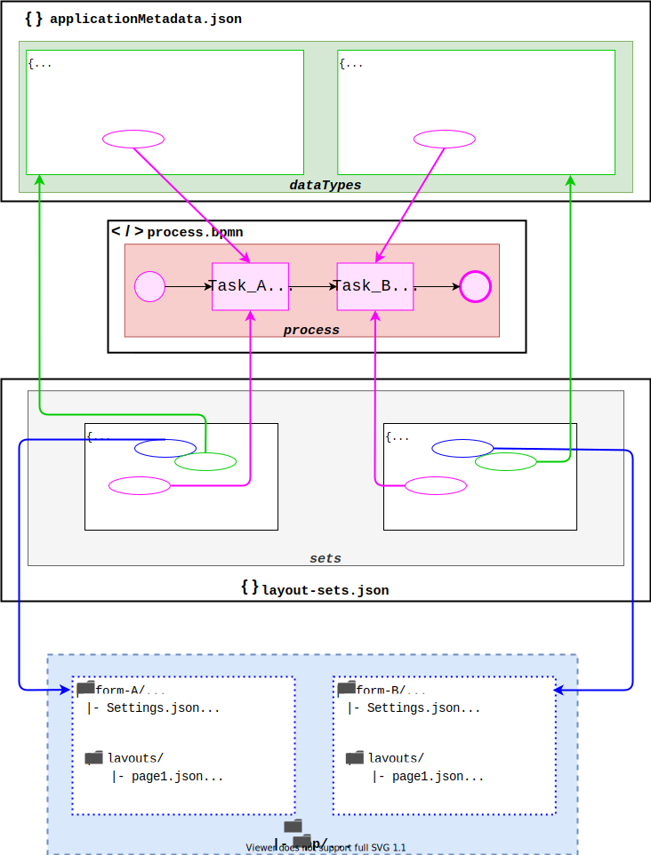

En applikasjon i Altinn 3 kan ha flere steg som brukeren skal gjennom. Flyten med hvilke steg en sluttbruker
skal jobbe seg gjennom er styrt av en _prosess_. Prosessen er et XML-dokument som bruker [BPMN 2.0 standarden](https://en.wikipedia.org/wiki/Business_Process_Model_and_Notation)
for å definere stegene som bruker skal gjennom. Denne filen heter `process.bpmn`, den ligger i `App/config/process`-mappa i applikasjonen.

Applikasjonen bruker så denne filen til å styre brukeren gjennom de forskjellige stegene. Status på hvor bruker er i prosessen
lagres på instansen. 

### Steg-typer
Følgende steg-typer (tasks) er støttet pr. i dag:

#### Data (`data`) 
Utfylling/innhending av data. Tilsvarer utfyllingssteg på en innsendingstjeneste i Altinn II.

#### Bekreftelse (`confirmation`)
Bruker vises en side hvor de kan bekrefte det de skal sende inn. Tekster på siden kan overstyres, se [her for mer info](/customize/#bekreftelse-confirmation);

#### Tilbakemelding (`feedback`)

Bruker vises en side med informasjon om at de venter på tilbakemelding fra applikasjonseier. Bruker kan ikke navigere videre i prosessen selv. 
Applikasjonseier kan sende bruker videre i prosessen når de har gjennomført det de trenger ved å kalle 
[`next` i prosess-API'et](../../../api/apps/process/#complete-and-move-to-next-task).
## Fremtidige prosess-tasker (tentativ)

- Signering (Signing)
- Betaling (Payment)
- Parallellsignering (Paralell Signing)
- Brukerstyrt signering (User Controlled Signing)
- Ekstern validering (External Validation)

## Endre prosessen

For å endre på prosessen kan du manuelt redigere BPMN-filen med en valgfri XML- eller BPMN-editor.
Den ligger lagret i app-repoet som `App/config/process/process.bpmn`.

## Sammenheng mellom prosess, datamodell og layouts
For hvert prosess-steg (av typen data) kan man definere hvilket sett med layout-filer som skal benyttes. Dette gjøres i 
`layoutSets.json`, som legges inn under `ui/`-mappen i applikasjonen. Man definerer også hvilken datamodell som brukes for et 
gitt prosess-steg i `dataTypes`-listen i `config/applicationMetadata.json`. Oversikten under viser hvordan dette henger sammen:

