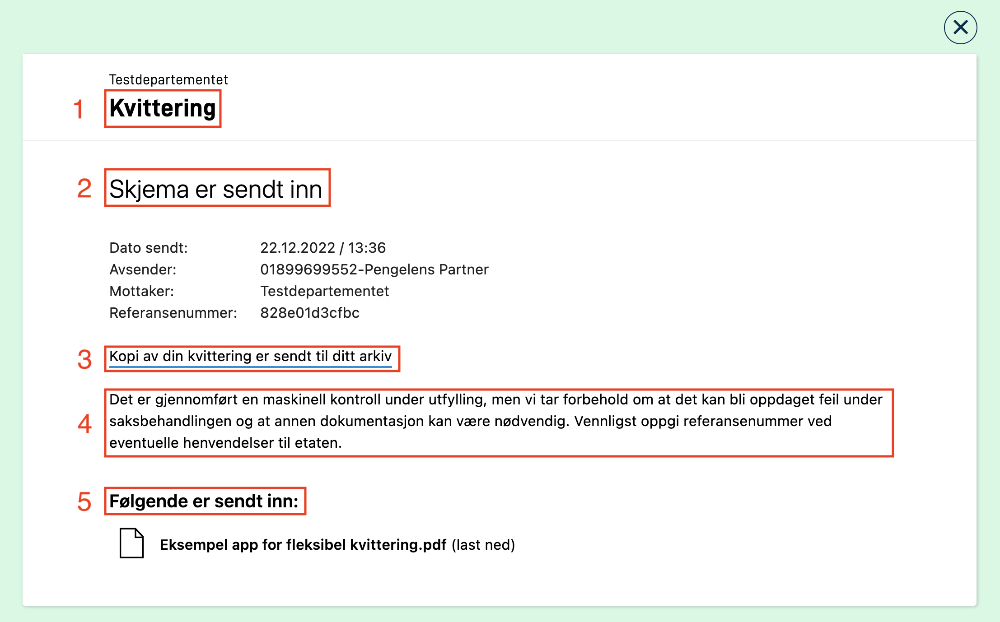
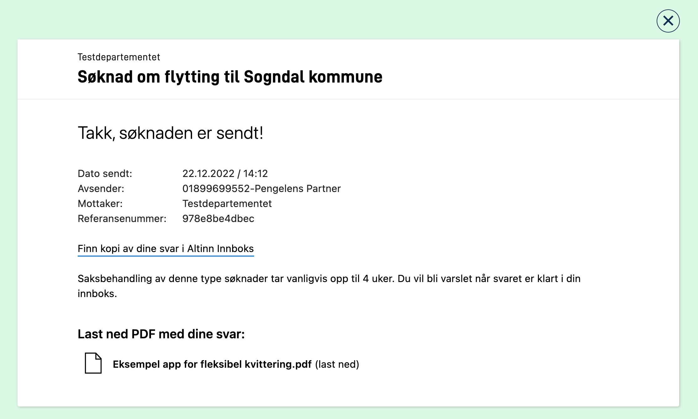
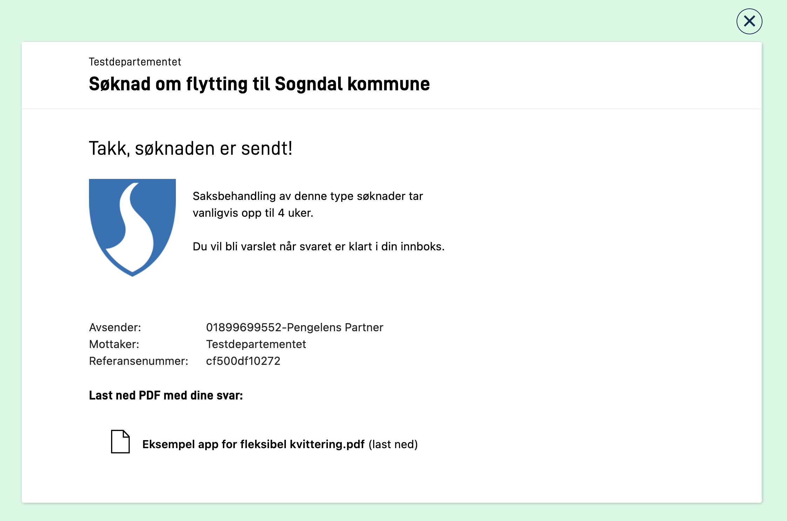

An application wil have a process which the user of the application follows.
Depending of the type of step the user is in, different views are presented.
This page explains the different views and how they can be customized.

## Data 
In this process task a form which the user can fill in data.
The form can be edited using the [UI editor](../../../../getting-started/navigation/designer/ui-editor) or by changing `FormLayout.json` manually.

## Confirmation
In this process task some standard texts are presented and the user can choose to *confirm* to go forward.

These texts can be overridden by manually adding each defined text keys in the apps text resources. More information about how this is done can be found [here](../../../ux/texts).
In the following section we will present an overview of the different texts that can be customized.


### Customize texts

| Text # (see image above)  | Text key            |
| ------------------------- | ------------------- |
| 1                         | confirm.title       |
| 2                         | confirm.sender      |
| 3                         | confirm.body        |
| 4                         | confirm.answers     |
| 5                         | confirm.attachments |
| 6                         | confirm.button_text |

Example of custom texts in the file  `resources.nb.json`:

```json
{
  "id": "confirm.title",
  "value": "Vennligst bekreft at du ønsker å sende inn"
},
{
  "id": "confirm.body",
  "value": "Du må kun trykke send inn om du er helt sikker på at du vil sende inn. <br/><br/>I det du trykker send inn kan du ikke gjøre endringer."
},
{
  "id": "confirm.attachments",
  "value": "Dokumenter med opplysninger"
},
{
  "id": "confirm.button_text",
  "value": "Lagre og fortsett"
}
```

Note that in the example we have used the html-tag `<br/>` to make a line shift.
For links and formatting [use markdown](../../../ux/texts#formatting-of-texts).

This results in the following view:


### Custom form layout

For the confirm task the app developer has the possibility for configuring their own [layout set](../../../ux/pages/layout-sets/) with corresponding form layout definitions and other ui-configuration files which are included in the data step.

This makes the confirmation page custumizable, and can use the components that are supported in Altinn Studio.

Since the confirm step is not meant to be used for writing data, a good practice would be to use static components (header, paragraph) and set other components to `readOnly`.

An example setup of the `layout-sets.json` where `Task_1` is a data step, and `Task_2` a confirmation step:

```json
{
    "sets": [
      {
        "id": "simple",
        "dataType": "simple",
        "tasks": [
          "Task_1"
        ]
      },
      {
        "id": "custom-confirmation",
        "dataType": "simple",
        "tasks": [
          "Task_2"
        ]
      }
    ]
  }
```

Notice that the layout-set configuration for `Task_2` references the data model used in `Task_1`.

Example `formLayout.json` file that presents data from the data model used in the `data`-task:

```json
{
  "$schema": "https://altinncdn.no/schemas/json/layout/layout.schema.v1.json",
  "data": {
    "layout": [
      {
        "id": "paragraph",
        "type": "Paragraph",
        "textResourceBindings": {
          "title": "paragraph"
        }
      },
      {
        "id": "name",
        "type": "Input",
        "textResourceBindings": {
          "title": "name.label"
        },
        "dataModelBindings": {
          "simpleBinding": "Felt1"
        },
        "required": true,
        "readOnly": true
      },
      {
        "id": "lastname",
        "type": "Input",
        "textResourceBindings": {
          "title": "lastName.label"
        },
        "dataModelBindings": {
          "simpleBinding": "Felt2"
        },
        "required": true,
        "readOnly": true
      }
    ]
  }
}
```

The app structure would look look this:

```txt
├───App
│   ├───config
│   ├───logic
│   ├───models
|   | ...
│   ├───ui
│   │   ├───custom-confirmation
│   │   │   └───layouts
|   |   |   └─── ...
│   │   └───simple
│   │       └───layouts
|   |   |   └─── ...

```

The end result:


For a complete setup of this feature see our [example app.](https://altinn.studio/repos/ttd/custom-view-confirm)

## Feedback
This is a process step where the application owner can validate the filled data to generate a feedback before the data is archived.

In the following section we will present an overview of the different texts that can be customized.


### Customize texts

| Text # (see image above)  | Text key          |
| ------------------------- | ----------------- |
| 1                         | feedback.title    |
| 2                         | feedback.body     |

Example of custom texts in the file  `resources.nb.json`:

```json
{
  "id": "feedback.title",
  "value": "Vent på at tjenesteeier sjekker data"
},
{
  "id": "feedback.body",
  "value": "Når tjenesteier har sjekket at alle data er godkjent vil du bli automatisk sendt videre til siste steg i prosessen."
}
```

## Receipt
In this process task the process will be ended and some standard texts are shown.

These texts can be overridden by manually adding each defined text keys in the apps text resources. More information about how this is done can be found [here](../../../ux/texts).
In the following section we will present an overview of the different texts that can be customized.



### Customize texts

| Text # (see image above)  | Text key                |
|---------------------------|-------------------------|
| 1                         | receipt.receipt         |
| 2                         | receipt.title           |
| 3                         | receipt.subtitle        |
| 4                         | receipt.body            |
| 5                         | receipt.title_submitted |


Example of custom texts in the file  `resources.nb.json`:

```json
{
  "id": "receipt.receipt",
  "value": "Søknad om flytting til Sogndal kommune"
},
{
  "id": "receipt.title",
  "value": "Takk, søknaden er sendt!"
},
{
  "id": "receipt.subtitle",
  "value": "Finn kopi av dine svar i Altinn Innboks"
},
{
  "id": "receipt.body",
  "value": "Saksbehandling av denne type søknader tar vanligvis opp til 4 uker. Du vil bli varslet når svaret er klart i din innboks."
},
{
  "id": "receipt.title_submitted",
  "value": "Last ned PDF med dine svar:"
}
```

Note that if you change the value of the text key `receipt.subtitle` the url will still point to Altinn Innbox.

This results in the following view:



### Custom form layout

{}
This is a temporary approach for customizing the receipt page just as any other pages in the form. When support for layout-sets is available in Altinn Studio it will be possible to customize the receipt page in the same way as the confirmation page.
{}

A custom receipt can be made in the same way as any other form page. The functionality will also be available in Altinn Studio shortly.

Build the layout as usual and refer to the filename of the layout in `setting.json` with the key `receiptLayoutName`. See below example where the layoutfile `receipt.json` is referred to.

```json
{
  "$schema": "https://altinncdn.no/schemas/json/layout/layoutSettings.schema.v1.json",
  "pages": {
    "order": [
      "page1",
      "page2",
      "page3"
    ]
  },
  "receiptLayoutName": "receipt"
}
```

Example of a customized layout file for the receipt.

```json
{
  "$schema": "https://altinncdn.no/schemas/json/layout/layout.schema.v1.json",
  "data": {
    "layout": [
      {
        "id": "ReceiptHeader",
        "type": "Header",
        "textResourceBindings": {
          "title": "receipt.title"
        },
        "dataModelBindings": {},
        "size": "h2"
      },
      {
        "id": "fa796d12-49fc-457a-9d9a-d153998d55de",
        "type": "Image",
        "textResourceBindings": {
          "title": "Bilde"
        },
        "dataModelBindings": {},
        "image": {
          "src": {
            "nb": "https://docs.altinn.studio/app/app-dev-course/modul2/kommune-logo.png"
          },
          "width": "100%",
          "align": "flex-start"
        },
        "grid": {
          "xs": 2
        }
      },
      {
        "id": "ReceiptParagraph",
        "type": "Paragraph",
        "textResourceBindings": {
          "title": "receipt.body"
        },
        "grid": {
          "xs": 10
        }
      },
      {
        "id": "ReceiptInstanceInformation",
        "type": "InstanceInformation",
        "elements":{
          "dateSent": false
        }
      },
      {
        "id": "ReceiptHeader",
        "type": "Header",
        "textResourceBindings": {
          "title": "receipt.title_submitted"
        },
        "size": "h4"
      },
      {
        "id": "ReceiptAttachmentList",
        "type": "AttachmentList",
        "dataTypeIds": ["ref-data-as-pdf"],
        "includePDF": true
      }
    ]
  }
}
```

Resulting receipt in the application:



