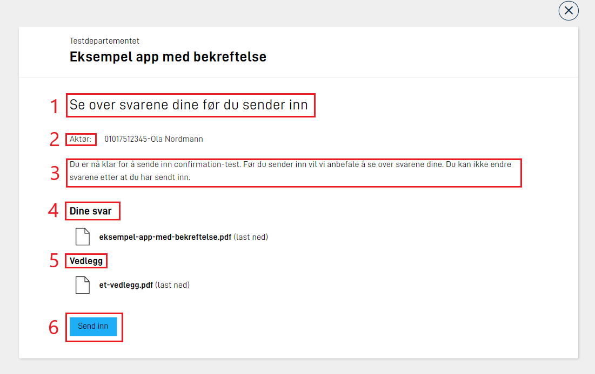
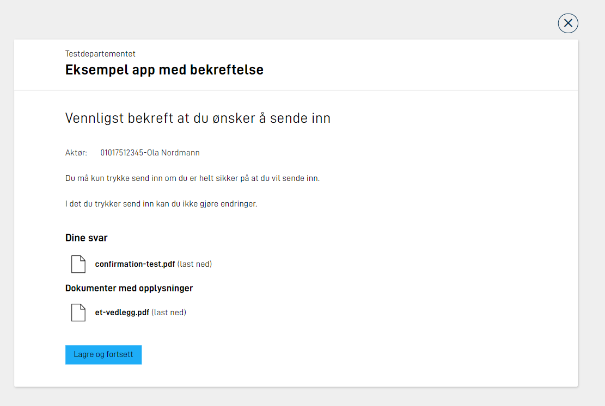
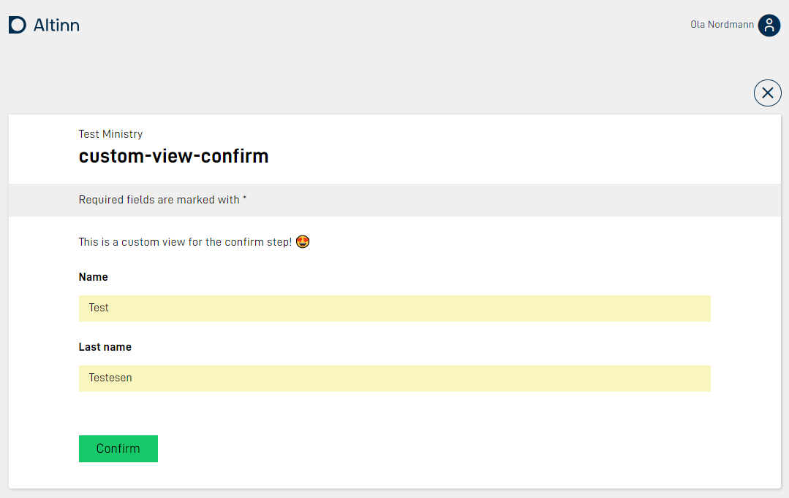
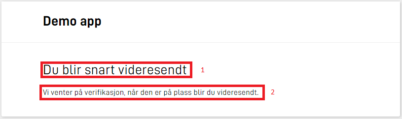

An application wil have a process which the user of the application follows.
Depending of the type of step the user is in, different views are presented.
This page explains the different views and how they can be customized.

## Data 
In this process task a form which the user can fill in data.
The form can be edited using the [UI editor](../../../../getting-started/navigation/designer/ui-editor) or by changing `FormLayout.json` manually.

## Confirmation
In this process task some standard texts are presented and the user can choose to *confirm* to go forward.

These texts can be overridden by manually adding each defined text keys in the apps text resources. More information about how this is done can be found [here](../../../ux/texts).
In the following section we will present an overview of the different texts that can be customized.



### Customize texts

| Text # (see image above)  | Text key            |
| ------------------------- | ------------------- |
| 1                         | confirm.title       |
| 2                         | confirm.sender      |
| 3                         | confirm.body        |
| 4                         | confirm.answers     |
| 5                         | confirm.attachments |
| 6                         | confirm.button_text |

Example of custom texts in the file  `resources.nb.json`:

```json
{
  "id": "confirm.title",
  "value": "Vennligst bekreft at du ønsker å sende inn"
},
{
  "id": "confirm.body",
  "value": "Du må kun trykke send inn om du er helt sikker på at du vil sende inn. <br/><br/>I det du trykker send inn kan du ikke gjøre endringer."
},
{
  "id": "confirm.attachments",
  "value": "Dokumenter med opplysninger"
},
{
  "id": "confirm.button_text",
  "value": "Lagre og fortsett"
}
```

Note that in the example we have used the html-tag `<br/>` to make a line shift.
For links and formatting [use markdown](../../../ux/texts#formatting-of-texts).

This results in the following view:



### Custom form layout

For the confirm task the app developer has the possibility for configuring their own [layout set](../../../ux/pages/layout-sets/) with corresponding form layout definitions and other ui-configuration files which are included in the data step.

This makes the confirmation page custumizable, and can use the components that are supported in Altinn Studio.

Since the confirm step is not meant to be used for writing data, a good practice would be to use static components (header, paragraph) and set other components to `readOnly`.

An example setup of the `layout-sets.json` where `Task_1` is a data step, and `Task_2` a confirmation step:

```json
{
    "sets": [
      {
        "id": "simpel",
        "dataType": "simpel",
        "tasks": [
          "Task_1"
        ]
      },
      {
        "id": "custom-receipt",
        "dataType": "simpel",
        "tasks": [
          "Task_2"
        ]
      }
    ]
  }
```

Notice that the layout-set configuration for `Task_2` references the data model used in `Task_1`.

Example `formLayout.json` file that presents data from the data model used in the `data`-task:

```json
{
  "$schema": "https://altinncdn.no/schemas/json/layout/layout.schema.v1.json",
  "data": {
    "layout": [
      {
        "id": "paragraph",
        "type": "Paragraph",
        "textResourceBindings": {
          "title": "paragraph"
        }
      },
      {
        "id": "name",
        "type": "Input",
        "textResourceBindings": {
          "title": "name.label"
        },
        "dataModelBindings": {
          "simpleBinding": "Felt1"
        },
        "required": true,
        "readOnly": true
      },
      {
        "id": "lastname",
        "type": "Input",
        "textResourceBindings": {
          "title": "lastName.label"
        },
        "dataModelBindings": {
          "simpleBinding": "Felt2"
        },
        "required": true,
        "readOnly": true
      }
    ]
  }
}
```

The app structure would look look this:

```txt
├───App
│   ├───config
│   ├───logic
│   ├───models
|   | ...
│   ├───ui
│   │   ├───custom-receipt
│   │   │   └───layouts
|   |   |   └─── ...
│   │   └───simple
│   │       └───layouts
|   |   |   └─── ...

```

The end result:



For a complete setup of this feature see our [example app.](https://altinn.studio/repos/ttd/custom-view-confirm)

## Feedback
This is a process step where the application owner can validate the filled data to generate a feedback before the data is archived.

In the following section we will present an overview of the different texts that can be customized.



### Customize texts

| Text # (see image above)  | Text key          |
| ------------------------- | ----------------- |
| 1                         | feedback.title    |
| 2                         | feedback.body     |

Example of custom texts in the file  `resources.nb.json`:

```json
{
  "id": "feedback.title",
  "value": "Vent på at tjenesteeier sjekker data"
},
{
  "id": "feedback.body",
  "value": "Når tjenesteier har sjekket at alle data er godkjent vil du bli automatisk sendt videre til siste steg i prosessen."
}
```
