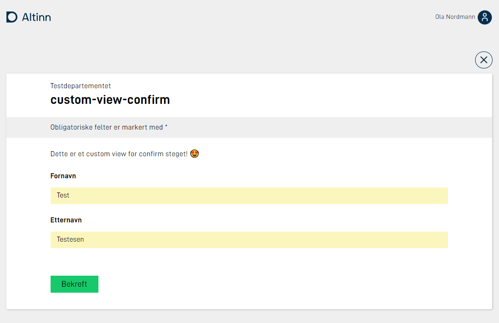

En applikasjon vil ha en prosess som brukeren av applikasjonen vil følge. 
Avhengig av hvilken type steg brukeren er i, vil forskjellige ting vises. 
Denne siden vil forklare hvordan visningen til de forskjellige stegene kan tilpasses.

## Data (tilsvarer utfyllingssteg i Altinn II)
I denne prosess-task-typen vises skjema som kan fylles ut.  
Skjema kan redigeres ved bruk av [UI editoren](../../../../getting-started/navigation/designer/ui-editor) eller ved å endre `FormLayout.json` direkte.

## Bekreftelse (Confirmation)
I denne prosess-task-typen vises noen standard-tekster, og bruker kan velge å *bekrefte* for å gå videre.

Tekstene kan overstyres, ved at man legger inn tekstnøkkel som hører til hver tekst i språkfilene for appen. Info
om hvordan dette gjøres finner du [her](../../../ux/texts). Se under for oversikt over de forskjellige tekstnøklene som kan
overstyres.


### Overstyre tekster

| Tekst nr. (se bilde over) | Tekstnøkkel         |
| ------------------------- | ------------------- |
| 1                         | confirm.title       |
| 2                         | confirm.sender      |
| 3                         | confirm.body        |
| 4                         | confirm.answers     |
| 5                         | confirm.attachments |
| 6                         | confirm.button_text |


Eksempel på overstyrte tekster i filen `resources.nb.json`:

```json
{
  "id": "confirm.title",
  "value": "Vennligst bekreft at du ønsker å sende inn"
},
{
  "id": "confirm.body",
  "value": "Du må kun trykke send inn om du er helt sikker på at du vil sende inn. <br/><br/>I det du trykker send inn kan du ikke gjøre endringer."
},
{
  "id": "confirm.attachments",
  "value": "Dokumenter med opplysninger"
},
{
  "id": "confirm.button_text",
  "value": "Lagre og fortsett"
}
```

Merk at i eksempelet over har vi brukt html-taggen `<br/>` for å lage linjeskift.
For lenke og utheving, [benytt markdown](../../../ux/texts#formatering-av-tekster).

Dette resulterer i følgende visning:


### Custom form layout

For bekreftelsessteget har man som apputvikler muligheten til å definere et eget [layout set](../../../ux/pages/layout-sets/) med tilhørende form layout filer og andre konfigurasjonsfiler som hører til data-steget.

Dette gjør det mulig å helt fritt styre innholdet på bekreftelsessiden, og man kan bruke komponentene man ellers har tilgjengelig i Altinn Studio.

Siden bekreftelsessteget ikke er ment brukt når man skal skrive data, anbefaler vi å bruke statiske komponenter (header, paragraph) og sette komponenter utover dette som `readOnly`.

Eksempel oppsett av `layout-sets.json` hvor `Task_1` er et datasteg, og `Task_2` et bekreftelsesteg.

```json
{
    "sets": [
      {
        "id": "simple",
        "dataType": "simple",
        "tasks": [
          "Task_1"
        ]
      },
      {
        "id": "custom-receipt",
        "dataType": "simple",
        "tasks": [
          "Task_2"
        ]
      }
    ]
  }
```

Legg merke til at konfigurasjonen for settet til `Task_2` referer til data typen til `Task_1`.

Eksempel `formLayout.json` som presenterer data som brukeren fylte ut i data-steget.

```json
{
  "$schema": "https://altinncdn.no/schemas/json/layout/layout.schema.v1.json",
  "data": {
    "layout": [
      {
        "id": "paragraph",
        "type": "Paragraph",
        "textResourceBindings": {
          "title": "paragraph"
        }
      },
      {
        "id": "name",
        "type": "Input",
        "textResourceBindings": {
          "title": "name.label"
        },
        "dataModelBindings": {
          "simpleBinding": "Felt1"
        },
        "required": true,
        "readOnly": true
      },
      {
        "id": "lastname",
        "type": "Input",
        "textResourceBindings": {
          "title": "lastName.label"
        },
        "dataModelBindings": {
          "simpleBinding": "Felt2"
        },
        "required": true,
        "readOnly": true
      }
    ]
  }
}
```

Dette vil gi følgende app-struktur:

```txt
├───App
│   ├───config
│   ├───logic
│   ├───models
|   | ...
│   ├───ui
│   │   ├───custom-receipt
│   │   │   └───layouts
|   |   |   └─── ...
│   │   └───simpel
│   │       └───layouts
|   |   |   └─── ...

```

Sluttresultatet i appen:



For et komplett oppsett av denne muligheten kan du se vår [eksempel applikasjon.](https://altinn.studio/repos/ttd/custom-view-confirm)

## Tilbakemelding (Feedback)
Dette er et prosesssteg hvor applikasjonseier vil sjekke utfylte data for å generere en tilbakemelding før alle data kan arkiveres.

Tekstene på siden kan overstyres ved at man legger inn tekstnøkler som hører til hver tekst i språkfilene for appen. Info om hvordan dette gjøres finner du [her](../../../ux/texts). Se under for oversikt over de forskjellige tekstnøklene som kan overstyres.


### Overstyre tekster

| Tekst nr. (se bilde over) | Tekstnøkkel       |
| ------------------------- | ----------------- |
| 1                         | feedback.title    |
| 2                         | feedback.body     |

Eksempel på overstyrte tekster i filen `resources.nb.json`:

```json
{
  "id": "feedback.title",
  "value": "Vent på at tjenesteeier sjekker data"
},
{
  "id": "feedback.body",
  "value": "Når tjenesteier har sjekket at alle data er godkjent vil du bli automatisk sendt videre til siste steg i prosessen."
}
```
