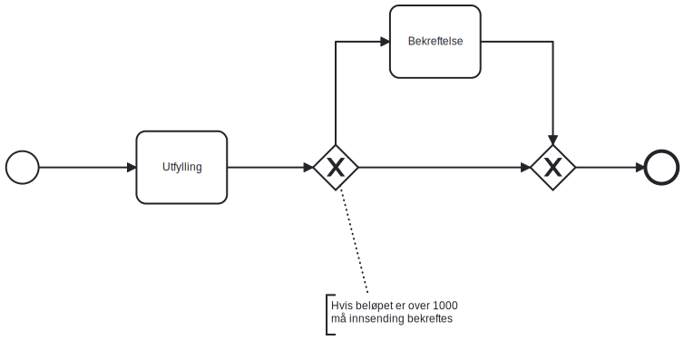

{}
Funksjonaliteten beskrevet på denne siden krever minimum version 7.1.0 av Altinn nugets.
{}

## Forutsetninger

* Applikasjonen din benytter versjon 7.1.0 eller nyere av Altinn nugets
* En applikasjon med exclusive gateway(s) definert i prosessen sin

## Eksempel prosess med exclusive gateways




```xml
<?xml version="1.0" encoding="UTF-8"?>
<bpmn:definitions xmlns:xsi="http://www.w3.org/2001/XMLSchema-instance" xmlns:bpmn="http://www.omg.org/spec/BPMN/20100524/MODEL" xmlns:bpmndi="http://www.omg.org/spec/BPMN/20100524/DI" xmlns:dc="http://www.omg.org/spec/DD/20100524/DC" xmlns:di="http://www.omg.org/spec/DD/20100524/DI" xmlns:altinn="http://altinn.no" id="Altinn_SingleDataTask_Process_Definition" targetNamespace="http://bpmn.io/schema/bpmn" exporter="bpmn-js (https://demo.bpmn.io)" exporterVersion="10.2.0">
  <bpmn:process id="SingleDataTask" isExecutable="false">
    <bpmn:startEvent id="StartEvent_1">
      <bpmn:outgoing>Flow_s_t1</bpmn:outgoing>
    </bpmn:startEvent>
    <bpmn:sequenceFlow id="Flow_s_t1" sourceRef="StartEvent_1" targetRef="Task_1" />
    <bpmn:task id="Task_1" name="Utfylling">
      <bpmn:incoming>Flow_s_t1</bpmn:incoming>
      <bpmn:outgoing>Flow_t1_g1</bpmn:outgoing>
      <bpmn2:extensionElements>
        <altinn:taskExtension>
          <altinn:taskType>data</altinn:taskType>
        </altinn:taskExtension>
      </bpmn2:extensionElements>
    </bpmn:task>
    <bpmn:sequenceFlow id="Flow_t1_g1" sourceRef="Task_1" targetRef="Gateway_1" />
    <bpmn:exclusiveGateway id="Gateway_1">
      <bpmn:incoming>Flow_t1_g1</bpmn:incoming>
      <bpmn:outgoing>Flow_g1_g2</bpmn:outgoing>
      <bpmn:outgoing>Flow_g1_t2</bpmn:outgoing>
    </bpmn:exclusiveGateway>
    <bpmn:sequenceFlow id="Flow_g1_g2" sourceRef="Gateway_1" targetRef="Gateway_2" />
    <bpmn:sequenceFlow id="Flow_g1_t2" sourceRef="Gateway_1" targetRef="Task_2" />
    <bpmn:task id="Task_2" name="Bekreftelse">
      <bpmn:incoming>Flow_g1_t2</bpmn:incoming>
      <bpmn:outgoing>Flow_t2_g2</bpmn:outgoing>
      <bpmn2:extensionElements>
        <altinn:taskExtension>
          <altinn:actions>
              <altinn:action>confirm</altinn:action>
          </altinn:actions>
          <altinn:taskType>confirmation</altinn:taskType>
        </altinn:taskExtension>
      </bpmn2:extensionElements>
    </bpmn:task>
    <bpmn:sequenceFlow id="Flow_t2_g2" sourceRef="Task_2" targetRef="Gateway_2" />
    <bpmn:exclusiveGateway id="Gateway_2">
      <bpmn:incoming>Flow_g1_g2</bpmn:incoming>
      <bpmn:incoming>Flow_t2_g2</bpmn:incoming>
      <bpmn:outgoing>Flow_g2_end</bpmn:outgoing>
    </bpmn:exclusiveGateway>
    <bpmn:sequenceFlow id="Flow_g2_end" sourceRef="Gateway_2" targetRef="EndEvent_1" />
    <bpmn:endEvent id="EndEvent_1">
      <bpmn:incoming>Flow_g2_end</bpmn:incoming>
    </bpmn:endEvent>
  </bpmn:process>
  <!-- BPMN Diagram part is omitted for previty -->
</bpmn:definitions>
```




```xml
<?xml version="1.0" encoding="UTF-8"?>
<bpmn:definitions xmlns:xsi="http://www.w3.org/2001/XMLSchema-instance" xmlns:bpmn="http://www.omg.org/spec/BPMN/20100524/MODEL" xmlns:bpmndi="http://www.omg.org/spec/BPMN/20100524/DI" xmlns:dc="http://www.omg.org/spec/DD/20100524/DC" xmlns:di="http://www.omg.org/spec/DD/20100524/DI" xmlns:altinn="http://altinn.no" id="Altinn_SingleDataTask_Process_Definition" targetNamespace="http://bpmn.io/schema/bpmn" exporter="bpmn-js (https://demo.bpmn.io)" exporterVersion="10.2.0">
  <bpmn:process id="SingleDataTask" isExecutable="false">
    <bpmn:startEvent id="StartEvent_1">
      <bpmn:outgoing>Flow_s_t1</bpmn:outgoing>
    </bpmn:startEvent>
    <bpmn:sequenceFlow id="Flow_s_t1" sourceRef="StartEvent_1" targetRef="Task_1" />
    <bpmn:task id="Task_1" name="Utfylling" altinn:tasktype="data">
      <bpmn:incoming>Flow_s_t1</bpmn:incoming>
      <bpmn:outgoing>Flow_t1_g1</bpmn:outgoing>
    </bpmn:task>
    <bpmn:sequenceFlow id="Flow_t1_g1" sourceRef="Task_1" targetRef="Gateway_1" />
    <bpmn:exclusiveGateway id="Gateway_1">
      <bpmn:incoming>Flow_t1_g1</bpmn:incoming>
      <bpmn:outgoing>Flow_g1_g2</bpmn:outgoing>
      <bpmn:outgoing>Flow_g1_t2</bpmn:outgoing>
    </bpmn:exclusiveGateway>
    <bpmn:sequenceFlow id="Flow_g1_g2" sourceRef="Gateway_1" targetRef="Gateway_2" />
    <bpmn:sequenceFlow id="Flow_g1_t2" sourceRef="Gateway_1" targetRef="Task_2" />
    <bpmn:task id="Task_2" name="Bekreftelse" altinn:tasktype="confirmation">
      <bpmn:incoming>Flow_g1_t2</bpmn:incoming>
      <bpmn:outgoing>Flow_t2_g2</bpmn:outgoing>
    </bpmn:task>
    <bpmn:sequenceFlow id="Flow_t2_g2" sourceRef="Task_2" targetRef="Gateway_2" />
    <bpmn:exclusiveGateway id="Gateway_2">
      <bpmn:incoming>Flow_g1_g2</bpmn:incoming>
      <bpmn:incoming>Flow_t2_g2</bpmn:incoming>
      <bpmn:outgoing>Flow_g2_end</bpmn:outgoing>
    </bpmn:exclusiveGateway>
    <bpmn:sequenceFlow id="Flow_g2_end" sourceRef="Gateway_2" targetRef="EndEvent_1" />
    <bpmn:endEvent id="EndEvent_1">
      <bpmn:incoming>Flow_g2_end</bpmn:incoming>
    </bpmn:endEvent>
  </bpmn:process>
  <!-- BPMN Diagram del er fjernet -->
</bpmn:definitions>
```






Visuell representasjon av bpmn definisjonen over



## Implementer og inject egendefinert gateway kode

For å velge riktig sequenceflow ut av en exclusive gateway basert på instansdataene må applikasjonen inneholde en implementasjon av `Altinn.App.Core.Features.IProcessExclusiveGateway` og registrere det med dependency injection systemet.

Interfacet har en string Property `GatewayId`, og en metode `FilterAsync`

`GatewayId` brukes for å identifisere gatewayen i processen som koden er koblet til.

I eksempelet over vil en implementasjon ha propertien satt til `Gateway_1` siden dette er verdien på attributtet _id_ i gatewayen vi øsnker å skrive logikk for (eneste med to sequenceflows ut av seg).

Metoden FilterAsync er hvor du implementerer din egendefinerte kode som skal filtrere og returnere gyldige sequenceflow(er) ut av gatewayen basert på instanses data.

For mer dokumentasjon av interfacet se xml dokumentasjonen på interfacet [her](https://github.com/Altinn/app-lib-dotnet/blob/main/src/Altinn.App.Core/Features/IProcessExclusiveGateway.cs)

Etter du har skrevet logikken din må den registreres i dependency injection systemet. Dette gjøres i metoden `RegisterCustomAppServices` i filen `Program.cs`

Eksempel: 

```csharp
void RegisterCustomAppServices(
    IServiceCollection services, 
    IConfiguration config, 
    IWebHostEnvironment env)
{
    services.AddTransient<IProcessExclusiveGateway, GatewayOne>();
}
```