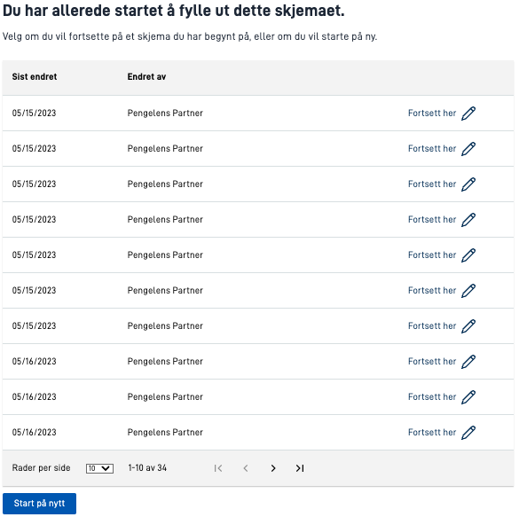

In `applicationmetadata.json` there is an option to configure the user interface when a user navigates to a direct link to the application.
This is done in the field `onEntry.show` where you have the possibility to set the values `new-instance` (default) or `select-instance`.
Standard behaviour if this field is not present is to create a new instance for the user.

## Select from active instances

{}

**Notice:** in order to use this functionality the application must reference version >= 4.15.2 of the nuget packages `Altinn.App.PlatformServices`, `Altinn.App.Common` and `Altinn.App.Api`.

{}

If the field `onEntry.show` is set to `select-instance` the user is presented with a list of active instances for the selected reportree when navigating to the application.

### Example
The following configuration is added to `applicationmetadata.json` to configure select from active instance.

```json {hl_lines=[8,9,10]}
{
  "id": "ttd/demo-app",
  "org": "ttd",
  "title": {
    "nb": "Starte fra aktiv instans"
  },
  ...
  "onEntry": {
    "show": "select-instance"
  }
}
```

For users that do not have any active instances, a new instance will be created,
while users that have active instances will be presented with the following user interface:


## Configure instance selection page

{}  
**Notice:** in order to use this functionality the application must reference version >= 7.12.0 of the nuget packages
`Altinn.App.core` and `Altinn.App.Api`.
{}

Using the field `onEntry.instanceSelection`, you can further customize the instance selection page. The following
options are available:

- `sortDirection`: Choose between `asc` or `desc` to sort the instances ascending or descending. Default is `desc`.
- `rowsPerPageOptions`: Choose which options the user can choose between when deciding how many instances to show per
page. Default is `[10, 25, 50]`.

### Configuration Example

The following configuration is added to `applicationmetadata.json` to configure the instance selection page.

```json {hl_lines=[10,11,12,13]}
{
  "id": "ttd/demo-app",
  "org": "ttd",
  "title": {
    "nb": "Starte fra aktiv instans"
  },
  ...
  "onEntry": {
    "show": "select-instance",
    "instanceSelection": {
      "sortDirection": "asc",
      "rowsPerPageOptions": [10, 25, 50, 100]
    }
  }
}
```


