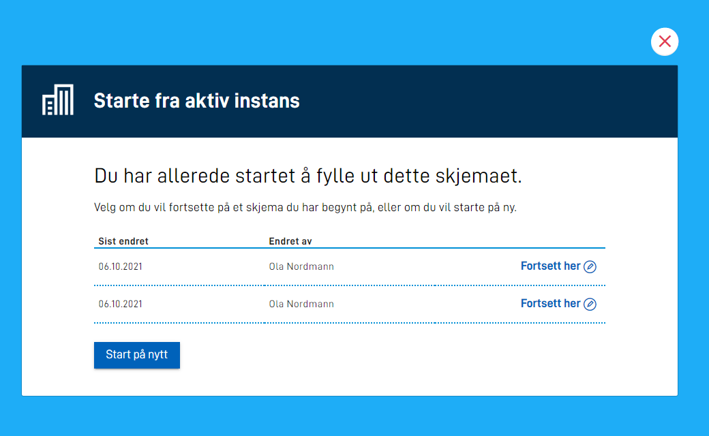

I `applicationmetadata.json` har man mulighet til å styre hva applikasjonen viser i det brukeren går mot en direktelenke.
Dette gjøres under feltet `onEntry.show`, hvor man har mulighet til å sette verdiene `new-instance` (default) eller `select-instance`.
Standard oppførsel om dette feltet ikke er satt er at det lages en ny instans for brukeren som besøker applikasjonen.

## Velge fra aktive instanser

{}

**MERK:** for å benytte denne funksjonaliteten må man ha versjon >= 4.15.2 av nugetpakkene `Altinn.App.PlatformServices`, `Altinn.App.Common` og `Altinn.App.Api`.

{}

Om man setter feltet til `onEntry.show` til `select-instance` vil brukeren bli presentert med en liste av aktive instanser for den valgte avgiver når man navigerer seg til en applikasjon.

### Eksempel
Følgende konfigurasjon legges til i `applicationmetadata.json` for å sette opp valg av aktive instanser.
```json {hl_lines=[8,9,10]}
{
  "id": "ttd/demo-app",
  "org": "ttd",
  "title": {
    "nb": "Starte fra aktiv instans"
  },
  ...
  "onEntry": {
    "show": "select-instance"
  }
}
```

For brukere som ikke har noen aktive instanser vil det automatisk bli opprettet en instans.
Brukere som har aktive instanser vil bli presentert med følgende brukergrensesnitt:


