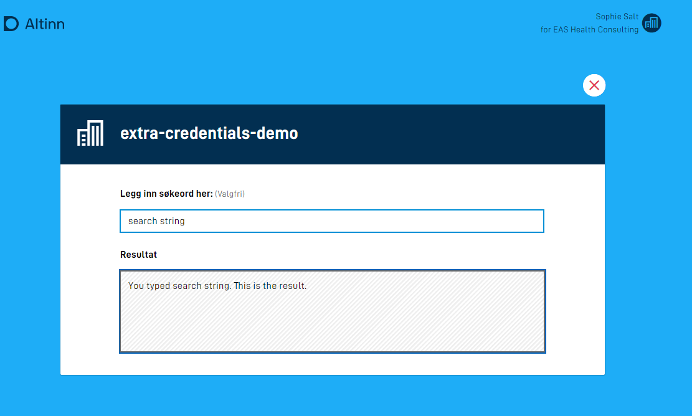

## Introduction to stateless applications

A stateless application differentiates itself from standard applications by not storing any data,
including form data or metadata about instances of the application.
Because of this, a stateless application is a good choice for information transparency services where the end user or a system is doing a lookup against
one or more resources or presents data from a third party based on who the user is. 
It is also possible to configure a stateless application to only allow anonymous users, or users that are not logged on.

## Configuration

{}

This is brand new functionality. Setup has to be completed manually until further notice.

**Notice:** To make use of this functionality, version >= 4.5.2 of the nuget packages `Altinn.App.PlatformServices`, `Altinn.App.Common` and `Altinn.App.Api` is required.

{}

In the application metadata it is possible to control behaviours during startup. Your application can now act like a stateless application if it is enabled.
For an application like this, no data or metadata is stored, and the application will also not end up in the message box of an end user. This is equivalent to a stateless application in Altinn 2.

Configuration of this is done in `applicationmetadata.json`. Example:

```json{hl_lines=[31]}
{
  "id": "ttd/stateless-app-demo",
  "org": "ttd",
  "title": {
    "nb": "Stateless App Demo"
  },
  "dataTypes": [
    {
      "id": "ref-data-as-pdf",
      "allowedContentTypes": [
        "application/pdf"
      ],
      "maxCount": 0,
      "minCount": 0
    },
    {
      "id": "Stateless",
      "allowedContentTypes": [
        "application/xml"
      ],
      "appLogic": {
        "autoCreate": true,
        "classRef": "Altinn.App.Models.StatelessV1"
      },
      "taskId": "Task_1",
      "maxCount": 1,
      "minCount": 1
    }
  ],
  ...
  "onEntry": { "show": "stateless" } // legg til denne linjen
}

```
In the field `onEntry.show` there is the opportunity to reference a layout set which you want to display during startup of the application. Read more about layout-sets [here.](../../ux/ui-editor/multiple-layoutsets/#setup)

The layout sets you refer to here will be used as the display the user is presented before navigating to the application.

The configuration file `layout-sets.json` can be created if it doesn't already exist. It should be located in the folder `App/ui`.
In `layout-sets.json` you add the actual set you are refering to from `applicationmetadata.json`, Example:

```json
{
    "sets": [
      {
        "id": "stateless",
        "dataType": "Stateless"
      }
    ]
  }
```

In the example above the layout-set `stateless` is referring to the datamodel `Stateless`. Example of an app structure for an application which is set up in this way:

```text
├───App
    ├───config
    ├───logic
    ├───models
    │       Stateless.cs
    │       Stateless.metadata.json
    │       Stateless.schema.json
    │       Stateless.xsd
    ├───ui
        │   layout-sets.json
        │
        └───stateless
            |   RuleConfiguration.json
            │   RuleHandler.js
            │   Settings.json
            │
            └───layouts
                  FormLayout.json
```

`FormLayout.json` should then be set up the same way as any normal application, and will support all components which are possible to use in a normal app with the exception of:
- File upload
- Button

App frontend will read the configuration in `applicationmetadata.json` and understand that it isn't supposed to instantiate, and then collect the layout-files and the connected datamodel, and present it to the end user. 

### Configuring access without login

{}
Note! Form components that affect process (Button for submission or instantiation) are not supported for anonymous users!

**Note:** To make use of this functionality you must use version >= 5.1.0 of the nuget packages `Altinn.App.PlatformServices`, `Altinn.App.Common` and `Altinn.App.Api`.

{}

To permit use of an app by a user that is not logged in, you must follow the steps that are described above. You _also_ have to define the data type which is used by the stateless app to allow anonymous use. This is done by modifying the `dataType`-element in `applicationMetadata.json`.
The datatype's `appLogic`-object needs a new setting, `"allowAnonymousOnStateless": true`. See example below:

```json{hl_lines=[24]}
{
  "id": "ttd/stateless-app-demo",
  "org": "ttd",
  "title": {
    "nb": "Stateless App Demo"
  },
  "dataTypes": [
    {
      "id": "ref-data-as-pdf",
      "allowedContentTypes": [
        "application/pdf"
      ],
      "maxCount": 0,
      "minCount": 0
    },
    {
      "id": "Stateless",
      "allowedContentTypes": [
        "application/xml"
      ],
      "appLogic": {
        "autoCreate": true,
        "classRef": "Altinn.App.Models.StatelessV1",
        "allowAnonymousOnStateless": true,
      },
      "taskId": "Task_1",
      "maxCount": 1,
      "minCount": 1
    }
  ],
  ...
  "onEntry": { "show": "stateless" } 
}
```

## Populating data

When using a stateless data type you will be able to populate the data model in when the app front-end requests the form data.

Data will be populated in two steps during the initial call from the front-end (GET):
1. Prefill, read more about this [here.](../../data/prefill/)
2. Data processing, read more about this [here.](../../logic/dataprocessing/)

The following updates to the same form data (POST) will then run prefill one more time, but the calculation is triggered. This allows manipulating the data based on the user's input even in stateless condition.

Example of a calculation which populates the datamodel mentioned in the example above:

```c#
public async Task<bool> ProcessDataRead(Instance instance, Guid? dataId, object data)
{  
    if (instance.GetType() == typeof(StatelessV1))
    {
        StatelessV1 form = (StatelessV1) data;
        // Here you can do what you want, for ex. an API-call
        // if your service is supposed to act as an information transparency service
        form.Fornavn = "Test";
        form.Etternavn = "Testesten";
        return true
    }
    return false;
}
```

## Authorization with third party solutions

Controlling access for stateless applications can be done with [standard app-authorization](../authorisation) 
Where by using Altinn roles you define who has access to the service.
If you require further securing of your service you can implement logic for authorization of users with third party solutions.
This can be an API which is exposed in your organization or an open API from a different provider.

In the example below, an API from the Financial Supervisory Authority of Norway is used to determine if a company that is
represented by a user in Altinn has the necessary licenses to use a service. 




The source code for the example application can be found [here](https://altinn.studio/repos/ttd/extra-credentials-demo). (Requires account in Altinn Studio.) 

Further down this page we will use the designation *user* synonymously with an organization represented by a person in Altinn. 

1. **Expand the data model with fields for authorization**

    In addition to a field for user input and a field to display the result,
    in this example we have a field for holding information about if the user is authenticated 
    and a field for holding a dynamic error message.

    ```xml
    <xs:sequence>
        <xs:element name="searchString" type="xs:string" />
        <xs:element name="result" type="xs:string" />
        <xs:element name="userAuthorized" type="xs:boolean" />
        <xs:element name="errorMessage" type="xs:string" />
    </xs:sequence>
    ```

    *Skip to step 4 if the application will only be used via an API.*
  
2. **Add a field to display error messages in the user interface**
    
    There are three components to the user interface of an application. 
    A search field for user input, a text field dedicated to showing a search result and a paragraph which is reserved for error messages.

    

    The components are connected to a data model and text resource in the following way in `FormLayout.json`

    ```json
    "layout": [
      {
        "id": "sokeBoks",
        "type": "Input",
        "textResourceBindings": {
          "title": "SearchString"
        },
        "dataModelBindings": {
          "simpleBinding": "searchString"
        },
        "required": false,
        "readOnly": false
      },
      {
        "id": "resultatBoks",
        "type": "TextArea",
        "textResourceBindings": {
          "title": "Result"
        },
        "dataModelBindings": {
          "simpleBinding": "result"
        },
        "required": false,
        "readOnly": true
      },
      {
        "id": "errorBoks",
        "type": "Paragraph",
        "textResourceBindings": {
          "title": "ErrorMessage"
        },
        "required": false,
        "readOnly": true
      }
    ]
    ```

3. **Add dynamic rules to show/hide fields**
    
    We use dynamic rules to show/hide fields depending on the users level of authorization 
    
    There has been added a dynamic rule in `RuleHandler.js` which checks if a field in the datamodel has the value `false`.
    Configuration of rules is described closre [here](../../logic/dynamic/#legg-tilrediger-funksjoner-for-beregninger-eller-visskjul).

    In `RuleConfiguration.json` you can see how the rule is utilized.
    If the input value from the data model `userAuthorized` is false, the errorBox-component will be made visible,
    while the opposite happens to the searh and result fields as those are hidden. 
    
    Default behaviour will be the opposite, that search and results are visibile while the error field is hidden.

    ```json
    {
      "data": {
        "ruleConnection": {},
        "conditionalRendering": {
          "e2dd8ff0-f8f1-11eb-b2bc-5b40a942c260": {
            "selectedFunction": "isFalse",
            "inputParams": {
              "value": "userAuthorized"
            },
            "selectedAction": "Show",
            "selectedFields": {
              "e2dd68e0-f8f1-11eb-b2bc-5b40a942c260": "errorBoks"
            }
          },
          "e2dd8ff0-f8f1-11eb-b2bc-5b40a942c261": {
            "selectedFunction": "isFalse",
            "inputParams": {
              "value": "userAuthorized"
            },
            "selectedAction": "Hide",
            "selectedFields": {
              "e2dd68e0-f8f1-11eb-b2bc-5b40a942c261": "sokeBoks",
              "e2dd68e0-f8f1-11eb-b2bc-5b40a942c262": "resultatBoks"
            }
          }
        }
      }
    }
    ```
4. **Add text resources**

   In addition to the name of the service, three text resources have been added.
  
   The text resource for error messages contains a placeholder for the name of the user.
   The variable `errorMessage`will be populated in the datamodel when it is registered
   that the user lacks the authentification to access the service.

    ```json
     {
      "id": "ErrorMessage",
      "value": "{0} mangler rettigheter til å bruke denne tjenesten.",
      "variables": [
        {
          "key": "errorMessage",
          "dataSource": "dataModel.lookup"
        }
      ]
    },
    {
      "id": "Result",
      "value": "Resultat"
    },
    {
      "id": "SearchString",
      "value": "Legg inn søkeord her:"
    },
    ```
5. **Implement authorization logic**

    All data processing for stateless applications is located in the file `App\logic\DataProcessing\DataProcessingHandler.cs`,
    and it is also where the authorization logic should be placed.
    
    Logic for looking up data and authorizing the user is handled in the method `ProcessDataRead`.
    It is called every time a user opens the application or inputs any data.

    ```{cs, attr.source='.numberLines'}
     public async Task<bool> ProcessDataRead(Instance instance, Guid? dataId, object data)
     {
         lookup lookup = (lookup)data;
         
         // Check if user is authorized to use service
         Party party = await _register.GetParty(int.Parse(instance.InstanceOwner.PartyId)); 

         if (string.IsNullOrEmpty(party.OrgNumber) || !await _finanstilsynet.HasReqiuiredLicence(_settings.LicenseCode, party.OrgNumber))
         {
             lookup.userAuthorized = false;
             lookup.errorMessage = $"{party.Name}";
             return true;
         }         
          
         // logic for looking up data
         if (!string.IsNullOrEmpty(lookup.searchString))
         {
             lookup.result = $"You typed \"{lookup.searchString}\". This is the result.";
             return true;
         }

         return false;
     }
    ```

    The method starts with logic for collecting form data for future use in the mehtod.

    ```cs
    lookup lookup = (lookup)data 
    ```
    
    Then comes the logic for checking if the user is authenticated.

    ```cs
    // Check if user is authorized to use service
    Party party = await _register.GetParty(int.Parse(instance.InstanceOwner.PartyId)) 

    if (string.IsNullOrEmpty(party.OrgNumber) || !await _finanstilsynet.HasReqiuiredLicence(_settings.LicenseCode, party.OrgNumber))
    {
        lookup.userAuthorized = false;
        lookup.errorMessage = $"{party.Name}";
        return true;
    }   
    ```

    To know the identity of the user, the identificator `instance.InstanceOwner.PartyId` is used, this is used as an input for the method.
    We use Altinns register to collect the party-object which represents the user. It can contain either an organization or a person. 

    ```cs
    Party party = await _register.GetParty(int.Parse(instance.InstanceOwner.PartyId)) 
    ```

    Two checks are done to decide the authentification of a iser.
    First it is verified that the party object has a defined organization number,
    if this is not the case and the user is not representing an organization he is not authorized.

    The other check calls `_finanstilsynet.HasReqiuiredLicence()`, a method which looks up the norwegian ministry of finance's API to decide if an organization has been given a license. 
    The implementation of that service is available [here][her](https://altinn.studio/repos/ttd/extra-credentials-demo/src/branch/master/App/services/FinanstilsynetService.cs).
    
    If none of the checks are succesfull two fields in the datamodel are populated;
    - an indicator that the user is not authorized
    - an error message, with only the name of the user
  
     And `true` is returned to indicate that the datavalues have been updated. 
    

    ```cs
    lookup.userAuthorized = false;
    lookup.errorMessage = $"{party.Name}";
    return true;
    ```

    Finally the logic to display the results based on the query string.
    
    ```cs
    // logic for looking up data
    if (!string.IsNullOrEmpty(lookup.searchString))
    {
        lookup.result = $"You typed \"{lookup.searchString}\". This is the result.";
        return true;
    }

    return false;
    ```

    `lookup.result` is populated with the value from the lookup, bin this case we just write the query string back to the user.
    Again `true` is returned to indicate that a davavalue has been changed, and `false`if this is not the case.
## Starting an instance from a stateless form

{}

This is brand new functionality. Setup must be completed manually untill further notice and will not be supported in Altinn Studio.

**Note:** To make use of this functionality you must use version >= 4.17.2 of the nuget packages `Altinn.App.PlatformServices`, `Altinn.App.Common` og `Altinn.App.Api`.

{}

In a stateless application you have the opportunity to use the `InstantiationButton` component to start an instance.
Currently we only support starting an instance from within the same application the stateless form is displayed in. Starting an instance in another application is functionality we will add in the future.

There is an example application which is set up like an access service where the end user can choose to start an instance in the actual application. It can be used as inspiration for further development. The application with source code can be found [here](https://altinn.studio/repos/ttd/start-from-stateless)

### Instantiation with prefill

One use case where starting an instance from a stateless view can be that you first want the app to act like an access service where the user is presented some given data. From this information the user can choose to act on the listed data, and then use the service as a normal form submittance service.

To achieve this type of flow you are dependent on setting up your application as a stateless application, described under [configuration](#configuration).
When this has been done, you can expand the stateless view to include `InstantiationButton` which can start a new instance when the user clicks the button.
Standard behaviour for this button is to submit the entire data model that the user has used as a part of the instantiation under the field `prefill`.
If one wishes to pick parts of the data model which are connected in the stateless step it will also be possible to add `mapping`to the `InstantiationButton` component. For example:

```json
 {
    "id": "instantiation-button",
    "type": "InstantiationButton",
    "textResourceBindings": {
      "title": "Start instans"
    },
    "mapping": {
      "some.source.field": "name",
      "some.other.field": "id"
    }
  }
```

When the user then chooses to start an instance the app frontend will gather the fields `some.source.field` and `some.other.field` from the data model in the stateless step and map these fields to `name` and `id` which are sent with the instantiation call for the application.
Example request which will be sent to the backend which can be mapped to the data model used in the submit part of the application:

```json
{
    "prefill": {
        "name": "Ola Nordmann",
        "id": "12345"
    },
    ...
}

```

This prefill value can then be used in the method `DataCreation` in `InstantiationHandler.cs` to map against the fields that are needed as a part of the submittance part of the application during instantiation. Example:

```c#
public async Task DataCreation(Instance instance, object data, Dictionary<string, string> prefill)
  {
      if (data.GetType() == typeof(MessageV1))
      {
          string name = "";
          string id = "";
          if (prefill.ContainsKey("name")) {
              name = prefill["name"];
          }
          if (prefill.ContainsKey("id")) {
              id = prefill["id"];
          }
          MessageV1 skjema = (MessageV1)data;
          skjema.Sender = name;
          skjema.Reference = id;
      }            
      await Task.CompletedTask;
  }
```

#### Intantiating from a repeating group

If in the stateless step wanted the user to, for example, pick an element from a repeating group to continue on the chosen element, you can set up the `InstantiationButton` component as a part of the repeating group.
Here you can then configure the instantiation button to map fields from the given index the user chose to start an instance from. This requires setting up mapping fields with an index on the actual group.
Example:

```json
 {
    "id": "instantiation-button",
    "type": "InstantiationButton",
    "textResourceBindings": {
      "title": "Start ny instans"
    },
    "mapping": {
      "people[{0}].name": "name",
      "people[{0}].age": "age"
    }
  }
```

In the repeating group `{0}` will be replaced with the actual index of the group the user wishes to start from.
