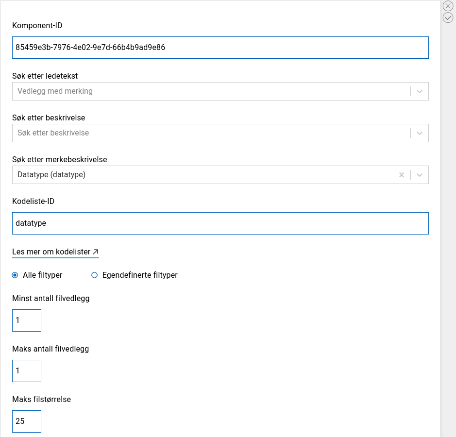
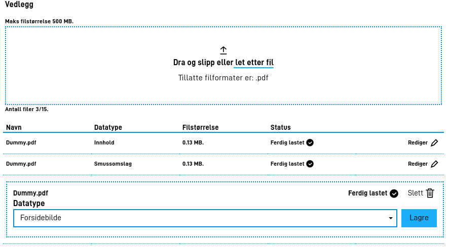

## Methods for uploading file attachments

In an Altinn application there are two options for uploading file attachments:

- File upload component in a form
- API-call to app backend

The former will be a good alternative for all data where it is expected that the user will upload files through the user interface in the app.
The latter is recommended for use if it is only expected that systems will upload the attachment.
There is no limit to how many attachments that can be included in one application
and both upload methods can be used within the same application.

Below is a simple description of how you can accommodate your application to be able to receive attachments.

## Submitting file attachments with file upload component in a form

When building your form in Altinn Studio, a file upload component is available.
It is possible to upload multiple file attachments on one single component, and how many file upload components
you use in your application will be determined by the characteristics of the documents you expect to be uplaoded
and any restrictions you need to impose.
(see [configuration of file attachments](#submission-of-attachments-with-api-call) for more information on this).

Note: It will also be possible to upload file attachments of the type defined in the attachment component through API.


The image above shows the file upload component in Altinn Studio.
Part of the configuration for the uploaded attachments can be set up here.

1. Custom file types can be specified if you want to limit the file types that can be submitted.
In this case, a user will be prevented from uploading if the file type is not in the approved list.
2. The minimum/maximum amount of file attachments can be specified if you want a specific amount of attachments uploaded through the component.
By setting the value of _minst antall filvedlegg_ to '0' it will not be required to upload a file.
3. The maxmimum file size is specified in _MB_.

Additional configurations that can be set for attachments include: allowed contributors and description.
This is conigured in _applicationMetadata.json_ which is placed under App/config in the application repo.

### File upload component with tagging
There is also a separate component where the user tags the file using a dropdown list.
This is configured pretty similarily to the normal file upload component, with the addition of a codelist-ID and the name
you want the tag to have.




Below you can see it in use



## Submission of attachments with API-call

To accommodate being able to submit attachments without this being supported in GUI,
you will need to add a [datatype object](/technology/solutions/altinn-platform/storage/#datatype)
in the _applicationMetadata.json_ (the file is under App/config in the application repo).
It will then only be possible to submit attachments of this type through API-calls.
For a more detailed description of the available fields, see
[configuration of attachments](#configuration-of-attachments)

## Configuration of attachments

In _applicationMetadata.json_ (placed in App/config in the application repo) you will find a property called 'dataTypes'.
Configuration of all data types supported in the application can be found here,
both form data (app model data) and file attachments. The field _appLogic_, that can also be found among some of the objects
in the list, should only be used for form data.

Below there are two examples of `dataTypes`-instances from a deployed application.

```json
 "dataTypes": [
    {
      "id": "53a50f0d-2345-448d-9fba-f18e6bbe71f8",
      "taskId": "Task_1",
      "maxSize": 25,
      "maxCount": 1,
      "minCount": 1,
      "allowedContentTypes":["application/pdf"]
    },
    {
      "id": "attest",
      "taskId": "Task_1",
      "maxSize": 25,
      "maxCount": 1,
      "minCount": 0,
      "allowedContributers": ["org:nav", "orgNo:XXXXXXXXXX"],
      "grouping": "Attester",
    }
  ]
```

- **Id** on the attachment type
This will be set as a GUID if you use an attachment component from Altinn Studio like the one you can find in the first element in the dataTypes list.
If you want to change the value to a more sensible name then you should note that this change
must be done two places: _applicationMetadata.json_ and _FormLayout.json_. (Only relevant if you added a file upload component to the GUI)

- **taskID** denotes which step in the process it is expected that this attachment is uploaded to.
This value must be identical to one of the tasks in _process.bpmn_.

- **maxSize** denotes the maximum allowed size of the attachment.

- **maxCount** denotes the upper limit for how many attachments of this type that are to be uploaded per instance.

- **minCount** denotes the lower limit for how many attachments of this type that are to be uploaded per instance.
              If the value is 0 then it is not required to upload a file attachment of this type.

- **allowedContributors** specifies who is allowed to create and/or modify file attachments of this type.
This is specified on the format `{key}:{value}`.
Allowed keys include: 'org'; three letter abbreviation for organization and *orgNo'; organization number.
It is as of today not possible to specify an organization that is not registered as a service owner.

- **allowedContentTypes** specifies which file attachment types that are allowed.
The most frequently used include: application/pdf, text/xml, image/jpeg. If you do not want to set a limit to the type of attachments, you will not need to define this parameter.
Read more on mime types [here](https://developer.mozilla.org/en-US/docs/Web/HTTP/Basics_of_HTTP/MIME_types/Common_types).

- **grouping** denotes the group that the file attachments should be gropued according to.
This is an optional attribute, where file attachments with the same grouping will be sorted into the same list. Grouping can be both a string (e.g. "Certificates") or a text key if you wish to configure multiple languages (e.g. "form.attachmentgrouping"). Here is an example where the grouping "Demogruppe" is set on an file attachment type:

