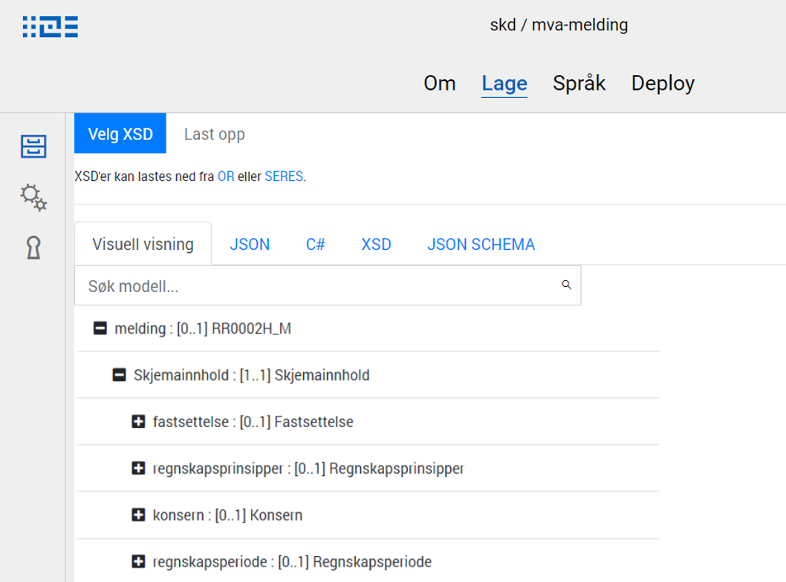

{}
Data modeling functionality is currently under development in Altinn Studio. 
Functionality is limited, but will be continuously added.
{}

To get to the new data model page in Altinn Studio, simply open an app and select _Data model_
from the top menu.

When opening the page, a dialog with some information about the page is shown. You can choose 
to not have this dialog open every time by clicking _Do not show again_. As long as you use the
same computer/browser, the message will not be shown again.

## Upload / show data model
The data model defines which data that can be sent in via an app, and which format it should be on.
In order to upload an existing data model, the model must be defined as an XSD in an external tool.

Each app needs at least one data model.

1. Open the app from the dashboard.
2. Select the _Data model_ meny item
3. Click _Upload data model_ and choose an XSD in the file browser.
4. Click _Open_ in the dialog to upload the XSD

The data model is then parsed, and a C# class and JSON schema are generated from the XSD.
You can see a tree view representation of the data model in the tool once it has been uploaded.

## Create new data model
In addition to uploading a data model, a new model can be created from scratch.

1. Click _Create new data model_
2. Type in the name of the model.
3. Click _Create model_ to create the model.

The new model is created from a template, and has a single example field called `e1`.

## Select data model
Switch between already uploaded/created data models by using the dropdown list of available
models in the top toolbar.

## Edit data model
{}
This functionality is under development and will be limited. Functionality is added
continuously, and new functinality will be documented when it is ready.
{}

To edit a model, select that model from the models dropdown in the top toolbar. Then click _Edit_
on the right hand side of the top toolbar to enable editing and to show the editing panel.

**NB!** Remember to _save_ your model by clicking _Save_ when making changes. There is no auto-save
feature currently for the data modelling tool.

### Redigere navn på felt
1. Klikk på feltet, og se at navnet på feltet vises i høyre-panelet.
2. Endre navn til ønsket verdi
3. Navnet oppdateres.

### Legge til nytt felt
1. Klikk på noden du ønsker å legge til et felt på
2. Klikk på de 3 prikkene til høyre for noden
3. Velg _Legg til felt_ fra menyen
4. Feltet blir lagt til.

### Slette et felt
1. Klikk på noden du ønsker å slette, og/eller
2. Klikk på de 3 prikkene til høyre for noden
3. Velg _Slett felt_ fra menyen
4. Feltet blir slettet.

{}
Data modeling functionality is planned for Altinn Studio. The temporary functionality is therefore very limited.
{}

## Upload / show data model
The data model defines which data can be submitted through an app and the format used when submitting.
As of now, the data model must be defined as an XSD in an external tool - preferably [Seres Domain Client](https://altinn.github.io/docs/seres/brukerveiledninger/domeneklient/).

A data model must be uploaded for each app.

1. Open the app from the dash board
2. Choose the tab Lage
3. In the navigation menu choose Data model 
4. Click _Choose XSD_ and choose the XSD in the file picker
5. Click _Upload_

The data model is then parsed and all necessary files are generated and saved in the app repository.
These files can be viewed by choosing the different tabs on the data model page.

