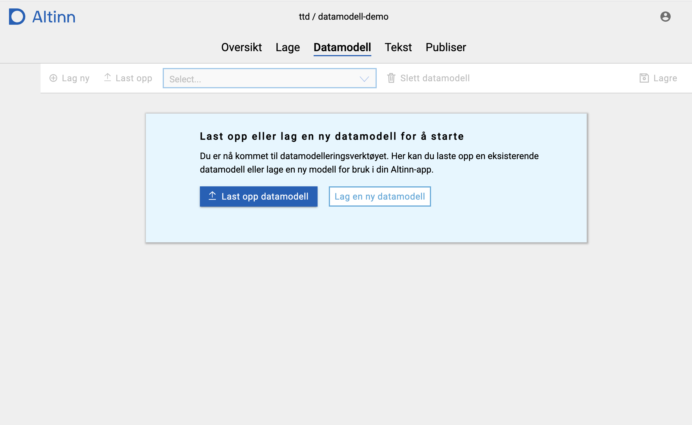

{}
Data modeling functionality is currently under development in Altinn Studio. 
Functionality is limited, but will be continuously added.
{}

To get to the new data model page in Altinn Studio, simply open an app and select _Data model_
from the top menu.

When opening the page, a dialog with some information about the page is shown. You can choose 
to not have this dialog open every time by clicking _Do not show again_. As long as you use the
same computer/browser, the message will not be shown again.

## Upload / show data model
The data model defines which data that can be sent in via an app, and which format it should be on.
In order to upload an existing data model, the model must be defined as an XSD in an external tool.

Each app needs at least one data model.

1. Open the app from the dashboard.
2. Select the _Data model_ meny item
3. Click _Upload data model_ and choose an XSD in the file browser.
4. Click _Open_ in the dialog to upload the XSD

The data model is then parsed, and a C# class and JSON schema are generated from the XSD.
You can see a tree view representation of the data model in the tool once it has been uploaded.

## Create new data model
In addition to uploading a data model, a new model can be created from scratch.

1. Click _Create new data model_
2. Type in the name of the model.
3. Click _Create model_ to create the model.

The new model is created from a template, and has a single example field called `e1`.

## Select data model
Switch between already uploaded/created data models by using the dropdown list of available
models in the top toolbar.

## Edit data model
{}
This functionality is under development and will be limited. Functionality is added
continuously, and new functinality will be documented when it is ready.
{}

To edit a model, select that model from the models dropdown in the top toolbar. Then click _Edit_
on the right hand side of the top toolbar to enable editing and to show the editing panel.

**NB!** Remember to _save_ your model by clicking _Save_ when making changes. There is no auto-save
feature currently for the data modelling tool.

### Edit field name
1. Click on the field, and see that the data for the field is shown in the panel to the right.
2. Change the name as wanted
3. The name is updated in the tree view once you leave the field.

Other properties of the field can be updated in the same way.

### Add a new field
1. Click the node you want to add a field to, and/or
2. Click the `...` on the right end of the node to open the context menu
3. Choose `Add field` from the menu
4. A new field is added
5. Use the right hand panel to edit the properties of the field.

### Delete a field
1. Click the node you want to delete, and/or
2. Click the `...` on the right end of the node to open the context menu
3. Chose `Delete field` from the menu
4. The field is deleted
