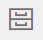

{}
Data modeling functionality is planned for Altinn Studio. The temporary functionality is therefore very limited.
{}

## Upload / show data model
The data model defines which data can be submitted through an app and the format used when submitting.
As of now, the data model must be defined as an XSD in an external tool - preferably [Seres Domain Client](https://altinn.github.io/docs/seres/brukerveiledninger/domeneklient/).

A data model must be uploaded for each app.

1. Open the app from the dash board
2. Choose the tab Lage
3. In the navigation menu choose Data model 
4. Click _Choose XSD_ and choose the XSD in the file picker
5. Click _Upload_

The data model is then parsed and all necessary files are generated and saved in the app repository.
These files can be viewed by choosing the different tabs on the data model page.

