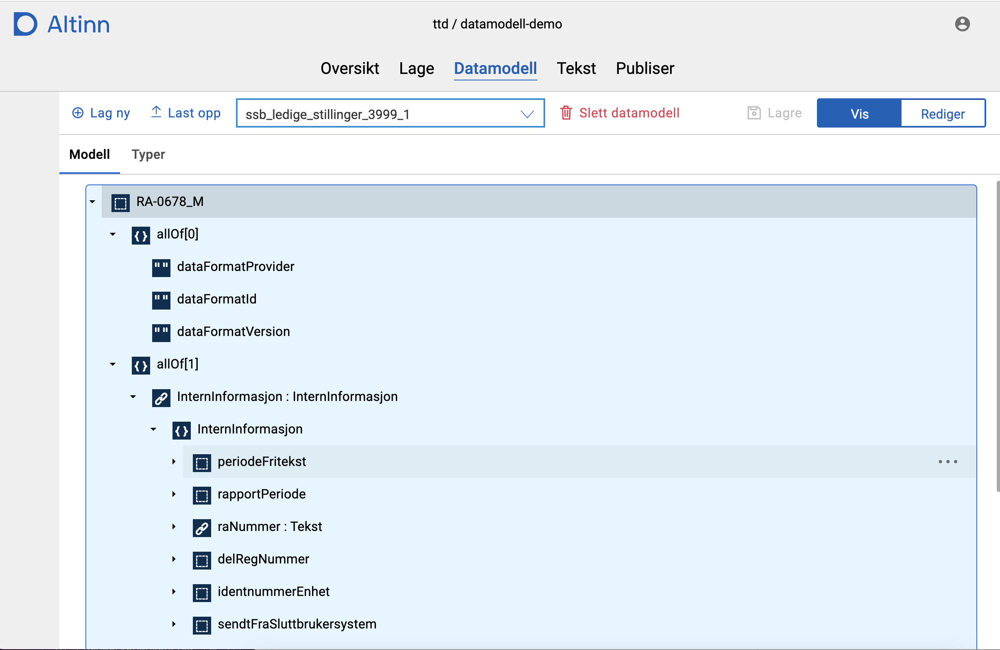
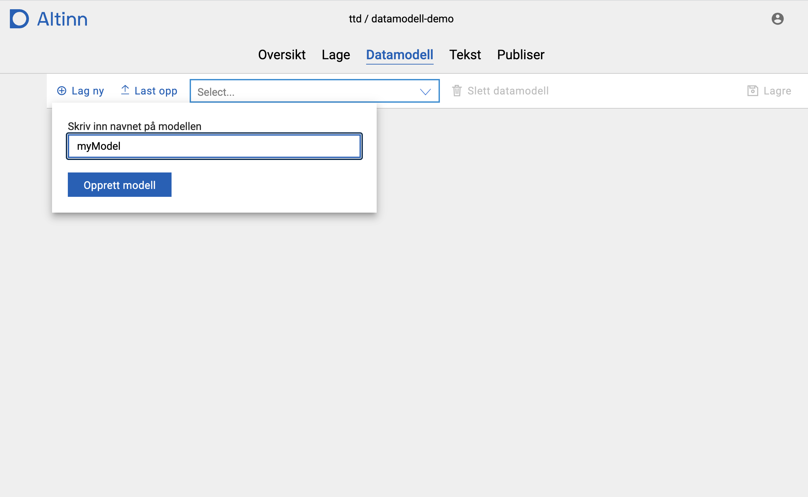
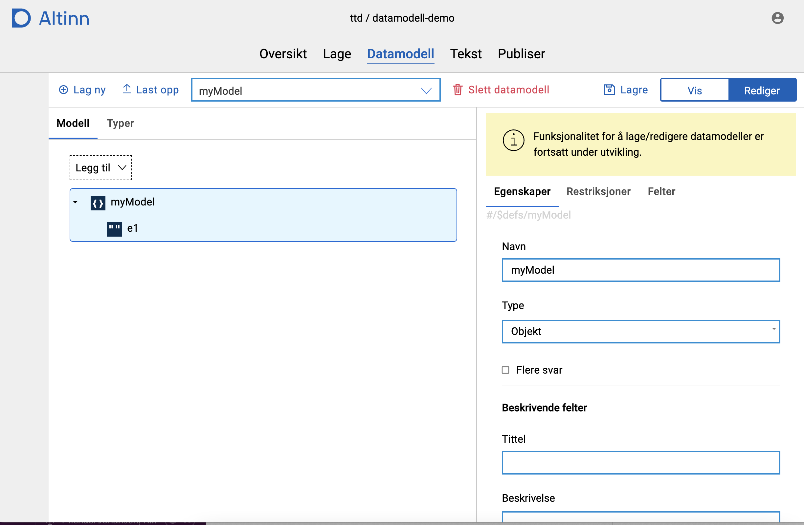

{}
Datamodelleringsfunksjonalitet utvikles nå i Altinn Studio. Funksjonalitet vil være begrenset, men vil 
bygges på fortløpende.
{}

Når man kommer til den nye siden for datamodellering vises en dialog med informasjon om 
den nye siden. 
Om man ikke ønsker å se denne hver gang man går inn på siden kan man velge _Ikke vis igjen_. 
Da vil dialogen skjules så lenge man bruker samme PC og nettleser.

## Laste opp / vise datamodell
Datamodellen definerer hvilke data som kan sendes inn via en app, og hvilket format det skal sendes på.
Per nå må datamodellen være definert som en XSD i et eksternt verktøy - gjerne [Seres Domeneklient](https://altinn.github.io/docs/seres/brukerveiledninger/domeneklient/).

Det må lastes opp en datamodell for hver app.

1. Åpne appen fra dashboardet
2. Velg fanen Datamodell
3. Klikk på _Last opp datamodell_ og velg XSD-en i filvelgeren
4. Klikk _Last opp_

Datamodellen blir da parset, og alle nødvendige filer generert og lagret i app-repositoryet.
Tre-visning av datamodellen kan åpnes for å se en visuell representasjon av datamodellen.

## Lage ny datamodell
Det er mulig å opprette en ny datamodell fra bunnen av:

1. Klikk på _Lag ny datamodell_.
2. Skriv inn navnet på datamodellen i feltet.
3. Klikk på _Opprett modell_.

Datamodellen opprettes med et eksempelfelt som er kalt `e1`. 

## Redigere datamodell
{}
Funksjonalitet for å redigere datamodell er under utvikling. Denne funksjonaliteten vil være begrenset,
men bygges på fortløpende. 
{}

For å redigere en datamodell må modellen være valgt i nedtrekkslisten. I tillegg må man velge _Rediger_
øverst til høyre i modellverktøyet - da vil et panel for å redigere modellen vises på høyre side av 
verktøyet.

**OBS!** Husk på å trykke på _Lagre_ når du har gjort endringer, da det p.t. ikke er autolagring
for datamodelleringsverktøyet.

### Redigere navn på felt
1. Klikk på feltet, og se at navnet på feltet vises i høyre-panelet.
2. Endre navn til ønsket verdi.
3. Navnet oppdateres.

### Legge til nytt felt
1. Hold musepekeren over noden du ønsker å legge til et felt på.
2. Klikk på de tre prikkene til høyre for noden.
3. Velg _Legg til felt_ fra menyen.
4. Feltet blir lagt til.

### Slette et felt
1. Hold musepekeren over noden du ønsker å slette.
2. Klikk på de tre prikkene til høyre for noden.
3. Velg _Slett felt_ fra menyen.
4. Feltet blir slettet.
