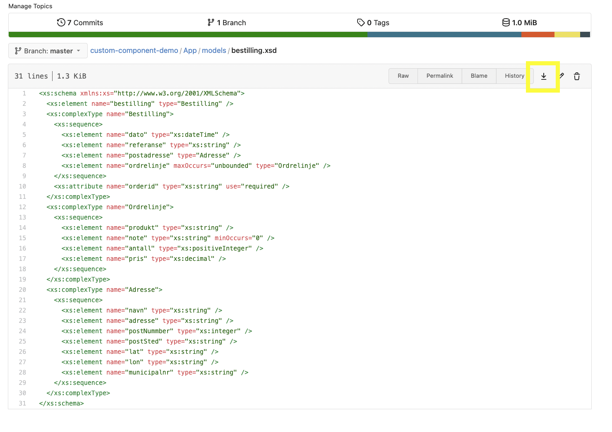

{}
Datamodelleringsfunksjonalitet utvikles nå i Altinn Studio. Funksjonalitet vil være begrenset, men vil 
bygges på fortløpende.
{} 

Altinn Studio Datamodellering er et verktøy for å utvikle datamodeller. Den baserer seg på en datamodell i JSONSchema
format, og kan ut fra dette generere XSD- og C#-modell.

## Navigere til Altinn Studio Datamodellering (ASD)
1. Logg inn i Altinn Studio
2. På førstesiden, velg _rediger_ (blått penn-ikon) på enten:
  a. En app, eller
  b. Datamodellerings repo for din organisasjon
3. Velg **Datamodell** fanen i topp-menyen

Når man kommer til den nye siden for datamodellering vises en dialog med informasjon om 
den nye siden. 
Om man ikke ønsker å se denne hver gang man går inn på siden kan man velge _Ikke vis igjen_. 
Da vil dialogen skjules så lenge man bruker samme PC og nettleser - frem til det ev. kommer endringer vi ønsker å
varsle om.

## Laste opp / vise datamodell
Datamodellen definerer hvilke data som kan sendes inn via en app, og hvilket format det skal sendes på.
Vi støtter pr. nå kun opplasting av XSD datamodell.

1. Klikk på _Last opp datamodell_ - enten fra startsiden om det ikke er noen eksisterende datamodeller, eller fra 
   verktøylinjen øverst i verktøyet og velg XSD-en i filvelgeren
2. Klikk _Last opp_

Datamodellen blir da lastet opp og prosessert, og alle nødvendige filer generert og lagret i app-repositoryet.
Tre-visning av datamodellen kan åpnes for å se en visuell representasjon av datamodellen.

## Velge modell fra nedtrekkslisten
Alle modeller som er lastet opp i verktøyet for en app eller `<org>-datamodels` repo er tilgjengelig i listen.
XSD'er som ligger i repo som ikke har noen tilknyttede modell-filer (JSONSchema) vil også vises i listen, se neste 
avsnitt for mer info.

### Spesielt for datamodellering på organisasjons-nivå
Når man jobber mot et datamodell-repo på organisasjonsnivå (i stedet for direkte mot en app), er det 2 grupper med
datamodeller som vises i nedtrekkslisten. 
- Den første er _JSONSchema_ - dette er modellene der man har hentet inn/lastet
  opp XSD i verktøyet og prosessert denne, og fått generert modell-filene.
- Den andre er _XSD_ - dette er de XSD'ene som ligger i `<org>-datamodels` repo som ikke har blitt hentet inn og
  prosessert i verktøyet. Når man velger en modell fra XSD-listen, vil denne automatisk lastes inn i verktøyet og 
  JSONSchema modell-fil genereres - denne kan så jobbes videre med i ASD.

## Lage ny datamodell
Det er mulig å opprette en ny datamodell fra bunnen av:

1. Klikk på _Lag ny datamodell_.
2. Skriv inn navnet på datamodellen i feltet.
3. Klikk på _Opprett modell_.

Datamodellen opprettes med utgangspunkt:
- En rot-node med referanse til en type
  - Typen får samme navn som navnet man har gitt modellen, og vises som en klikkbar boks på noden.
  - Den inneholder et enkelt tekst-felt `e1`. Dette kan gis nytt navn, type, osv, eller slettes.

For å redigere denne modellen, kan man gå til typen ved å klikke på den, eller ved å velge **Typer**-fanen og klikke
på typen i listen. Her kan man legge til/redigere felter via kontekst-menyen på noden, eller legge til nye typer via 
**Legg til element** øverst. For mer info om redigering av modeller, se [avsnitt om redigering av modeller](#redigere-datamodell).

## Redigere datamodell
{}
Funksjonalitet for å redigere datamodell er under utvikling. Denne funksjonaliteten vil være begrenset,
men bygges på fortløpende. 
{}

For å redigere en datamodell må modellen være valgt i nedtrekkslisten. I tillegg må man velge _Rediger_
øverst til høyre i modellverktøyet - da vil et panel for å redigere modellen vises på høyre side av 
verktøyet. Valget her vil huskes til neste gang man er inne. 

{}
Modellen lagres automatisk mens man jobber med den. For å generere opp modell-filer som XSD (og C#-fil for apper) må man
trykke på _Generer modeller_-knappen øverst til høyre.
{}

Merk at dersom man ønsker å endre en pre-definert _type_, må dette gjøres fra **Typer**-fanen. Dersom man ikke har 
definert noen gjenbrukbar type for et felt eller gruppe, kan det redigeres direkte fra **Modell**-fanen.

### Redigere navn på felt
1. Klikk på feltet, og se at navnet på feltet vises i høyre-panelet.
2. Endre navn til ønsket verdi.
3. Navnet oppdateres.

### Legge til nytt felt
1. Hold musepekeren over noden du ønsker å legge til et felt på.
2. Klikk på de tre prikkene til høyre for noden.
3. Velg _Legg til felt_ fra menyen.
4. Feltet blir lagt til.

### Legge til en referanse til en type
1. Hold musepekeren over noden du ønsker å legge til et felt på.
2. Klikk på de tre prikkene til høyre for noden.
3. Velg _Legg til referanse_ fra menyen.
4. Feltet blir lagt til
5. Velg type i _Refererer til_ feltet i høyre-panelet

### Slette et felt
1. Hold musepekeren over noden du ønsker å slette.
2. Klikk på de tre prikkene til høyre for noden.
3. Velg _Slett felt_ fra menyen.
4. Feltet blir slettet.

### Redigere egenskaper til et felt
1. Klikk på noden/feltet du ønsker å redigere for å få opp egenskaper i høyre-panelet
2. Rediger egenskapene for noden/feltet som ønsket. Tilgjengelige egenskaper for feltet vil variere basert på base-typen
   for feltet.

### Redigere/legge til XSD-attributter, namespaces, osv, inkl `dataFormatId og `dataFormatVersion`.
Foreløpig er ikke dette noe som støttes direkte i verktøyet. Det er allikevel mulig å gjøre dette manuelt. Beskrivelser
for hvordan dette gjores finnes i lenkene under:
- [dataFormatId og dataFormatVersion][1]
- [XSD attributter generelt][2]
- [XSD namespaces][3] 

## Generere modellfiler (XSD og C#)
Når modellen er klar, kan man generere modell-filer ved å klikke på **Generer modeller**-knappen over høyre-panelet.
For `<org>-datamodels`-repo vil det kun genereres XSD, mens for app-repo vil det også genereres C# modell-fil.
Husk å trykke på **Push** til venstre i hovedmenyen til Altinn Studio for å dele _dine_ endringer.

## Laste ned XSD
XSD fil kan så lastes ned ved å gå til repoet - klikk på person-ikonet øverst til høyre på siden, og velg 
"Åpne repository". Naviger til ønsker fil i mappestrukturen, og klikk på nedlastingsikonet.

[1]: ../altinn-2/#dataformatid-og-dataformatversion
[2]: ../altinn-2/#xsd-attributter
[3]: ../altinn-2/#xsd-namespaces

