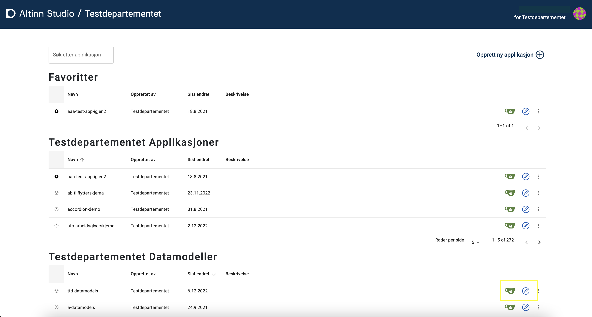

Datamodeller for organisasjoner ligger i Altinn Studio sin [repos][1]-løsning.
For å få tilgang til disse må man logge inn med Altinn Studio bruker. Om det er første gang du bruker Altinn Studio
må du [lage en bruker][2].

Datamodellene ligger i `<org>-datamodels`-repo, hvor `<org>` er den organisasjonen du tilhører. 
F.eks. ligger datamodellene til organisasjonen `Testdepartementet (ttd)` under 
https://altinn.studio/repos/ttd/ttd-datamodels.

Lenke til dette repoet finner man på førstesiden i Altinn Studio. Velg _Rediger_ (blått penn-ikon) for å komme til 
Altinn Studio Datamodellering verktøet. Velg _Gitea_ (grønt kopp-ikon) for å se filene direkte i repo.

## Tilgang til datamodellene

Alle kan se på datamodellene til en organisasjon som standard. For å få tilgang til å redigere datamodellene må brukeren
være del av `Datamodels`-teamet i organisasjonen. Les mer om [tilgangsstyring][3] for mer informasjon.
Ta kontakt med de som styrer tilganger i Altinn Studio i din organisasjon om du mangler tilganger. 

## Laste opp XSD
XSD kan lastes opp direkte i verktøyet [Altinn Studio Datamodellering][4]. Det vil da genereres en `.schema.json` fil
for modellen i tillegg til XSD'en som lastes opp - det er denne filen man jobber med i verktøyet.

Om man kun har behov for å laste opp XSD for lagring, og ikke skal bruke verktøyet for å redigere modellen, man man også 
laste opp XSD-filer direkte til filstrukturen til datamodeller for organisasjonen. Naviger da til ønsket mappe og velg 
"Add file" -> "Upload file". I tekstfeltet som dukker opp øverst kan man skrive inn ev. mappenavn man ønsker å benytte.
Last opp ønsket fil, scroll ned, skriv ev. in en melding om hva slags fil det er, og trykk på "commit changes"
for å bekrefte.

[1]: https://altinn.studio/repos
[2]: /nb/app/getting-started/first-time-setup/
[3]: /nb/app/getting-started/access-management/studio/
[4]: ../data-models-tool/