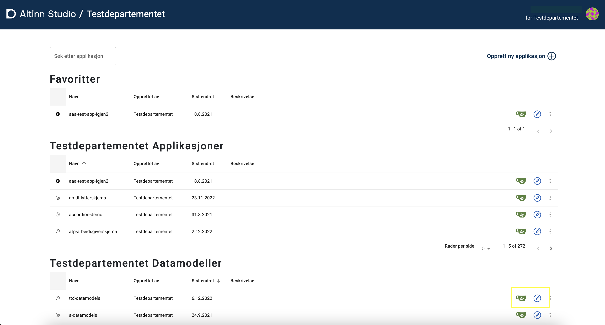
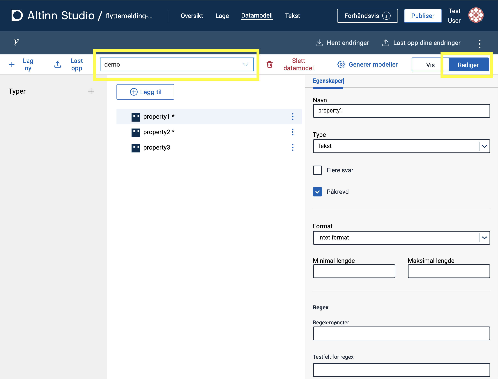
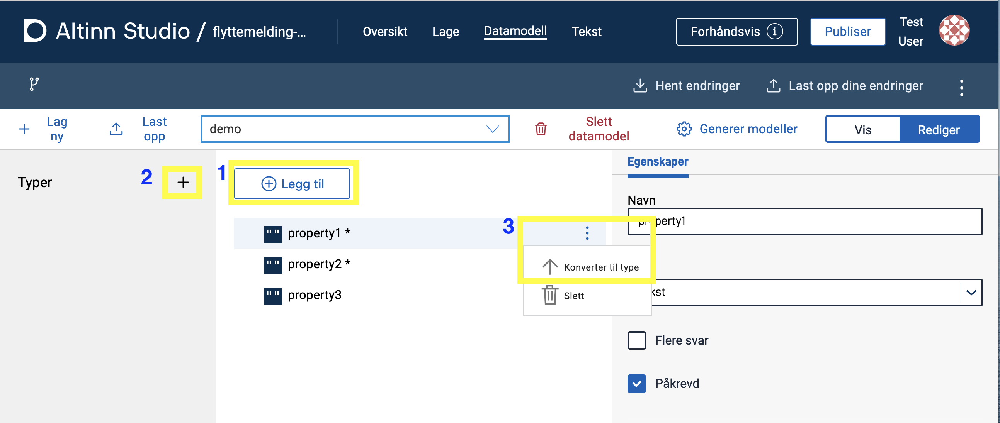
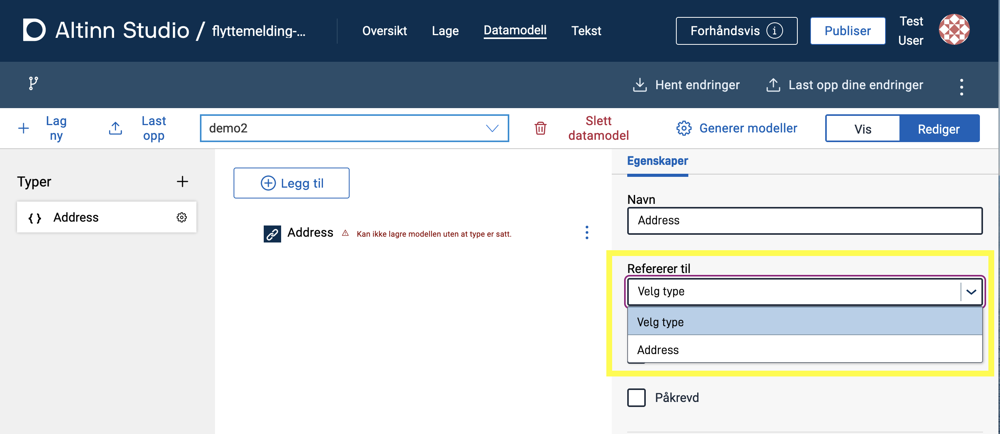
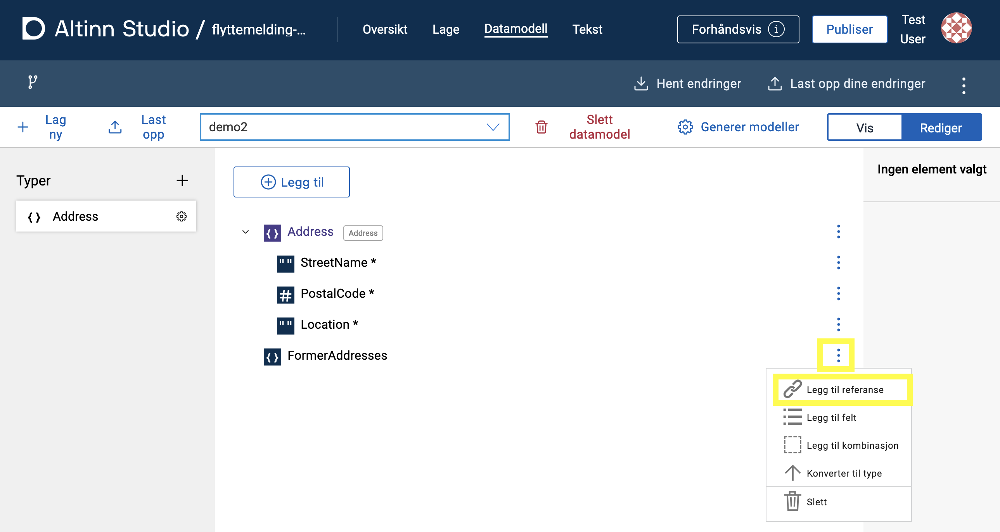

## Data models

### Data Model Files for Applications

Data models for applications are located in the same folder structure as the rest of the application files. These are stored in the [Altinn Studio repository](https://altinn.studio/repos) under `App/models` in the application's file structure.
An application has 4 model files:

* **C# data model** (`<model>.cs`): Data model used by the application's backend/APIs to process and validate data.
* **JSON schema** (`<model>.schema.json`): Data model in JSONschema format used by the application on the client-side (frontend) to validate data in real-time.
This is also the file that is worked on in the data modeling tool.
* **XSD data model** (`<model>.XSD`): Data model in XML format that defines the elements that can be used in a document.
This is not directly used by the application but can be uploaded to generate the other model files in Altinn Studio or downloaded as needed.
* **JSON metadata** (`<model>.metadata.json`): Used by Altinn Studio to generate the `<model>.cs` file.
_In the future, this file will not be stored in the application and will only be generated if needed_.

### Data models for organizations

Data models for organizations are located in Altinn Studio's [repos][1].
 To access these, log in with am Altinn Studio user.
  If this is your first time using Altinn Studio, you need to [create a user][2].

The data models are located in the `<org>-datamodels` repository, where `<org>` is the organization you belong to. 
For example, the data models for the organization 'Test Department (ttd)' are located under 
https://altinn.studio/repos/ttd/ttd-datamodels.

You can find the link to this repository in the [Altinn Studio Dashboard](/app/getting-started/navigation/dashboard): https://altinn.studio/dashboard.
 Select _Edit_ (blue pen icon) to access the Altinn Studio [Data Modeling](#altinn-studio-data-modeling) tool.
 Select _Gitea_ (green cup icon) to view the files directly in the repository.

 

#### Access to Data Models

By default, anyone can view an organization's data models.
 To gain access to edit the data models, the user needs to be part of the _Datamodels_ team in the organization.
  Refer to the [access management][3] for more information.

#### Uploading XSD to Repository
XSD files can be directly uploaded to the tool [Altinn Studio Datamodellering](#altinn-studio-data-modeling) and are described under [Upload and Display Data Model](#upload-and-display-data-model).

If you only need to upload XSD files for storage and do not intend to use the tool to edit the model, you can upload XSD files directly to the `<org>-datamodels` repo.
 To do this, navigate to the desired folder and select "Add file" -> "Upload file." In the text field that appears at the top, you can enter the folder name you wish to use (optional).
 Upload the desired file, scroll down, optionally provide a message indicating the file type, and click "commit changes" to confirm.

[1]: https://altinn.studio/repos
[2]: /app/getting-started/create-user/
[3]: /app/guides/access-management/studio/

## Altinn Studio Data Modeling

{}
The Data Modeling tool in Altinn Studio is under development and will have limited functionality until it is completed.
{}

Altinn Studio Data Modeling is a tool for developing [data models](#data-models).
 It is based on a data model in JSONSchema format from which it can generate XSD and C# models (see [Data Model Files for Applications](#data-model-files-for-applications)).

{}
* [Known issues and shortcomings for Altinn Studio Datamodellering](https://github.com/orgs/Altinn/projects/1/views/10)
* [Planned new functionality for Altinn Studio Datamodellering](https://github.com/orgs/Altinn/projects/1/views/6)
* [Development of data model for Altinn 2](/app/development/data/data-model/altinn-2/)
* [Migrating from Seres to Altinn Studio Datamodellering](/app/development/data/data-model/seres-migration/)
{}

### Navigating to Altinn Studio Data Modeling

1. Log in to Altinn Studio. If you are not in the [Altinn Studio Dashboard](/app/getting-started/navigation/dashboard/), navigate there by clicking on the logo in the top left corner or [here](https://altinn.studio/dashboard).
2. Select _Edit_ (blue pen icon) either for:  
   a. An app under "Mine applikasjoner" (My Applications) or  
   b. Data Modeling repository for your organization.
3. Select the **Datamodell** (Data model) tab in the top menu.

## Upload and Display Data Model

The data model defines the data that can be submitted through an app and the allowed format of the data.
Currently, we only support uploading XSD data models.
When uploading an XSD model `<model>.xsd`, the tool will generate the following files: `<model>.cs`, `<model>.schema.json`, and `<model>.metadata.json` (see [Data Model Files](#data-model-files)).

1. Click _Last opp datamodell_ (_Upload Data Model_) from the homepage if there are no existing data models or _Last opp_ (_Upload_) from the
   toolbar at the top of the tool.
2. Select an XSD data model file in the file picker and click _Last opp_.

After the data model is processed, you can find the generated files under `App/models/` in the app repository.

The types defined in the data model are displayed in the left-side panel.
A tree view of the data model can be opened to see a visual representation of the data model and the available fields.

## Selecting a Model from the Dropdown List

All models uploaded in the tool for an app or the organization's repository (`<org>-datamodels`) are available from the drop-down list in the toolbar.
XSDs that exist in a repository but do not have any associated model files (JSONSchema) will also appear in the list. See the next
section for more information.s

### Specific to Organization-Level Data Modeling

When working with a data model repository at the organization level (instead of directly with an app), there are two groups of
data models displayed in the dropdown list.

- The first one is _JSONSchema_. These are models generated after the processing of uploaded XSD models.
- The second one is _XSD_. These are the XSDs that exist in the `<org>-datamodels` repository but have not been imported and
  processed in the tool. When selecting a model from the XSD list, it will automatically be imported into the tool, and
  a JSONSchema model file will be generated. This can then be further worked on in Altinn Studio Designer.

## Create a New Data Model

To create a new data model from scratch:

   1. Click _Lag ny_ (_Create new_) on the left-side of the toolbar.
   2. Enter the name of the data model in the field.
   3. Click _Opprett modell_ (_Create model_).

The data model will be created with some example fields that you can work with or delete:

  - `property1` (text, required)
  - `property2` (text, required)
  - `property3` (text)

## Editing a Data Model

{}
Functionality for editing the data model with the Altinn Studio Data Model tool is under development and will be somewhat limited until it is completed.
{}

Select a model from the dropdown list on the toolbar and click _Rediger_ (_edit_)
 in the top right corner of the model tool. A panel for editing the model will appear on the right side.

{}
The JSONschema model is automatically saved as you work on it. To generate other model files such as XSD (and C# file for apps), you need to
click _Generer modeller_ (_Generate Models_) on the toolbar (see [Generating Model Files](#generating-model-files-xsd-and-c)).
{}

### Add New Field

To add a field at the top-level (root node), click "Legg til" (**1** in below image).

You can add sub-fields to fields of the Object type via the context menu of the field (three dots to the right of the field name) or by clicking the field and select the tab _Felter_ (_Fields_) in the right-side panel.

### Adding a New Type

Click on the **+** sign in the "Typer" panel on the left side (**2** in below image).

### Converting Field to Type

A field can be converted to a type by clicking the three dots to the right of the field and selecting "Konverter til type" (**3** in below image).

### Editing a Type

1. Select the type from the panel on the left side. A tree view for the type will appear in the center.
2. Properties for the type can be edited in the right-side panel.
3. Add new fields by clicking the _Legg til_ (add) button at the top.
4. Select individual fields to edit their properties in the right-side panel.
5. Exit the type editing mode by clicking the **x** at the top of the model panel (next to `Du redigerer nå på <type>`).

### Deleting a Type

1. Select the desired type from the panel on the left side.
2. Click the context menu (three dots) on the top field (root node) of the type and select "Delete".

Note that it is not possible to delete types that are in use.

### Type References

A type reference is a field that follows the structure of a custom type.
 For instance, if you have the type 'Address' with fields 'StreetName', 'PostalCode', and 'Location', adding a reference to that type will automatically add these fields.
  The type is displayed next to the field name in the tree view.

 

### Adding a Type Reference

 1. Click _Legg til_ (add) at the top of the tree view and choose _Legg til referanse_ (add reference).
 
 2. In the right-hand panel, select the type you wish to reference from the drop-down list "Refererer til" (refers to).
 

You can also add a type reference as a sub field: Click the three dots next to a field and select _Legg til referanse_.

{}
**NOTE**  
To add a reference as a sub field, the parent field must be of type _Object_.
{}

 

### Deleting a Field

Click on the three dots to the right of the node/field and select _Slett_ (delete) from the menu.

### Editing Properties of a Field

1. Click on the node/field you want to edit to display the properties in the right-side panel.
2. Edit the properties of the node/field as desired. The available properties for the field will vary based on the base type
   of the field.

### Editing/Adding XSD attributes, namespaces, etc., including `dataFormatId` and `dataFormatVersion`.

This is currently not directly supported in the tool and must be done manually. Descriptions
on how to do this can be found in the links below:

- [dataFormatId og dataFormatVersion][1]
- [XSD attributter generelt][2]
- [XSD namespaces][3]

## Generating Model Files (XSD and C#)

Once the model is ready, you can generate model files by clicking on the **Generate Models** button above the right panel.
For the `<org>-datamodels` repository, a XSD file will be generated. For the app repository, both a XSD and C# model files will be generated.
Remember to click **Last opp dine endringer** (Upload your changes) on the right side of the main menu in Altinn Studio to save your changes.

## Downloading XSD

A generated XSD file can be downloaded by accessing the repository: click on the person icon in the top right corner of the page and select
"Open repository." Navigate to the desired file in `App/models/` and click on the download icon.

[1]: /app/development/data/data-model/altinn-2/#dataformatid-og-dataformatversion
[2]: /app/development/data/data-model/altinn-2/#xsd-attributter
[3]: /app/development/data/data-model/altinn-2/#xsd-namespaces
