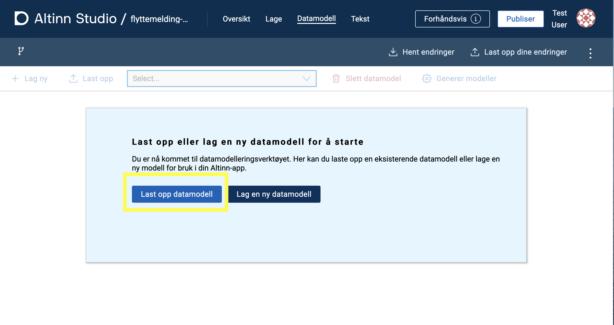
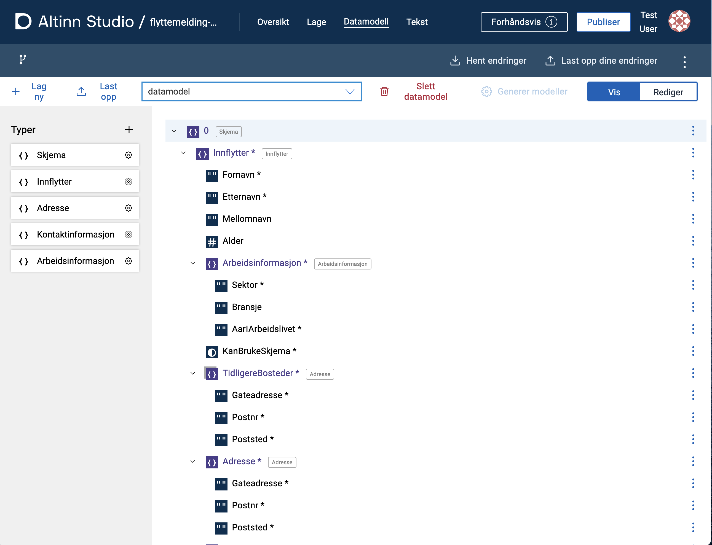
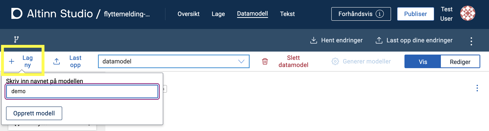
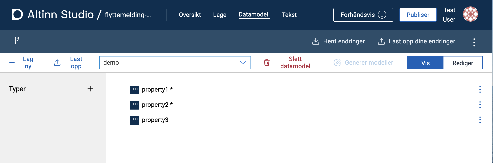
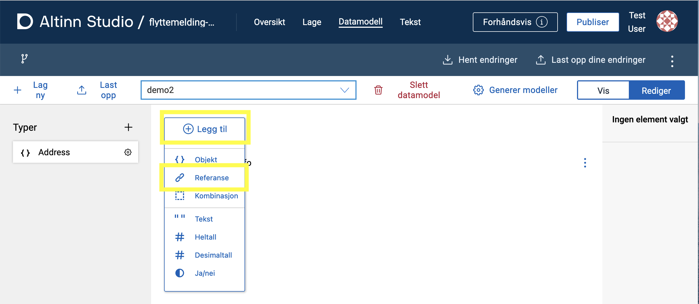

## Datamodeller for applikasjoner

Datamodeller for applikasjoner ligger i samme mappestruktur som resten av applikasjonsfilene. Disse ligger lagret i 
[Altinn Studio repository](https://altinn.studio/repos) under `App/models` i filstrukturen til appen.
En applikasjon har 4 modellfiler:

* **C# datamodell** (`<model>.cs`) : Datamodell som benyttes av applikasjonens backend/API'er for å behandle og validere data.
* **JSON schema** (`<model>.schema.json`) : Datamodell i JSONschema-format som brukes av applikasjonen på klientsiden (frontend) for å validere data fortløpende.
Det er også denne filen man jobber med i datamodelleringsverktøyet.
* **XSD datamodell** (`<model>.XSD`) : Datamodell i _XML_-format som definerer hvilke elementer som kan brukes i et dokument.
Denne brukes ikke direkte av applikasjonen, men kan lastes opp for å generere de andre modellfilene i Altinn Studioe eller lastes ned ved behov til f.eks. mottakssystemer.
* **JSON metadata** (`<model>.metadata.json`) : Brukes av Altinn Studio for å genererere `<model>.cs`-filen.
 _På sikt vil vi slutte å lagre denne filen i appen og kun generere den ved behov_.

## Altinn Studio Datamodellering

{}
Verktøyet Datamodellering i Altinn Studio er under utvikling og vil ha noe begrenset funksjonalitet før det er ferdigstilt.
{}

Altinn Studio Datamodellering er et verktøy for å utvikle datamodeller. Den baserer seg på en datamodell i JSONSchema
format og kan ut fra dette generere XSD- og C#-modeller.

## Navigere til Altinn Studio Datamodellering

1. Logg inn i Altinn Studio. Hvis du ikke befinner deg i [Altinn Studio Dashboard](/nb/app/getting-started/navigation/dashboard/), naviger dit ved å klikke på logoen øverst i venstre hjørne eller [her](https://altinn.studio/dashboard).
2. Velg _rediger_ (blått penn-ikon) ved enten:  
   a. En app under "Mine applikasjoner", eller  
   b. Datamodellerings repo for din organisasjon.
3. Velg fanen **Datamodell** i topp-menyen.

## Laste opp og vise datamodell

Datamodellen definerer hvilke data som kan sendes inn via en app, og hvilket format det skal sendes på.
Vi støtter pr. nå kun opplasting av XSD datamodell.
 Ved opplasting av XSD-modell `<model>.xsd` vil verktøyet generere følgende filer: `<model>.cs`, `<model>.schema.json` og `<model>.metadata.json` (se [datamodell-filer](#datamodell-filer)).

1. Klikk på _Last opp datamodell_ fra startsiden om det ikke er noen eksisterende datamodeller eller _Last opp_ fra
   verktøylinjen øverst i verktøyet.
2. Velg en XSD datamodell-fil i filvelgeren og klikk _Last opp_.

Etter at datamodellen er prosessert kan du finne de genererte filene under `App/models/` i app-repositoryet.

Typer som er definert i datamodellen vises i panelet på venstre side.
Tre-visning av datamodellen kan åpnes for å se en visuell representasjon av datamodellen og feltene som er tilgjengelige.

## Velge modell fra nedtrekkslisten

Alle modeller som er lastet opp i verktøyet for en app eller organisasjonens repo (`<org>-datamodels`) er tilgjengelig i listen.
XSD'er som ligger i repo som ikke har noen tilknyttede modell-filer (JSONSchema) vil også vises i listen. Se neste
avsnitt for mer info.

### Spesielt for datamodellering på organisasjonsnivå

Når man jobber mot et datamodell-repo på organisasjonsnivå (i stedet for direkte mot en app), er det to grupper med
datamodeller som vises i nedtrekkslisten.

- Den første er _JSONSchema_. Dette er modeller som er generert etter prosessering av opplastede XSD-modeller.
- Den andre er _XSD_. Dette er de XSD'ene som ligger i `<org>-datamodels` repo som ikke har blitt hentet inn og
  prosessert i verktøyet. Når man velger en modell fra XSD-listen, vil denne automatisk lastes inn i verktøyet og
  JSONSchema modell-fil genereres. Denne kan så jobbes videre med i Altinn Studio Designer.

## Lage ny datamodell

For å opprette en ny datamodell fra bunnen av:

1. Klikk på _Lag ny_ til venstre på verktøylinjen.
2. Skriv inn navnet på datamodellen i feltet.
3. Klikk på _Opprett modell_.

Datamodellen opprettes med noen eksempel-felter som man kan jobbe videre med eller slette:

- `property1` (tekst, påkrevd)
- `property2` (tekst, påkrevd)
- `property3` (tekst)

## Redigere datamodell

{}
Funksjonalitet for å redigere datamodell er under utvikling og vil være noe begrenset frem til den er ferdig.
{}

Velg modell i nedtrekkslisten på verktøylinjen og klikk _Rediger_
øverst til høyre i modellverktøyet. Et panel for å redigere modellen vises på høyre side av
verktøyet.

{}
JSONschema-modellen lagres automatisk mens man jobber med den. For å generere andre modell-filer som XSD (og C#-fil for apper) må man
trykke på knappen _Generer modeller_ øverst til høyre (se [Generere Modellfiler](#generere-modellfiler-xsd-og-c)).
{}

### Legge til nytt felt

For å legge til felt på øverste nivå (rot-node), klikk "Legg til" (**1** i bildet under).

Du kan legge til underfelt på felter av type Objekt via kontekstmenyen til feltet (tre prikker til høyre for feltnavnet) eller ved å klike på feltet og velge fanen _Felter_ i panelet til høyre.

### Legge til en ny type

Klikk på **+**-tegnet i "Typer"-panelet på venstre side (**2** i bildet under).

### Konvertere felt til type

Et felt kan konverteres til en type ved å klikke de tre prikkene til høyre for feltet og velge "Konverter til type" (**3** i bildet under).

### Redigere en type

1. Klikk på typen du ønsker å redigere. En tre-visning for typen vises i midten.
2. Egenskaper for typen kan redigeres i panelet til høyre.
3. Klikk "Legg til" øverst for å legge til felter på typen.
4. Ved å velge felter fra typen kan man redigere egenskaper for disse i høyre-panelet.
5. Lukk redigering av typer ved å trykke på **x** øverst i modell-panelet (ved siden av `Du redigerer nå på <type>`).

### Slette en type

1. Velg ønsket type fra panelet på venstre side.
2. Klikk kontekst-menyen (tre prikker) til det øverste feltet (rot-noden) på typen og velg "Slett".

Merk at det ikke er mulig å slette typer som er i bruk.

### Typereferanser

En typereferanse er et felt som følger strukturen til en egendefinert type.
For eksempel, hvis du har typen 'Adresse' med feltene 'Gateadresse', 'Postnummer' og 'Sted', vil en referanse til denne typen automatisk legge til disse feltene.
Typen vises ved siden av feltnavnet i trevisningen.

### Legge til en typereferanse

1. Klikk _Legg til_ øverst i trevisningen og velg _Legg til referanse_.

1. Klikk på referansen du opprettet og velg typen du ønsker å referere til fra nedtrekkslisten under "Refererer til" i det høyre panelet.

Du kan også legge til en referanse som en underordnet felt: Klikk de tre prikkene ved siden av et feltet og velg _Legg til referanse_.

{}
**MERK**  
For å legge til elementer under et felt (node) må feltet være av typen _Objekt_.
{}

### Slette et felt

Klikk på de tre prikkene til høyre for noden/feltet og velg _Slett_ fra menyen.

### Redigere egenskaper til et felt

1. Klikk på noden/feltet du ønsker å redigere for å få opp egenskaper i høyre-panelet
2. Rediger egenskapene for noden/feltet som ønsket. Tilgjengelige egenskaper for feltet vil variere basert på base-typen
   for feltet.

### Redigere/legge til XSD-attributter, namespaces, osv, inkl `dataFormatId og `dataFormatVersion`.

Dette er foreløpig ikke noe som støttes direkte i verktøyet og må gjøres manuelt. Beskrivelser
for hvordan dette gjores finnes i lenkene under:

- [dataFormatId og dataFormatVersion][1]
- [XSD attributter generelt][2]
- [XSD namespaces][3]

## Generere modellfiler (XSD og C#)

Når modellen er klar kan man generere modell-filer ved å klikke på knappen **Generer modeller** over det høyre panelet.
For `<org>-datamodels`-repo vil det kun genereres XSD, mens for app-repo vil det også genereres C# modell-fil.
Husk å trykke på **Last opp dine endringer** til høyre i hovedmenyen til Altinn Studio for å lagre endringene dine.

## Laste ned XSD

En generert XSD fil kan lastes ned ved å gå til repoet: klikk på person-ikonet øverst til høyre på siden og velg
"Åpne repository". Naviger til ønsket fil i `App/models/` og klikk på nedlastingsikonet.

[1]: ../altinn-2/#dataformatid-og-dataformatversion
[2]: ../altinn-2/#xsd-attributter
[3]: ../altinn-2/#xsd-namespaces
