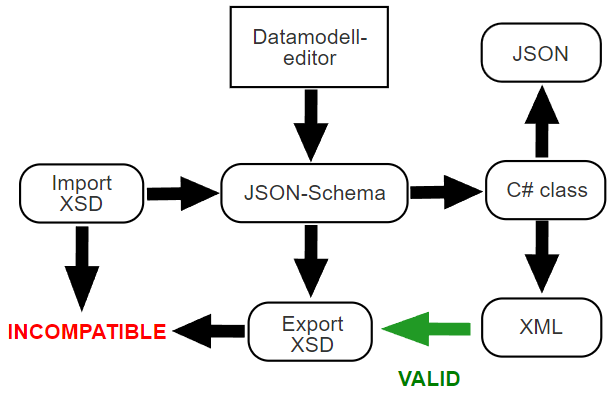

## Explanation

Altinn studio and the default apps created with Altinn studio primarily work with JSON schemas. When an XSD is uploaded in Altinn studio it is converted to a JSON schema. An app developer can then continue to work on the JSON schema in the datamodel editor in Altinn studio. 

The JSON schema will contain some XSD related information so that it is possible to generate a new XSD based on the JSON schema. The most notable piece of information is the original target namespace. The original XSD is discarded. Altinn studio will not be able to recreate the original XSD even if the JSON schema remains unedited.

The C# class being generated based on the JSON schema will use XmlSerializer related attributes so that it is possible for the app to generate an XML representation of the model. The XML will not be compatible with the original XSD, but it can be validated against an XSD downloaded from Altinn studio. This XSD will be generated when requested based on the current JSON schema.



## XSD features lost in convertion

During the convertion from XSD to JSON schema some information will be lost.

### Attributes

Attributes are converted to elements.

Original XSD
```xml
<xs:element name="product">
  <xs:complexType>
    <xs:element name="prodname" type="xs:string"/>
    <xs:attribute name="prodid" type="xs:positiveInteger"/>
  </xs:complexType>
</xs:element>
```

JSON schema snippet
```json
{
  "product": {
    "properties": {
      "prodname": {
        "type": "string"
      },
      "prodid": {
        "type": "integer"
      }
    }
  }
}
```
Exported XSD:
```xml
<xs:element name="product">
  <xs:complexType>
    <xs:element name="prodname" type="xs:string"/>
    <xs:element name="prodid" type="xs:positiveInteger"/>
  </xs:complexType>
</xs:element>
```


## Limited XSD feature space support

There are limitations to what Altinn 3 can support from the XSD definition from W3C. This is primarily because the XSD schema is converted to a JSON schema which in turn is used to generate a C# class.

TODO: List unsupported XSD snippets. 