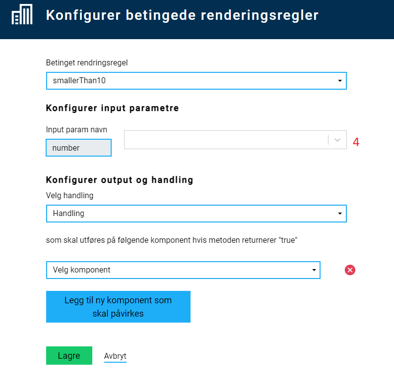
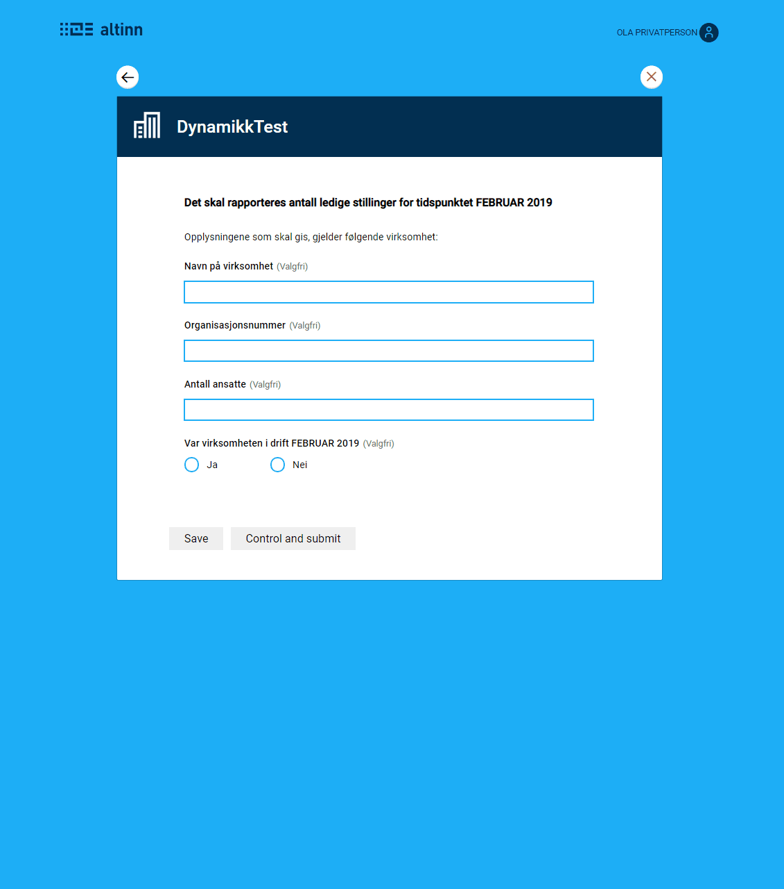

{}
⚠️ Dynamikk er et område under aktiv utvikling. Logikk-filer skrevet i JavaScript fases etterhvert ut og blir erstattet
av [dynamiske uttrykk](../expressions). Foreløpig gjelder dette dynamikk for vis/skjul, men etterhvert skal uttrykk
også kunne brukes for å utføre beregninger og styre valideringsmeldinger.
{}

## Introduksjon

Dynamikk er hendelser som skjer på klient-siden. Disse kan deles opp i to kategorier:
- Beregning - kjøre beregninger på klient-side, og oppdatere felter med ny verdi
- Vis/skjul felter - bestemme om felter skal vises eller skjules basert på verdier i skjema.

Det er to måter å legge til og endre dynamikkregler for en Altinn App.
1. Direkte i Altinn Studio under _Lage_-fanen. Velg _Rediger dynamikk_ i høyre-menyen.
2. I lokalt utviklingsmiljø ved å jobbe i filen `RuleHandler.js` som finnes i `App/ui`-mappen .


All dynamikk skrives som funksjoner i JavaScript i _RuleHandler_-filen. 
Funksjonene som er definert i denne filen kan videre konfigureres til å kjøres for feltene i skjemaet.

{}
Koden som definerer beregninger eller regler for vis/skjul bør settes opp slik at den håndterer eventuell feil i input.
Blant annet bør de håndtere å motta et tomt felt, eller tekst der man forventer et tall, uten å kræsje.
Dersom dynamikken ikke fungerer som forventet, ta en titt på koden som definerer
beregninger eller regler for vis/skjul for å se om det er noe feilhåndtering som mangler.
{}

{}MERK: For å støtte beregning/vis-skjul felter på eldre nettlesere, må man skrive 
JavaScript-koden man legger i `RuleHandler.js` i den versjonen av ECMAScript som den aktuelle nettleseren støtter. 
For IE11 vil dette være ECMAScript 5. {}

## Legg til/rediger funksjoner for beregninger eller vis/skjul

I filen `RuleHandler.js` er det satt opp to JavaScript-objekter:

- `ruleHandlerObject` - funksjoner for beregninger
- `conditionalRuleHandlerObject` - funksjoner med regler for vis/skjul

Det er inne i disse at de forskjellige funksjonene skal defineres. I tillegg er det satt opp to _hjelpeobjekter_  (`ruleHandlerHelper` og `conditionalRuleHandlerHelper`), hvor man skal sette opp hva slags input de forskjellige funksjonene forventer å få inn. Dette gjør det mulig å konfigurere reglene i Altinn Studio senere. For at en funksjon skal være tilgjengelig for å konfigureres som dynamikk, må selve funksjonen være definert i hovedobjektet 
(`ruleHandlerObject` eller `conditionalRuleHandlerObject`), og parametrene den forventer å få inn må være satt opp i det tilhørende hjelpeobjektet.

Strukturen på hjelpeobjektet vises under:

```javascript
var ruleHandlerHelper = {
  <name_of_rule>: () => {
    return {
      <input_param>: "<description>",
      <input_param>: "<description>",
      <input_param>: "<description>"
      ...
    };
  }
}
```

Strukturen på hovedobjektet, som inneholder funksjoner som brukes i dynamikk, vises under:

```javascript
var ruleHandlerObject = {
  <name_of_rule>: (<input_variable_name>) => {
    // Do something here
    // Values from input parameters defined in 
    // helper can be accessed through the object passed
    // into the rule, f.ex.
    // <input_variable_name>.<input_param>
  }
}
```

For eksempel, for å lage en regel som returnerer summen av to tall (beregning), vil man trenge følgende kode:

```javascript
var ruleHandlerHelper = {
  sum: () => {
    return {
      field1: "Field 1 in sum",
      field2: "Field 2 in sum"
    };
  }
}

var ruleHandlerObject = {
  sum: (data) => {
    // Check if data is available
    if (!data) return;

    // Check if value from input fields are available
    // If not, use value 0 in sum
    data.field1 = data.field1 ? data.field1 : 0;
    data.field2 = data.field2 ? data.field2 : 0;

    // return the sum
    return data.field1 + data.field2;
  }
}
```

Noen standardmetoder for beregninger, med hjelpeobjekt, er satt opp automatisk når appen lages i Altinn Studio. Noen av disse er vist i eksempelet under.

| Method name          | Description                                                      | Parameters              | Defined in object/helper                                      |
|----------------------| ---------------------------------------------------------------- | ----------------------- | ------------------------------------------------------------- |
| `sum`                | Returnerer summen av to verdier                        | `value1`, `value2`      | `ruleHandlerObject`/`ruleHandlerHelper`                       |
| `fullName`           | Returnerer to tekster (fornavn og etternavn) satt sammen med mellomrom mellom. | `firstName`, `lastName` | `ruleHandlerObject`/`ruleHandlerHelper`                       |
| `lengthBiggerThan4`  | Returnerer `true` dersom verdien den får inn er lengre enn 4 karakterer lang.  | `value`                 | `conditionalRuleHandlerObject`/`conditionalRuleHandlerHelper` |


Regler for dynamikk kjøres dersom det har skjedd en endring i input-parametrene til de forskjellige reglene. 
Funksjonene som da kjøres må kunne håndtere dersom det f.eks. har kommet inn kun 1 av 2 parametre eller lignende.

Et eksempel på hvordan dette kan gjøres er vist i `sum`-funksjonen under, hvor man tester hvilke parametre man 
har fått inn, og setter verdi til `0` på den/de parametre som mangler, sånn at regelen fortsatt fungerer.

```javascript
var ruleHandlerObject = {
  sum: (obj) => {
    obj.value1 = obj.value1 ? +obj.value1 : 0;
    obj.value2 = obj.value2 ? +obj.value2 : 0;
    return obj.value1 + obj.value2;
  },

  fullName: (obj) => {
    return obj.firstName + ' ' + obj.lastName;
  }
}
var ruleHandlerHelper = {
  sum: () => {
    return {
      value1: "Value 1",
      value2: "Value 2"
    }
  },

  fullName: () => {
    return {
      firstName: "First name",
      lastName: "Last name"
    };
  }
}

var conditionalRuleHandlerObject = {
  lengthBiggerThan4: (obj) => {
    if (obj.value == null) return false;
    return obj.value.length >= 4;
  }
}
var conditionalRuleHandlerHelper = {
  lengthBiggerThan4: () => {
    return {
      value: "value"
    }
  }
}
```

## Konfigurere dynamikk for skjemakomponenter

1. Legg til de skjemakomponentene som ønskes i layout.
2. I menyen til høyre, velg å legge til _Regler for beregninger_ eller _Regler for vis/skjul felt_.
   
3. Velg en tilgjengelig funksjon som gjør det du ønsker. Legg eventuelt til en ny funksjon, se beskrivelse over.
    
4. Sett opp hvilke(t) felt som skal fungere som _input_ til funksjonen - her er det felt i datamodellen som gjelder.
    
5. Sett opp hvilke(t) felt som skal påvirkes av regelen (skal motta beregnet verdi, eller skal vises/skjules) - her er det skjemakomponent som gjelder.
   - For regler for vis/skjul felt, kan man velge flere felter som skal vises/skjules basert på samme regel.
6. Lagre konfigurasjonen.
7. Test at det fungerer som forventet.

Eksisterende oppsett ligger synlig i menyen til høyre og kan redigeres/slettes.

Konfigurasjonen legges i filen `App/ui/RuleConfiguration.json`. Denne kan også redigeres manuelt ved behov.

## Eksempel på bruk av dynamikk i skjema

Scenario:

En app med skjema har flere felter for input. Én av disse er en radioknapp-gruppe, med valgene "Ja" og "Nei".
Avhengig av hva sluttbruker velger her, skal forskjellig innhold vises i skjemaet:

- Ja: Et nytt input-felt vises, sammen med ekstra informasjon om hvordan feltet skal fylles ut.
- Nei: En annen informasjonstekst vises.

Dette kan gjøres ved å legge inn følgende i `RuleHandler.js`, enten via _Rediger dynamikk_ i Altinn Studio, eller ved å laste ned kildekoden
til appen og redigere lokalt.

```javascript
var conditionalRuleHandlerObject = {
  sjekkVirksomhetIDrift: (obj) => {
    return (obj.value && obj.value === "Ja");
  },

  sjekkVirksomhetIkkeIDrift: (obj) => {
    return (!obj.value || obj.value != "Ja");
  }
}

var conditionalRuleHandlerHelper = {
  sjekkVirksomhetIDrift: () => {
    return {
      value: "Verdi"
    }
  },
  sjekkVirksomhetIkkeIDrift: () => {
    return {
      value: "Verdi"
    }
  }
}
```

Her har to funksjoner blitt opprettet, som sjekker om verdien er henholdsvis "Ja" eller ikke.
Etter at denne koden er lagt til, kan regelen konfigureres i Altinn Studio. Resultatet vises under. 



## Dynamikk i repeterende gruppe
Det er også mulig å sette opp dynamikk innad i en repeterende gruppe. Dette krever at man først setter opp regelen som
vanlig, og så redigerer på oppsettet i `App/ui/RuleConfiguration.json` manuelt. Helt konkret, er det følgende som må endres:

- For alle `inputParams`, må man legge til `{0}` etter _gruppe-delen_ av datamodellen. F.eks. `Datamodell.gruppe{0}.felt`. Dette erstattes i koden av _indeksen_ til 
hvert enkelt innslag av den repeterende gruppen.
- For alle `selectedFields` (altså feltene som påvirkes av reglen), må man legge til `{0}` bak felt-ID-en. F.eks. `skjemaFelt1{0}`
- I tillegg må man legge enn en ny egenskap på regelen, `repeatingGroup`. Denne skal inneholde ID-en til gruppen i layout-filen.

Et eksempel på en regel som er satt opp for repeterende grupper vises under:

```json {hl_lines=[8,12-13,15-17]}
{
  "data": {
    "ruleConnection": {},
    "conditionalRendering": {
      "9f9f2a50-360b-11ea-b69a-8510e2e248b9": {
        "selectedFunction": "lengthBiggerThan4",
        "inputParams": {
          "value": "Skjemainnhold.personalia.arbeidserfaring{0}.stilling"
        },
        "selectedAction": "Show",
        "selectedFields": {
          "962e2f60-3797-11ea-bfa5-9922024b4738": "a-e-4{0}",
          "something": "arbeidsgiver-adresse{0}"
        },
        "repeatingGroup": {
          "groupId": "arbeidserfaring-group",
        }
      }
    }
  }
}
```

### Nøstede repeterende grupper

Det er også mulig å sette opp dynamikk for nøstede repeterende grupper. Oppsettet likner på repeterende grupper, men man har med et ektra parameter `childGroupId` i `repeatingGroup`-objektet, samt en ekstra indeks-indikator.

Eksempel: 

```json {hl_lines=[8,12,14,15,16]}
{
    "data": {
        "ruleConnection": {},
        "conditionalRendering": {
            "hide-nested-group-field": {
                "selectedFunction": "shouldHide",
                "inputParams": {
                    "value": "someGroup{0}.nestedGroup{1}.someField"
                },
                "selectedAction": "Hide",
                "selectedFields": {
                    "field": "the-component-id{0}{1}"
                },
                "repeatingGroup": {
                    "groupId": "mainGroup",
                    "childGroupId": "subGroup"
                }
            }
        }
    }
}
```

## Eksempel med mer kompleks dynamikk

Scenario:
Et skjema med to sett med radioknapper (ja/nei) og en avkrysningsboks.

- Når skjema lastes, er kun det første settet med radioknapper synlig. 
- Hvis brukeren velger _Ja_, vises det andre settet med radioknapper. 
  - Hvis brukeren velger _Ja_ i det andre settet, blir avkrysningsboksen synlig.
  - Hvis brukeren går tilbake til det første settet med radioknapper og velger _Nei_, blir både det andre settet med radioknapper og avkrysningsboksen ikke lenger synlig.


### Alternativ 1
Dette kan settes opp ved å lage to forskjellige betingelser for når feltene skal vises:

- Én betingelse for det andre settet med radioknapper
  - Vises dersom _Ja_ er valgt i det første settet
- Én betingelse for avkrysningsboksen
  - Vises dersom _Ja_ er valgt i begge sett med radioknapper.

Kode for å oppnå dette kan se slik ut:

```javascript
var conditionalRuleHandlerObject = {
  showField2: (obj) => {
    if (obj && obj.field1 && obj.field1=== "yes") {
      return true;
    }
    return false;
  },

  showField3: (obj) => {
    if (obj && obj.field1 && obj.field1 === "yes"
      && obj.field2 && obj.field2 === "yes") {
        return true;
    }
    return false;
  }
}

var conditionalRuleHandlerHelper = {
  showField2: () => {
    return {
      field1: "Field 1"
    };
  },

  showField3: () => {
    return {
      field1: "Field 1",
      field2: "Field 2"
    };
  }
}
```

### Alternativ 2
Dette kan også settes opp ved å bruke den samme betingelsen for å vise både det andre settet med radioknapper og avkrysningsboksen. I tillegg må man 
da ha en regel som sletter verdien i det andre settet med radioknapper dersom verdien i det første settet settes til _Nei_:

```javascript
var ruleHandlerObject = {
  clearField: (obj) => {
    if (obj && obj.checkValue === "no") {
      return "";
    }
    return obj.currentValue;
  }
}

var ruleHandlerHelper = {
  clearField: () =>  {
    return {
      checkValue: "check against this value",
      currentValue: "the current value"
    }
  }
}

var conditionalRuleHandlerObject = {
  showField: (obj) => {
    if (obj && obj.checkField && obj.checkField === "yes") {
      return true;
    }
    return false;
  }
}

var conditionalRuleHandlerHelper = {
  showField: () => {
    return {
      checkField: "check against this value"
    };
  }
}
```


## Dynamikk i PDF

Fra versjon 3.0.0 er det også mulig å legge inn dynamikk for PDF. Dette gjøres i _PDF Handler_. Her kan man ved hjelp av logikk velge å skjulte felter eller sider i print.

Appen må inkludere `ui/Settings.json`-filen som [forklart her](../../../../app/development/ux/pages/navigation/#rekkefølge).

Teknisk er det veldlig likt hvordan man gjør det for validering. 

Eksempel nedenfor som skjuler et gitt felt basert på innhold. Komponentene er basert på ID som man finner i layout-filene til skjema.

```C#
        public async Task<LayoutSettings> FormatPdf(LayoutSettings layoutSettings, object data)
        {
            if (data is Skjema)
            {
                Skjema skjema = (Skjema)data;

                if (skjema?.Innledninggrp9342?.Kontaktinformasjongrp9344?.KontaktpersonNavndatadef2?.value.Contains("tulling") == true)
                {
                    layoutSettings.Components = new Components();
                    layoutSettings.Components.ExcludeFromPdf = new System.Collections.Generic.List<string>();
                    layoutSettings.Components.ExcludeFromPdf.Add("079f205b-c9ea-414d-9983-0d158e833e8a");
                }
            }
            
            return await Task.FromResult(layoutSettings);
        }
        ```
