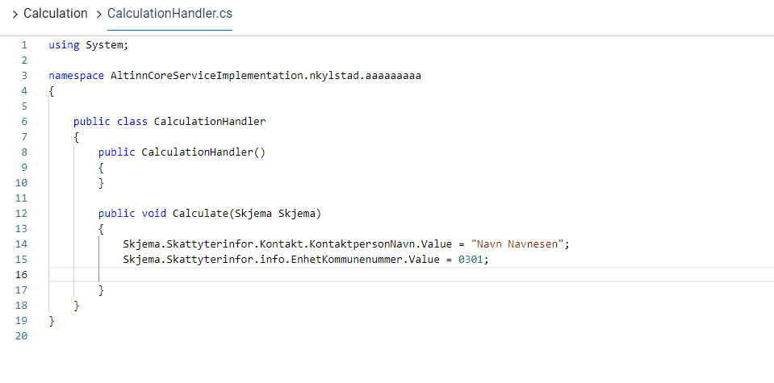

## Introduction

The various files that are used to define logic can be found in the logic menu
that is available in the UI editor through the _f(x)_-icon at the top right corner.


They can also be edited directly from the application repo, under the folder `App/logic` (for server-side application logic) or the folder `App/ui` (for dynamic behaviour in the GUI).
This folder contains the following files by default:

```C#
🗀 App/
  🗀 logic/
    🗀 DataProcessing/
      🗎 DataProcessingHandler.cs
    🗀 Print/
      🗎 PdfHandler.cs
    🗀 Validation/
      🗎 ValidationHandler.cs
    🗎 App.cs
    🗎 InstantiationHandler.cs
```

More files can be added when needed.

A complete project with examples on server-side application logic can be found [here](https://dev.altinn.studio/repos/ttd/webdemo2).

{}
**NOTE:** The way you refer to elements in the data model is different between OR and SERES type XSD's.
For OR XSD's, `.value` is a necessary suffix in the reference. The example code beow uses a mixture of the two types of data models.
{}


## Auto-complete/intellisense

By editing the source code in the apps locally, e.g. in Visual Studio Code, you get intellisense and autocomplete automatically.
For the C#-files, it's easiest working on these locally.

For the javascript-files, intellisense/autocomplete is also available if you wish to edit the files directly in Altinn Studio.
This appears automatically when writing, and you can also force it to appear by pressing `CTRL + SPACE`


