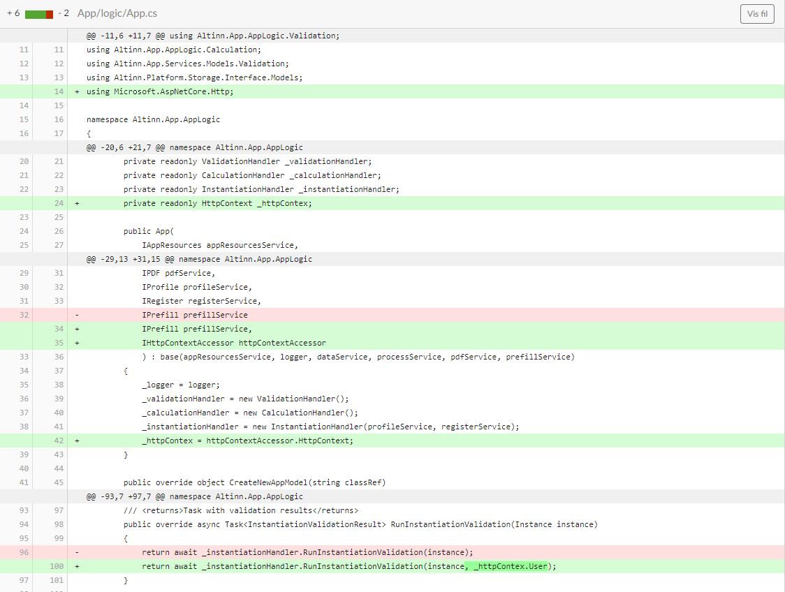
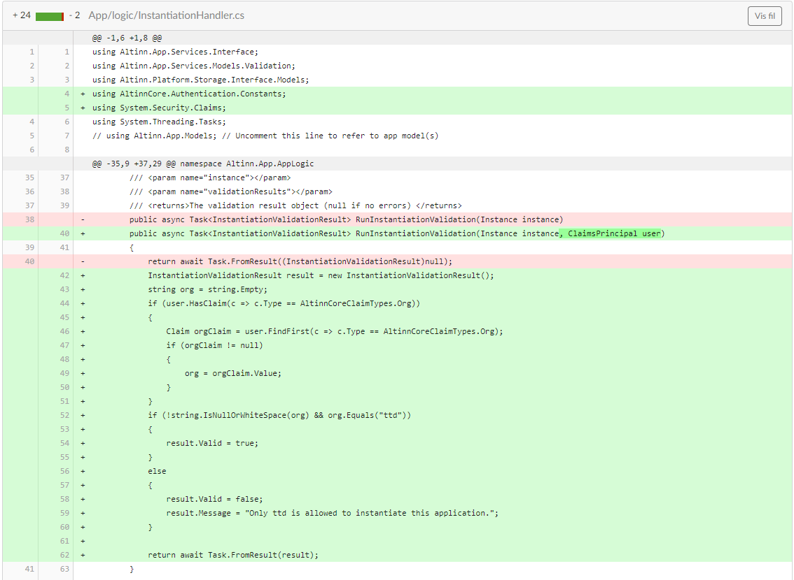
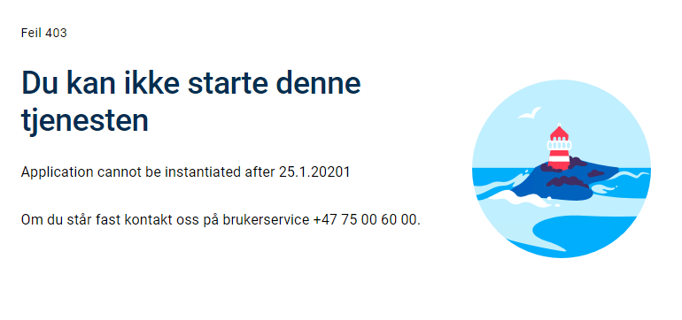

## Introduction

Application logic connected to instantiation can be defined in `InstantiationHandler.cs`. For a completely new app, two functions will be implemented in this class:

 - `RunInstantiationValidation` - create your own tests for determining whether a user/submitter is allowed to instantiate.
 - `DataCreation` - create customized prefill data.

## Custom validation rules for instantiation
As previously mentioned, tests for instantiation are defined in `RunInstantiationValidation`
Access to _Register_- and _Profile_-services are included in the `InstantiationHandler.cs`-file, which allows test to be
run against these.
Validation rules for instantiation can include validating a time to specific user instructions and complex tests that
require external API calls.


### Example 1 - Instantiation only allowed before 3 pm on any given day

```C# {hl_lines=[4]}
public async Task<InstantiationValidationResult> RunInstantiationValidation(Instance instance)
{
    DateTime now = DateTime.Now;
    if (now.Hour < 15)
    {
        return new InstantiationValidationResult()
        {
            Valid = false,
            Message = "ERROR: Instantiation not possible before 3PM."
        };
    }

    return null;
}
```

### Example 2 - Instantiation only allowed for application owner

The application this example is based on is available [here](https://altinn.studio/repos/ttd/example-app-1).
(requires login in altinn.studio)

To limit instantiation to a given entity, in this case the application owner, 
two files must be changed: `App.cs` and `InstantiationHandler.cs`. 



In `App.cs` the http-context is made available and
user data (claims principals) is retrieved from the context by calling ```_httpContext.User```.

To validate the instantiation, you can check one of two claims in the context.
Either the organization's three-letter abbreviation or the organization number.
The validation is run in `InstantiationHandler.cs` and the example below uses the organization abbreviation.

To validate based on organization number you can follow the example below,
and replace *AltinnCoreClaimTypes&#46;Org* with *AltinnCoreClaimTypes.OrgNumber*.
You can see the changes required in the file below. 




```C#
public async Task<InstantiationValidationResult> RunInstantiationValidation(Instance instance, ClaimsPrincipal user)
{
    var result = new InstantiationValidationResult();
    string org = string.Empty;

    if (user.HasClaim(c => c.Type == AltinnCoreClaimTypes.Org))
    {
        Claim orgClaim =
          user.FindFirst(c => c.Type == AltinnCoreClaimTypes.Org);
          
        if (orgClaim != null)
        {
            org = orgClaim.Value;
        }
    }

    if (!string.IsNullOrWhiteSpace(org) && org.Equals("ttd"))
    {
        result.Valid = true;
    }
    else
    {
        result.Valid = false;
        result.Message =
          "Only ttd is allowed to instantiate this application.";
    }

    return await Task.FromResult(result);
}
```
### Example 3 - Instantiation only allowed between certain dates

To limit instantiation to a certain time frame, in this example January 2021, 
one file requires changes:`InstantiationHandler.cs`. 

The method `RunInstantiationValidation` will run whenever someone tries to instantiate the application,
so logic is placed here to verify that the time is within the allowed frame.

```cs
public async Task<InstantiationValidationResult> RunInstantiationValidation(Instance instance)
{
    InstantiationValidationResult result = null;
    DateTime now = TimeZoneInfo.ConvertTime(DateTime.UtcNow, TimeZoneInfo.FindSystemTimeZoneById("Central European Standard Time"));
    if (now < new DateTime(2021, 01, 01))
    {
        result = new InstantiationValidationResult
        {
            Valid = false,
            Message = "Application cannot be instantiated before 1.1.2021"
        };
    }
    else if (now > new DateTime(2021, 01, 31))
    {
        result = new InstantiationValidationResult
        {
            Valid = false,
            Message = "Application cannot be instantiated after 25.1.2021"
        };
    }
    return await Task.FromResult(result);
}
```

Logic connected to date handling has been added to ensure the Norwegian time zone
is being used in the validation. 

```cs
DateTime now = TimeZoneInfo.ConvertTime(DateTime.UtcNow, TimeZoneInfo.FindSystemTimeZoneById("Central European Standard Time"));
```

Furthermore, a simple test is run to see if the current time is within the given time frame

```cs
(now < new DateTime(2021, 01, 01)
```

If the requirements are not met, the return object is populated with an _InstantiationValidationResult_ object that contains two fields:
_Valid_: a boolean that says if the instantiation is valid or not.
_Message_: a string that can contain an error message if it is not valid.


```cs
 result = new InstantiationValidationResult
        {
            Valid = false,
            Message = "Application cannot be instantiated before 1.1.2021"
        };
```

In addition you have the opportunity to use property
_ValidParties_: a list of the parties that are allowed to instantiate the application.

The result of a failed validation is shown below:





