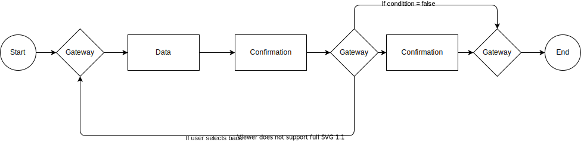

Malen følger [BPMN 2.0-standarden](https://www.bpmn.org/).

## Støttede prosesselementer

* [__Prosessoppgaver__](tasks) _oppgaver som lar brukerne utføre handlinger før prosessen fortsetter_

* [__Flytkontroll__](flowcontrol) _kontrollerer navigasjonen gjennom en prosess med gateways_

## Prosesseksempler

## Konfigurasjon av prosessen

I Altinn Studio kan apputvikleren konfigurere prosessen.

[Les vår utviklerhåndbok for detaljer.](../../../../app/development/configuration/process/)