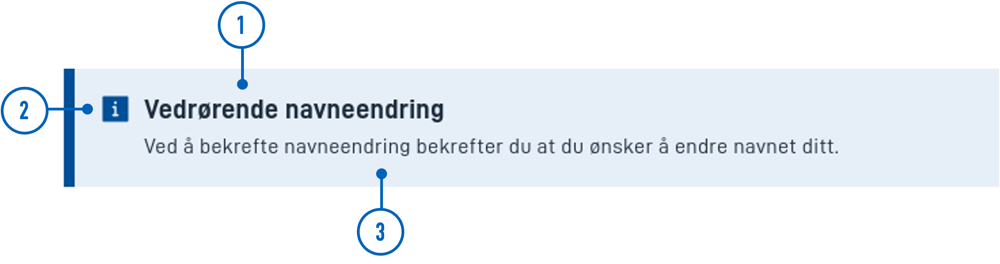
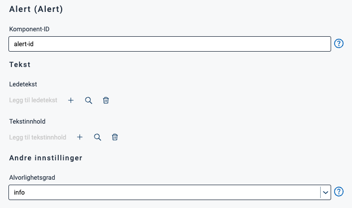
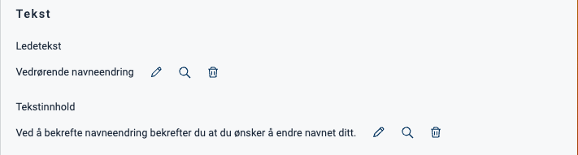
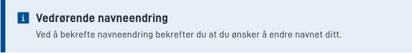
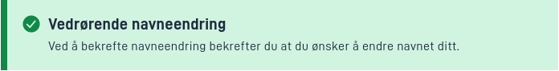
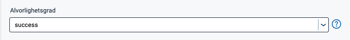
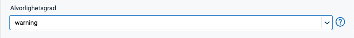

{}
🚧 Denne dokumentasjonen er under oppdatering.
{}

---

## Bruk

Alert brukes ofte til å vise viktig informasjon som skal fremheves for brukerne.

### Anatomi



{}
1. **Overskrift**: En kort beskrivende tittel .
2. **Ikon**: Et grafisk symbol som formidler alvorlighetsgraden av varselet.
3. **Tekstinnhold**: Skritlig informasjon eller beskjed assosiert med varselet.
{}

### Tilgjengelighet

Komponenten får ikke automatisk `role="alert"`. Dette betyr at skjermlesere ikke vil behandle den som en varsel.
En Alert bør bare ha `role="alert"` hvis den vises i brukergrensesnittet som et resultat av en handling brukeren har tatt.
Vi legger automatisk til `role="alert"` hvis `Alert` har en `hidden`-egenskap satt til false. Dette betyr at `Alert`-en
ble synlig for brukeren basert på en handling brukeren tok.

<!-- 
Legg til følgende seksjoner dersom de er relevante:

### Oppførsel

(Hvordan komponenten oppfører seg i ulike sammenhenger.)

### Stil

(Visuell styling, e.g. plassering, padding, "dos and don'ts")

### Beste praksis

(Bransjestandarder, "dos and don'ts")

### Veiledning for innhold

(E.g. regler for tegnsetting, standard etiketter, etc.)

### Mobil

(Hvordan implementere komponent i mobile miljøer.)

-->
### Relatert

- [`Panel`](../panel/)


## Egenskaper

| **Egenskap** | **Type**                                       | **Beskrivelse**                                                                               |
|--------------|------------------------------------------------|-----------------------------------------------------------------------------------------------|
| `severity`   | string | Strengverdi som angir alvorlighetsgraden til varselet. Dette påvirker utseendet til varselet. **Enum:** `"success" \| "info" \| "danger" \| "warning"`|

<!-- Følgende er en liste over tilgjengelige egenskaper for {}. Listen er automatisk generert basert på komponentens JSON schema (se link).

{}
Vi oppdaterer for øyeblikket hvordan vi implementerer komponenter. Listen over egenskaper kan derfor være noe unøyaktig.
{} -->

<!-- Shortkoden `component-props` genererer automatisk en liste over komponentegenskaper fra komponentens JSON schema.
Komponentnavnet kan gis eksplisitt som argument (f.eks. `component-props "Grid"`).
Hvis ingen argument gis, henter shortkoden komponentnavnet fra 'schemaname' i frontmatter. -->

<!-- {} -->

## Konfigurering

### Legg til komponent

Du kan legge til en komponent i [Altinn Studio Designer](/nb/app/getting-started/ui-editor/) ved å dra den fra venstre sidepanel til midten av siden.
Når du velger komponenten, vises et panel med innstillinger for den på høyre side.

### Innstillinger i Altinn Studio Designer

{}
Vi oppdaterer for øyeblikket Altinn Studio med flere muligheter for innstillinger!
 Dokumentasjonen vil bli oppdatert for å gjenspeile endringene når de er stabile.
  I mellomtiden kan det være flere alternativer tilgjengelige i betaversjonen enn det som beskrives her.
{}




Innstillinger for egenskaper tilgjengelig i Altinn Studio Designer.



- **Komponent-ID** (`id`): Automatisk generert komponent-ID (kan redigeres).
- **Ledetekst** (`textResourceBindings.title`): Overskrift.
- **Tekstinnhold** (`textResourceBindings.body`): Innholdstekst.
- **Alvorlighetsgrad** (`severity`): Påvirker varselets useende (farger og ikon).




Korresponderende innstillinger i sidens JSON-fil.


App/ui/layouts/{page}.json


```json{hl_lines=""}
{
  "data": {
    "layout": [
      {
        "id": "alert-id",
        "type": "Alert",
        "severity": "info",
        "textResourceBindings": {
          "title": "",
          "body": ""
        }
      }
    ]
  }
}
```




### Overskrift og tekstinnhold

Overskrift (ledetekst) og tekstinnhold legges til ved å opprette ny eller velge en eksisterende [tekstressurs](/nb/app/development/ux/texts/#legge-til-og-endre-tekster-i-en-app).









App/ui/layouts/{page}.json


```json{hl_lines="7-10"}
{
  "data": {
    "layout": [
      {
        "id": "alert-id",
        "type": "Alert",
        "textResourceBindings": {
          "title": "Vedrørende navneendring",
          "body": "Ved å bekrefte navneendring bekrefter du at du ønsker å endre navnet ditt."
        },
        "severity": "info"
      }
      }
    ]
  }
}
```



### Alvorlighetsgrad

Ved å endre alvorlighetsgrad endrer du varselets farger og ikon.

#### `info`














App/ui/layouts/{page}.json


```json{hl_lines="11"}
{
  "data": {
    "layout": [
      {
        "id": "alert-id",
        "type": "Alert",
        "textResourceBindings": {
          "title": "Vedrørende navneendring",
          "body": "Ved å bekrefte navneendring bekrefter du at du ønsker å endre navnet ditt."
        },
        "severity": "info"
      }
      }
    ]
  }
}
```



#### `success`














App/ui/layouts/{page}.json


```json{hl_lines="11"}
{
  "data": {
    "layout": [
      {
        "id": "alert-id",
        "type": "Alert",
        "textResourceBindings": {
          "title": "Vedrørende navneendring",
          "body": "Ved å bekrefte navneendring bekrefter du at du ønsker å endre navnet ditt."
        },
        "severity": "success"
      }
      }
    ]
  }
}
```



#### `warning`














App/ui/layouts/{page}.json


```json{hl_lines="11"}
{
  "data": {
    "layout": [
      {
        "id": "alert-id",
        "type": "Alert",
        "textResourceBindings": {
          "title": "Vedrørende navneendring",
          "body": "Ved å bekrefte navneendring bekrefter du at du ønsker å endre navnet ditt."
        },
        "severity": "warning"
      }
      }
    ]
  }
}
```



#### `danger`














App/ui/layouts/{page}.json


```json{hl_lines="11"}
{
  "data": {
    "layout": [
      {
        "id": "alert-id",
        "type": "Alert",
        "textResourceBindings": {
          "title": "Vedrørende navneendring",
          "body": "Ved å bekrefte navneendring bekrefter du at du ønsker å endre navnet ditt."
        },
        "severity": "danger"
      }
      }
    ]
  }
}
```

