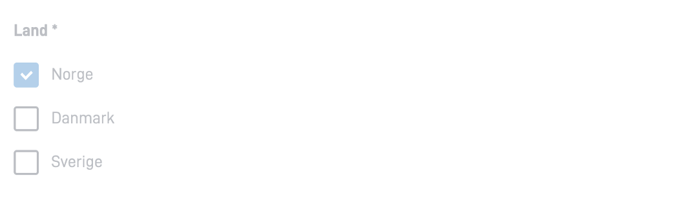
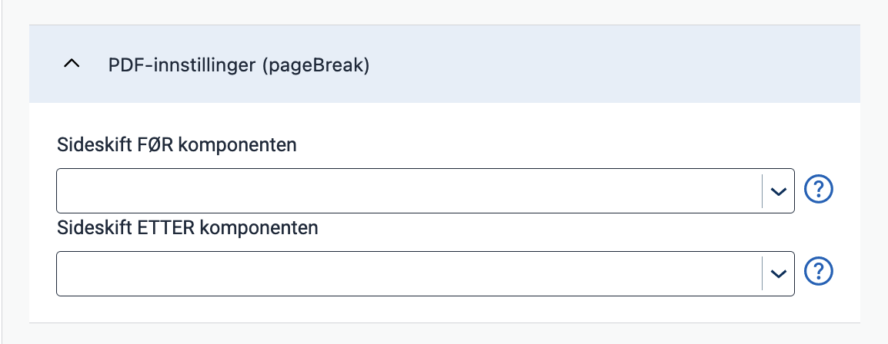

{}
🚧 This documentation is a work in progress.
{}

---

## Usage

Checkboxes are often used in forms to gather input from the user, allowing them to select one or more options from a list.

#### Use checkboxes when:
* Users can select multiple options from a list.
* An explicit choice needs to be made to use the settings (e.g., confirming that the user has read a document).

### Anatomy


{}
1. **Heading** - Question or instruction.
2. **Checkbox** - The choice control.
3. **Label** - Text label associated with the checkbox.
{}

### Style

* Checkboxes should always have an associated label on the right side.

### Best Practices

* Checkboxes with disabled options should be avoided.
    If an option is unavailable, it should be removed, and an explanation should be provided for why the option is missing.

### Content guidelines

* Keep labels short and descriptive.
* Start all labels with a capital letter.
* Do not include punctuation after labels.

### Related

* For a more compact way to display multiple options with multiple selection, use [MultipleSelect](../multipleselect/).
* If the user can only select one option from a list, use [RadioButtons](../radiobuttons).
* For a more compact way to display multiple options with single selection, use [Dropdown](../dropdown).

## Properties

The following is an autogenerated list of the properties available for {} based on the component's JSON schema file (linked below).

{}
We are currently updating how we implement components, and the list of properties may not be entirely accurate.
{}

{}

## Configuration

{}
We are currently updating Altinn Studio with more configuration options!
 The documentation is continuously updated, but more settings may be available than described here, and some settings may be in beta.
{}

### Add component




You can add a component in [Altinn Studio Designer](/app/getting-started/ui-editor/) by dragging it from the list of components to the page area.
Selecting the component brings up its configuration panel.




Basic component:


App/ui/layouts/{page}.json


```json{hl_lines="6-14"}
{
  "$schema": "https://altinncdn.no/schemas/json/layout/layout.schema.v1.json",
  {
    "data": {
      "layout": [
        {
          "id": "Image-id",
          "type": "Image",
          "image": {
            "src": {},
            "width": "100%",
            "align": "center"
          }
        }
      ]
    }
  }
}
```











### Checkbox settings









App/ui/layouts/{page}.json


```json{hl_lines="4-7"}
{
  "id": "komponent-id",
  ...
  "readOnly": false,
  "required": true,
  "layout": "row",
  "preselectedOptionsIndex": 0
}
```


 
- **Feltet skal være skrivebeskyttet** (`readOnly`): Field is read only. Disables the component when enabled (`true`).
- **Feltet skal være påkrevd** (`required`): Field is required when enabled (`true`).
- **Visning** (`layout`): Layout. Can be column (`column`) (default for more than two options) or row (`row`) (default for up to two options).
- **Forhåndsvalgt verdi** (`preselectedOptionsIndex`): Sets a preselected value. Options are zero-indexed, so the first option is `0`, the second is `1`, and so on.




### General settings











App/ui/layouts/{page}.json


```json{hl_lines="4-9"}
{
  "id": "komponent-id",
  ...
  "renderAsSummary": false,
  "hidden": false,
  "pageBreak": {
    "breakBefore": "auto",
    "breakAfter": "auto"
  }
}
```



- **Oppsummering** (`renderAsSummary`): Indicates whether the field should be included in a summary or not (default: `false`).
- **Feltet skal skjules** (`hidden`): Indicates whether the field should be hidden or not (default: `false`).
- **PDF-innstillinger** (`pageBreak`): Indicates whether a page break should be added before or after the component. Can be either: `auto` (default), `always`, or `avoid`.

---

{}
The following settings are not yet supported in the form editor but can be configured manually.
{}

### Horizontal alignment with `grid`

The `grid` property controls horizontal alignment based on a 12-column layout.
 Items are allocated fractions of 12 which sets their width relative to the screen width.
  In the example below, we set the component's width to 2/12 of the screen width for all screen sizes (from `xs` and up).





App/ui/layouts/{page}.json


```json{hl_lines=["4-6"]}
{
  "id": "komponent-id",
  ...
  "grid": {
      "xs": 2,
    }
}
```



You can also use `grid` to place items side by side.

See [Components placed side by side (grid)](/app/development/ux/styling/#components-placed-side-by-side-grid) for details and examples.

<!-- ## Examples -->